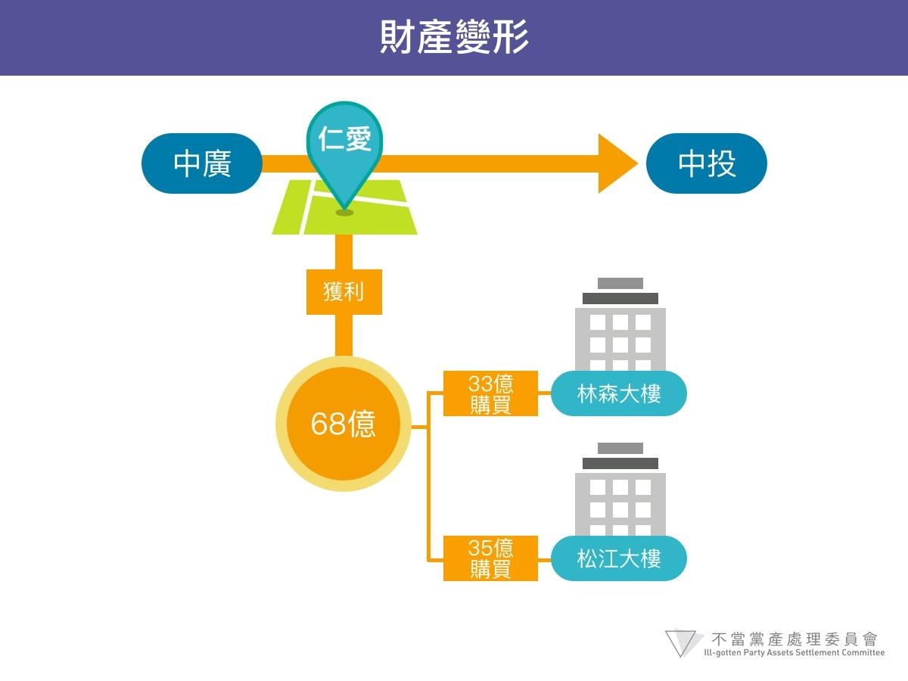

# 中國廣播股份有限公司案初步調查報告

## 一、中廣公司接收台灣放送協會土地始末

現今位於台北市仁愛路與建國南路交叉口的「宏盛帝寶」，於日治時期原為「社團法人台灣放送協會」總部，根據日治時期地籍謄本，該塊土地「臺北市大安字十二甲217、218、219番」等地號1，係於昭和15年至16年（即1940至1941年）之間，由日本國庫及台灣放送協會出資，向民眾江丕添及今井盛太郎等陸續購入。
這塊土地於二次世界大戰結束之後，由中國國民黨中央執行委員會「中央廣播事業管理處」接收。其接收依據，根據行政院台45年財字228號函2，係由國民黨中央財務委員會報經行政院轉奉國防最高委員會第225及227次常務會議核准。「中央廣播事業管理處」接收台灣放送協會之土地及建物，除上述台灣放送協會總部土地之外，尚包括臺灣台、臺南台、臺中台、嘉義台及花蓮台等5處廣播電台。
民國35年12月，中國國民黨中央執行委員會「中央廣播事業管理處」於大陸地區改組為「中國廣播股份有限公司」（下稱：中廣公司）。根據中廣公司董事會40年4月8日董臺40字第78號函，該公司於38年遷台，復於40年3月30日修改章程並重新辦理登記3，登記地址為台北市仁愛路三段53號（原日產台灣放送協會總部），資本額100萬元，股東為張道藩、何應欽、陳果夫、秦孝儀等58人4。
民國44年間，中廣公司就台北市地產產權向台北市政府申請辦理土地登記，台北市政府函覆「應添附奉令接管及公司更名沿革證明文件」；由於轉帳手續雖於40年間辦理完竣，惟原始文件卻因中央廣播事業管理處於廣州撤退至重慶而部分陷失5。中廣公司遂於同年5月去函交通部請求賜予證明6。

民國45年1月21日，交通部長袁守謙以「交郵字第00530號」代電發出證明書：「台灣光復時期由前中央廣播事業管理處接管日據時期台灣區各廣播電台所有房屋地產統由改組後之中廣公司掌理特證明如上」。中廣公司憑此於46年向台北市政府提出申請，於47年5月28日完成登記7，成為「臺北市大安區懷生段三小段308地號8」土地所有權部之權利人，登記次序為0001、登記原因欄則為空白。

## 二、資本形成與股權結構變動歷程

自從38年遷台後，因應政府需求，中廣公司即與政府簽訂合約，利用接收的臺灣台、臺南台、臺中台、嘉義台及花蓮台等5處廣播電台從事廣播業務，將全部廣播電臺均作傳布政教之用，負起國家宣傳義務。成為政府之廣播宣傳機構之中廣公司，經費支出列入國家總預算，由政府按月補助經費，遂無普通營業收入可言9，一方面會計處理與一般普通公務機關相同，每年決算送請中央政府核辦，一方面又因屬民間公司型態，並未報送營業決算書表予主管機關10。51年以後，比照國營事業陳送每年營業書表11，該公司於41年至53年期間之財務概況略如下12：

表一、中廣公司財務概況（民國41至53年）       單位：(新臺幣)元              

<table class="table table-bordered table-hover table-condensed">
  <thead>
    <tr>
      <th>年度</th>
      <th>收入</th>
      <th>支出</th>
      <th>損益</th>
      <th>淨值</th>
      <th>備註</th>
    </tr>
  </thead>
  <tbody>
    <tr>
      <td>41</td>
      <td>5,179,511</td>
      <td>5,683,019</td>
      <td>-503,508</td>
      <td>19,800,740</td>
      <td>資本額100萬</td>
    </tr>
    <tr>
      <td>42</td>
      <td>3,345,329</td>
      <td>3,825,859</td>
      <td>-480,529</td>
      <td>19,182,614</td>
      <td> </td>
    </tr>
    <tr>
      <td>43</td>
      <td>6,466,935</td>
      <td>6,321,785</td>
      <td>145,150</td>
      <td>20,203,275</td>
      <td> </td>
    </tr>
    <tr>
      <td>44</td>
      <td>8,080,085</td>
      <td>7,770,450</td>
      <td>309,635</td>
      <td>20,369,121</td>
      <td> </td>
    </tr>
    <tr>
      <td>45</td>
      <td>13,949,181</td>
      <td>13,636,260</td>
      <td>312,920</td>
      <td>21,899,054</td>
      <td> </td>
    </tr>
    <tr>
      <td>46</td>
      <td>15,867,069</td>
      <td>15,101,102</td>
      <td>765,967</td>
      <td>25,032,488</td>
      <td> </td>
    </tr>
    <tr>
      <td>47</td>
      <td>17,840,505</td>
      <td>17,732,115</td>
      <td>108,389</td>
      <td>26,501,892</td>
      <td> </td>
    </tr>
    <tr>
      <td>48</td>
      <td>24,682,070</td>
      <td>24,541,881</td>
      <td>140,189</td>
      <td>30,918,972</td>
      <td> </td>
    </tr>
    <tr>
      <td>49</td>
      <td>25,006,246</td>
      <td>25,085,964</td>
      <td>-79,718</td>
      <td>40,468,346</td>
      <td> </td>
    </tr>
    <tr>
      <td>50</td>
      <td>29,386,603</td>
      <td>28,934,152</td>
      <td>452,451</td>
      <td>41,000,825</td>
      <td> </td>
    </tr>
    <tr>
      <td>51</td>
      <td>32,278,417</td>
      <td>34,756,114</td>
      <td>-2,477,696</td>
      <td>77,293,240</td>
      <td> </td>
    </tr>
    <tr>
      <td>52</td>
      <td>37,869,038</td>
      <td>34,686,569</td>
      <td>3,182,468</td>
      <td>90,233,211</td>
      <td> </td>
    </tr>
    <tr>
      <td>53</td>
      <td>44,487,750</td>
      <td>43,941,770</td>
      <td>1,222,147</td>
      <td>94,232,176</td>
      <td> </td>
    </tr>
  </tbody>
</table>

54年間，中國廣播公司再與政府簽訂新合約，就該公司對大陸及海外之廣播，一律由政府編列預算給付，而對國內之廣播業務，則改為企業經營，除經營廣告業務外，並由政府以「購買時段」方式付費，故中國廣播公司開始經營廣告，以謀業務發展13，惟初期中廣公司營業績效不佳，54年至56年共計虧損303萬8,810元，詳細資料如下表：

表二、中廣公司虧損狀況（民國54至56年）

<table class="table table-bordered table-hover table-condensed">
  <thead>
    <tr>
      <th>年度</th>
      <th>收入</th>
      <th>支出</th>
      <th>損益</th>
      <th>淨值</th>
    </tr>
  </thead>
  <tbody>
    <tr>
      <td>54年</td>
      <td>44,506,462</td>
      <td>43,941,770</td>
      <td>564,692</td>
      <td>106,009,561</td>
    </tr>
    <tr>
      <td>55年</td>
      <td>33,243,292</td>
      <td>35,777,453</td>
      <td>-2,534,160</td>
      <td>108,022,334</td>
    </tr>
    <tr>
      <td>56年</td>
      <td>40,600,332</td>
      <td>41,669,674</td>
      <td>-1,069,342</td>
      <td>108,167,260</td>
    </tr>
  </tbody>
</table>

根據中廣公司54至56年虧損狀況表所列，截至56年12月31日，該公司淨值為1億816萬7,260元。依前述可知，其中除了張道藩等人於公司設立之初所投入股本100萬元，以及41年至56年期間公司累計盈餘5萬9,055萬元之外，其餘1億710萬8,205元之資本公積俱屬歷年政府購置財產或投入經費結餘所致。58年間，中廣公司以前開資本公積14轉增資9,900萬元，股本增為1億元，其增資新股並未歸於國家，而是發放予49名自然人股東，皆為黨股代表15。

78年間中廣公司辦理現金增資3億元，實收資本擴增為4億元，股東為郭哲、張炎元、蔣孝武、劉松藩、饒穎奇等63名自然人；80年間，華夏公司取得中國廣播公司3億6,445萬元股權，並派駐法人代表，80年7月再投資1599萬16，迄88年12月31日，華夏持有中國廣播公司97.10%股權17，其餘則為員工持股。

## 三、中廣公司出售原台灣放送協會總部土地

58年間，中廣公司於前述放送協會總部土地興建廣播電視大廈，60年完工後由中廣與中國電視公司（中視）共用。75年，中視搬離廣播電視大廈，遷往台北市南港區中國電視大廈。89年1月，中廣公司總部遷往中山區松江路之松江大樓。

87年12月22日，中廣第一次股東臨時會決議將該地號以88億元賣給「中央投資股份有限公司」（下稱：中投公司）18，中廣公司因繳納土地增值稅約20.62億元，實得價款約68億元。

中投公司則於民國88年10月再將上開土地轉售予「宏盛建設股份有限公司」（統一編號：22221180），交易價金為90億元，中投公司賺得土地交易價差2億元，該土地並於89年2月19日過戶予宏盛建設公司，宏盛建設公司遂於該地段推出「宏盛帝寶」建案，建築基地地號為懷生段三小段308、308-1，面積11,309.00平方公尺，並於94年完工，對外出售。

表三：放送協會總部土地所有權變動歷程（1940-1999）

<table class="table table-bordered table-hover table-condensed">
  <thead>
    <tr>
      <th>年度</th>
      <th>所有權人</th>
      <th>概況</th>
    </tr>
  </thead>
  <tbody>
    <tr>
      <td>1940年</td>
      <td>江丕添、江丕泉、今井盛太郎等</td>
      <td>日治時期為私人所有。</td>
    </tr>
    <tr>
      <td>1941年</td>
      <td>台灣放送協會</td>
      <td>昭和15、16年，先由國庫購入，再由放送協會繼續購入。</td>
    </tr>
    <tr>
      <td>1945年</td>
      <td>日本投降後即屬國有</td>
      <td>國民政府指派中國國民黨中央執行委員會之「中央廣播事業管理處」接收上述由台灣放送協會所有之土地</td>
    </tr>
    <tr>
      <td>1958年</td>
      <td>中國廣播公司</td>
      <td>二戰後由國民黨「中央廣播事業管理處」接收，至民國47年始登記為中廣所有。</td>
    </tr>
    <tr>
      <td>1998年</td>
      <td>中央投資公司</td>
      <td>以88億向中廣購得。</td>
    </tr>
    <tr>
      <td>1999年</td>
      <td>宏盛建設</td>
      <td>以90億向中投購得，帝寶於2005年底完工。</td>
    </tr>
  </tbody>
</table>

## 四、財產變形：林森、松江兩大樓

民國88年6月25日，中廣公司以前述出售台灣放送協會總部土地所得68億元現款，向東雲集團購置位於台北市林森北路 312 號之林森大樓建物（台北市中山區中山段三小段380地號），價金33億1955萬元19；同（88）年10月22日，又以36億836萬元20向冠德建設股份有限公司購得位於台北市松江路 371、373、375及377 號松江大樓全棟建物（台北市中山區榮星段七小段0019-0000地號）。根據土地建物查詢資料，林森大樓現有於95年向大眾商業銀行抵押貸款12.7億元，松江大樓則有於105年向元大商業銀行貸款19.2億元。

圖一：原台灣放送協會總部土地財產變形示意圖

## 五、中廣公司移轉予好聽等4家公司經營

94年，中國國民黨將華夏投資99.6%股權分別出售予光華投資21及中投各143,415千股（60%股權）及95,625千股（39.6%股權），買賣價金共38億2,465萬元22。94年12月，中投及光華公司將華夏公司（含中影50%、中廣97%及中視33.94%）以40億元出售予榮麗投資公司，惟該交易標的嗣後變更，榮麗投資公司只購買華夏公司所持有之33.94%中視股權，華夏投資公司持有之中廣公司97.1%股權，則在中投公司主導之下，中廣公司先於95年10月辦理盈餘轉增資，將實收資本額擴充至33億元，再安排華夏公司以57億元將中廣公司股權出售予好聽股份有限公司、悅悅股份有限公司、播音員股份有限公司、廣播人股份有限公司等4家公司23，股權並先行過戶，並經主管機關同意在案24。

根據最高法院檢察署特別偵查組103年8月4日新聞稿，華夏公司為順利出售中廣公司股權，考量部分產權涉訟不易處分，採取「資產與廣播分別處理之交易模式25」，四家公司與華夏簽訂「股份轉讓契約書」及「股份轉讓契約補充協議書」，廣播部分以10億元售予好聽等四家公司，待股權全數移轉予好聽等四家公司後，再進行廣播及資產分割處理，以支付其餘價金。

根據合約採取之「資產與廣播分別處理之交易模式 」，好聽等4家公司實際支付10億元取得中廣公司廣播事業部門（包含流行網、新聞網、鄉親網、客家頻道、台中1242、台南891、寶島網以及音樂網等8個頻道26），其價金10億元由四家公司先以2億元簽約金支付，其餘8億元分為5次1.6億分期付款；價值47億元之資產部分則區分為無爭議之資產28.4億元及訴訟中資產18.6億，約定待中國廣播公司出售或處分後，再將所得支付予華夏公司，因此華夏公司對於四家公司有此部分之債權。其交易價款付款方式及條件如表所示：

表四、四家公司付款方式及時程

<table class="table table-bordered table-hover table-condensed">
  <tbody>
    <tr>
      <td>第一次付款</td>
      <td>給付簽約金2億元</td>
    </tr>
    <tr>
      <td>第二次付款</td>
      <td>給付28.4億，包括： 1、出售17項不動產後支付6.5億。 2、出售松江、林森大樓後，支付17億。 3、出售高雄新興區中正三路後，支付0.43億。 4、處分長、短期投資後，支付4.47億。</td>
    </tr>
    <tr>
      <td>第三次付款</td>
      <td>自97年1月31日起五年內支付8億：1、97年1月31日支付1.6億2、98年1月31日支付1.6億 3、99年1月31日支付1.6億 4、100年1月31日支付1.6億 5、101年1月31日支付1.6億</td>
    </tr>
    <tr>
      <td>第四次付款</td>
      <td>爭議資產共18.6億，包括板橋8.8億（已敗訴）、八里8.7億（已敗訴）、芬園0.15億（已敗訴）、民雄0.95億，待實際處分後支付。</td>
    </tr>
  </tbody>
</table>

另外，因華夏公司將前述股款債權以56億元轉讓予光華公司，為使債權債務順利履行，四家公司與中投及光華公司另以協議書及備忘錄約定，由中廣公司將所持股權及不動產依法另行成立資產管理部門，再行分割成立資產管理公司，完成登記後再將四家公司所持有之股權全部轉讓予光華公司或其債權人（四份契約見表五）。意即四家公司僅以10億購得頻道，中廣其他資產之權利仍由光華公司所有。

為成立資產管理公司以履行約定，中廣公司董事會曾於97年12月17日、103年5月12日、104年8月12日以及105年8月17日多次就「現金減資」及「分割減資」等案提出申請27，惟均遭國家通訊傳播委員會否准。經查，目前登記於中廣公司名下之不動產如附表六。

表五、四家公司與中投、華夏及光華簽訂之合約

<table class="table table-bordered table-hover table-condensed">
  <thead>
    <tr>
      <th>契約名稱</th>
      <th>對象</th>
      <th>內容</th>
    </tr>
  </thead>
  <tbody>
    <tr>
      <td>協議書</td>
      <td>中投</td>
      <td>約定好聽等四家公促請中廣公司依公司法將不動產出售予中投或是中投所洽之第三人，並將部分廣播所使用之標的優先出租予中廣公司。</td>
    </tr>
    <tr>
      <td>股份轉讓契約書</td>
      <td>華夏</td>
      <td>約定轉讓標的物為中廣公司97%股權、轉讓總價金57億、付款方式及時程、交割時程、文件交付等</td>
    </tr>
    <tr>
      <td>股份轉讓契約補充協議書</td>
      <td>華夏</td>
      <td>約定股款付款方式及時程（第二次付款）、履約保證之轉讓、股票的解質、擔保條款等。</td>
    </tr>
    <tr>
      <td>備忘錄</td>
      <td>光華</td>
      <td>約定將「股份轉讓契約書」中有關於不動產部份，成立資產管理部門，再行分割成立資產管理公司，分割後四家公司再將所持的資產管理公司之股份轉讓予光華。</td>
    </tr>
  </tbody>
</table>

表六、中廣公司不動產一覽表

<table class="table table-bordered table-hover table-condensed">
  <thead>
    <tr>
      <th></th>
      <th>標的物</th>
      <th>建物座落地址、建號</th>
      <th>土地座落地號</th>
      <th>土地面積 (坪）</th>
      <th>建物面積 (坪）</th>
      <th>權利 範圍</th>
    </tr>
  </thead>
  <tbody>
    <tr>
      <td>1</td>
      <td>松江大樓</td>
      <td>台北市中山區松江路371、373、375、377 號 建號：2216、2217、2221、2226-2234 、2239、2242、2248、2252、2254、2258、2259</td>
      <td>台北市中山區榮星段7小段19、19-24地號</td>
      <td>765</td>
      <td>6,492.25</td>
      <td>全部</td>
    </tr>
    <tr>
      <td>2</td>
      <td>林森大樓</td>
      <td>台北市中山區林森北路312號</td>
      <td>台北市中山區中山段三小段380地號</td>
      <td>497</td>
      <td>5,503.85</td>
      <td>全部</td>
    </tr>
    <tr>
      <td>3</td>
      <td>南雄新興區</td>
      <td>高雄市新興區中正三路111號</td>
      <td>高雄市新興區三小段523地號</td>
      <td>73</td>
      <td>219.56</td>
      <td>全部</td>
    </tr>
    <tr>
      <td>4</td>
      <td>景美機室</td>
      <td>台北市福興路101號</td>
      <td>台北市文區興隆段1小段315地號</td>
      <td>61</td>
      <td>32</td>
      <td>全部</td>
    </tr>
    <tr>
      <td>5</td>
      <td>板橋市既行道路</td>
      <td> </td>
      <td>台北縣板橋市民族段259地號</td>
      <td>15</td>
      <td> </td>
      <td>全部</td>
    </tr>
    <tr>
      <td>6</td>
      <td>新竹台址</td>
      <td>新竹市東光路55號9樓-2、3</td>
      <td>新竹市東光段406、406-2地號</td>
      <td>17</td>
      <td>147.3</td>
      <td>建物全部 土地3.53%</td>
    </tr>
    <tr>
      <td>7</td>
      <td>新竹台（新豐機室）</td>
      <td>新竹縣新豐鄉青埔子路125-1 號）（39建號）</td>
      <td>新竹縣新豐鄉青埔子1306、1307、1308、1309、1310</td>
      <td>3,300</td>
      <td>154.88</td>
      <td>全部</td>
    </tr>
    <tr>
      <td>8</td>
      <td>店子湖轉播站</td>
      <td>桃園縣龍潭鄉番子窩路14-4號（342建號）</td>
      <td>桃園縣龍潭鄉三洽水段1019地號</td>
      <td>399</td>
      <td>20.4097</td>
      <td>全部</td>
    </tr>
    <tr>
      <td>9</td>
      <td>苗栗台址</td>
      <td>苗栗市中山路1〇〇8巷78號 (5547建號）</td>
      <td>苗栗市苗栗段736-44地號</td>
      <td>5,186</td>
      <td>309.83</td>
      <td>全部</td>
    </tr>
    <tr>
      <td>10</td>
      <td>台灣台址</td>
      <td>台中市忠明南路758、760號35樓及地下停車位</td>
      <td>台中市南區半平 厝段1919地號</td>
      <td>16</td>
      <td>389.49</td>
      <td>建物全部 土地 2.30%</td>
    </tr>
    <tr>
      <td>11</td>
      <td>嘉義台址</td>
      <td>嘉義市吳鳳南路121號 (1382、1351、1352建號）</td>
      <td>嘉義市下路頭336-10、335-3、335-22、335-24地號；嘉義市崛川段34-14、31-1、34-1、37地號</td>
      <td>664</td>
      <td>249.88</td>
      <td>全部</td>
    </tr>
    <tr>
      <td>12</td>
      <td>嘉義台（虎尾寮轉播站）</td>
      <td>嘉義縣民雄鄉鎮北村2鄰虎尾寮31號（298建號）</td>
      <td>嘉義縣民雄鄉崙子頂段1100地號</td>
      <td>252.29</td>
      <td>72.98</td>
      <td>全部</td>
    </tr>
    <tr>
      <td>13</td>
      <td>台南台址</td>
      <td>台南市永華路2段248號19樓-5、6、7(4438-4440建號）</td>
      <td>台南市安平區 新南段78-5地號</td>
      <td>10.0037</td>
      <td>133.1</td>
      <td>建物全部 土地： 3307/163500</td>
    </tr>
    <tr>
      <td>14</td>
      <td>台南台（七股機室）</td>
      <td>台南縣七股鄉樹林村131-20（22建號）</td>
      <td>台南縣七股鄉義合段48、52、53地號</td>
      <td>5,871.83</td>
      <td>134.4</td>
      <td>全部</td>
    </tr>
    <tr>
      <td>15</td>
      <td>高雄台址</td>
      <td>高雄市前鎮區中山路91號24樓之1、2、3、4</td>
      <td>高雄市前鎮區獅甲段 158-1、160-1 地號</td>
      <td>17.61</td>
      <td>274.67</td>
      <td>建物全部 土地 1.79%</td>
    </tr>
    <tr>
      <td>16</td>
      <td>高雄台調頻站新址預定地</td>
      <td> </td>
      <td>高雄縣旗山鎮嘮碡坑段535-10、535-11、53542地號</td>
      <td>457.38</td>
      <td>180.11</td>
      <td>全部</td>
    </tr>
    <tr>
      <td>17</td>
      <td>花蓮台玉里站</td>
      <td>花蓮縣玉里鎮大禹路165號</td>
      <td>花蓮縣玉里鎮禹西段260地號</td>
      <td>7,391.32</td>
      <td>66.12</td>
      <td>全部</td>
    </tr>
    <tr>
      <td>18</td>
      <td>花蓮台址</td>
      <td>花蓮市水源路25號（1776建號）</td>
      <td>花蓮市民勤段1367、1367-1、1367-2地號</td>
      <td>2,921.24</td>
      <td>78.05</td>
      <td>全部</td>
    </tr>
    <tr>
      <td>19</td>
      <td>宜蘭台址</td>
      <td>宜蘭縣古結路8號（315建號）</td>
      <td>宜蘭縣壯圍鄉古結段25-1等共45筆土地</td>
      <td>10,056.92</td>
      <td>130.89</td>
      <td>全部</td>
    </tr>
    <tr>
      <td>20</td>
      <td>宜蘭台市區辦公室</td>
      <td>宜蘭市民權街1-10號（1143建號）</td>
      <td>宜蘭市宜蘭段巽門小段268-8地號</td>
      <td>36.3</td>
      <td>15.34</td>
      <td>全部</td>
    </tr>
  </tbody>
</table>

根據趙少康向特偵組提出之陳報狀28，四家公司與華夏公司於「股份轉讓契約書」第11條約定：「於（給付）股款未達90%以前，(1)華夏（中投）可推派超過二分之一董事及一席監察人。(2)董事長為甲方（好聽）代表，財務主管中投指派。(3)1000萬元以上資金借貸支出，需經華夏（中投）同意。(4)非經中投同意，好聽等四家不得轉讓股份。(5)股款給付縱達90%，但直至繳清股款前，中投還要推派一席董事。」；四家公司又與華夏公司於「股份轉讓契約補充協議書」第5條約定：「給付股款未達90%以前，(1)1000萬元以上資金借貸，銀行貸款，合作契約需經華夏（中投）同意。(2)中廣對外背書保證、章程修訂、股利分派、增減資、發行新股、資產分配，需經召開董事會決定。」。經查，中廣公司現今董監事名單29（如附表七），其中陳明暉、曾忠正、鄭世芳、簡泰正、郭令立以及黃士等人，經研判應即為中投公司依上開約定所指派之董監事。

表七、中廣公司董監事資料

<table class="table table-bordered table-hover table-condensed">
  <thead>
    <tr>
      <th>職稱</th>
      <th>姓名</th>
      <th>代表法人</th>
      <th>持有股份數</th>
      <th>備註</th>
    </tr>
  </thead>
  <tbody>
    <tr>
      <td>董事長</td>
      <td>趙少康</td>
      <td>好聽股份有限公司</td>
      <td>89,297,837</td>
      <td> </td>
    </tr>
    <tr>
      <td>常務董事</td>
      <td>陳明暉</td>
      <td>好聽股份有限公司</td>
      <td>89,297,837</td>
      <td>經研判為中投公司所指派之董事</td>
    </tr>
    <tr>
      <td>董事</td>
      <td>邱蜜絲</td>
      <td>好聽股份有限公司</td>
      <td>89,297,837</td>
      <td> </td>
    </tr>
    <tr>
      <td>常務董事</td>
      <td>曾忠正</td>
      <td>廣播人股份有限公司</td>
      <td>70,059,000</td>
      <td>經研判為中投公司所指派之董事</td>
    </tr>
    <tr>
      <td>董事</td>
      <td>吳華潔</td>
      <td>廣播人股份有限公司</td>
      <td>70,059,000</td>
      <td> </td>
    </tr>
    <tr>
      <td>董事</td>
      <td>鄭世芳</td>
      <td>廣播人股份有限公司</td>
      <td>70,059,000</td>
      <td>經研判為中投公司所指派之董事</td>
    </tr>
    <tr>
      <td>董事</td>
      <td>陳聖一</td>
      <td>播音員股份有限公司</td>
      <td>87,600,000</td>
      <td> </td>
    </tr>
    <tr>
      <td>董事</td>
      <td>簡泰正</td>
      <td>播音員股份有限公司</td>
      <td>87,600,000</td>
      <td>經研判為中投公司所指派之董事</td>
    </tr>
    <tr>
      <td>董事</td>
      <td>郭令立</td>
      <td>播音員股份有限公司</td>
      <td>87,600,000</td>
      <td>經研判為中投公司所指派之董事</td>
    </tr>
    <tr>
      <td>監察人</td>
      <td>黃士庭</td>
      <td>悅悅股份有限公司</td>
      <td>70,000,000</td>
      <td>經研判為中投公司所指派之董事</td>
    </tr>
    <tr>
      <td>監察人</td>
      <td>張黛娜</td>
      <td>悅悅股份有限公司</td>
      <td>70,000,000</td>
      <td> </td>
    </tr>
  </tbody>
</table>

## 六、中廣公司股權交易尾款47億元處理情形

民國99年間，中央投資公司進行減資分割，以約73億2,734萬元資產及3億2,734萬元負債作價70億元30抵充設立欣裕台公司。當時欣裕台公司資產中，包含作價56億5,750萬元之光華投資公司100%股權，其資產內容即為前述好聽等4家公司因中廣公司股權交易案尚未支付之交易價金。

101年，好聽等4家公司付清買受中廣公司廣播部門之尾款8億元予光華投資公司，故光華公司隨即以現金減資方式將該等8億元款項退還予欣裕台公司，欣裕台公司再於102年間，將前述光華公司減資而得之8億元，併同該公司其餘現金，合計20億元以現金減資方式退還股東中國國民黨31。

104年間，欣裕台公司又將光華投資公司100%股權出售予中投公司關係企業欣光華投資公司，取得30億元現款，其中29億元以辦理二度現金減資方式退還予中國國民黨32，餘1億元則併同該公司另有8,000萬元，合計1億8,000萬元分別捐贈9,000萬元予財團法人民生建設基金會，以及捐贈各3,000萬元而設立財團法人民族基金會、財團法人民權基金會及財團法人國家發展基金會。

## 七、民雄機室案

民雄機室用地位於嘉義縣民雄鄉頂寮段頂寮小段369地號及同段中廣小段607地號，係中廣公司於民國41間由中廣向原地主購買，並登記於中廣名下。中廣於該地有地上物4座天線鐵塔設備及地下物即地下網。

政府於民國93年為清查國民黨黨產，由交通部對中廣公司提告索討位於新北市板橋區、新北市八里區、彰化縣芬園鄉、嘉義縣民雄鄉及花蓮縣等5處廣播電台或機房用地。中廣於板橋、八里、芬園及花蓮等4案均敗訴，均已歸還國有（如附表八），至於民雄機室之土地，則因勝訴而仍登記為該公司名下。

如同前述，民國41至54年間，中廣公司乃政府之廣播宣傳機構，由政府按月補助經費。據此，國民政府之行政院與中廣公司於36年簽訂廣播合約，並於41年間由交通部代表行政院與中廣公司以換約方式續約，之後於46年另由行政院新聞局與中廣公司簽訂廣播合約，雖無續約之記載，但合約內容與前兩份合約大致相同，均係由政府委託中廣公司播送節目，並由行政院或所屬單位如交通部或新聞局等按月補助中廣公司現有設備及業務所需經費。

歷次審判過程中，法院認交通部撥款後，中廣以該補助款所購置之財產、設備乃屬中廣所有。且雙方所簽訂之廣播合約足認交通部所委任之事務，乃中廣應以其所設廣播電台及設備為政府播送傳佈政教所需要之節目，委任事務並未包括購置財產及設備；且三份合約均未提及系爭土地及其地上地下物之購置，故無法證明雙方就土地購置事項成立委託契約。至於中廣為擴充廣播設備而向交通部申請補助，於撥款後該款項即屬中廣所有，系爭土地及其地上地下物，均屬中廣就該補助款如何規劃之問題，與交通部委任之意旨無涉。故法院認為，交通部依信託、委任及不當得利之法律關係訴請中廣公司將前開土地之所有權移轉登記及將土地返還，均為無理由。

表八：交通部對中廣公司提告索討不動產之訴訟概況

<table class="table table-bordered table-hover table-condensed">
  <thead>
    <tr>
      <th>爭議不動產</th>
      <th>門牌號碼/地號</th>
      <th>訴訟過程</th>
      <th>目前狀況</th>
    </tr>
  </thead>
  <tbody>
    <tr>
      <td>八里機室案</td>
      <td>八里鄉中山路二段70-1號（小八里坌13行小段246、246-1、246-2、 246-3、246-4）</td>
      <td>經臺灣高等法院97年重上更（一）第111號判決廢棄第一審判決，命中廣塗銷以徵收取得之登記，最高法院99年12月17日以上訴無理由駁回定讞。</td>
      <td>國有</td>
    </tr>
    <tr>
      <td>板橋機室案</td>
      <td>板橋市民族路168號、館前東路156巷7弄1號及3號（民族段570-1、658、658-3、658-4、752、752-2、752-3、752-4）</td>
      <td>經臺灣高等法院101年重上更(三)字42號判決交通部勝訴，經最高法院103年度台上字第1675號判決駁回中廣上訴定讞。</td>
      <td>國有</td>
    </tr>
    <tr>
      <td>芬園微波機室案（天馬計畫案）</td>
      <td>彰化縣芬園鄉同安寮段640、640-2地號</td>
      <td>共3筆土地及地上建物產權1/3持分，經臺灣高等法院95年上字313 號判決交通部勝訴。最高法院96年台上字1094號判決中廣上訴駁回。</td>
      <td>國有</td>
    </tr>
    <tr>
      <td>民雄機室案</td>
      <td>嘉義縣民雄鄉頂寮段中廣小段607、頂寮小段369</td>
      <td>歷經台北地方法院93年度重訴字第163號敗訴、台灣高等法院93年度重上字第388號駁回上訴，於94年5月最高法院94年度台上字第818號判決敗訴定讞。</td>
      <td>中廣所有</td>
    </tr>
    <tr>
      <td>花蓮電台案</td>
      <td>花蓮民勤段土地1367、1367-1、 1367-2</td>
      <td>經臺灣高等法院花蓮分院103年度重上更(三)字第4號判決交通部勝訴。</td>
      <td>國有</td>
    </tr>
  </tbody>
</table>

中國廣播股份有限公司案初步調查報告所憑之證據資料清單
1.  臺北市大安區懷生段三小段308地號地籍謄本
2.  行政院台45年財字228號函
3.  交通部追討中國國民黨財產書面報告，交通部編，105年3月
4.  中國廣播公司董事會40年4月8日董臺(40)字第78號函
5.  中國廣播公司民國40年股東名單
6.  中廣公司民國44年5月28日致交通部函
7.  臺灣省政府建設廳44年9月24日(四四)建商字第29667號函
8.  臺灣省建設廳51年3月10日建三字第8732號函
9.  經濟部經台(五一)商字第03954號函  
10. 本黨經營事業概況，中國國民黨中央財務委員會編列，59年7月
11. 中廣公司56年12月25日科目餘額表
12. 中國廣播公司第15次股東會會議紀錄
13. 中國廣播公司民國80年7月10日公司代表人指派書
14. 中國廣播股份有限公司公開說明書，民國98年6月12日
15. 中央投資公司94年財務報表
16. 中國國民黨與光華投資、中央投資之股份買賣契約
16-1 94年4月19日國民黨與光華
16-2 94年4月19日國民黨與中投
16-3 94年4月29日國民黨與光華
16-4 94年5月30日國民黨與光華
16-5 94年6月29日國民黨與光華
16-6 94年7月12日國民黨與光華
16-7 94年8月15日國民黨與光華
17. 趙少康向特偵組提出之陳報狀
18. 好聽、悅悅、播音員及廣播人等四家公司與華夏公司簽訂之股份轉讓契約書
19. 好聽、悅悅、播音員及廣播人等四家公司與華夏公司簽訂之股份轉讓契約補充協議書
20. 好聽、悅悅、播音員及廣播人等四家公司與光華公司簽訂之備忘錄
21. 好聽、悅悅、播音員及廣播人等四家公司與中央投資公司簽訂之協議書
22. 最高法院檢察署103年8月4日新聞稿

----------

1. 臺北市大安字十二甲218番及258番之2、217番之3、217番之5、217番之6、219番之17、218番之2、219番之3、219番之4、219番之5等地號，參見該地段地籍謄本。
2. 行政院台45年財字228號函，交通部追討中國國民黨財產書面報告，交通部編，105年3月10日，頁143。
3. 中國廣播公司董事會40年4月8日董臺(40)字第78號函，中國廣播股份有限公司登記卷(1)
4. 民國40年中國廣播公司股東名單，中國廣播股份有限公司登記卷(1)。
5. 參見民國44年5月28日中廣公司致台灣省建設廳函。
6. 民國44年5月28日函，交通部追討中國國民黨財產書面報告，交通部編，105年3月10日，頁141。
7. 46年大安字第007270號
8. 民國41年，臺灣省政府頒布《各縣市日式地名更改要點》，其中第二點第三項，規定：「大字」改為「段」，「字」改為「小段」。原表示大字範圍之「町」字及表示小字範圍之「丁目」二字，一律改換為「段」及「小段」。
9. 中國廣播公司董事會40年4月8日董臺(40)字第78號函，中國廣播股份有限公司登記卷(1)
10. 參見臺灣省政府建設廳44年9月24日(四四)建商字第29667號函引述中國廣播公司台廣會(44)字第8509號函內容、臺灣省建設廳51年3月10日建三字第8732號函引述中國廣播公司台廣會(51)字第23810號申請書內容，中國廣播股份有限公司登記卷(1)。
11. 參見經濟部經台(五一)商字第03954號函，中國廣播股份有限公司登記卷(1)。
12. 參見「本黨經營事業概況」，中國國民黨中央財務委員會編列，59年7月1日，頁76。
13. 參見「本黨經營事業概況」，中國國民黨中央財務委員會編列，59年7月1日，頁72。
14. 依該公司登記卷(1)內附中廣公司56年12月25日科目餘額表所載，資本為100萬元，資本公積1億1,077萬762元，前期損益為253萬4,160元，與註4「本黨經營事業概況」頁76、77所載該公司56年12月31日財務資料數字稍有不同，惟差異不大。
15. 中國廣播公司第15次股東會會議紀錄，中國廣播股份有限公司登記卷(1)。
16. 公司代表人指派書，民國80年7月10日，中廣公司登記卷。
17. 中國廣播股份有限公司登記卷(10)。
18. 由中投分四期支付，第二期款會同繳納土地增值稅，第三期款支付10億，第四期款於點交後一年內支付，付清前餘額以年息6％計。
19. 中國廣播股份有限公司公開說明書，中國廣播股份有限公司編製，民國98年6月12日，頁35。
20. 同前。
21. 94年光華投資為中投100%持股之子公司，參見94年中央投資公司財務報表。
22. 參見中國國民黨與光華投資、中央投資之股份買賣契約。
23. 參見四家公司與華夏簽訂之股份轉讓契約書、股份轉讓契約補充協議書。
24. 參見國家通訊傳播委員會96年11月8日通傳營字第09600342680號函。
25. 最高法院檢察署103年8月4日新聞稿，頁25。
26. 參見趙少康向特偵組提出之陳報狀，最高法院檢察署特別偵查組偵查筆錄，第22卷，頁148。
27. 97年12月17日申請將旗下所有土地分割出去，其中包含中廣全台9個分站電波發射台土地，NCC於98年11月4日否決；103年5月12日另申請，將板橋訴訟中的土地與花蓮台址分割給中廣資產公司，並辦減資1500萬， 104年8月12日再次申請，董事會通過「分割減資」及「現金減資」案，將旗下松江大樓、林森大樓等不動產，以及長期投資（含京華城、亞太電信等），分割給新成立的「中廣資產管理股份有限公司」。中廣通過另一個現金減資案，打算出售松江、林森兩大樓籌措現金，再將售屋所得進行現金減資26億3691萬元，減資比例高達81.46%，減資後的中廣實收資本額將為6億280元，原始股東每股可退回8.14元，均遭NCC否准。105年8月17日，NCC再次否准分割減資，參見NCC新聞稿。
28. 參見趙少康向特偵組提出之陳報狀，最高法院檢察署特別偵查組偵查筆錄，第22卷，頁107。
29. 「經濟部商業司─公司資料查詢」網站查詢資料。
30. 總計包括：「應收關係人款」1億2,403萬元、「應收票據」3億2,734萬元、「採權益法之長期股權投資」56億5,750萬元、「以成本衡量之非流動金融資產」12億1,846萬元，以及「暫收款」3億2,734萬元。
31. 其中包括處分全部基金受益憑證與元大金控公司股票，變現約8億6,000萬元，以及就轉投資之光華投資公司現金減資8億元，本調查報告推測此即屬前述趙少康入主中廣之「第三次支付」。
32. 因該公司以30億元價格將光華投資公司全部股權出售予欣光華投資公司，隨即決定二度現金減資22億元及7億元
