# 「中影股份有限公司是否為社團法人中國國民黨之附隨組織」調查報告

[調查報告PDF](pdfs/cmpc_2.pdf)

## 壹、調查源起

民國（下同）89年，監察院黃煌雄委員等為確實掌握行政院及各級政府機關將其所管有之公有財產，以贈與、轉帳撥用或撥歸等方式交予社團法人中國國民黨（下稱國民黨）所有或經營，其中包含台灣省行政長官公署撥歸國民黨經營之19家戲院新世界戲院、大世界戲院、芳明戲院、台灣戲院、大光明戲院、光復戲院、壽星戲院、共樂戲院、台中戲院、世界戲院、延平戲院、嘉義戲院、羅東新生戲院、蘇澳戲院、中華戲院、光華戲院、和樂戲院、南方常設館、新光戲院。

據監察院90年4月2日調查報告摘錄：「按相關檔案及史料文件顯示，該十九家戲院係台灣省行政長官公署宣傳委員會接收日資電影院移交予國民黨台灣省黨部經營，既係撥歸該黨經營，該黨對於該十九家戲院應僅有經營權而無所有權，惟行政院及相關政府機關竟未能釐清兩者之分際，致該十九家戲院陸續有已移轉予他人者，有仍登記為該黨所有者。行政院身為國家最高行政機關，應本維護國家財產及人民權益之職責，確實澈底清理，依法處理。」1

復依國家資產經營管理委員會黨產處理小組96年至105年清查統計結果，該19家日產戲院土地大部分透過中央電影事業股份有限公司（原名台灣電影事業股份有限公司，43年間改名為中央電影事業股份有限公司，現已改名為中影股份有限公司；下稱中影公司）移轉第三人或被地方政府徵收2。本會爰依政黨及其附隨組織不當取得財產處理條例（下稱本條例）第5條、第6條、第8條第5項及第6項規定主動立案調查。
 
## 貳、本會調查經過

監察院調查報告顯示，對於自日產接收之19家日產戲院，國民黨應只有經營權而無所有權，但因行政院與相關政府機關未能釐清兩者之分際，使得自日產接收之19家日產戲院陸續有移轉予他人之情形。本會就監察院調查報告之結果，調查上開日產戲院財產移轉之流向。

本會於105年10月間向最高法院檢察署特別偵查組（下稱特偵組；現已裁撤）調閱3三中案（即中國廣播股份有限公司、中國電視股份有限公司與中影公司案）全卷，以釐清中影公司股權交易過程中與本條例調查認定附隨組織及處理不當取得財產有關之爭議。

本會於105年11月間向財政部國有財產署調閱4國民黨及其附隨組織取得或使用國家資產之土地清冊（105年）與國民黨及其附隨組織取自國家資產之土地清冊（103年9月26日），以釐清國民黨及其附隨組織移轉19家日產戲院之流向。

本會於105年12月16日就中影公司接收自日產戲院土地案舉行預備聽證5，並就當日當事人及利害關係人所陳述之內容進行後續調查。

本會依據特偵組中影案相關筆錄，就95年間中影公司股權交易過程之相關疑點，於106年2月18日約詢中影公司股權交易價格合理性評估報告書之出具人張錦耀證券分析師、同年3月10日約詢上開評估報告之交易價格複核意見書出具人楊忠耕會計師、同年3月29日約詢94年度及95年度中影公司財務報表暨會計師查核報告之簽證會計師林寬照先生、同年6月30日約詢中央投資股份有限公司（下稱中投公司）負責中影公司股權交易案之承辦人曾忠正先生、同年7月14日約詢中投公司負責接洽中影公司股權交易價格評估之承辦人簡錫塘先生。
 
## 參、中影公司設立經過

### 一、國民黨以「自然人」擔任黨股代表時期

（一）中影公司原名為台灣電影事業股份有限公司，於42年間設立登記6，股東由戴安國等22人代表國民黨登記（43年間增為24人），資本額新台幣（下同）200萬元係以台北大世界戲院基地及房屋抵繳，大世界戲院則為39年間由台灣省公產管理處接管之日產戲院7。43年間該公司增資發行新股200萬元，由台灣農業教育電影股份有限公司（下稱農教電影公司）以其資產抵繳8，並由蔣經國等16名自然人代表農教電影公司登記為股東。台灣電影事業股份有限公司此時改名為中央電影事業股份有限公司，實收資本額增為400萬元，參見【圖1】。

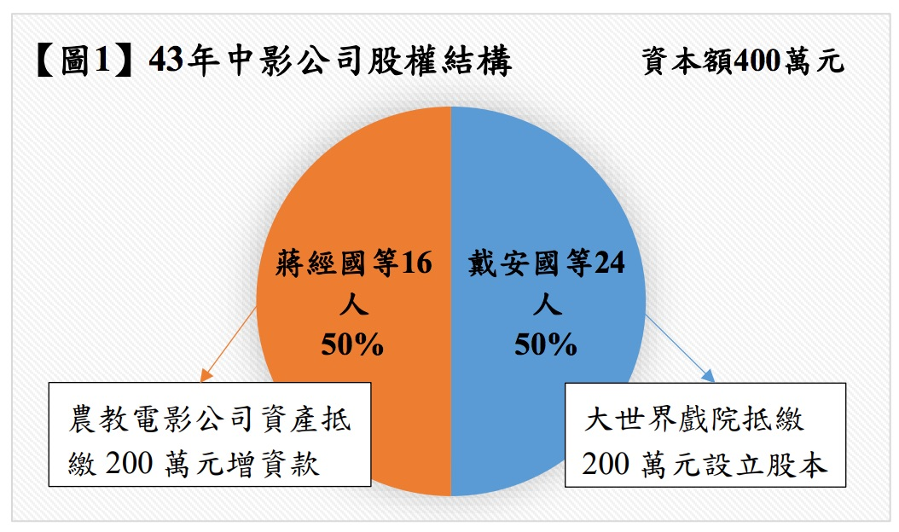

（二）52年間，中影公司逕於公司股東名簿上將農教電影公司除名，其股份直接登記予原代表該公司之自然人名下9，故中影公司所有股份均登記為自然人名義。53年間，中影公司共增資6,600萬元，其中資本公積轉增資3,600萬元，直接登記於蔡孟堅等41人名下，另台灣銀行則以債作股取得3,000萬元股份10，參見【圖2】。

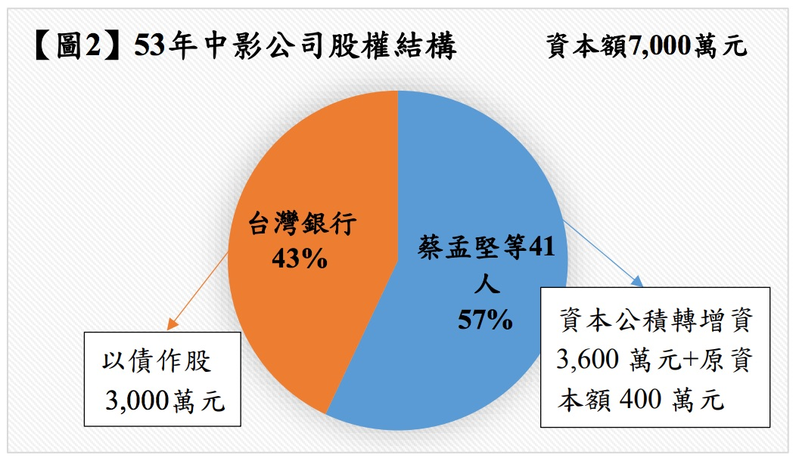

（三）60年以前，中影公司每年營運盈虧互見，43年度至58年度期間合計盈餘為5萬8,111元11，期間曾出售大光明戲院12、芳明戲院13、世界戲院14、中華戲院15及共樂戲院16等5家接收日產戲院，並以110萬元購置位於台北市士林區之中影文化城3,000坪土地17。此段期間中影公司之收支損益情形參見【表1】。

【表1】中影公司43-58年度收支損益情形。單位：（新台幣）元

<table class="table table-bordered table-hover table-condensed">
  <thead>
    <tr>
      <th>年度(民國)</th>
      <th>收入</th>
      <th>支出</th>
      <th>損益</th>
      <th>備註</th>
    </tr>
  </thead>
  <tbody>
    <tr>
      <td>43</td>
      <td>3,748,268</td>
      <td>1,653,400</td>
      <td>2,094,868</td>
      <td> </td>
    </tr>
    <tr>
      <td>44</td>
      <td>12,335,021</td>
      <td>10,924,944</td>
      <td>1,410,976</td>
      <td>農教電影增資200萬</td>
    </tr>
    <tr>
      <td>45</td>
      <td>12,587,688</td>
      <td>12,535,575</td>
      <td>52,113</td>
      <td> </td>
    </tr>
    <tr>
      <td>46</td>
      <td>14,122,295</td>
      <td>13,219,836</td>
      <td>902,459</td>
      <td> </td>
    </tr>
    <tr>
      <td>47</td>
      <td>13,959,876</td>
      <td>13,755,426</td>
      <td>204,449</td>
      <td> </td>
    </tr>
    <tr>
      <td>48</td>
      <td>13,788,076</td>
      <td>15,347,179</td>
      <td>-1,559,103</td>
      <td> </td>
    </tr>
    <tr>
      <td>49</td>
      <td>18,010,343</td>
      <td>18,538,740</td>
      <td>-528,396</td>
      <td> </td>
    </tr>
    <tr>
      <td>50</td>
      <td>17,908,402</td>
      <td>18,812,889</td>
      <td>-904,487</td>
      <td> </td>
    </tr>
    <tr>
      <td>51</td>
      <td>22,045,471</td>
      <td>23,002,385</td>
      <td>-956,914</td>
      <td> </td>
    </tr>
    <tr>
      <td>52</td>
      <td>25,164,524</td>
      <td>26,359,733</td>
      <td>-1,195,208</td>
      <td> </td>
    </tr>
    <tr>
      <td>53</td>
      <td>28,943,068</td>
      <td>29,330,793</td>
      <td>-387,725</td>
      <td>增資6,600萬</td>
    </tr>
    <tr>
      <td>54</td>
      <td>37,830,498</td>
      <td>37,534,354</td>
      <td>296,143</td>
      <td>購置中影文化城土地</td>
    </tr>
    <tr>
      <td>55</td>
      <td>40,996,536</td>
      <td>40,777,977</td>
      <td>218,558</td>
      <td> </td>
    </tr>
    <tr>
      <td>56</td>
      <td>47,524,631</td>
      <td>47,262,136</td>
      <td>262,494</td>
      <td> </td>
    </tr>
    <tr>
      <td>57</td>
      <td>59,892,619</td>
      <td>59,815,370</td>
      <td>77,249</td>
      <td> </td>
    </tr>
    <tr>
      <td>58</td>
      <td>66,691,143</td>
      <td>66,620,508</td>
      <td>70,635</td>
      <td> </td>
    </tr>
    <tr>
      <td>合計</td>
      <td> </td>
      <td> </td>
      <td>58,111</td>
      <td> </td>
    </tr>
  </tbody>
</table>

（四）64年初，中影公司依國民黨中央委員會文化工作會（下稱文工會）指示，將該公司內部「文工會往來」會計科目中以「稽查費」名義列帳之歷年累計積欠1,600萬元轉作黨股增資，向經濟部申請登記增資發行新股1,600萬元股份予國民黨18：

1. 當時經濟部商業司承辦人認有疑義，遂以書面上簽並敘明擬予駁回之理由：「二、查債權固可轉作資本，惟必須確實之債權方得為之。股東若欲稽查公司業務帳目，應依公司法第二百四十五條規定辦理，若係上級派員稽查，似屬本於職權，反而收取稽查費，亦非所宜。若以股東身分行使檢查權，而收取檢查費，以之轉作資本，將嚴重影響資本不實。三、本案情形雖屬特殊，似不宜開此先例，擬予駁回，不予登記」19。

2. 嗣經當時的經濟部次長劉師誠於前揭簽呈上批示：「所謂『稽查費』，經洽中央文工會吳主任，並派人前往稽查，所收費用，乃歷年對中央提撥協款之餘額。此一餘額既未提取，當屬中央對該公司之債權，轉為投資，於法應無不合，附文工會附來說明一件（置於簽後）」20，並附以文工會提供之中影公司說明書：「中影公司之前身為農業教育電影公司（簡稱農教公司）及台灣電影公司（簡稱台影公司）於四十三年九月合併而成，隸屬於本黨（按：指國民黨）經營事業受中央財務委員會之管理與督導，合併之初之台影公司原屬省黨營事業，依其成規每月應提撥新台幣貳拾萬元交由省黨部充作黨務經費之用，然因未便以黨務經費項目明列公司賬目，故即以『稽查費』子目稱之。本公司成立後因久需向中央提撥『協款』，其性質與『稽查費』相同，故仍延用該子目繼續提撥，對方科目列『財務委員會往來』，文經會時期則轉列『文經會往來』，　鈞會（按：指國民黨文工會）成立後因隸屬改變，即轉列『文工會往來』科目以符歸屬，該項往來經歷年累積截至五十八年時賬面金額已達新台幣壹仟陸佰餘萬元，當時因公司虧損頗鉅，即簽准停止提撥，餘額均保留賬面。六十二年因實施黨營文化事業整頓方案，奉命澈底整理公司之資產、負債，本公司曾以〈62〉中影董公會字第○九九九號代電請准以『文工會往來』科目餘額沖抵累積虧損，嗣經〈62〉文七字第○三二七號代電指示應研究作為黨股增資處理，復經〈62〉文七字第○三九六號代電准將積欠稽查費，即『文工會往來』科目內撥出新台幣壹仟陸佰萬元作為本公司黨股增資一案准予備查」21。

3. 承上述，劉師誠次長指示同意上開增資1,600萬元登記後，承辦人即依其批示，於64年2月3日以經（64）商字第02659號函復中影公司准予其增資登記22。中影公司增資後股權結構參見【圖3】。

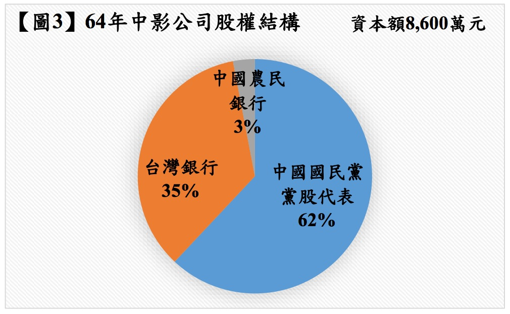

（五）67年間，中影公司向經濟部商業司申請變更董事、監察人登記時曾提及：「本公司係黨營文化事業，所有董監事均無薪給，亦無實際股權，僅為股權代表人。凡代表黨股者，自中央提報中常會核備後，再由中央文化工作會派任之」23，顯見中影公司之自然人股東僅係國民黨之黨股代表，當時國民黨不僅掌控該公司半數以上股權，更透過指派董、監事掌控中影公司之業務經營。

### 二、國民黨以「黨營事業」擔任黨股代表時期

（一） 80年間，國民黨之黨股代表自然人股東將持有之股份移轉登記予黨營事業華夏投資股份有限公司（下稱華夏投資公司；當時由宋楚瑜擔任董事長），華夏投資公司並指派鄭水枝等人代表執行職務24，並於81年4月20日申請變更登記其持有股數為535,940股（約62%股權），華夏投資公司成為中影公司的最大股東25；另台灣銀行及中國農民銀行則分別持有中影公司300,000股（約35%股權）及24,000股（約3%股權），參見【圖4】。

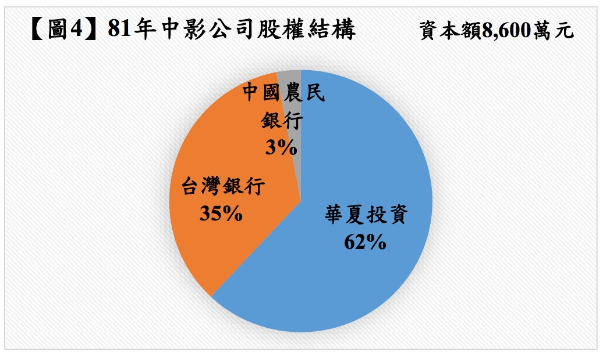

（二）87年間，中影公司股東會決議增資1億1,200萬元，因台灣銀行及中國農民銀行放棄認購，故增資部分多由華夏投資公司、中投公司及建華投資股份有限公司（下稱建華投資公司）等關係企業，並有少數中影公司員工參與26，以每股發行價格270元認購27。中影公司原登記資本額為8,600萬元，分為86萬股，每股100元，全額發行；增資後資本總額為1億9,800萬元，並修改每股面額為10元，共計發行1,980萬股；增資所繳股款1億1,200萬元及發行溢額29億1,200萬元，共計30億2,400萬元，其中發行溢額29億1,200萬元已於87年8月5日轉入資本公積28。中影公司增資後股權結構參見【圖5】。

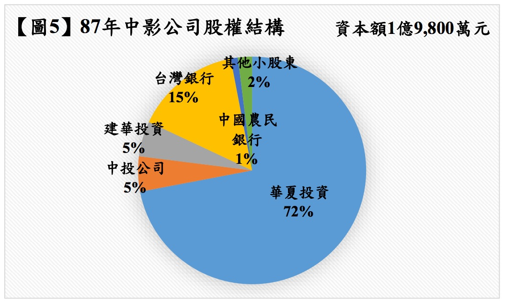

（三）88年間，中影公司以28億元29收購中央日報辦公大樓，後稱八德路華夏大樓。嗣後中影公司陸續以資本公積轉增資，並辦理減資、註銷買回該公司股份227,500股，至93年7月間，中影公司登記資本總額為5億8,578萬5,000元，分為5,857萬8,500股，其股權分別由華夏投資公司持有約50%、台灣銀行持有約15%、中國廣播股份有限公司（下稱中廣公司）持有約15%，其餘股權則由中國農民銀行、中投公司及其他小股東持有30，參見【圖6】。

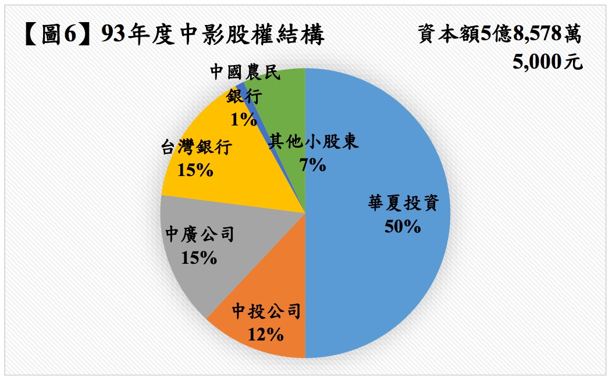

另請參考【附件A：民國42年至93年間中影公司資本額與股權結構變動一覽表】。

（四）94年間，國民黨將其所持有之華夏投資公司全部股權（約佔華夏投資公司之99.6%股權）分別出售予光華投資股份有限公司（下稱光華投資公司）143,415,000股（約59.76%股權）31及中投公司95,625,000股（約39.84%股權），買賣價金共38億2,464萬元32。94年12月底，中投公司及光華投資公司將華夏投資公司（含中影公司50%股權、中廣公司97%股權及中視公司33.94%股權）以40億元出售予榮麗投資股份有限公司（下稱榮麗投資公司）；惟該交易嗣經變更，雙方洽定交易標的限縮為華夏投資公司持有中視公司33.94%股權之部分，至華夏投資公司持有之中影公司50%股權及中廣公司97%股權，則由中投公司另行處分。

### 三、國民黨將中影公司股權轉讓出售時期

95年4月27日中投公司將其與華夏投資公司、中廣公司、光華投資股份有限公司（下稱光華公司）、建華投資股份有限公司（下稱建華公司）及中央日報社等關係企業全部持有的82.56%中影公司股權，以31億4,368萬8,210元價格出售予買方羅玉珍（即郭台強之配偶）與莊婉均。上開中影公司股權交易過程及股權變動情形詳後述。
 
## 肆、中影公司股權出售予羅玉珍、莊婉均之交易過程

### 一、95年4月27日中投公司與羅玉珍、莊婉均簽署股權買賣契約書

95年4月27日中投公司以每股65元出售中影公司82.56%股權予莊婉均、羅玉珍33。當時中影公司每股65元價格如何決定，據中影公司股權交易案之承辦人曾忠正表示，95年1月中投公司總經理汪海清於工作會議中提到郭台強想要以每股65元收購中影股權，但中影公司股權交易過程係由蔡正元代表郭台強與中投公司磋商；且中投公司當時面臨財務調度的壓力，有迫切處分中影公司股權取得資金之需求34。蔡正元代表郭台強於94年10月至12月間，一再向中投公司表示郭台強對收購中影公司股權有興趣，中投公司管理階層相信郭台強的實力，在面臨財務壓力下，同意將中影公司股權出售予郭台強；但蔡正元向中投公司表示郭台強為上市公司正崴精密工業股份有限公司之負責人，若涉及非本業轉投資會對郭台強造成困擾，故以郭台強之夫人羅玉珍名義簽約，最後由郭台強之妻羅玉珍及蔡正元介紹的莊婉均擔任買方簽約35。

曾忠正並表示，由於中影公司主要資產為不動產，因此中投公司當時先找中華徵信所就八德路華夏大樓、西門町新世界大樓及中影文化城三大不動產作鑑價，然後再拿這三份鑑價報告36去跟買方磋商合理的交易價格；而中投公司與買方代表蔡正元磋商出交易價格後，委託衡平資產鑑定有限公司（下稱衡平公司）於95年4月26日出具中影公司股權交易價格合理性評估報告書（下稱評估報告書）37。該評估報告書評估中影公司合理交易價格區間介於60.8元至67.2元之間，並由萬盛會計師事務所楊忠耕會計師就該評估報告書出具交易價格複核意見書38。

95年4月27日中投公司與羅玉珍、莊婉均簽立股權買賣契約書，約定中投公司將其與華夏投資公司39、中廣公司、光華公司、建華公司及中央日報社等關係企業全部持有的中影公司48,364,434股（約82.56%股權），以31億4,368萬8,210元價格出售予買方羅玉珍（即郭台強之配偶）與莊婉均，並由林秀美擔任莊婉均之連帶保證人，蔡正元和李永然律師擔任股權買賣契約之見證人。買、賣雙方於上開股權買賣契約書第三條「交易方法」約定支付簽約金1.5億元，餘款分期給付，共計五期：於買方支付第一期款4.5億元時，賣方應過戶給買方之中影公司股權為9,230,000股（約15.76%股權）；支付第二期款6億元時，應過戶之中影公司股權為9,230,000股（約15.76%股權）；支付第三期款6億元時，應過戶之中影公司股權為9,230,000股（約15.76%股權）；支付第四期款6億4,980萬9,550元時，應過戶之中影公司股權為9,997,070股（約17.06%股權）；支付第五期款6億9,387萬8,660元時，應過戶之中影公司股權為10,677,364股（約18.22%股權）。惟雙方又於同條第（六）項約定，賣方於支付第二期款之日起10日內或中影公司辦理減增資除權基準日前，應將第三至五期款付款時擬交割之中影公司股份全數過戶給買方或買方指定且賣方同意之第三人，但買方或買方指定之第三人應同時將該等股份設質予轉讓股份之賣方及各股票原持有人，並於完成轉讓之日起5日內將該等設質後之股份交付給保管人（即永然聯合法律事務所）保管，而保管人於買方支付各該期款項時，即應將各該期已解除設質之股份交付予買方。另就中影公司5,035,985股（約8.6%股權）部分則約定待農教案40定讞後交割41。

此外，中投公司與羅玉珍、莊婉均於上開股權買賣契約書第七條訂定「資產現金價值利潤分享」條款，其內容如下：「

> （一）中影公司出售下列不動產，買、賣雙方同意買方應依下列方式計算與賣方分享利潤：

> 1、華夏大樓部分

> (1)中影公司出售位於台北市中山區八德路二段260號之華夏大樓（以下稱「華夏大樓」）成交後扣除稅捐（土地增值稅除外）及交易費用之淨現金價格合計高於十五億元（1,500,000,000）時，買方應支付予賣方之金額為該淨現金價格超出十五億元（1,500,000,000）部分之82.56%。

> (2)買方保證自第一次付款日起，促使中影公司以二十億元之價格優先出售華夏大樓之產權予賣方或賣方覓得之第三人。

> 2、新世界大樓部分

> 中影公司出售位於北市萬華區漢中街116號、成都路13號之新世界大樓（以下稱「新世界大樓」）成交後扣除稅捐（土地增值稅除外）及交易費用之淨現金價格合計高於十二億元（1,200,000,000）時，買方應支付予賣方之金額為該成交之淨現金價格超出十二億元（1,200,000,000）部分乘以82.56%之三分之二之數額。

> 3、中影文化城部分

> 中影公司出售位於台北市士林區至善路2段34號之中國電影文化城（以下稱「中影文化城」）成交後扣除稅捐（土地增值稅除外）及交易費用之淨現金價格合計高於二十六億元（2,600,000,000）時，買方應支付予賣方之金額為該淨現金價格超出二十六億元（2,600,000,000）部分乘以82.56%之二分之一之數額。

> （二）本利潤分享方案自本契約簽約日起三年內有效，逾期賣方不得主張利潤分享。

> （三）本利潤分享方案有效期間內，中影公司如依本條第一項出售各項不動產時，買方應保證促請中影公司先以書面通知賣方得依出售之價格及條件優先承購該不動產，並得將不動產所有權登記予賣方指定之名義人。但賣方於收到通知函之日起十日內如未行使優先承購權時，視為放棄。

> （四）本利潤分享方案有效期間屆滿時，如中影公司未能出售華夏大樓、新世界大樓、中影文化城任一不動產時，買方保證儘速協助賣方以前項各款之下限價格及同一條件優先購買，並得將該不動產所有權登記予賣方所指定之名義人。

> （五）本利潤分享方案有效期間屆期前，如買方出售其所持有之中影公司股份時，買方同意賣方得依本條第一項各款不動產之下限價格及同一條件優先承購該不動產，並得將該不動產所有權登記予賣方所指定之名義人。

> （六）賣方依本條第一項各款約定得享有之利潤，買、賣雙方同意買方應於各該不動產標的簽立買賣契約之日起六個月內給付利潤分配款予賣方。

> （七）如賣方無法將中影公司總股權數之百分之八十二點五六（82.56%）全部轉讓予買方或買方指定之第三人時，買、賣雙方同意賣方依本條第一項各款約定得享有之利潤，按買方實際取得之股權比例計算。

> （八）本契約簽約日起三年內，賣方得推荐一人擔任買方之法人代表出任中影公司董事，該人選經買方指派後，非經賣方同意，買方不得更換。」

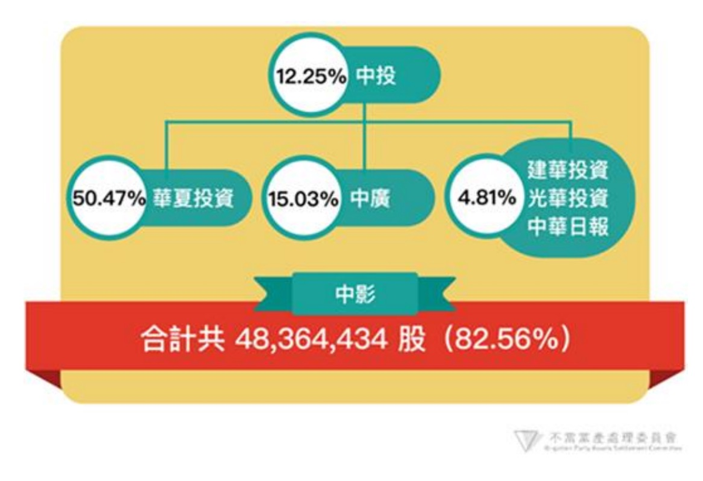

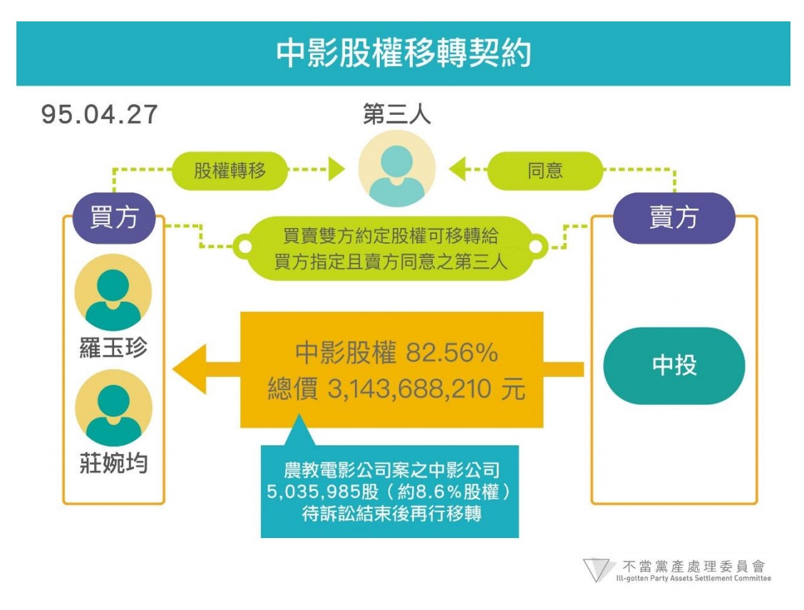

### 二、95年4月27日羅玉珍（即郭台強之妻）、莊婉均與蔡正元簽署三方密約

根據95年4月27日羅玉珍（即郭台強之妻）、莊婉均及蔡正元簽署之合作協議書（即三方密約）記載，中影公司股權交易之第一期款6億元與第二期款6億元由莊婉均負責支付；第三期款至第五期款，則由蔡正元規劃執行中影公司增減資事宜，並利用增減資取得之資金支付第三期款至第五期款。羅玉珍則同意出面擔任與中投公司簽約股權交易之買方，並簽發履約本票（發票人為羅玉珍與莊婉均，連帶保證人為郭台強與林秀美），以取信中投公司，促成交易的成立，並取得中影文化城土地三分之一優先購買權42。

### 三、中投公司收取價款及移轉股權之過程

（一）95年4月27日簽約時由莊婉均支付簽約金1億5,000萬元；95年5月3日，中投公司依羅玉珍與莊婉均之指示協調華夏投資公司指派蔡正元、莊婉均、羅玉珍3人擔任中影公司之董事，林秀美則為監察人，中影公司董事會並於同年5月8日選任蔡正元為董事長（同時聘任其為總經理）、莊婉均為副董事長；95年5月29日中投公司收到第一期股款4.5億元，簽約金及第一期款共6億元於此時收訖。中投公司即依約將中影公司8,768,000股（約14.97%股權）及462,000股（約0.79%股權）共9,230,000股（約15.76%股權）分別過戶予羅玉珍與莊婉均指定之阿波羅投資股份有限公司（下稱阿波羅公司）及茸國國際投資股份有限公司（下稱茸國公司）43。

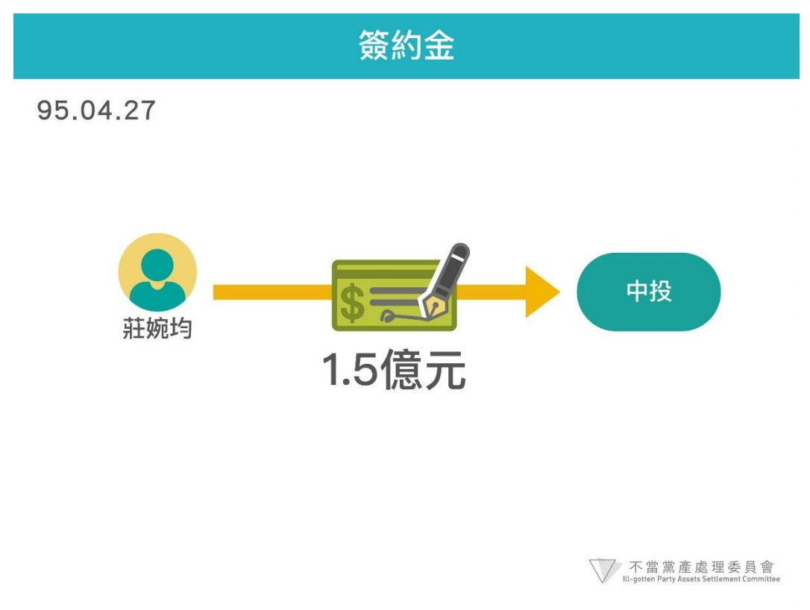

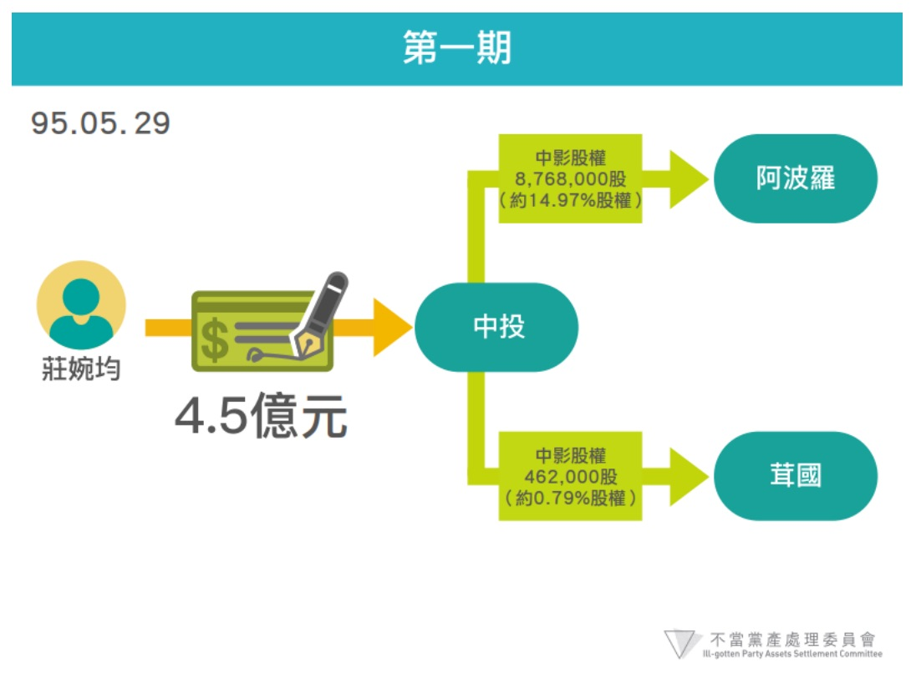

（二）95年7月20日中投公司收到莊婉均支付第二期款6億元44。莊婉均自95年5月8日擔任中影公司副董事長起，迄95年9月11日被解任職務為止，以預付購地土地款、購買辦公大樓預付款等名目挪用中影公司7億4,932萬9,000元，並將其中6億元以台支方式支付第二期款予中投公司45。中投公司依約將中影公司8,800,000股（約15.02%股權）及430,000股（約0.74%股權）共9,230,000股（約15.76%股權），分別過戶予阿波羅公司及茸國公司，其餘24,868,449股（約42.45%股權；不含農教案部分之5,035,985股，約8.6%股權）亦先行過戶予阿波羅公司後再設質予中投公司46。

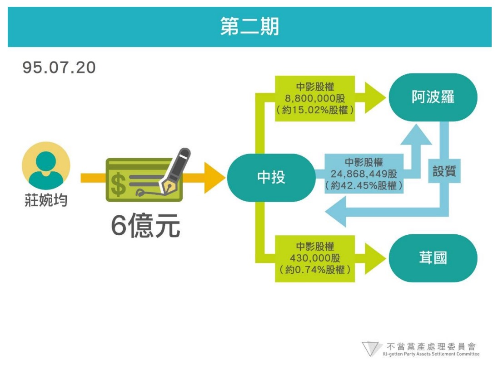

（三）95年6月間，中影公司股東會議及董事會議在蔡正元、莊婉均主導下，決議辦理現金增資收回優先股300萬股、資本公積轉增資同時等額減資7億6,152萬500元等案47，惟台灣銀行反對，並於同年7月間向法院提起訴訟48。嗣於98年11月間，經濟部以中影公司95年決議通過之上開資本公積轉增資同時減資案違反公司法為由，不予登記，經提起訴願遭駁回後，中影公司於98年11月25日召開董事會議，決議依法將資本結構回復至95年增、減資前之狀態49。

（四）中投公司收到上開簽約金及第一、二期款共計12億元後，羅玉珍及莊婉均指定之中影公司股權受領對象阿波羅公司不但已取得中影公司股權17,998,000股（約30.72%股權）50，並已取得原本應於第三至五期款付款時擬交割之中影公司股權24,868,449股（約42.45%股權；不含農教案部分之股權）；另經前述95年6月間中影公司股東會議及董事會議決議收回台灣銀行優先股300萬股，並辦理現金增資發行普通股300萬股，阿波羅公司認購其中1,966,780股（約3.36%股權）51，總計阿波羅公司於95年9月22日登記持有股數共44,833,229股（約76.53%股權）52。從而中影公司於95年9月22日減資7億6,152萬500元時，阿波羅公司以其持股比例約76.53%取得減資款5億8,283萬2,027元53，但當時買方羅玉珍與莊婉均尚未付清全部價款31億4,368萬8,210元，卻能在僅僅支付第一、二期價款12億元（占總價款38%）之情形下，以持股76.53%之比例獲得減資款5億8,283萬2,027元，較其原本依第一、二期款取得之持股比例30.72%所應得之減資款約2億3,393萬9,098元多出一倍有餘。

（五）96年1月間，阿波羅公司將所取得之上開中影公司減資款5億8,283萬2,027元，以利害關係人身分代莊婉均償還挪用資金7億餘元予中影公司，不足1億餘元部分應係由阿波羅公司向清晞電子股份有限公司（下稱清晞電子公司）借款54，阿波羅公司並與中影公司簽立權利轉讓書，取得中影公司對莊婉均之資金償還請求權及損害賠償請求權55。96年7月間，阿波羅公司將所持有之中影公司11,100,000股（約18.95%股權）以5億7,720萬元價格出售予清晞電子公司56。

（六）至於中投公司與羅玉珍、莊婉均間之中影公司股權買賣契約第三期以後款項，則由中投公司與羅玉珍另於96年6月11日簽署補充協議，約定第三至五期款由羅玉珍支付，富聯國際投資股份有限公司（下稱富聯國際公司）擔任連帶保證人57；羅玉珍僅先支付第三期款其中之2億元58，即於96年6月12日經中投公司同意，簽收永然聯合法律事務所保管之登記為阿波羅公司名義並設質於中投公司之中影公司24,868,449股股票（約42.45%股權）59；96年6月26日上開2,486,8449股（約42.45%股權）自阿波羅公司移轉登記予羅玉珍擔任董事長之富聯國際公司60。

（七）96年7月間中影公司在蔡正元讓出經營權後，由林麗珍律師接任董事長61。97年7月1日中投公司收到羅玉珍支付第三期款其餘4億元62。

（八）98年2月間郭台強接任中影公司董事長63，同年8月5日中投公司收到第四期款6億4,980萬9,550元與第五期款部分款項3億6,653萬9,635元（第五期剩餘款項為農教案部分之股權價款3億2,733萬9,025元），並於次日將相關中影公司股票15,638,449股完成解質64，富聯國際公司此時持有中影公司共24,868,449股（約42.45%股權）65。同年11月間，中影公司成立100%持股之子公司中影八德股份有限公司（下稱中影八德公司）與中影文化城股份有限公司（下稱中影文化城公司）66，嗣99年4月間，中影公司以其100%持股子公司中影八德公司發行新股予中影公司之方式，作價21億8,116萬元將中影公司名下八德路華夏大樓土地移轉予其子公司中影八德公司67。

（九）99年間，中投公司將73億餘元資產及3億餘元負債分割成立欣裕台股份有限公司（下稱欣裕台公司），並將其對中影公司股權買受人羅玉珍、莊婉均等人之權利移轉予欣裕台公司68；同年5月間，中投公司在農教案判決確定後收到第五期餘款3億2,733萬9,025元69，並透過欣裕台公司移轉農教案部分之中影公司5,035,985股（約8.6%股權）予富聯國際公司。

（十）103年間，中影公司資本公積轉增資1億1,715萬7,000元，資本額為7億294萬2,000元70；104年間，中影公司現金增資4億元，資本額為11億294萬2,000元，股權結構為富聯國際公司（董事長為羅玉珍）約37.14%、富士臨國際投資股份有限公司（董事長為郭台強）約13.6%、崴強科技股份有限公司（董事長為郭台強）約3.89%、清晞電子公司約17.92%、台灣銀行約14.39%、香港商傑麗發展有限公司約10.87%、合作金庫約0.78%，其餘約1.41%為其他小股東持有（包含欣裕台公司約0.11%）71。106年度股權結構同104年度72，參見【圖7】。

另請參考【附件B：中投公司出售中影公司股權後之股權結構變化】。

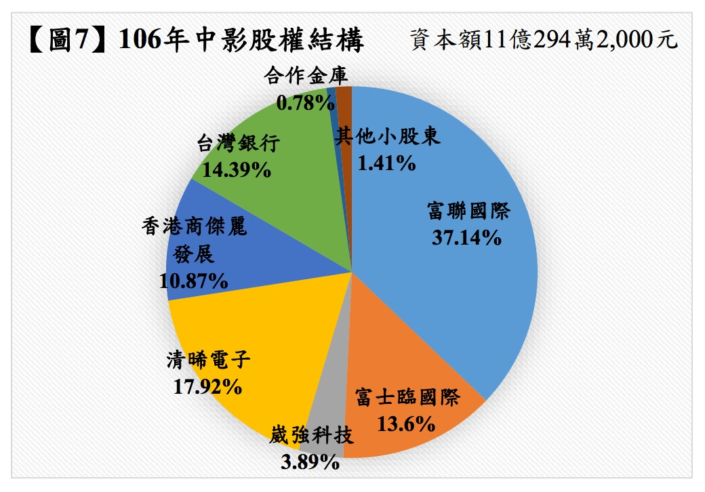
 
## 伍、中影公司股權交易價格之合理性分析

### 一、中影公司股權交易價格合理性評估報告書是否低估中影公司資產價值

依中影公司股權交易價格合理性評估報告書（下稱系爭股價評估報告）第13頁記載：「推估每股合理價值＝1.09倍×72.49元×81%=64.001元/每股。故，推估每股合理價值區間：64.001元×95%≤推估每股價值區間≤64.001元×105%；60.8元≤推估每股價值區間≤67.2元」73，上述推估過程中係以1.09倍、72.49元與81%作為評估中影公司合理股價之要素。

其中72.49元為中影公司94年度之每股淨值，計算方式為中影公司94年度財務報表暨會計師查核報告（下稱中影公司94年度財報暨查核報告）記載之股東權益42億4,663萬8,873元除以當時中影公司總股數5,857萬8,500股74；1.09倍則係以中投公司出售中影公司股權時，中影公司並非為公開發行公司，考量中影公司資產豐厚、股權歸屬等特性，選定同樣具有豐厚固定資產與官股經營且公開發行之台灣肥料股份有限公司（下稱台肥公司）與臺鹽實業股份有限公司（下稱台鹽公司）作為類比公司，取這兩家公司93年1月至95年3月間每股股價除以淨值之比例平均後算出1.09倍，作為中影公司94年度每股淨值之調整；81%調整數則係依據評估報告書第16頁Value-Netex模型，就中影公司之數量性風險類型（如變現性、財務槓桿等項目）與品質性風險類型（如競爭環境與管理能力等項目），計算出81%作為中影公司合理股價判斷之調整數。

然而，就上開中影公司94年度每股淨值72.49元的部分，林寬照會計師表示，依照會計帳務處理原則，中影公司94年度財報暨查核報告是以「土地公告現值」認列中影公司土地重估增值75，會嚴重低估中影公司土地價值；此外，由於房屋價值減損又被認列減損在上開財報暨查核報告上，當時中影公司的淨值亦會被低估76。又根據林寬照會計師提供之說明書第2頁與第4頁記載，中影公司94年度財報暨查核報告認列土地重估增值乃僅就新世界大樓、屏東光華戲院、中影文化城與梅花戲院以94年「土地公告現值」扣除當初取得所認列成本之帳面金額，計算出該年度土地重估增值37億310萬3,865元，惟當時中影公司名下尚有台中戲院、嘉義戲院、延平戲院、壽星戲院、新店沖印廠、康定路宿舍與羅東新生戲院，中影公司於94年度卻並未辦理重估，亦未於財務報表上認列土地重估增值77；林寬照會計師更進一步表示，合理的股權售價不宜以被低估的公司淨值為計算基礎，而應找鑑價公司進行資產現值的估價78，事實上，94年6月間，中投公司已委請中華徵信所就八德路華夏大樓、西門町新世界大樓及中影文化城三大不動產作鑑價，並出具三份鑑價報告，依據中華徵信所的鑑價結果，八德路華夏大樓之土地勘估價格為14億4,661萬1,219元、中影文化城之土地勘估價格為36億2,375萬4,831元、西門町新世界大樓之土地勘估價格為14億2,034萬8,258元，總計64億9,071萬4,308元79，顯然高於中影公司94年度財報暨查核報告以當年度「土地公告現值」所計算之三大不動產金額45億9,284萬6,167元80，但中影公司94年度財報暨查核報告由於非以評估合理股價為目的，因此在計算土地增值時並未採用較能反映資產實際價值之中華徵信所鑑價報告，但在提列八德路華夏大樓之減損損失時卻又採用中華徵信所鑑價報告，於94年底提列減損損失共計5億7,025萬3,068元81。綜上，基於中影公司94年度財報暨查核報告是以低於市價之「土地公告現值」計算土地重估增值，且僅就中影公司名下之「部分」土地計算重估增值，並未就「全部」土地計算其重估增值，而在提列華夏大樓減損損失時卻又使用中華徵信所鑑價報告勘估之土地價值等因素，所以中影公司94年度財報暨查核報告記載之每股淨值72.49元並無法反映中影公司當時名下所有土地之實際價值。就此，臺灣臺北地方法院96年度司字第160號裁定選派洪再德會計師檢查中影公司業務帳目與財產情形，洪再德會計師亦表示，中影公司名下不動產價值甚高，即使中影公司辦理過資產重估，仍屬低估，而有相當的價差82。另請參考【附件C：94年6月中影公司土地重估增值及中華徵信所鑑價結果一覽表】。

至於以81%作為調整數的部分，系爭股價評估報告書第12頁Value-Netex模型記載：「考慮中影公司股權之流通性及變現性、獲利性及經營績效等不及類比公司台鹽、台肥等因素，以81%作為『調整數』」，而81%調整數同頁註腳係參照Value-Netex評價模型，但系爭股價評估報告第16頁之標的公司風險評估表並無記載81%調整數之計算過程。經本會詢問當時出具系爭股價評估報告之張錦耀證券分析師：「（問：為何在你的評價過程中會乘以81%調整數估計合理股價？）81%是很主觀的，如果是上市櫃股票，就沒有流動性的問題。因為中影公司是未上市櫃的股票，有流動性的問題，所以就大概打個八折，以81%調整計算」、「（問：為什麼是81%，而不是其他的數值？）這是很主觀的，非上市櫃公司股票有流動性問題」83，因此以81%作為調整數在評估上是相當主觀的。此外，經本會於106年2月18日詢問張錦耀證券分析師能否提出81%的具體計算式，張錦耀表示嗣後將另行提供相關資料84，但至今仍未能提出。

又關於1.09倍此一數值之來源，經本會詢問張錦耀證券分析師，其表示：「（問：照你所述這些公司的土地資產都很高，你在附件『股權交易價格合理性評估報告書』第7頁對於中影公司的描述有提到『迄94年底該公司帳上固定資產總額占資產總額比率71.95%之高』，那你當初是否有對台肥及台鹽2家公司的固定資產總額占資產總額比率進行確認？）我沒有就台肥及台鹽這2家公司做過固定資產比重的確認。是因為市場上台肥及台鹽都是被評估為資產股，我是憑印象去選取類比對象」、「（問：經本會查詢，台鹽94年固定資產比重約51%、93年約49%，明顯低於94年中影固定資產比重71.95%，為什麼在這磨大的落差下，你會認為這兩家公司與中影公司有所謂『相同資產潛值』？）我當時是沒有去查證台鹽、台肥的固定資產比重，我只是依照多年來在股票市場上的印象選去這兩家公司」、「（問：（提示附件）這份『股權交易價格合理性評估報告書』第11頁『（二）、計算數值列表：台鹽及台肥公司均價、淨值及比例數據列示：（表一）』是以月份為單位計算，逐月例示。但為何表格中，自93年1月起至95年3月止，台鹽每股淨值每個月都是29.67，而台肥每股淨值每個月都是31.62，從未有任何浮動？）事實上確實可以參考年報、季報，但我認為可能的變動不大，如果要說這部分我的報告有些瑕疵，我承認」、「（問：（提示附件）依據該表之註記：『＊比例表示：月均價除以每股淨值。均以93年底淨值代替。』這是何意？）當時是以93年底的每股淨值，代替94年底的每股淨值。也許要用94年底的每股淨值去比會比較妥當」及「（問：為什麼會用93年底的每股淨值代替94年底的每股淨值？）這部分我承認有點瑕疵」等語85，可知系爭股價評估報告中選擇以台鹽公司與台肥公司作為類比公司時，並未事先確認台鹽公司與台肥公司的固定資產總額占全部資產總額的比重是否與中影公司的固定資產比重相當，且張錦耀證券分析師亦承認此一計算過程中存有瑕疵。

另據張錦耀證券分析師表示：「（問：（提示附件）這份95年4月26日由衡平資產鑑定有限公司作為評估單位、張錦耀證券分析師作為評估人員、標的為中央電影事業股份有限公司的『股權交易價格合理性評估報告書』，其內容是否由你親自撰寫？）這份報告是由我複核並簽名的」及「（問：這份報告是不是楊忠耕寫好再交給你複核的？）我沒辦法確認是不是楊忠耕寫的，但有可能是由衡平公司裡面的人擬好草稿，再交由我複核」等語86，可知張錦耀證券分析師並未親自撰寫系爭股價評估報告。又經本會詢問當時就系爭股價評估報告出具「交易價格複核意見書」之楊忠耕會計師：「（問：張錦耀證券分析師如何取得華夏投資股份有限公司與中央電影事業股份有限公司之股權交易價格合理性評估業務？）這部分業務是我這邊承攬過來，我是在安東街遇到我台大的學長簡錫塘，剛好他也在中投擔任財務副總，因為這樣的關係，才慢慢轉介中投的業務給我。但因為我是個人事務所，無法作他們財稅簽的工作，因此只能替他們做一些財務會計方面的事務，例如公司財務訴訟、增資變更登記、解算清算的工作」、「（問：（提示附件一）你負責接洽張錦耀先生來擔任衡平資產鑑定有限公司承攬該評估報告之評估人，你本人是否可否再用萬盛會計師事務所名義再對衡平資產鑑定有限公司出具的交易價格合理性報告，再出具交易價格複核意見書？）在業界，這個情形是很常見的。我想市場上大部分都是這樣的狀況，都是找與我有信賴關係的人來出具股權交易合理性評估報告的，而我和我找的人有相當穩定的合作關係與一定的工作品質、態度等。獨立性問題我比較欠考慮」87，可知楊忠耕會計師一方面代表衡平公司向中影公司招攬系爭股價格評估報告業務，並由衡平公司人員擬妥系爭股價評估報告後，交給張錦耀先生簽名，另一方面又由其負責出具系爭股價評估報告之「交易價格複核意見書」，其獨立性顯然有問題。

此外，中投公司負責中影公司股權交易案之承辦人曾忠正及簡錫塘均表示，簽約之前並未研讀此份評估報告書，因此對於評估報告書之計算基礎與計算方式並不清楚88。

### 二、為何要訂定「資產現金價值利潤分享」條款以及其效力

依95年4月27日中投公司（賣方）與羅玉珍、莊婉均（買方）之股權買賣契約書第七條「資產現金價值利潤分享」條款約定，簽約日起3年內，若中影公司處分華夏大樓、新世界大樓與中影文化城3處不動產之淨價加上土地增值稅分別高於15億元、12億元及26億元，買方應就華夏大樓超出部分之82.56%支付予賣方；就新世界大樓超出部分之82.56%乘以三分之二支付予賣方；就中影文化城部分超出82.56%乘以二分之一支付予賣方。若3年內中影公司未處分上開三大不動產，則中投公司有權以15億元、12億元及26億元向中影公司購回。

另據中影公司股權出售業務承辦人曾忠正表示，95年1月間就知道郭台強有意要以每股65元收購中影公司股權，但因為買方郭台強與賣方中投公司對於中影公司主要資產中影文化城、新世界大樓與華夏大樓價值認知不同，且預估未來三年房地產市場看漲，故進一步就這三大不動產進行利潤分享條款之磋商89。然而，由於前開股權買賣契約書之簽約者僅有中投公司、羅玉珍和莊婉均三方，中影公司並非契約當事人，因此前開股權買賣契約書第七條「資產現金價值利潤分享」條款之約定根本無法拘束中影公司，以致3年後中影公司並未處分上開三大不動產時，中投公司無從直接向中影公司主張購回該三大不動產；再加上前開股權買賣契約書亦未約定違約條款，中投公司亦無從依上開股權買賣契約向羅玉珍、莊婉均求償，使得「資產現金價值利潤分享」條款無論是對中影公司或是對羅玉珍、莊婉均而言，均無強制力可言。時至今日，中投公司不僅無法要求中影公司處分上開三大不動產並依上述比例分享利潤予中投公司，也無法主張以上述價格向中影公司購回上開三大不動產，所謂「資產現金價值利潤分享」條款形同虛設。

97年8月間，中影公司就三大資產中之新世界大樓曾委請戴德梁行鑑價、標售90，但最終仍未出售。100年3月間，有關台灣銀行訴請確認中影公司95年6月23日股東會決議修訂「取得或處分資產處理程序準則」無效乙案敗訴確定91。另目前欣裕台公司針對利潤分享條款約定三大不動產其中之一的八德路華夏大樓仍在訴訟進行中92。
 
## 陸、爭點：

中影股份有限公司是否曾由社團法人中國國民黨實質控制其人事、財務或業務經營；且其82.56%股權於95年4月27日以每股65元讓售予羅玉珍、莊婉均，是否係以相當對價轉讓而脫離社團法人中國國民黨之實質控制？

【附件A：民國42年至93年間中影公司資本額與股權結構變動一覽表】
<table class="table table-bordered table-hover table-condensed">
  <thead>
    <tr>
      <th>年度</th>
      <th>實收資本額</th>
      <th>股權結構變動原因</th>
      <th>變動方式</th>
      <th>股權結構</th>
      <th>持股比例</th>
    </tr>
  </thead>
  <tbody>
    <tr>
      <td>42年</td>
      <td>200萬元</td>
      <td>設立登記</td>
      <td>以台北大世界戲院基地及房屋抵繳</td>
      <td>戴安國等22人</td>
      <td>100%</td>
    </tr>
    <tr>
      <td>43年</td>
      <td>400萬元</td>
      <td>增資200萬元</td>
      <td>以農教電影公司資產抵繳之</td>
      <td>戴安國等24人</td>
      <td>50%</td>
    </tr>
    <tr>
      <td> </td>
      <td> </td>
      <td> </td>
      <td> </td>
      <td>農業教育電影（股）公司</td>
      <td>50%</td>
    </tr>
    <tr>
      <td>53年</td>
      <td>7,000萬元</td>
      <td>增資6,600萬元</td>
      <td>資本公積、固定資產、其他長期借款、向台銀透支之短期借款轉作資本</td>
      <td>蔡孟堅等41人</td>
      <td>57%</td>
    </tr>
    <tr>
      <td> </td>
      <td> </td>
      <td> </td>
      <td> </td>
      <td>台灣銀行</td>
      <td>43%</td>
    </tr>
    <tr>
      <td>64年</td>
      <td>8,600萬元</td>
      <td>增資1,600萬元</td>
      <td>以國民黨文工會稽查費轉作黨股增資</td>
      <td>辜振甫等51人</td>
      <td>62%</td>
    </tr>
    <tr>
      <td> </td>
      <td> </td>
      <td> </td>
      <td> </td>
      <td>台灣銀行</td>
      <td>35%</td>
    </tr>
    <tr>
      <td> </td>
      <td> </td>
      <td> </td>
      <td> </td>
      <td>中國農民銀行</td>
      <td>3%</td>
    </tr>
    <tr>
      <td>81年</td>
      <td>8,600萬元</td>
      <td>－</td>
      <td>－</td>
      <td>華夏投資</td>
      <td>62%</td>
    </tr>
    <tr>
      <td> </td>
      <td> </td>
      <td> </td>
      <td> </td>
      <td>台灣銀行</td>
      <td>35%</td>
    </tr>
    <tr>
      <td> </td>
      <td> </td>
      <td> </td>
      <td> </td>
      <td>中國農民銀行</td>
      <td>3%</td>
    </tr>
    <tr>
      <td>87年</td>
      <td>1億9,800萬元</td>
      <td>增資1億1,200萬元</td>
      <td>現金增資</td>
      <td>華夏投資</td>
      <td>72%</td>
    </tr>
    <tr>
      <td> </td>
      <td> </td>
      <td> </td>
      <td> </td>
      <td>中投</td>
      <td>5%</td>
    </tr>
    <tr>
      <td> </td>
      <td> </td>
      <td> </td>
      <td> </td>
      <td>建華投資</td>
      <td>5%</td>
    </tr>
    <tr>
      <td> </td>
      <td> </td>
      <td> </td>
      <td> </td>
      <td>台灣銀行</td>
      <td>15%</td>
    </tr>
    <tr>
      <td> </td>
      <td> </td>
      <td> </td>
      <td> </td>
      <td>中國農民銀行</td>
      <td>1%</td>
    </tr>
    <tr>
      <td> </td>
      <td> </td>
      <td> </td>
      <td> </td>
      <td>持股5%以下股東</td>
      <td>2%</td>
    </tr>
    <tr>
      <td>88年</td>
      <td>3億5,640萬元</td>
      <td>增資1億5,840萬元</td>
      <td>資本公積轉增資</td>
      <td>華夏投資</td>
      <td>72%</td>
    </tr>
    <tr>
      <td> </td>
      <td> </td>
      <td> </td>
      <td> </td>
      <td>台灣銀行</td>
      <td>15%</td>
    </tr>
    <tr>
      <td> </td>
      <td> </td>
      <td> </td>
      <td> </td>
      <td>中國農民銀行</td>
      <td>1%</td>
    </tr>
    <tr>
      <td> </td>
      <td> </td>
      <td> </td>
      <td> </td>
      <td>持股5%以下股東</td>
      <td>12%</td>
    </tr>
    <tr>
      <td>89年</td>
      <td>5億3,460萬元</td>
      <td>增資1億7,820萬元</td>
      <td>資本公積轉增資</td>
      <td>華夏投資</td>
      <td>50%</td>
    </tr>
    <tr>
      <td> </td>
      <td> </td>
      <td> </td>
      <td> </td>
      <td>中央投資</td>
      <td>27%</td>
    </tr>
    <tr>
      <td> </td>
      <td> </td>
      <td> </td>
      <td> </td>
      <td>台灣銀行</td>
      <td>15%</td>
    </tr>
    <tr>
      <td> </td>
      <td> </td>
      <td> </td>
      <td> </td>
      <td>中國農民銀行</td>
      <td>1%</td>
    </tr>
    <tr>
      <td> </td>
      <td> </td>
      <td> </td>
      <td> </td>
      <td>持股5%以下股東</td>
      <td>7%</td>
    </tr>
    <tr>
      <td>91年</td>
      <td>5億8,806萬元</td>
      <td>增資5,346萬元</td>
      <td>資本公積轉增資</td>
      <td>華夏投資</td>
      <td>50%</td>
    </tr>
    <tr>
      <td> </td>
      <td> </td>
      <td> </td>
      <td> </td>
      <td>中央投資</td>
      <td>12%</td>
    </tr>
    <tr>
      <td> </td>
      <td> </td>
      <td> </td>
      <td> </td>
      <td>中國廣播</td>
      <td>15%</td>
    </tr>
    <tr>
      <td> </td>
      <td> </td>
      <td> </td>
      <td> </td>
      <td>台灣銀行</td>
      <td>15%</td>
    </tr>
    <tr>
      <td> </td>
      <td> </td>
      <td> </td>
      <td> </td>
      <td>中國農民銀行</td>
      <td>1%</td>
    </tr>
    <tr>
      <td> </td>
      <td> </td>
      <td> </td>
      <td> </td>
      <td>持股10%以下股東</td>
      <td>5%</td>
    </tr>
    <tr>
      <td>93年</td>
      <td>5億8,578萬5,000元</td>
      <td>減資227萬5,000元</td>
      <td>庫藏股註銷</td>
      <td>華夏投資</td>
      <td>50%</td>
    </tr>
    <tr>
      <td> </td>
      <td> </td>
      <td> </td>
      <td> </td>
      <td>中投</td>
      <td>12%</td>
    </tr>
    <tr>
      <td> </td>
      <td> </td>
      <td> </td>
      <td> </td>
      <td>中廣</td>
      <td>15%</td>
    </tr>
    <tr>
      <td> </td>
      <td> </td>
      <td> </td>
      <td> </td>
      <td>台灣銀行</td>
      <td>15%</td>
    </tr>
    <tr>
      <td> </td>
      <td> </td>
      <td> </td>
      <td> </td>
      <td>中國農民銀行</td>
      <td>1%</td>
    </tr>
    <tr>
      <td> </td>
      <td> </td>
      <td> </td>
      <td> </td>
      <td>持股10%以下股東</td>
      <td>7%</td>
    </tr>
  </tbody>
</table>

 
【附件B：中投公司出售中影公司股權後之股權結構變化】
<table class="table table-bordered table-hover table-condensed">
  <thead>
    <tr>
      <th>時間</th>
      <th>總股數（股）</th>
      <th>股權結構</th>
      <th>持股數（股）</th>
      <th>持股比例</th>
    </tr>
  </thead>
  <tbody>
    <tr>
      <td>95年4月27日  簽立中影股權買賣契約書</td>
      <td>58,578,500</td>
      <td>華夏投資</td>
      <td>29,563,305</td>
      <td>50.47%</td>
    </tr>
    <tr>
      <td> </td>
      <td> </td>
      <td>台灣銀行</td>
      <td>8,913,458</td>
      <td>15.21%</td>
    </tr>
    <tr>
      <td> </td>
      <td> </td>
      <td>中廣</td>
      <td>8,804,059</td>
      <td>15.03%</td>
    </tr>
    <tr>
      <td> </td>
      <td> </td>
      <td>中投</td>
      <td>7,172,796</td>
      <td>12.25%</td>
    </tr>
    <tr>
      <td> </td>
      <td> </td>
      <td>中國農民銀行</td>
      <td>713,076</td>
      <td>1.22%</td>
    </tr>
    <tr>
      <td> </td>
      <td> </td>
      <td>持股5%以下股東</td>
      <td>3,411,806</td>
      <td>5.82%</td>
    </tr>
    <tr>
      <td>95年7月20日  第二期款6億元支付後</td>
      <td>58,578,500</td>
      <td>阿波羅投資</td>
      <td>42,436,449</td>
      <td>72.44%</td>
    </tr>
    <tr>
      <td> </td>
      <td> </td>
      <td>台灣銀行</td>
      <td>8,913,458</td>
      <td>15.21%</td>
    </tr>
    <tr>
      <td> </td>
      <td> </td>
      <td>中投</td>
      <td>5,035,985</td>
      <td>8.60%</td>
    </tr>
    <tr>
      <td> </td>
      <td> </td>
      <td>茸國國際投資</td>
      <td>892,000</td>
      <td>1.53%</td>
    </tr>
    <tr>
      <td> </td>
      <td> </td>
      <td>中國農民銀行</td>
      <td>713,076</td>
      <td>1.22%</td>
    </tr>
    <tr>
      <td> </td>
      <td> </td>
      <td>持股5%以下股東</td>
      <td>587,532</td>
      <td>1%</td>
    </tr>
    <tr>
      <td>95年8月至9月  中影公司現金增資後  資本公積轉增資前</td>
      <td>58,578,500</td>
      <td>阿波羅投資</td>
      <td>44,833,229</td>
      <td>76.53%</td>
    </tr>
    <tr>
      <td> </td>
      <td> </td>
      <td>台灣銀行</td>
      <td>5,913,458</td>
      <td>10.09%</td>
    </tr>
    <tr>
      <td> </td>
      <td> </td>
      <td>中投</td>
      <td>5,267,035</td>
      <td>8.99%</td>
    </tr>
    <tr>
      <td> </td>
      <td> </td>
      <td>茸國國際投資</td>
      <td>462,000</td>
      <td>0.79%</td>
    </tr>
    <tr>
      <td> </td>
      <td> </td>
      <td>中國農民銀行</td>
      <td>713,076</td>
      <td>1.22%</td>
    </tr>
    <tr>
      <td> </td>
      <td> </td>
      <td>持股5%以下股東</td>
      <td>1,389,702</td>
      <td>2.38%</td>
    </tr>
    <tr>
      <td>95年9月21日  中影公司資本公積轉增資後</td>
      <td>134,730,550</td>
      <td>阿波羅投資</td>
      <td>103,116,434</td>
      <td>76.53%</td>
    </tr>
    <tr>
      <td> </td>
      <td> </td>
      <td>台灣銀行</td>
      <td>13,600,953</td>
      <td>10.09%</td>
    </tr>
    <tr>
      <td> </td>
      <td> </td>
      <td>中投</td>
      <td>12,114,180</td>
      <td>8.99%</td>
    </tr>
    <tr>
      <td> </td>
      <td> </td>
      <td>茸國國際投資</td>
      <td>1,062,600</td>
      <td>0.79%</td>
    </tr>
    <tr>
      <td> </td>
      <td> </td>
      <td>中國農民銀行</td>
      <td>1,640,074</td>
      <td>1.22%</td>
    </tr>
    <tr>
      <td> </td>
      <td> </td>
      <td>持股5%以下股東</td>
      <td>3,196,309</td>
      <td>2.38%</td>
    </tr>
    <tr>
      <td>95年10月19日  中影公司減資後</td>
      <td>58,578,500</td>
      <td>阿波羅投資</td>
      <td>44,833,229</td>
      <td>76.53%</td>
    </tr>
    <tr>
      <td> </td>
      <td> </td>
      <td>台灣銀行</td>
      <td>5,913,458</td>
      <td>10.09%</td>
    </tr>
    <tr>
      <td> </td>
      <td> </td>
      <td>中投</td>
      <td>5,267,035</td>
      <td>8.99%</td>
    </tr>
    <tr>
      <td> </td>
      <td> </td>
      <td>茸國國際投資</td>
      <td>462,000</td>
      <td>0.79%</td>
    </tr>
    <tr>
      <td> </td>
      <td> </td>
      <td>中國農民銀行</td>
      <td>713,076</td>
      <td>1.22%</td>
    </tr>
    <tr>
      <td> </td>
      <td> </td>
      <td>持股5%以下股東</td>
      <td>1,389,702</td>
      <td>2.38%</td>
    </tr>
    <tr>
      <td>96年6月26日  中投公司與羅玉珍第一次補充協議簽立後</td>
      <td>58,578,500</td>
      <td>富聯國際投資</td>
      <td>24,868,449</td>
      <td>42.45%</td>
    </tr>
    <tr>
      <td> </td>
      <td> </td>
      <td>阿波羅投資</td>
      <td>19,964,780</td>
      <td>34.08%</td>
    </tr>
    <tr>
      <td> </td>
      <td> </td>
      <td>台灣銀行</td>
      <td>5,913,458</td>
      <td>10.09%</td>
    </tr>
    <tr>
      <td> </td>
      <td> </td>
      <td>中投</td>
      <td>5,267,035</td>
      <td>8.99%</td>
    </tr>
    <tr>
      <td> </td>
      <td> </td>
      <td>茸國國際投資</td>
      <td>462,000</td>
      <td>0.79%</td>
    </tr>
    <tr>
      <td> </td>
      <td> </td>
      <td>中國農民銀行</td>
      <td>713,076</td>
      <td>1.22%</td>
    </tr>
    <tr>
      <td> </td>
      <td> </td>
      <td>持股5%以下股東</td>
      <td>1,389,702</td>
      <td>2.38%</td>
    </tr>
    <tr>
      <td>96年7月13日  清晞電子公司取得中影股權</td>
      <td>58,578,500</td>
      <td>富聯國際投資</td>
      <td>24,868,449</td>
      <td>42.45%</td>
    </tr>
    <tr>
      <td> </td>
      <td> </td>
      <td>清晞電子</td>
      <td>11,100,000</td>
      <td>18.95%</td>
    </tr>
    <tr>
      <td> </td>
      <td> </td>
      <td>阿波羅投資</td>
      <td>8,864,780</td>
      <td>15.13%</td>
    </tr>
    <tr>
      <td> </td>
      <td> </td>
      <td>台灣銀行</td>
      <td>5,913,458</td>
      <td>10.09%</td>
    </tr>
    <tr>
      <td> </td>
      <td> </td>
      <td>中投</td>
      <td>5,267,035</td>
      <td>8.99%</td>
    </tr>
    <tr>
      <td> </td>
      <td> </td>
      <td>茸國國際投資</td>
      <td>462,000</td>
      <td>0.79%</td>
    </tr>
    <tr>
      <td> </td>
      <td> </td>
      <td>中國農民銀行</td>
      <td>713,076</td>
      <td>1.22%</td>
    </tr>
    <tr>
      <td> </td>
      <td> </td>
      <td>持股5%以下股東</td>
      <td>1,389,702</td>
      <td>2.38%</td>
    </tr>
    <tr>
      <td>97年12月9日  莊婉均已自阿波羅投資取得中影股權</td>
      <td>58,578,500</td>
      <td>富聯國際投資</td>
      <td>24,868,449</td>
      <td>42.45%</td>
    </tr>
    <tr>
      <td> </td>
      <td> </td>
      <td>清晞電子</td>
      <td>11,100,000</td>
      <td>18.95%</td>
    </tr>
    <tr>
      <td> </td>
      <td> </td>
      <td>莊婉均</td>
      <td>6,743,000</td>
      <td>11.51%</td>
    </tr>
    <tr>
      <td> </td>
      <td> </td>
      <td>台灣銀行</td>
      <td>5,913,458</td>
      <td>10.09%</td>
    </tr>
    <tr>
      <td> </td>
      <td> </td>
      <td>中投</td>
      <td>5,267,035</td>
      <td>8.99%</td>
    </tr>
    <tr>
      <td> </td>
      <td> </td>
      <td>阿波羅投資</td>
      <td>2,121,780</td>
      <td>3.62%</td>
    </tr>
    <tr>
      <td> </td>
      <td> </td>
      <td>中國農民銀行</td>
      <td>713,076</td>
      <td>1.22%</td>
    </tr>
    <tr>
      <td> </td>
      <td> </td>
      <td>持股5%以下股東</td>
      <td>1,851,702</td>
      <td>3.17%</td>
    </tr>
    <tr>
      <td>103年7月9日  中影公司資本公積轉增資1億1,715萬7,000元</td>
      <td>70,294,200</td>
      <td>富聯國際</td>
      <td>35,964,425</td>
      <td>51.16%</td>
    </tr>
    <tr>
      <td> </td>
      <td> </td>
      <td>清晞電子</td>
      <td>13,320,000</td>
      <td>18.95%</td>
    </tr>
    <tr>
      <td> </td>
      <td> </td>
      <td>台灣銀行</td>
      <td>10,696,149</td>
      <td>15.22%</td>
    </tr>
    <tr>
      <td> </td>
      <td> </td>
      <td>香港商傑麗發展</td>
      <td>8,079,600</td>
      <td>11.49%</td>
    </tr>
    <tr>
      <td> </td>
      <td> </td>
      <td>合作金庫</td>
      <td>855,691</td>
      <td>1.22%</td>
    </tr>
    <tr>
      <td> </td>
      <td> </td>
      <td>持股5%以下股東</td>
      <td>1,378,335</td>
      <td>1.96%</td>
    </tr>
    <tr>
      <td>104年4月7日  中影公司現金增資4億元</td>
      <td>110,294,200</td>
      <td>富聯國際</td>
      <td>40,964,425</td>
      <td>37.14%</td>
    </tr>
    <tr>
      <td> </td>
      <td> </td>
      <td>清晞電子</td>
      <td>19,762,636</td>
      <td>17.92%</td>
    </tr>
    <tr>
      <td> </td>
      <td> </td>
      <td>台灣銀行</td>
      <td>15,869,677</td>
      <td>14.39%</td>
    </tr>
    <tr>
      <td> </td>
      <td> </td>
      <td>富士臨國際</td>
      <td>15,000,000</td>
      <td>13.60%</td>
    </tr>
    <tr>
      <td> </td>
      <td> </td>
      <td>香港商傑麗發展</td>
      <td>11,987,552</td>
      <td>10.87%</td>
    </tr>
    <tr>
      <td> </td>
      <td> </td>
      <td>崴強科技</td>
      <td>4,294,264</td>
      <td>3.89%</td>
    </tr>
    <tr>
      <td> </td>
      <td> </td>
      <td>合作金庫</td>
      <td>855,691</td>
      <td>0.78%</td>
    </tr>
    <tr>
      <td> </td>
      <td> </td>
      <td>持股5%以下股東</td>
      <td>1,559,955</td>
      <td>1.41%</td>
    </tr>
    <tr>
      <td>106年6月15日  中影公司最新股東名冊</td>
      <td>110,294,200</td>
      <td>富聯國際</td>
      <td>40,964,425</td>
      <td>37.14%</td>
    </tr>
    <tr>
      <td> </td>
      <td> </td>
      <td>清晞電子</td>
      <td>19,762,636</td>
      <td>17.92%</td>
    </tr>
    <tr>
      <td> </td>
      <td> </td>
      <td>台灣銀行</td>
      <td>15,869,677</td>
      <td>14.39%</td>
    </tr>
    <tr>
      <td> </td>
      <td> </td>
      <td>富士臨國際</td>
      <td>15,000,000</td>
      <td>13.60%</td>
    </tr>
    <tr>
      <td> </td>
      <td> </td>
      <td>香港商傑麗發展</td>
      <td>11,987,552</td>
      <td>10.87%</td>
    </tr>
    <tr>
      <td> </td>
      <td> </td>
      <td>崴強科技</td>
      <td>4,294,264</td>
      <td>3.89%</td>
    </tr>
    <tr>
      <td> </td>
      <td> </td>
      <td>合作金庫</td>
      <td>855,691</td>
      <td>0.78%</td>
    </tr>
    <tr>
      <td> </td>
      <td> </td>
      <td>持股5%以下股東</td>
      <td>1,559,955</td>
      <td>1.41%</td>
    </tr>
  </tbody>
</table>
 
【附件C：94年6月中影公司土地重估增值及中華徵信所鑑價結果一覽表】
<table class="table table-bordered table-hover table-condensed">
  <thead>
    <tr>
      <th>單位</th>
      <th>面積  （m2）</th>
      <th>帳面金額  （帳列成本）</th>
      <th>94年度  土地公告現值</th>
      <th>土地重估增值  （公告現值）</th>
      <th>中華徵信所  土地鑑價結果</th>
      <th>土地鑑價結果  之增／減值</th>
    </tr>
  </thead>
  <tbody>
    <tr>
      <td>計算式</td>
      <td>－</td>
      <td>a</td>
      <td>b</td>
      <td>(b-a)</td>
      <td>c</td>
      <td>(c-a)</td>
    </tr>
    <tr>
      <td>新世界大樓</td>
      <td>1,411.00</td>
      <td>26,768,119</td>
      <td>655,441,732</td>
      <td>628,673,613</td>
      <td>1,420,348,258</td>
      <td>1,393,580,139</td>
    </tr>
    <tr>
      <td>屏東光華戲院</td>
      <td>1,684.00</td>
      <td>2,293,670</td>
      <td>106,320,298</td>
      <td>104,026,628</td>
      <td>－</td>
      <td>－</td>
    </tr>
    <tr>
      <td>文化城</td>
      <td>42,183.00</td>
      <td>12,695,947</td>
      <td>2,930,414,063</td>
      <td>2,917,718,116</td>
      <td>3,623,754,831</td>
      <td>3,611,058,884</td>
    </tr>
    <tr>
      <td>梅花  戲院</td>
      <td>144.09</td>
      <td>8,926,800</td>
      <td>61,612,308</td>
      <td>52,685,508</td>
      <td>－</td>
      <td>－</td>
    </tr>
    <tr>
      <td>小計</td>
      <td>45,422.09</td>
      <td>50,684,536</td>
      <td>3,753,788,401</td>
      <td>3,703,103,865</td>
      <td>5,044,103,089</td>
      <td>5,004,639,023</td>
    </tr>
    <tr>
      <td>台中  戲院</td>
      <td>422.09</td>
      <td>36,015,102</td>
      <td>18,810,788</td>
      <td>－</td>
      <td>－</td>
      <td>－</td>
    </tr>
    <tr>
      <td>嘉義  戲院</td>
      <td>662.26</td>
      <td>1,839,349</td>
      <td>94,707,511</td>
      <td>－</td>
      <td>－</td>
      <td>－</td>
    </tr>
    <tr>
      <td>延平  戲院</td>
      <td>440.23</td>
      <td>－</td>
      <td>61,632,200</td>
      <td>－</td>
      <td>－</td>
      <td>－</td>
    </tr>
    <tr>
      <td>壽星  戲院</td>
      <td>507.38</td>
      <td>11,047,399</td>
      <td>24,950,830</td>
      <td>－</td>
      <td>－</td>
      <td>－</td>
    </tr>
    <tr>
      <td>新店  沖印廠</td>
      <td>5,441.00</td>
      <td>5,636,303</td>
      <td>66,013,984</td>
      <td>－</td>
      <td>－</td>
      <td>－</td>
    </tr>
    <tr>
      <td>華夏  大樓</td>
      <td>5,580.00</td>
      <td>2,206,400,000</td>
      <td>1,006,990,372</td>
      <td>－</td>
      <td>1,446,611,219</td>
      <td>-759,788,781</td>
    </tr>
    <tr>
      <td>康定路宿舍</td>
      <td>55</td>
      <td>329,931</td>
      <td>8,910,000</td>
      <td>－</td>
      <td>－</td>
      <td>－</td>
    </tr>
    <tr>
      <td>羅東新生戲院</td>
      <td>336</td>
      <td>－</td>
      <td>12,619,152</td>
      <td>－</td>
      <td>－</td>
      <td>－</td>
    </tr>
    <tr>
      <td>小計</td>
      <td>13,443.96</td>
      <td>2,261,268,084</td>
      <td>1,294,634,837</td>
      <td>－</td>
      <td>1,446,611,219</td>
      <td>-759,788,781</td>
    </tr>
    <tr>
      <td>總計</td>
      <td>58,866.05</td>
      <td>2,311,952,620</td>
      <td>5,026,894,086</td>
      <td>3,703,103,865</td>
      <td>6,490,714,308</td>
      <td>4,244,850,242</td>
    </tr>
  </tbody>
</table>

---

1. 監察院90年4月2日調查報告第47頁（調查卷1第47頁）。
2. 中國國民黨及其附隨組織取得或使用國家資產之土地清冊（依96年清查成果列冊及後續處理情形）105年第33至35頁（調查卷1第122至125頁）。
3. 參見105年10月6日臺黨產調一字第1050000527號函（調查卷11第255頁）。
4. 參見105年11月3日臺黨產調一字第1050000864號函（調查卷11第354頁）。
5. 參見105年12月16日[中影案預備聽證之聽證紀錄](https://www.cipas.gov.tw/gazettes/33)，公布於本會網站─公告資訊。
6. 參見42年台灣電影事業股份有限公司董事監察股款報告書（調查卷11第9至11頁）。
7. 參見臺北市建成地政事務所105年10月3日北市建地籍字第10531792200號函檢送之大世界戲院土地謄本（調查卷2第4至16頁）。
8. 參見中央電影事業股份有限公司變更登記事項表（調查卷11第14至15頁）、股東名簿（調查卷11第24至27頁）及監察人報告書（調查卷11第35頁）。
9. 農教電影公司後於95年間訴請華夏及中影等公司返還股權，經臺灣臺北地方法院95年度重訴字第88號判決敗訴，臺灣高等法院96年度重上字第380號判決及最高法院99年度台上字第594號判決均駁回上訴而敗訴確定。二審判決並依據農教電影公司43年8月30日股東會議紀錄：「『列席人：中央財務委員會……乙、討論事項：……二本公司『奉命』與台影公司（即台灣電影公司）合併組織新公司案。決議：1.本公司以轉投資方式參加新公司。2.新公司登記資本額定為新台幣四百萬元，由本公司及台影公司各出資兩百萬元。……4.一俟新公司正式成立後，本公司即停止營業，由新公司接辦一切業務，所有債權債務仍自行清理……三推選參加新公司股權代表人案。決議：推選蔣經國、戴安國……等十七人為本公司參加新公司之股權代表人。……』」、中影公司52年3月20日第七屆股東大會會議紀錄之案由二（4）記載：「農教公司股份過去未以其公司法人名義出名，增資後擬如舊』，併此陳明。決議：通過。」，及農教電影公司於審判中所述「台灣電影公司係由國民黨中央委員會投資設立，亦屬黨營事業」，認定「……同屬黨營事業之上訴人（按：指農教電影公司）於43年間原係奉命與台灣電影公司合併組織中影公司，並事先於43年8月30日股東會中推選其將來在中影公司之股權代表人。因上訴人係以200萬元轉投資於中影公司，股本占中影公司股本總額400萬元之50%，是其股權代表人應以中國國民黨黨員（下稱黨員）充任；雖上訴人未辦理合併，惟其既經股東會決議於43年8月31日中影公司成立後，即停止營業，自無再出名登記為中影公司法人股東之必要，事實上亦無法於日後再行指派法人股東之代表人，乃採用『推選參加中影公司股權代表人』之方式處理，遂將其轉投資所得股份登記在上開推選參加中影公司股權代表人之黨員名下，並由渠等行使股權」，故農教電影公司轉投資中影公司並非約定以其名義為股東，不得以其轉投資200萬元以抵繳股款，即認為農教電影公司為中影公司之股東（調查卷10第3至35頁）。
10. 參見（52）中影董劍秘字第2121號中影公司申請書（調查卷11第45至47頁）、中影公司常駐監察人報告書（調查卷11第82至88頁）。
11. 參見中國國民黨中央財務委員會編印之《本黨經營事業概況》第87頁（調查卷1第189頁）。
12. 參見臺北市建成地政事務所105年10月3日北市建地籍字第10531792200號函檢送之大光明戲院土地謄本（調查卷2第326頁）。
13. 參見臺北市建成地政事務所105年10月3日北市建地籍字第10531792200號函檢送之芳明戲院土地謄本（調查卷2第48至280頁）。
14. 參見臺南市臺南地政事務所105年10月6日臺南地所登字第1050107975號函檢送之世界戲院土地謄本（調查卷3第243至304頁）。
15. 參見花蓮縣花蓮地政事務所105年10月4日花地所資字第1050011444號函檢送之中華戲院土地謄本（調查卷3第147至239頁）。
16. 參見行政法院81年度判字第1029號判決（調查卷10第111至118頁）。
17. 參見中央電影事業股份有限公司57年2月5日第10屆股東大會會議紀錄（調查卷11第130頁）。
18. 參見經濟部商業司64年1月21日簽辦用箋（調查卷11第154至155頁）。
19. 同註18。
20. 同註18。
21. 同註18，附於該簽辦用箋後（調查卷11第156至157頁）。
22. 參見64年2月3日經（64）商字第02659號函（調查卷11第151頁）。
23. 參見經濟部商業司67年9月14日經（67）商字第31062號函（調查卷11第203頁）及中影公司67年9月7日致經濟部商業司之書面說明（調查卷11第204至205頁）。
24. 參見80年5月5日華夏投資股份有限公司致中央電影事業股份有限公司之書面（調查卷11第233頁）。
25. 參見81年4月20日（81）中影董枝秘字第0309號董事會函（調查卷11第233-1頁）
26. 參見87年8月5日中央電影事業股份有限公司股東名簿（調查卷11第238至242頁）。
27. 參見87年8月6日會計師查核報告書（調查卷11第242-1頁）。
28. 同註27。
29. 參見88年6月10日中央日報大樓出售相關事宜協調會會議紀錄（調查卷11第257-1頁）。
30. 參見93年7月13日會計師查核報告書及中央電影事業股份有限公司減資後股東持有股份明細表（調查卷11第243至244頁）。
31. 94年間光華投資公司為中投公司100%持股之子公司。
32. 參見中國國民黨、光華投資公司與中央投資公司之股份買賣契約，共7份（調查卷11第258至292頁）。
33. 參見95年4月27日中投公司與羅玉珍、莊婉均股權買賣契約書（調查卷10第132至145頁）。
34. 參見曾忠正106年6月30日調查筆錄第3至4頁及第8頁（調查卷8第351至352頁及第356頁）。
35. 參見中央投資股份有限公司100年2月8日出具之「真相─中影股權交易案始末」報告第6至8頁（調查卷8第576至578頁）。
36. 中華徵信所94年6月10日八德路華夏大樓鑑價報告之土地及建物勘估價格為20億168萬7,998元（調查卷12第122頁）、94年6月16日中影文化城鑑價報告之土地及建物勘估價格為36億3,962萬4,170元（調查卷12第4頁）、94年6月17日西門町新世界大樓鑑價報告之土地及建物勘估價格為16億5,917萬120元（調查卷12第65頁），總計73億48萬2,288元。
37. 參見曾忠正106年6月30日調查筆錄第3至5頁（調查卷8第351至353頁）。
38. 參見中影公司股權交易價格合理性評估報告書；評估單位：衡平資產鑑定有限公司；日期：95年4月26日；評估人員：張錦耀證券分析師。末頁附萬盛會計師事務所楊忠耕會計師交易價格複核意見書（調查卷6第81頁至98頁）。
39. 中投公司於95年5月5日向華夏投資公司買受其持有之中影公司29,563,305股（約50.47%股權），參見95年5月5日中投公司與華夏投資簽立股權買賣契約書（調查卷6第47至51頁）。
40. 同註9。
41. 參見95年4月27日中投公司與羅玉珍、莊婉均股權買賣契約書（調查卷10第132至145頁）。
42. 參見95年4月27日羅玉珍、莊婉均與蔡正元簽訂之合作協議書（調查卷10第280至282頁）、中央投資股份有限公司100年2月8日出具之「真相─中影股權交易案始末」報告第6至7頁及第10頁（調查卷8第576至577頁及第580頁）。
43. 參見中央投資股份有限公司100年2月8日出具之「真相─中影股權交易案始末」報告第11頁（調查卷8第581頁）。
44. 參見中央投資股份有限公司100年2月8日出具之「真相─中影股權交易案始末」報告第13頁（調查卷8第583頁）。
45. 參見臺灣高等法院103年金上重更（一）字第17號刑事判決（調查卷10第298頁）；95年10月17日林寬照會計師出具之協議程序執行報告記載莊婉均指示撥付之其他預付款7.51億元（調查卷11第311頁）；96年1月12日中影公司與阿波羅公司簽立之權利轉讓書記載莊婉均挪用7億5,136萬元（調查卷10第283頁）。
46. 同註44。
47. 參見中影公司95年6月24日第42屆董事會第6次董事會議議事錄（調查卷11第304至309頁）。
48. 參見台灣銀行股份有限公司95年7月21日民事起訴狀（調查卷10第170至185頁）。
49. 參見中影公司98年11月25日第44屆董事會第14次董事會議議事錄（調查卷7第898頁）。
50. 包含阿波羅公司於第一期款交割之8,768,000股、於第二期款交割之8,800,000股及茸國公司於第二期款交割之430,000股（嗣後過戶予阿波羅公司）。
51. 參見中影公司95年6月24日第42屆董事會第6次董事會議議事錄第2頁（調查卷11第305頁）及96年6月12日洪再德會計師檢查報告書第8頁（調查卷7第418頁）。
52. 參見基準日期95年9月22日股東持股名冊（調查卷10第295頁）。
53. 參見中影股份有限公司95年度第A期現金股利發放清冊（減資股款），除息基準日95年9月22日（調查卷8第291頁）。
54. 參見中央投資股份有限公司100年2月8日出具之「真相─中影股權交易案始末」報告第34頁（調查卷8第604頁）。
55. 參見96年1月12日中影公司與阿波羅公司簽立之權利轉讓書（調查卷10第283頁）。
56. 參見臺灣臺北地方法院99年度重訴字第551號民事判決（調查卷10第38頁）。
57. 參見96年6月11日中投公司與羅玉珍簽立之股權買賣契約書補充協議（調查卷10第156至160頁）。
58. 參見中央投資股份有限公司100年2月8日出具之「真相─中影股權交易案始末」報告第26頁（調查卷8第596頁）。
59. 參見96年6月12日羅玉珍簽收之領收股票收據（調查卷10第284頁）。
60. 參見96年6月11日中投公司與羅玉珍簽立之股權買賣契約書補充協議（調查卷10第156至160頁）、96年6月12日羅玉珍簽收之領收股票收據（調查卷10第284頁）、中影股份有限公司95年至97年股東名冊（調查卷7第430頁）、中央投資股份有限公司100年2月8日出具之「真相─中影股權交易案始末」報告第26至27頁（調查卷8第596至597頁）。
61. 參見中央投資股份有限公司100年2月8日出具之「真相─中影股權交易案始末」報告第31頁（調查卷8第601頁）。
62. 參見中央投資股份有限公司97年7月1日傳票號碼000018（調查卷8第636頁）。
63. 參見中影公司98年2月17日第44屆董事會第3次董事會議議事錄（調查卷11第245頁）。
64. 參見中央投資股份有限公司100年2月8日出具之「真相─中影股權交易案始末」報告第38頁（調查卷8第608頁）。
65. 參見經濟部商業司98年3月19日經授商字第09801052890號變更登記表（調查卷11第252頁）。
66. 參見98年11月23日中影八德股份有限公司發起人名冊（調查卷11第421-1頁）、98年11月23日中影文化城股份有限公司發起人名冊（調查卷11第385-1頁）。
67. 參見99年4月16日中影八德股份有限公司與中影股份有限公司簽署之收購契約書（調查卷11第400至402頁）。
68. 參見中投公司與欣裕台公司民國99年5月4日簽訂之公司分割執行協議書（調查卷10第129至131頁）。
69. 參見中央投資股份有限公司99年5月14日傳票號碼000007（調查卷8第645頁）。
70. 參見中影公司103年增資後股東名冊（調查卷7第433頁）、103年度資本額查核報告書（調查卷11第253頁）。
71. 參見中影公司104、105年股東名冊（調查卷7第435至436頁）、104年度資本額查核報告書（調查卷11第254頁）。
72. 參見中影股份有限公司106年最新股東名冊（調查卷7第575頁）。
73. 參見95年4月26日中影公司股權交易價格合理性評估報告書第13頁（調查卷第93頁）。
74. 參見中央電影事業股份有限公司94及93年度財務報表暨會計師查核報告第4頁（調查卷7第510頁）。
75. 參見中央電影事業股份有限公司94及93年度財務報表暨會計師查核報告第18頁第1點（調查卷7第524頁）。
76. 參見林寬照106年3月29日調查筆錄第4至6頁（調查卷8第138至140頁）。
77. 參見大中國際聯合會計師事務所106年4月19日（106）大照0403號函林寬照會計師說明書（調查卷8第341至346頁）。
78. 參見林寬照106年3月29日調查筆錄第6頁（調查卷8第140頁）。
79. 中華徵信所94年6月10日八德路華夏大樓鑑價報告之土地及建物勘估價格為20億168萬7,998元、94年6月16日中影文化城鑑價報告之土地及建物勘估價格為36億3,962萬4,170元、94年6月17日西門町新世界大樓鑑價報告之土地及建物勘估價格為16億5,917萬120元，總計73億48萬2,288元，同註36。
80. 94年度八德路華夏大樓之土地公告現值為10億699萬372元、中影文化城之土地公告現值為29億3,041萬4,063元、西門町新世界大樓之土地公告現值為6億5,544萬1,732元，總計45億9,284萬6,167元，同註77。
81. 參見中央電影事業股份有限公司94及93年度財務報表暨會計師查核報告第18頁第2點（調查卷7第524頁）。
82. 參見最高法院檢察署99年度特他字第3號背信案100年6月30日洪再德訊問筆錄。
83. 參見張錦耀106年2月18日調查筆錄第6至7頁（調查卷8第28至29頁）。
84. 參見張錦耀106年2月18日調查筆錄第8頁（調查卷8第30頁）。
85. 參見張錦耀106年2月18日調查筆錄第7至9頁（調查卷8第29至31頁）。
86. 參見張錦耀106年2月18日調查筆錄第4、8頁（調查卷8第26、30頁）。
87. 參見楊忠耕106年3月10日調查筆錄第5、8頁（調查卷8第56、59頁）。
88. 參見曾忠正106年6月30日調查筆錄第5頁（調查卷8第353頁）、簡錫塘106年7月14日調查筆錄第6頁（調查卷8第697頁）。
89. 參見曾忠正106年6月30日調查筆錄第4、10頁（調查卷8第352、358頁）
90. 參見中影公司97年8月18日第44屆董事會第9次臨時董事會議議事錄第2至3頁（調查卷8第681至682頁）。
91. 參見臺灣銀行106年5月2日銀財字第10600303471號函（調查卷10第166至270頁）。
92. 參見105年12月16日[中影案預備聽證之聽證紀錄](https://www.cipas.gov.tw/gazettes/33)第16頁第26至27行，公布於本會網站─公告資訊。
