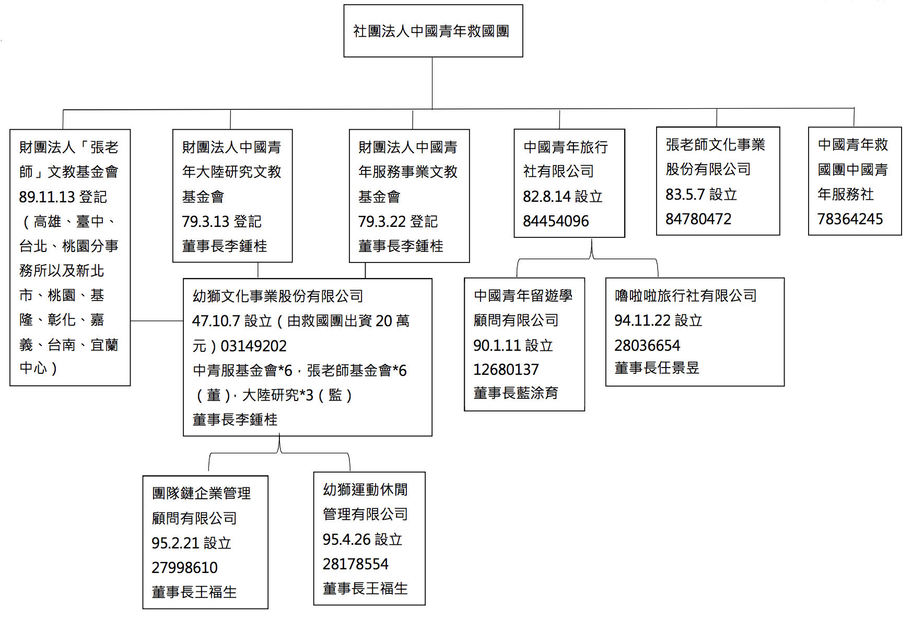

# 社團法人中國青年救國團是否為社團法人中國國民黨之附隨組織案初步調查報告

[調查報告PDF](pdfs/cyc.pdf)

## 壹、調查緣起

社團法人中國青年救國團（下稱救國團）成立於民國（下同）41年10月31日，本會爰依政黨及其附隨組織不當取得財產條例第8條第6項主動立案調查。

## 貳、本會調查經過

本會基於職權，參照監察院相關之調查報告1，同時調取機關檔案2、國家檔案3以及參照相關文獻資料。復向臺灣臺北地方法院調取救國團之法人登記卷、並向財政部財政資訊中心調取財產清單；向所轄國稅局調取102年至104年稅務資料，以下說明救國團現況及其成立。

## 參、救國團之現況

### 一、組織架構

依救國團現行組織章程4第19條規定，其除設總團部外，並分設有17處縣市團委會、15處青年活動中心（含山莊及學苑）、8處輔導中心、學習中心據點共65個5。救國團持有「中國青年旅行社有限公司」全部股份及「張老師文化事業股份有限公司」股份（7名董事均由法人股東救國團指派），而「中國青年旅行社有限公司」再轉投資「中國青年留遊學顧問有限公司」及「嚕啦啦旅行社有限公司」；另該團捐助設立之「財團法人中國青年服務事業文教基金會」、「財團法人張老師基金會」、「財團法人中國青年大陸研究文教基金會」，分別持有「幼獅文化事業股份有限公司」股份，並指派法人代表或監察人。「幼獅文化事業股份有限公司」再轉投資「團隊鏈企業管理顧問有限公司」及「幼獅運動休閒管理有限公司」，組織架構圖如附表一。救國團總團部現設址於台北市中山區松江路219號。

依照章程第11條規定，團員大會為最高權力機關，會中選舉團務指導委員暨評議委員，分別組成團務指導委員會暨評議委員會，於團員大會閉會期間，代行職權。團員大會的成員即為團員，第5條規定，經團員5人推薦，並經團務指導委員會審查通過者得成為團員。第6條規定，團員有表決權、選舉權、被選舉權與罷免權。依第14條規定設團務指導委員11至21人，評議委員3至5人，由團員選舉產生，並分別成立團務指導委員會、評議委員會，負責團務工作之策定、指導與監督。第18條第2項則規定，設主任一人負責執行團員大會集團務指導委員會之決議，執行團務其間，對外代表本團，其人選由團務指導委員會召集人提名，經團務指導委員會通過後產生之。現任第16屆（自103年3月7日至106年3月6日止）團務指導委員為孫震、鍾任琴、林澄枝、曾濟群、鄭松年、黃敏惠、林新欽、楊頭雄、林高德、王玲惠、李念祖、羅國雄、吳澄清、朱鳳芝、張文雄、李棟樑、陳飛鵬、凃如肯、莊隆昌、黃正鵠、李總集等21人，其中黃正鵠為召集人，李棟樑為副召集人；評議委員會召集人為高銘輝，其餘評議委員為張植珊、梁尚勇、柴松林、黃大洲。另第22條以下規定有團體贊助團員，並在第25條規定，團體贊助會員無表決權、選舉權、被選舉權與罷免權。章程第21條第1項規定，其經費來源為入團費、長年團費、團員捐款、事業及活動收費、委託代辦工作之費用、基金及孳息、其他收入等。

### 二、資產

經查至105年10月止，社團法人中國青年救國團名下擁有多筆土地建物坐落於台灣各地區，詳見附表二6。104年度救國團現金及銀行存款帳面金額新台幣8億3,455萬元，基金存款帳面金額新台幣9億2,434萬元，固定資產帳面金額新台幣24億5,950萬元，資產負債分配情形如表：

救國團104年度資產負債比較表科目揭露（單位：新台幣/元）

<table class="table table-bordered table-hover table-condensed">
  <thead>
    <tr>
      <th colspan="2">資產</th>
      <th colspan="2">負債與權益</th>
    </tr>
  </thead>
  <tbody>
    <tr>
      <td>現金及銀行存款</td>
      <td>8億3,455萬</td>
      <td>流動負債</td>
      <td>5億6,480萬</td>
    </tr>
    <tr>
      <td>流動資產</td>
      <td>15億2,144萬</td>
      <td>非流動負債</td>
      <td>4億7,078萬</td>
    </tr>
    <tr>
      <td>基金存款</td>
      <td>9億2,434萬</td>
      <td>總負債</td>
      <td>10億3,558萬</td>
    </tr>
    <tr>
      <td>固定資產</td>
      <td>24億5,950萬</td>
      <td>登記基金</td>
      <td>25億4,540萬</td>
    </tr>
    <tr>
      <td> </td>
      <td>（餘略）</td>
      <td>基金</td>
      <td>16億9,094萬</td>
    </tr>
    <tr>
      <td> </td>
      <td> </td>
      <td>總權益</td>
      <td>42億7,912萬</td>
    </tr>
    <tr>
      <td>總資產</td>
      <td>53億1,470萬</td>
      <td> </td>
      <td> </td>
    </tr>
  </tbody>
</table>

102年度救國團以台北市松山區美仁段一小段761-2號交換嘉義縣嘉義市檜段三小段8-8號、9-2號、9-12號與9-36號，並認列交換利益新台幣2,156萬元7；104年度救國團出售名下四維路眷舍土地與建物，認列出售資產利益新台幣2億3,3540萬元8。自102年至104年共償還金融機構短期借款新台幣2億7,000萬元9。

救國團自78年底為法人登記後，其財產登記變更10如下表：

財產總額變更一覽表  單位：(新台幣)元

<table class="table table-bordered table-hover table-condensed">
  <thead>
    <tr>
      <th>登記日期</th>
      <th>財產總額</th>
      <th>變更摘要</th>
      <th>備註</th>
    </tr>
  </thead>
  <tbody>
    <tr>
      <td>78年11月21日</td>
      <td>500萬元</td>
      <td>團員繳入團費、常年團費。</td>
      <td>合庫甲存</td>
    </tr>
    <tr>
      <td>78年11月21日</td>
      <td>500萬元</td>
      <td>入團費、常年團費、團員及熱心人士捐款、事業及活動收費、委託代辦工作之費用、基金及其孳息、其他收入。</td>
      <td>增資方式、章程修改變更。</td>
    </tr>
    <tr>
      <td>89年4月26日</td>
      <td>16億2,025萬9,425元</td>
      <td>財產總額變更。</td>
      <td> </td>
    </tr>
    <tr>
      <td>89年11月14日</td>
      <td>16億2,025萬9,425元</td>
      <td>法人名稱原登記中國青年反共救國團變更為中國青年救國團。</td>
      <td> </td>
    </tr>
    <tr>
      <td>0100年6月8日</td>
      <td>24億2,792萬8,164元</td>
      <td>法人代表由高銘輝變更為黃正鵠；財產總額變更。</td>
      <td> </td>
    </tr>
  </tbody>
</table>

## 肆、  救國團之沿革

### 一、前言

#### （一）中國國民黨改造

38年12月，政府播遷臺灣，同月11日，中國國民黨中央黨部亦開始在台北辦公。39年7月22日，第六屆中央常務委員會召開臨時會議，通過「中國國民黨改造案」，包含「關於實施中國國民黨改造之說明」、「中國國民黨改造綱要」及「中國國民黨改造之措施及其程序」3項文件，展開黨的改造。依據「中國國民黨改革之措施及其程序」，為實施中國國民黨改造案，以促進中國國民黨之徹底改造，關於中央黨部方面應立即採取下列各項措施：（一）第六屆中央執行委員會暨中央監察委員會，均停止行使職權。（二）成立中央改造委員會，行使中央執行委員會及中央監察委員會之職權，中央改造委員會名額為15人至25人，由總裁遴選之。（三）中央改造委員會下設各種工作部門或委員會，其人員由總裁遴派之。（四）本黨設中央評議委員若干人，對黨的改造負督導與監察之責，由總裁聘任之。39年7月26日，蔣總裁遴派吳敬恆、居正等25人為中央評議委員；陳誠、張其昀、張道藩、谷正綱、鄭彥棻、陳雪屏、胡建中、袁守謙、崔書琴、谷鳳翔、曾虛白、蔣經國、蕭自誠、沈昌煥、郭澄、連震東等16人為中央改造委員，8月5日，中央改造委員會正式成立，隨即召開第1次會議，由蔣總裁主持，通過「中央改造委員會組織大綱草案」、「中央改造委員會組織系統表草案」及相關人事案。中央改造委員會設秘書長1人、副秘書長1人至2人，秘書長承總裁之命，與改造委員會之決議，掌理會務並對各組會工作負綜合與督導之責，其中第二組掌理產業職業等團體、知識青年及其他特種黨部之組織、黨員之訓練，及指導其活動，並負有關民眾運動指導之責，第二組主任為谷正綱11。同年8月31日通過「現階段政治主張」，說明反攻收復時期之一切措施；9月1日，宣布「中國國民黨改造綱要」，並且開始為期2年的改造工作。9月9日，通過「中國國民黨暨所屬黨部改造之措施及其程序」。9月29日，通過「黨員歸隊實施辦法」。於是台灣省各縣市改造委員會相繼成立，開始辦理黨員重新登記及編隊工作，至41年9月舉行第420次會議後正式結束，改造工作告一段落12。黨組織的整頓，分爲中央及直屬區黨部、地方黨部、知識青年黨部、職業黨部、海外黨部、特種黨部及敵後(中國大陸)黨部，進行順序是⑴現有黨員之重新登記和整肅，⑵吸收新黨員⑶黨員編入組織⑷召開黨大會改訂黨綱、黨章，形成新中央13。

#### （二）知識青年黨部

知識青年黨部是因曾有內戰期間對學生運動束手無策的經驗而新規劃成立的，所有大學、專科院校都設立，並置於中央直接指導之下14，早在國民黨規劃籌組救國團之前，39年9月29日中改會第29次會議已修正通過了「中國國民黨中央直屬知識青年黨部設置原則及組織規程草案」。設置原則有二：「一、專科以上學校一概建置知識青年黨部改造委員會，由中央直接領導。二、各中等學校視其人數之多寡，分別設置區黨部、直屬區分部或小組，除省會地區者得由省改造委員會領導外，均隸歸各縣市改造委員會領導。」15知識青年黨部被賦予11項主要任務，各個黨部的名稱由中改會按照番號順序編定。16檢視其組織規程第11條表示：「本黨部採秘密方式，對外絕不公開。」要言之，國民黨在校園内組織是被隱藏起來的。39年12月起，陸續在台灣大學、省立師範學院、省立農學院、省立工學院組織改造委員會等設立黨部。43年6月3日第7屆中央委員會常務委員會第36次會議紀錄17中記載：「依照中央常務委員會第29次會議通過之『本黨領導中國青年反共救國團各級組織簡則』第一條規定，本黨於救國團總團部設置中央直屬知識青年黨部，由總團部全體黨員組織之。茲為積極籌備該團總部黨部之成立，特確定該黨部番號為中央直屬第九知識青年黨部，並就該團總部全體黨員中指定胡軌、李煥、洪同三同志為籌備員，以胡軌同志為召集人。……，經報告第34次工作會議決定：『報請中央常務委員會鑒核』記錄在卷，……報請鑒核。」該次會議決定：准予備案。顯見救國團成立不久後，即在總團部內部成立直屬黨中央之知識青年黨部。

#### （三）中國青年反共抗俄聯合會

中國青年反共抗俄聯合會（下稱青聯會）咸認於39年4月27日正式成立，究其緣起可回溯至同年4月9日的台北各界青年春季晚會。當晚蔣經國發表了演說，提出了中國青年已進入第四次團結之時代，從當時中央日報18及蔣經國手札19顯示，在4月10日，蔣經國要求李煥及王昇兩人，就「昨晚在中山堂所通過的『青年反共後援會』在一兩天以內應即召開籌備會議（是否可在12日下午）。」由此可見蔣經國非常有興趣籌組這個組織，並立刻著手進行，也顯示晚會當晚已通過組織該會的決議。在該會的成立之初即邀請張其昀、蔣經國、鄧文儀、倪文亞、傅斯年、程天放、浦薛鳳、上官業佑、劉真、朱虛白等人擔任指導委員20。40年7月2日中改會第164次會議21中稱：「查中國青年反共抗俄聯合會為當前號召青年從事反共抗俄之唯一全國性青年團體，一年餘來對反共抗俄宣傳及社會服務工作之推行頗為努力，茲為加強領導計，特根據知識青年黨團組織通則之規定，組織黨團定名為『中國國民黨青年反共抗俄聯合會黨團』，經將該會所有本黨同志分編為十三個聯絡小組，選舉張樞等十三同志為組長，並已依照規定指定該十三同志為幹事並指派張樞為書記。」由此可見，國民黨以黨團方式領導該會運作。該會主要活動為暑期軍中服務，其與國防部總政治部關係亦相當緊密。另據42年5月國民黨第七屆中央委員會第二次全體會議中，第五組報告表示：「中國青年反共救國團乃隸屬政府的全國性之青年組織，於去年10月31日正式成立，本組為遵守統一青年領導之原則，並輔導其發展起見，一方面策動前中國青年反共抗俄聯合會於10月28舉行全國代表大會，透過黨團組織，發表宣言，結束會務，號召會員一致踴躍參加中國青年反共救國團……」22，並稱青聯會「現遵照本黨決策，自動結束統一於青年救國團的組織之下。貫徹組織命令，毫無逡巡卻顧，亦足見本會對於青年團體之工作指導及組織運用，發生顯著效果。」23由此顯示，青聯會之所以結束會務，乃是國民黨工作指導及組織運用的結果。

#### （四）蔣經國與總政治部下之政工系統

蔣經國在被蔣介石遴選為中改會委員之前，於39年3月22日被任命為國防部政治部主任24。因爲中華民國憲法明文禁止黨派介入陸海空軍(第138條至第140條)，在軍中不得不非公開地組織黨組織（特種黨部），是公開的是政治工作系統，非公開設置的「特種黨部」是在「政工系統」的煙幕下進行，中改會會議中亦多次討論關於特種黨部之人事、組織25。最後形成的體系如下圖26。形式上，形成三個系統之組織相關連的黨軍關係。一是(由總統發令)參謀總長—各級司令官/指揮官的統帥系統。二是，中央黨部管理的特種黨部系統。三是總政治部(總政治作戰部)之下的政治將校系統(政工系統)。總政治部是國防部的一部分，但實際上獨立行動，在蔣經國的管理之下。由圖上的箭頭可知，各級部隊的黨組織(特種黨部爲代表)與指揮官負責管理政治將校。27蔣經國自39年4月1日正式就任擔任總政治部主任，至45年7月2日，總政治部主任由蔣堅忍28接任。

### 二、救國團之成立

40年1月29日中改會第78次會中修訂通過「中國國民黨現階段青年運動指導方案草案」，作為中國國民黨對青年運動的主要架構。將組織方式劃分為三項： **一、各種學術康樂團體，為一般學校青年的主要組織。二、扶植青年反共抗俄團體的發展，並健全其組織，使全國各階層青年均能從事反共抗俄的工作。三、配合軍事需要，發動青年成立戰地服務、軍中服務、防護服務等組織29。**

蔣介石進一步想要主導青年運動，於40年2月8日中改會第82次會議上，主張在青年和婦女運動上，應再發動青年反共先鋒隊及婦女反共愛國會等組織30。中改會於同年月14日將青年反共先鋒隊的籌組列為該年度黨部主要工作目標。40年5月15日中改會第132次會議提出「籌組青年反共先鋒隊原則草案」。會議中決議推谷正綱、張其昀、陳雪屏、鄭彥棻、 蔣經國、郭澄、連震東等人組成小組，根據會中之意見詳加研提具體方案，再行核議。由谷正綱召集組成小組詳加審議，並邀有關機關負責人參加討論31，經小組一再開會研討，歷時半年，而於11月5日中改會第235次會議提出 **「籌組中國青年反共先鋒隊原則草案」** 。32

在中改會第132次會議至第235次會議這段期間，蔣經國本人也召開了兩次「青年問題座談會」。蔣經國手札曾寫下 「擬於下週召開一次青年組織座談會，參加人數由十人至十五人，可先擬一名單。交李煥同志辦」的字句。33第一次會議於9月11日舉行，參加者有王志鵠、王昇、章群、李煥、錢野桐、蕭永泰、范魁書、聶鍾杉、江海東、王樹權、江國棟、傅雲、黎元譽、沈祖懋、俞諧、高偉時等人，眾人廣泛討論青年運動問題。蔣經國在會中總結指出在國家存亡關頭上，救黨要比救國來得更重要、更迫切，並強調今後的青年運動應該在國民黨的主義和政治主張之號召下動員起來。34

10月4日，蔣經國召開第二次青年問題座談會，出席者幾與第一次相同，討論議題為青年反共先鋒隊。最後，蔣經國作成五點結論，表示：國民黨總裁蔣介石提出組織青年反共先鋒隊具有遠大的政治目的及時代意義。先鋒隊必須歸根於國民黨，性質應屬於政治性，其成立的目的在於培養革命的新生力量，而讓環境來決定應採秘密或公開的組織。並批評一般人認為青年只需在校讀書是死讀書，也是一種反動思想，認為只要能發動青年參與，以任何方式來進行均無不可。35

11月5日中改會第235次會議召開前，李煥交了幾份資料給蔣經國過目。其中，有一份資料名為 **「自籌備青年反共先鋒隊問題提出後一般反對者所持理由」** ，內容如下：

> 一、青年反共先鋒隊成立以後，恐將再蹈三民主義青年團之覆 轍，形成組織對立，影響黨的領導。
> 二、目前台灣環境安定，社會進步，青年反共先鋒隊成立以後，恐將影響安定，妨礙進步。
> 三、青年反共先鋒隊成立以後，必以學生為主要對象，足以影響學生學業。
> 四、青年反共先鋒隊成立以後，如少數學生參加，多數不參加，增加學校管理上之困難，故以各校全體學生參加較為方便。
> 五、青年反共先鋒隊成立以後，必須大量經費，增加政府財政之困難。
> 六、目前反共無期，青年反共先鋒隊成立以後，無事可做，恐將徒具組織形式。
> 七、青年組織教育性應重於政治性，青年反共先鋒隊如必要成立，應偏重技能方面之訓練。
> 八、青年反共先鋒隊之戰鬥意味太強，一般青年之家長必然阻止青年參加，恐難收預期效果。

> 由上顯示，先鋒隊籌劃期間反對其成立的理由不少，這些反對理由若不加以克服，勢必妨礙先鋒隊的籌組36。

11月5日中改會第235次會議，由谷正綱召集的小組提出「籌組中國青年反共先鋒隊原則草案」。會中決議該草案交回小組，根據各委員意見並約集内政部、教育部、國防部、大陸工作處及總政治部從政負責人再行研討，就原則實施辦法兩方面分別提出具體意見37。12月29日，研究小組再約集余井塘、程天放、鄭介民等人，重新研討青年先鋒隊之組織，並作出三點重大決定，分別為： **「一、先鋒隊由政府主辦，本黨以黨團方式領導其活動。二、青年反共先鋒隊以全國高中以上學校學生及遴選優秀社會青年年紀在16歲以上，25歲以下者參加。三、為適宜一般青年之普遍參加，青年反共先鋒隊擬改稱為中國青年反共抗俄救國團。」** 並依照此原則，於41年1月22日約集國民黨內對青年運動有經驗的人士，訂定出 **「籌組中國青年反共抗俄救國團原則草案」** ，於中改會第288次會議提出，其要點摘列如下：

> 其中 **第三點指出救國團隸屬於政府，而國民黨則以黨團方式領導其活動** 。救國團成立的目的為「團結全國優秀青年增進其智能，鍛鍊其體格，訓練其工作技術，培養 其愛國精神，從事各種戰時工作，以爭取反共抗俄勝利，擔負復國建國之任務。」組織體系改為全國設團，省設分團，縣市設總隊，縣市以下地區設大隊，大專學校依學生人數之多寡，設總隊或直屬大隊；中等學校依其學生人數之多寡，設大隊或直屬中隊，分隊為最基層之單位，由團員15人至25人組成； **第六點規定參加的團員分為兩種：高中以上學生一律參加，社會青年以16歲以上25歲以下合於規定標準者得以參加；第九點規定，該團幹部除專門人才外，應就原有教育行政系統中選拔國民黨籍優秀且富有領導經驗者擔任** 。救國團以反共抗俄復國建國為中心任務，工作分為三個階段，第一階段為反攻前，參加各種訓練、從事社會服務、協助文化宣傳、社會調查、推行政令，以及發動勞軍、從軍及總動員運動等；第二階段為反攻時，協助軍隊擔任運輸、救護、情報、通訊、組訓民眾、整理戶籍、肅清匪諜、建立社會秩序，以及有關戰時工作等；第三階段為光復後，協助政府擔任教育地方自治、土地行政，以及各項建國復興工作等。此外，團員應注重兩項訓練，一為政治訓練，以「實施三民主義的思想教育，提高青年政治認識、加強其反攻抗俄之鬥志」為主。二為軍事技術訓練：以「實施軍事訓練，培養戰鬥技能，養成 紀律生活，以提高刻苦耐勞服務犧牲之卓絕精神，並分別實施各種實用技術訓 練，如駕駛、騎射、測量、救護、通訊、滑翔、機械、修理等以培養其工作技能」為主。 **第十點提到「青年反共抗俄救國團成立後，現有之青年組織應予以調整，以資統一領導。38**」

第288次會中決議：「本案修正通過。主名稱定為『中國青年反共抗俄救國團』抑為 『青年救國先鋒隊』一併簽報總裁核奪。39」，由中改會第297次會議紀錄可知，蔣介石於同年2月5日批示「青年反共救國團可也」，正式確定該組織之名稱。當天會議中第二組認為組織應從速積極準備進行，決議邀請教育部、內政部、國防部、總政治部及第五廳、台灣省教育廳等國民黨負責同志研商籌備事宜，谷正綱、蔣經國、陳雪屏三人為召集人40。

同年5月8日中改會第338次會議41中，通過「籌組青年反共救國團審查意見」，其中 **決議事項一：「中國青年反共救國團隸屬於國防部總政治部，設團務指導委員會負責全國團務之設計，指導委員由總政治部聘請有關人士擔任之」** 。

同年9月1日中改會第392次會議，通過 **「建全各種青年團體與黨的基層組織配合推行總動員工作實施辦法」** ，內容如下42：

> 甲、健全青年團體組織

> 一、中國青年反共救國團之籌組原則，業經行政院轉令國防部總政治部遵照辦理，該團應於本年十月各校開學以前從速成立，並應於本年內次第成立，各高中以上學校學生先行納入組織，以資統一青年運動之領導。
> **二、救國團成立以後，現有之社會青年團體，其工作性質與救國團相團者（如中國青年反共抗俄聯合會），應歸併其組織，以資統一……。**
> **三、救國團在各校之組織建立後，各校社團具學術性者，應予保留並由各校訓導處督導加強其工作外，其他康樂性、政治性、服務性之各種社團，均一律歸併於救國團，以求工作領導之統一。**

> **乙、加強黨的領導與配合**

> **四、中國青年反共救國團為本黨領導青年運動之外圍組織，本黨應依該團籌組原則第三條規定，以黨團方式透過該團之團務指導委員會領導其工作。**
> **五、救國團在各級學校之組織，應受各級知識青年黨部之指導。**
> **六、各級知識青年黨部應根據救國團在個學校所建立之大隊、中隊、分隊之組織體系，劃編區黨分部及小組，使黨的基層組織密切配合今救國團之建制，使本黨黨員成為救國團推動工作之核心。**
> **七、救國團之各級幹部應盡量遴選本黨優秀同志充任，加強黨的領導。**
> **八、因工作性質不同不能歸併入救國團之青年團體，應由各級黨部依照本黨黨團組織通則，分別建立黨團，領導其活動。**
> **九、中國青年反共救國團及各青年團體之優秀青年，本黨應積極吸收其入黨。**
> **十、為配合總動員業務之實施，各級學校之黨部及青年團部黨團，應負計劃、協助、督導、考核之責，推動各該校及青年團體之工作。**
> 十一、中國青年反共救國團應為領導青年推行總動員之主力，尤應以推行文化改造運動及社會改造運動為中心任務。
> 十二、下列各項工作為目前須積極進行者：
> 1.  各級學校之民族精神教育及軍事技術訓練，應由救國團配合各級學校，加強實施。
> 2.  發動青年成立各種服務工作隊，積極從事各種社會服務、軍中服務及戰時服務等工作。
> 3.  發動青年積極參加各項敬軍、勞軍、從軍工作，以鼓舞士氣，提高國軍戰鬥力量。
> 4.  發動青年到農村、工廠、礦場中去參加勞動生產等工作，以增加生產，擴大建設。
> 5.  發動青年團體及各學校組織巡迴文化工作隊，普及社會宣傳，提高民眾反共情緒。
> 6.  救國團各級組織應配合各級學校按期舉行動員月會，使一切社會改造及文化改造之工作，應能透過動員月會貫徹實施。
> 7.  救國團應運用各級組織配合學校，達成肅奸防諜之任務。

該次會議修正通過，辦法中並責成救國團應於同年10月開學以前儘速成立。

#### 三、救國團之定位

行政院41年5月31日以臺41教字2953號訓令配合前開會議決議，頒布「中國青年反共救國團籌組原則43」，國防部依照上開原則由總政治部負責辦理，並律定救國團隸屬國防部總政治部，當時總政治部主任為蔣經國。同年8月1日，救國團籌備處成立於北投復興崗政工幹校（政戰學校前身），由國防部總政治部完成組織章程及總團部編制表44，行政院並於同年9月18日以臺41教字5265號令45核定救國團組織及編裝，國防部於41年9月27日派蔣經國兼任救國團主任46。41年10月31日救國團正式成立，蔣經國為首任主任，除負責學生、社青組訓，並承辦普通高中以上學校軍訓教育事宜47。

就救國團的定位，47年5月19日第8屆中央委員會常務委員會第51次會議紀錄中記載：「報告事項六：……中國青年反共救國團總團部蔣主任經國於本年5月9日來函略稱：『關於本團之隸屬關係，在籌備之初，為配合當時情況，曾經中央決定隸屬於國防部總政治部，目前時事推移，不特開展工作諸多不便，抑且易滋社會人士之誤解，為適應當前情勢需要，似有重加研究之必要……』，並提出『改進中國青年救國團隸屬關係建議』，……提請中央常會採擇」，並於會議中討論，該次會議決議由谷正綱、陳雪屏（以上為召集人）、張其昀、蔣經國、馬紀壯等五同志組織專案小組加以審查，並邀張厲生、陳慶瑜、倪文亞、上官業佑等人參加48。 

嗣於49年7月1日，學生軍訓工作移交給教育部，至58年11月21日國防部呈請行政院調整救國團隸屬關係49，行政院復於同年12月23日以臺58教10426號令函復：「(一）原隸屬關係准予解除。(二）中國青年反共救國團本為社團性質，今後有關青年運動、 輔導、育樂活動等應仍由該團按其創立之目的逕行辦理，其業務可由本院予以督導。50」，救國團此時以上開一紙令函解除與國防部間之隸屬關係。救國團遵照上開指示，向内政部申請登記為社會運動機構51。62年5月，蔣經國辭去救國團主任職務，由李煥繼任，後續救國團主任分別為李元簇、宋時選、潘振球、李鍾桂、林垚、周逸衡、張德聰52。惟救國團主任一職，依照行政院41年5月31日頒發之「中國青年反共救國團籌組原則」53，蔣經國任職時之「主任」係為救國團之首54，而依現行組織章程，主任一職則係由團務指導委員會召集人提名，經團務指導委員會通過後產生之55。

再值得一提的是，有關李鍾桂接任救國團主任之經過。76年3月，李鍾桂接任救國團主任，在其傳記中，記載其與蔣經國會面之經過如下：

> 李鍾桂記得76年3月8日那天去見經國先生時，本以為經國先生想要了解基金會56運作的事，所以當經國先生問她近況如何時，便簡報了基金會的概況。沒想到經國先生說：「我不問妳基金會的事。」「您是不是要問青工會的事？」當時李鍾桂還兼任國民黨中央青工會副主任。「我也不問妳青工會的事。」「那是否要問在政大、臺大教學的狀況？」她緊接著問，想不到經國先生也說不對。「那您要問些什麼？」經國先生氣定神閒地問：「妳對救國團有何看法？」「我與救國團淵源不深，」李鍾桂誠實回答，「過去當學生時，曾經參加過救國團的活動。回國後，救國團副主任李煥先生、執行長宋時選先生以及主任祕書姚舜先生曾安排我到全省巡迴演講，參加過國際事務研習營活動，後來還擔任優秀青年選拔的評審。我跟救國團的關係僅只如此。」李鍾桂如實道出她與救國團關係不深的經過。 **經國先生卻說：「我要妳到救國團來擔任主任。」** 「不行呀！我在基金會還有很多計畫要推動，目前沒有辦法去。」李鍾桂想也不想，馬上拒絕。經國先生卻不再多說什麼，只說了一句：「再會，祝妳健康。」便起身離開，留下楞在當場的李鍾桂。直到旁邊的侍衛長提醒她應該走了，她才如夢初醒，急忙說：「不行呀」可是，只有侍衛長催促著「可以啦！可以啦！」的聲音。 **事情就這麼定了。經國先生沒有給她表達意見的機會，就拍板定案，並隨即發布人事命令。3月16日旋即走馬上任。57**

**當時（76年3月）蔣經國是中國國民黨黨主席，也是中華民國總統。58**

78年7月26日該團依「動員戡亂時期人民團體法」向内政部申請登記立案為社會團體，並向臺灣臺北地方法院聲請登記為為「教育性、服務性與公益性之社團法人」，89年10月25日更名為社團法人中國青年救國團59。 

又依據臺灣高等法院103年度重上字第38號民事判決60理由，救國團之組織自成立以來可分為三個階段：自41年10月31日成立起、迄58年12月23日，係隸屬國防部總政治部之政府機構；於58年12月23日經行政院核示解除與國防部總政治部之隸屬關係時起，迄78年11月21日登記為社團法人以前，僅為業務受行政院督導、團務工作依行政院指示之公益社團，尚未取得法人資格；78年8月28日經內政部立案為社會團體，同年11月21日向臺北地方法院社團法人登記後，始取得法人資格。
四、

#### 伍、救國團之經費來源

就救國團經費來源部分，依據41年10月救國團成立後至60年間之中國國民黨中央委員會常務委員會會議資料61顯示，救國團之預算列於「大陸敵後工作項目」62、「國防部情報局大陸工作」63、「政府委辦工作補助費」64等項目，係由中國國民黨中央委員會代領轉發：
（一） 第8屆中央委員會常務委員會第65次會議中提出47年度中央黨務經費總預算案：「情報局所列補助本會者4千萬元，另附列中華婦女反共抗俄聯合會經費352萬元、 **青年救國團經費210萬元** 、華興育幼院經費158萬元，該項目合共4,720萬元。」
（二） 第8屆中央委員會常務委員會205次會議紀錄中所提出之50年度中央黨務經費收入財源估計：「……國防部情報局大陸工作 5,118萬5,938元，（同上年度。至婦聯會救國團及華興育幼院三單位寄列之720萬元，未列計在內）。」
（三） 第8屆中央委員會常務委員會第457次會議紀錄，就53年度中央黨務經費與政府委託辦理工作經費收入預估：「（一）國家總預算委託辦理工作經費收入9,198萬78元（……政府撥付本會委辦工作費有關項目內，另有交由本會代領轉發國防研究院救國團婦聯會華興育幼院等四單位經費1330萬110元同上年度未包括在內）。」
（四） 第9屆中央委員會常務委員會第388次會議，會議記錄中所附之58年度中央黨務經費收入估計表記載：「國家總預算委託辦理工作費收入，本年度預估收入數為130,292,710元，……本項收入另有各項計共3,124萬8,100元經由本會代領轉發不在上列數內。（國防研究院665萬8,720元、中國青年反共救國團總部743萬9,460元、中華婦女反共聯合會400萬元、華興育幼院208萬元、國際問題研究所85萬9,920元、青華學校21萬元）」
（五） 第10屆中央委員會常務委員會第108次會議紀錄提出之60年度中央黨次經費及政府委託辦理工作費財源收入估計則記載：「……60年度另有中國青年反共救國團、國防研究院、中華婦女反共聯合會、華興育幼院、國際問題研究所等六單位經費，全年計2,578萬8,100元經由本會代領轉發，不在列數以內。」

另中國國民黨中央委員會秘書長唐縱於52年曾就加發救國團工作人員1月薪津事宜往來之公文中記載：「為比照政府加發五十二年年終一個月薪津，中國青年反共救國團工作人員所需經費，囑由本部（即國防部）在五十三年度大陸工作經費項下辦理追加撥助，五十四年度所需該項經費並請照案伸算編列……」65，而國防部函覆則以：「……上項所需經費新台幣125萬3550元已尊囑併列本部五十三年度請撥年終加薪一個月薪給預算內報請行政院核撥，至五十四年度所需該項經費仍請洽妥行政院後通知本部辦理。」66，與上開中央委員會會議記錄參照以觀，救國團之預算，係由國防部編列於「大陸工作」項目中，該項工作再由政府委託中國國民黨辦理，並由政府撥款給中國國民黨中央委員會，再由中央委員會代領轉發給救國團。

此外，59年6月5日，臺灣省政府（教育廳）曾經就救國團來函墊借經費一事函臺灣省議會，其59年6月5日府教主字第48818號函67中記載：「……查澄清湖青年活動中心增建房舍設施經費及本年度青年育樂活動經費業經本府教育廳編列六十年度『補助青年活動』計畫項下，該團函請先行墊借一〇、〇八二、二四〇元一節，經核尚屬需要，擬請准予照墊俟預算完成法定程序後再行分配歸墊。」臺灣省議會於59年7月2日函覆臺灣省政府：「……查本案預算係列在臺灣省六十年度地方總預算案內，業經本會第四屆第五次大會第六次會議審議通過在案。復請查照。副本抄送中國青年反共救國團總團部。」

再依據教育部106年2月17日回覆本會函68查之資料顯示，教育部曾於68年至79年間補助救國團興建青年活動中心69經費，補助明細如下表， 9個年度共補助4億5,800萬元。

教育部歷年(68-79)補助救國團興建青年活動中心經費一覽表   單位：元

<table class="table table-bordered table-hover table-condensed">
  <thead>
    <tr>
      <th>會計年度</th>
      <th>青年活動中心名稱</th>
      <th>經費</th>
      <th>興建或整建</th>
      <th>資料來源</th>
    </tr>
  </thead>
  <tbody>
    <tr>
      <td>68</td>
      <td>澎湖青年活動中心</td>
      <td>30,000,000</td>
      <td>興建</td>
      <td>教育部68年度單位決算書</td>
    </tr>
    <tr>
      <td rowspan="2">69</td>
      <td>澎湖青年活動中心</td>
      <td rowspan="2">40,000,000</td>
      <td>興建</td>
      <td rowspan="2">教育部69年度單位決算書</td>
    </tr>
    <tr>
      <td>墾丁青年活動中心</td>
      <td>興建</td>
    </tr>
    <tr>
      <td rowspan="2">70</td>
      <td>墾丁青年活動中心</td>
      <td rowspan="2">45,000,000</td>
      <td>興建</td>
      <td rowspan="2">教育部70年度單位決算書</td>
    </tr>
    <tr>
      <td>南投青年活動中心</td>
      <td>興建</td>
    </tr>
    <tr>
      <td>71</td>
      <td>墾丁青年活動中心</td>
      <td>55,000,000</td>
      <td>興建</td>
      <td>教育部71年度單位決算書</td>
    </tr>
    <tr>
      <td rowspan="3">72</td>
      <td>墾丁青年活動中心</td>
      <td rowspan="3">60,000,000</td>
      <td>興建</td>
      <td rowspan="3">教育部72年度單位決算書</td>
    </tr>
    <tr>
      <td>溪頭青年活動中心</td>
      <td>興建</td>
    </tr>
    <tr>
      <td>澄清湖青年活動中心</td>
      <td>興建</td>
    </tr>
    <tr>
      <td rowspan="4">76</td>
      <td>曾文青年活動中心</td>
      <td rowspan="4">60,000,000</td>
      <td>興建+整建</td>
      <td rowspan="4">教育部76年度單位決算書</td>
    </tr>
    <tr>
      <td>澄清湖青年活動中心</td>
      <td>興建+整建</td>
    </tr>
    <tr>
      <td>金山青年活動中心</td>
      <td>整建</td>
    </tr>
    <tr>
      <td>溪頭青年活動中心</td>
      <td>整建</td>
    </tr>
    <tr>
      <td>77</td>
      <td>劍潭海外青年活動中心</td>
      <td>60,000,000</td>
      <td>興建</td>
      <td>教育部77年度單位決算書</td>
    </tr>
    <tr>
      <td>78</td>
      <td>劍潭海外青年活動中心</td>
      <td>54,000,000</td>
      <td>興建</td>
      <td>教育部78年度單位決算書</td>
    </tr>
    <tr>
      <td>79</td>
      <td>劍潭海外青年活動中心</td>
      <td>54,000,000</td>
      <td>興建</td>
      <td>教育部79年度單位決算書</td>
    </tr>
    <tr>
      <td colspan="2">補助金額合計</td>
      <td>458,000,000</td>
      <td> </td>
      <td> </td>
    </tr>
  </tbody>
</table>

   依上開資料以及前揭中國國民黨中央委員會會議記錄顯示，在58年12月之後，救國團雖已與國防部總政治部解除隸屬關係，惟救國團之預算仍存在於政府機關所編列預算之工作項目與補助案中。

## 陸、爭點

社團法人中國青年救國團是否曾為社團法人中國國民黨實質控制其人事、財務或業務經營，且非以相當對價轉讓而脫離中國國民黨實質控制之附隨組織？ 

（一） 救國團自41年10月31日成立時起，有無受到中國國民黨實質控制？

（二） 救國團是否曾以相當對價轉讓而脫離中國國民黨實質控制？

附表一：救國團組織圖（一）

附表一：救國團組織圖（二）

附表二：救國團現有土地及建物清單
（一） 北部
<table class="table table-bordered table-hover table-condensed">
  <thead>
    <tr>
      <th>標的</th>
      <th>土地建物</th>
      <th>縣市</th>
      <th>市區鄉鎮</th>
      <th>段</th>
      <th>小段</th>
      <th>號</th>
      <th>面積(平方公尺)</th>
      <th>權利範圍</th>
      <th>轉入時間</th>
      <th>備註</th>
    </tr>
  </thead>
  <tbody>
    <tr>
      <td rowspan="9">基隆光華中心（基隆市成功路一段133巷1號）</td>
      <td>土地</td>
      <td>基隆</td>
      <td>仁愛</td>
      <td>成功</td>
      <td> </td>
      <td>1094</td>
      <td>900</td>
      <td>737/100,000</td>
      <td>0102年2月6日</td>
      <td> </td>
    </tr>
    <tr>
      <td> </td>
      <td> </td>
      <td> </td>
      <td> </td>
      <td> </td>
      <td>1094-12</td>
      <td>4</td>
      <td>737/100,000</td>
      <td>0102年2月6日</td>
      <td> </td>
    </tr>
    <tr>
      <td> </td>
      <td> </td>
      <td> </td>
      <td> </td>
      <td> </td>
      <td>1094-29</td>
      <td>1</td>
      <td>737/100,000</td>
      <td>0102年2月6日</td>
      <td> </td>
    </tr>
    <tr>
      <td> </td>
      <td> </td>
      <td> </td>
      <td> </td>
      <td> </td>
      <td>1094-31</td>
      <td>1,566.00</td>
      <td>737/100,000</td>
      <td>0102年2月6日</td>
      <td> </td>
    </tr>
    <tr>
      <td> </td>
      <td> </td>
      <td> </td>
      <td> </td>
      <td> </td>
      <td>1178</td>
      <td>1,803.00</td>
      <td>737/100,000</td>
      <td>0102年2月6日</td>
      <td> </td>
    </tr>
    <tr>
      <td> </td>
      <td> </td>
      <td> </td>
      <td> </td>
      <td> </td>
      <td>1179</td>
      <td>21,326.00</td>
      <td>737/100,000</td>
      <td>0102年2月6日</td>
      <td> </td>
    </tr>
    <tr>
      <td> </td>
      <td> </td>
      <td> </td>
      <td> </td>
      <td> </td>
      <td>1179-8</td>
      <td>37</td>
      <td>737/100,000</td>
      <td>0102年2月6日</td>
      <td> </td>
    </tr>
    <tr>
      <td> </td>
      <td> </td>
      <td> </td>
      <td> </td>
      <td> </td>
      <td>1964</td>
      <td>1,930.00</td>
      <td>737/100,000</td>
      <td>0102年2月6日</td>
      <td> </td>
    </tr>
    <tr>
      <td>建物</td>
      <td>基隆</td>
      <td>仁愛</td>
      <td>成功</td>
      <td> </td>
      <td>3287</td>
      <td>609.18</td>
      <td>全部</td>
      <td>0102年2月6日</td>
      <td> </td>
    </tr>
    <tr>
      <td rowspan="13">館前學習中心（臺北市中正區館前路45號）</td>
      <td>土地</td>
      <td>台北</td>
      <td>中正</td>
      <td>公園</td>
      <td>二</td>
      <td>158</td>
      <td>46</td>
      <td>全部</td>
      <td>88年7月28日</td>
      <td> </td>
    </tr>
    <tr>
      <td> </td>
      <td> </td>
      <td> </td>
      <td> </td>
      <td> </td>
      <td>159</td>
      <td>263</td>
      <td>全部</td>
      <td>88年7月28日</td>
      <td> </td>
    </tr>
    <tr>
      <td>建物</td>
      <td>台北</td>
      <td>中正</td>
      <td>公園</td>
      <td>二</td>
      <td>362</td>
      <td>258.85</td>
      <td>全部</td>
      <td>88年7月28日</td>
      <td> </td>
    </tr>
    <tr>
      <td> </td>
      <td> </td>
      <td> </td>
      <td> </td>
      <td> </td>
      <td>363</td>
      <td>258.85</td>
      <td>全部</td>
      <td>88年7月28日</td>
      <td> </td>
    </tr>
    <tr>
      <td> </td>
      <td> </td>
      <td> </td>
      <td> </td>
      <td> </td>
      <td>364</td>
      <td>258.85</td>
      <td>全部</td>
      <td>88年7月28日</td>
      <td> </td>
    </tr>
    <tr>
      <td> </td>
      <td> </td>
      <td> </td>
      <td> </td>
      <td> </td>
      <td>365</td>
      <td>258.85</td>
      <td>全部</td>
      <td>88年7月28日</td>
      <td> </td>
    </tr>
    <tr>
      <td> </td>
      <td> </td>
      <td> </td>
      <td> </td>
      <td> </td>
      <td>366</td>
      <td>258.85</td>
      <td>全部</td>
      <td>88年7月28日</td>
      <td> </td>
    </tr>
    <tr>
      <td> </td>
      <td> </td>
      <td> </td>
      <td> </td>
      <td> </td>
      <td>367</td>
      <td>258.85</td>
      <td>全部</td>
      <td>88年7月28日</td>
      <td> </td>
    </tr>
    <tr>
      <td> </td>
      <td> </td>
      <td> </td>
      <td> </td>
      <td> </td>
      <td>368</td>
      <td>258.85</td>
      <td>全部</td>
      <td>88年7月28日</td>
      <td> </td>
    </tr>
    <tr>
      <td> </td>
      <td> </td>
      <td> </td>
      <td> </td>
      <td> </td>
      <td>369</td>
      <td>258.85</td>
      <td>全部</td>
      <td>88年7月28日</td>
      <td> </td>
    </tr>
    <tr>
      <td> </td>
      <td> </td>
      <td> </td>
      <td> </td>
      <td> </td>
      <td>370</td>
      <td>258.85</td>
      <td>全部</td>
      <td>88年7月28日</td>
      <td> </td>
    </tr>
    <tr>
      <td> </td>
      <td> </td>
      <td> </td>
      <td> </td>
      <td> </td>
      <td>371</td>
      <td>211.86</td>
      <td>全部</td>
      <td>88年7月28日</td>
      <td> </td>
    </tr>
    <tr>
      <td> </td>
      <td> </td>
      <td> </td>
      <td> </td>
      <td> </td>
      <td>372</td>
      <td>254.1</td>
      <td>全部</td>
      <td>88年7月28日</td>
      <td> </td>
    </tr>
    <tr>
      <td rowspan="10">大直眷舍（臺北市大直街20巷）</td>
      <td>土地</td>
      <td>台北</td>
      <td>中山</td>
      <td>北安</td>
      <td>二</td>
      <td>639</td>
      <td>1,442</td>
      <td>7/1,520</td>
      <td>67年2月2日</td>
      <td>1506/1520為國有地，管理者為救國團</td>
    </tr>
    <tr>
      <td> </td>
      <td> </td>
      <td> </td>
      <td> </td>
      <td> </td>
      <td>640</td>
      <td>46</td>
      <td>14/1,520</td>
      <td>67年2月2日</td>
      <td>道路，1506/1520為國有地，管理者為救國團</td>
    </tr>
    <tr>
      <td>建物</td>
      <td>台北</td>
      <td>中山</td>
      <td>北安</td>
      <td>二</td>
      <td>400</td>
      <td>141.61</td>
      <td>全部</td>
      <td>62年8月9日</td>
      <td> </td>
    </tr>
    <tr>
      <td> </td>
      <td> </td>
      <td> </td>
      <td> </td>
      <td> </td>
      <td>401</td>
      <td>141.61</td>
      <td>全部</td>
      <td>62年8月9日</td>
      <td> </td>
    </tr>
    <tr>
      <td> </td>
      <td> </td>
      <td> </td>
      <td> </td>
      <td> </td>
      <td>402</td>
      <td>141.61</td>
      <td>全部</td>
      <td>62年8月9日</td>
      <td> </td>
    </tr>
    <tr>
      <td> </td>
      <td> </td>
      <td> </td>
      <td> </td>
      <td> </td>
      <td>403</td>
      <td>141.61</td>
      <td>全部</td>
      <td>62年8月9日</td>
      <td> </td>
    </tr>
    <tr>
      <td> </td>
      <td> </td>
      <td> </td>
      <td> </td>
      <td> </td>
      <td>404</td>
      <td>98.9</td>
      <td>全部</td>
      <td>62年8月9日</td>
      <td> </td>
    </tr>
    <tr>
      <td> </td>
      <td> </td>
      <td> </td>
      <td> </td>
      <td> </td>
      <td>405</td>
      <td>98.9</td>
      <td>全部</td>
      <td>62年8月9日</td>
      <td> </td>
    </tr>
    <tr>
      <td> </td>
      <td> </td>
      <td> </td>
      <td> </td>
      <td> </td>
      <td>406</td>
      <td>98.9</td>
      <td>全部</td>
      <td>62年8月9日</td>
      <td> </td>
    </tr>
    <tr>
      <td> </td>
      <td> </td>
      <td> </td>
      <td> </td>
      <td> </td>
      <td>407</td>
      <td>98.9</td>
      <td>全部</td>
      <td>62年8月9日</td>
      <td> </td>
    </tr>
    <tr>
      <td rowspan="3">張老師文化門市臺北市羅斯福路3段325號地下1樓）</td>
      <td>土地</td>
      <td>台北</td>
      <td>大安</td>
      <td>龍泉</td>
      <td>一</td>
      <td>789</td>
      <td>521</td>
      <td>789/10,000</td>
      <td>81年7月23日</td>
      <td> </td>
    </tr>
    <tr>
      <td> </td>
      <td> </td>
      <td> </td>
      <td> </td>
      <td> </td>
      <td>789-3</td>
      <td>12</td>
      <td>789/10,000</td>
      <td>81年7月23日</td>
      <td> </td>
    </tr>
    <tr>
      <td>建物</td>
      <td>台北</td>
      <td>大安</td>
      <td>龍泉</td>
      <td>一</td>
      <td>2908</td>
      <td>334.94</td>
      <td>全部</td>
      <td>81年7月23日</td>
      <td> </td>
    </tr>
    <tr>
      <td rowspan="6">南京中心（臺北市南京東路4段160號、162-1號、164-1號）</td>
      <td>土地</td>
      <td>台北</td>
      <td>松山</td>
      <td>美仁</td>
      <td>二</td>
      <td>20</td>
      <td>292</td>
      <td>754/10,000</td>
      <td>97年10月16日</td>
      <td> </td>
    </tr>
    <tr>
      <td> </td>
      <td> </td>
      <td> </td>
      <td> </td>
      <td> </td>
      <td>20-1</td>
      <td>926</td>
      <td>754/10,000</td>
      <td>97年10月16日</td>
      <td> </td>
    </tr>
    <tr>
      <td>建物</td>
      <td>台北</td>
      <td>松山</td>
      <td>美仁</td>
      <td>二</td>
      <td>2793</td>
      <td>89.01</td>
      <td>全部</td>
      <td>87年5月11日</td>
      <td> </td>
    </tr>
    <tr>
      <td> </td>
      <td> </td>
      <td> </td>
      <td> </td>
      <td> </td>
      <td>2794</td>
      <td>83.1</td>
      <td>全部</td>
      <td>87年5月11日</td>
      <td> </td>
    </tr>
    <tr>
      <td> </td>
      <td> </td>
      <td> </td>
      <td> </td>
      <td> </td>
      <td>2795</td>
      <td>342.44</td>
      <td>全部</td>
      <td>87年5月11日</td>
      <td> </td>
    </tr>
    <tr>
      <td> </td>
      <td> </td>
      <td> </td>
      <td> </td>
      <td> </td>
      <td>2798</td>
      <td>175.19</td>
      <td>全部</td>
      <td>97年10月16日</td>
      <td> </td>
    </tr>
    <tr>
      <td rowspan="6">劍潭中心（台北市士林區中山北路四段16號）</td>
      <td>建物</td>
      <td>台北</td>
      <td>士林</td>
      <td>百齡</td>
      <td>六</td>
      <td>63080-1</td>
      <td>18,859.18</td>
      <td>647/1,000</td>
      <td>94年11月14日</td>
      <td> </td>
    </tr>
    <tr>
      <td> </td>
      <td> </td>
      <td> </td>
      <td> </td>
      <td> </td>
      <td>63080-2</td>
      <td>121.2</td>
      <td>全部</td>
      <td>95年6月15日</td>
      <td> </td>
    </tr>
    <tr>
      <td> </td>
      <td> </td>
      <td> </td>
      <td> </td>
      <td> </td>
      <td>63080-3</td>
      <td>140.33</td>
      <td>全部</td>
      <td>95年6月15日</td>
      <td> </td>
    </tr>
    <tr>
      <td> </td>
      <td> </td>
      <td> </td>
      <td> </td>
      <td> </td>
      <td>63080-4</td>
      <td>901.8</td>
      <td>全部</td>
      <td>95年6月15日</td>
      <td> </td>
    </tr>
    <tr>
      <td> </td>
      <td> </td>
      <td> </td>
      <td> </td>
      <td> </td>
      <td>63080-5</td>
      <td>460.56</td>
      <td>全部</td>
      <td>95年6月15日</td>
      <td> </td>
    </tr>
    <tr>
      <td> </td>
      <td> </td>
      <td> </td>
      <td> </td>
      <td> </td>
      <td>63080-6</td>
      <td>1252.26</td>
      <td>全部</td>
      <td>95年6月15日</td>
      <td> </td>
    </tr>
    <tr>
      <td rowspan="8">忠孝中心（臺北市中正區忠孝西路1段7號3樓）</td>
      <td>土地</td>
      <td>台北</td>
      <td>中正</td>
      <td>公園</td>
      <td>一</td>
      <td>86</td>
      <td>1405</td>
      <td>4,442/100,000</td>
      <td>0102年12月25日</td>
      <td> </td>
    </tr>
    <tr>
      <td> </td>
      <td> </td>
      <td> </td>
      <td> </td>
      <td> </td>
      <td>86-1</td>
      <td>9</td>
      <td>4,442/100,000</td>
      <td>0102年12月25日</td>
      <td> </td>
    </tr>
    <tr>
      <td> </td>
      <td> </td>
      <td> </td>
      <td> </td>
      <td> </td>
      <td>87</td>
      <td>153</td>
      <td>4,442/100,000</td>
      <td>0102年12月25日</td>
      <td> </td>
    </tr>
    <tr>
      <td> </td>
      <td> </td>
      <td> </td>
      <td> </td>
      <td> </td>
      <td>87-1</td>
      <td>1</td>
      <td>4,442/100,000</td>
      <td>0102年12月25日</td>
      <td> </td>
    </tr>
    <tr>
      <td> </td>
      <td> </td>
      <td> </td>
      <td> </td>
      <td> </td>
      <td>90</td>
      <td>114</td>
      <td>4,442/100,000</td>
      <td>0102年12月25日</td>
      <td> </td>
    </tr>
    <tr>
      <td>建物</td>
      <td>台北</td>
      <td>中正</td>
      <td>公園</td>
      <td>一</td>
      <td>477</td>
      <td>127.87</td>
      <td>全部</td>
      <td>0102年12月25日</td>
      <td> </td>
    </tr>
    <tr>
      <td> </td>
      <td> </td>
      <td> </td>
      <td> </td>
      <td> </td>
      <td>1287</td>
      <td>193.76</td>
      <td>全部</td>
      <td>0102年12月25日</td>
      <td> </td>
    </tr>
    <tr>
      <td> </td>
      <td> </td>
      <td> </td>
      <td> </td>
      <td> </td>
      <td>1288</td>
      <td>215.22</td>
      <td>全部</td>
      <td>0102年12月25日</td>
      <td> </td>
    </tr>
    <tr>
      <td>金山青年活動中心</td>
      <td>建物</td>
      <td>新北</td>
      <td>金山</td>
      <td>中興</td>
      <td> </td>
      <td>88</td>
      <td>3,088.64</td>
      <td>全部</td>
      <td>76年10月9日</td>
      <td> </td>
    </tr>
    <tr>
      <td>復興青年活動中心</td>
      <td>建物</td>
      <td>桃園</td>
      <td>復興</td>
      <td>角板</td>
      <td> </td>
      <td>168</td>
      <td>4,051.64</td>
      <td>全部</td>
      <td>89年4月14日</td>
      <td> </td>
    </tr>
    <tr>
      <td rowspan="15">桃園學習中心 （桃園市桃園區成功路2段7號）</td>
      <td>土地</td>
      <td>桃園</td>
      <td>桃園</td>
      <td>東國</td>
      <td> </td>
      <td>162</td>
      <td>588</td>
      <td>全部</td>
      <td>79年6月4日</td>
      <td> </td>
    </tr>
    <tr>
      <td>建物</td>
      <td>桃園</td>
      <td>桃園</td>
      <td>東國</td>
      <td> </td>
      <td>1709</td>
      <td>168.65</td>
      <td>全部</td>
      <td>88年1月6日</td>
      <td> </td>
    </tr>
    <tr>
      <td> </td>
      <td> </td>
      <td> </td>
      <td> </td>
      <td> </td>
      <td>1710</td>
      <td>148.74</td>
      <td>全部</td>
      <td>88年1月6日</td>
      <td> </td>
    </tr>
    <tr>
      <td> </td>
      <td> </td>
      <td> </td>
      <td> </td>
      <td> </td>
      <td>1711</td>
      <td>184.63</td>
      <td>全部</td>
      <td>88年1月6日</td>
      <td> </td>
    </tr>
    <tr>
      <td> </td>
      <td> </td>
      <td> </td>
      <td> </td>
      <td> </td>
      <td>1712</td>
      <td>184.63</td>
      <td>全部</td>
      <td>88年1月6日</td>
      <td> </td>
    </tr>
    <tr>
      <td> </td>
      <td> </td>
      <td> </td>
      <td> </td>
      <td> </td>
      <td>1713</td>
      <td>184.63</td>
      <td>全部</td>
      <td>88年1月6日</td>
      <td> </td>
    </tr>
    <tr>
      <td> </td>
      <td> </td>
      <td> </td>
      <td> </td>
      <td> </td>
      <td>1714</td>
      <td>148.74</td>
      <td>全部</td>
      <td>88年1月6日</td>
      <td> </td>
    </tr>
    <tr>
      <td> </td>
      <td> </td>
      <td> </td>
      <td> </td>
      <td> </td>
      <td>1715</td>
      <td>148.74</td>
      <td>全部</td>
      <td>88年1月6日</td>
      <td> </td>
    </tr>
    <tr>
      <td> </td>
      <td> </td>
      <td> </td>
      <td> </td>
      <td> </td>
      <td>1716</td>
      <td>163.61</td>
      <td>全部</td>
      <td>88年1月6日</td>
      <td> </td>
    </tr>
    <tr>
      <td> </td>
      <td> </td>
      <td> </td>
      <td> </td>
      <td> </td>
      <td>1717</td>
      <td>163.61</td>
      <td>全部</td>
      <td>88年1月6日</td>
      <td> </td>
    </tr>
    <tr>
      <td> </td>
      <td> </td>
      <td> </td>
      <td> </td>
      <td> </td>
      <td>1718</td>
      <td>163.61</td>
      <td>全部</td>
      <td>88年1月6日</td>
      <td> </td>
    </tr>
    <tr>
      <td> </td>
      <td> </td>
      <td> </td>
      <td> </td>
      <td> </td>
      <td>1719</td>
      <td>163.61</td>
      <td>全部</td>
      <td>88年1月6日</td>
      <td> </td>
    </tr>
    <tr>
      <td> </td>
      <td> </td>
      <td> </td>
      <td> </td>
      <td> </td>
      <td>1720</td>
      <td>163.61</td>
      <td>全部</td>
      <td>88年1月6日</td>
      <td> </td>
    </tr>
    <tr>
      <td> </td>
      <td> </td>
      <td> </td>
      <td> </td>
      <td> </td>
      <td>1721</td>
      <td>163.61</td>
      <td>全部</td>
      <td>88年1月6日</td>
      <td> </td>
    </tr>
    <tr>
      <td> </td>
      <td> </td>
      <td> </td>
      <td> </td>
      <td> </td>
      <td>1722</td>
      <td>148.74</td>
      <td>全部</td>
      <td>88年1月6日</td>
      <td> </td>
    </tr>
    <tr>
      <td rowspan="4">桃園眷舍（桃園市龜山區萬壽街8號、14號）</td>
      <td>土地</td>
      <td>桃園</td>
      <td>龜山</td>
      <td>山鶯</td>
      <td> </td>
      <td>312</td>
      <td>117.37</td>
      <td>1/2</td>
      <td>59年9月24日</td>
      <td> </td>
    </tr>
    <tr>
      <td> </td>
      <td> </td>
      <td> </td>
      <td> </td>
      <td> </td>
      <td>315</td>
      <td>116.75</td>
      <td>1/2</td>
      <td>59年9月24日</td>
      <td> </td>
    </tr>
    <tr>
      <td>建物</td>
      <td>桃園</td>
      <td>龜山</td>
      <td>山鶯</td>
      <td> </td>
      <td>1098</td>
      <td>72.17</td>
      <td>全部</td>
      <td>82年10月30日</td>
      <td> </td>
    </tr>
    <tr>
      <td> </td>
      <td> </td>
      <td> </td>
      <td> </td>
      <td> </td>
      <td>1099</td>
      <td>72.25</td>
      <td>全部</td>
      <td>82年10月30日</td>
      <td> </td>
    </tr>
    <tr>
      <td rowspan="3">中壢學習中心</td>
      <td>土地</td>
      <td>桃園</td>
      <td>中壢</td>
      <td>新街</td>
      <td> </td>
      <td>263</td>
      <td>1,032.00</td>
      <td>810/10,000</td>
      <td>92年1月6日</td>
      <td> </td>
    </tr>
    <tr>
      <td>建物</td>
      <td>桃園</td>
      <td>中壢</td>
      <td>新街</td>
      <td> </td>
      <td>1035</td>
      <td>842.15</td>
      <td>1/27</td>
      <td>92年1月6日</td>
      <td> </td>
    </tr>
    <tr>
      <td> </td>
      <td> </td>
      <td> </td>
      <td> </td>
      <td> </td>
      <td>1359</td>
      <td>765.97</td>
      <td>全部</td>
      <td>92年1月6日</td>
      <td> </td>
    </tr>
    <tr>
      <td rowspan="3">新竹演藝中心</td>
      <td>土地</td>
      <td>新竹</td>
      <td>新竹</td>
      <td>北門</td>
      <td> </td>
      <td>2436</td>
      <td>2110</td>
      <td>837/10,000</td>
      <td>93年4月30日</td>
      <td> </td>
    </tr>
    <tr>
      <td>建物</td>
      <td>新竹</td>
      <td>新竹</td>
      <td>北門</td>
      <td> </td>
      <td>3778</td>
      <td>773.16</td>
      <td>全部</td>
      <td>90年7月9日</td>
      <td> </td>
    </tr>
    <tr>
      <td> </td>
      <td> </td>
      <td> </td>
      <td> </td>
      <td> </td>
      <td>4605</td>
      <td>33.31</td>
      <td>全部</td>
      <td>93年4月30日</td>
      <td> </td>
    </tr>
  </tbody>
</table>
（二） 中部
<table class="table table-bordered table-hover table-condensed">
  <thead>
    <tr>
      <th>標的</th>
      <th>土地建物</th>
      <th>縣市</th>
      <th>市區鄉鎮</th>
      <th>段</th>
      <th>小段</th>
      <th>號</th>
      <th>面積(平方公尺)</th>
      <th>權利範圍</th>
      <th>轉入時間</th>
      <th>備註</th>
    </tr>
  </thead>
  <tbody>
    <tr>
      <td rowspan="5">苗栗團委會</td>
      <td>土地</td>
      <td>苗栗</td>
      <td>苗栗</td>
      <td>苗栗</td>
      <td> </td>
      <td>63-9</td>
      <td>16</td>
      <td>全部</td>
      <td>0105年6月30日</td>
      <td> </td>
    </tr>
    <tr>
      <td> </td>
      <td> </td>
      <td> </td>
      <td> </td>
      <td> </td>
      <td>63-15</td>
      <td>14</td>
      <td>全部</td>
      <td>82年8月17日</td>
      <td> </td>
    </tr>
    <tr>
      <td> </td>
      <td> </td>
      <td> </td>
      <td> </td>
      <td> </td>
      <td>241-29</td>
      <td>126</td>
      <td>全部</td>
      <td>82年8月17日</td>
      <td> </td>
    </tr>
    <tr>
      <td> </td>
      <td> </td>
      <td> </td>
      <td> </td>
      <td> </td>
      <td>241-36</td>
      <td>329</td>
      <td>全部</td>
      <td>0105年6月30日</td>
      <td> </td>
    </tr>
    <tr>
      <td>建物</td>
      <td>苗栗</td>
      <td>苗栗</td>
      <td>苗栗</td>
      <td> </td>
      <td>3864</td>
      <td>1,717.86</td>
      <td>全部</td>
      <td>76年7月20日</td>
      <td> </td>
    </tr>
    <tr>
      <td rowspan="3">豐原學習中心（臺中市豐原區圓環南路255號6樓、B1）</td>
      <td>土地</td>
      <td>台中</td>
      <td>豐原</td>
      <td>豐原</td>
      <td> </td>
      <td>765-169</td>
      <td>952</td>
      <td>29,099/100,000</td>
      <td>86年7月2日</td>
      <td> </td>
    </tr>
    <tr>
      <td>建物</td>
      <td>台中</td>
      <td>豐原</td>
      <td>豐原</td>
      <td> </td>
      <td>6461</td>
      <td>663.34</td>
      <td>全部</td>
      <td>86年7月2日</td>
      <td> </td>
    </tr>
    <tr>
      <td> </td>
      <td> </td>
      <td> </td>
      <td> </td>
      <td> </td>
      <td>6464</td>
      <td>465.38</td>
      <td>全部</td>
      <td>86年7月2日</td>
      <td> </td>
    </tr>
    <tr>
      <td rowspan="3">中青旅中部分公司（臺中市大雅路58號9樓、9樓之1）</td>
      <td>土地</td>
      <td>台中</td>
      <td>北</td>
      <td>文正</td>
      <td> </td>
      <td>102</td>
      <td>2,637.00</td>
      <td>232/10,000</td>
      <td>86年6月12日</td>
      <td> </td>
    </tr>
    <tr>
      <td>建物</td>
      <td>台中</td>
      <td>北</td>
      <td>文正</td>
      <td> </td>
      <td>4050</td>
      <td>345.73</td>
      <td>全部</td>
      <td>86年6月12日</td>
      <td> </td>
    </tr>
    <tr>
      <td> </td>
      <td> </td>
      <td> </td>
      <td> </td>
      <td> </td>
      <td>4051</td>
      <td>345.73</td>
      <td>全部</td>
      <td>86年6月12日</td>
      <td> </td>
    </tr>
    <tr>
      <td rowspan="4">台中張老師（臺中市進化北路369號7樓）</td>
      <td>土地</td>
      <td>台中</td>
      <td>北</td>
      <td>賴厝廍</td>
      <td> </td>
      <td>444</td>
      <td>530</td>
      <td>633/10,000</td>
      <td>87年12月11日</td>
      <td> </td>
    </tr>
    <tr>
      <td> </td>
      <td> </td>
      <td> </td>
      <td> </td>
      <td> </td>
      <td> </td>
      <td> </td>
      <td>633/10,000</td>
      <td>94年4月21日</td>
      <td> </td>
    </tr>
    <tr>
      <td>建物</td>
      <td>台中</td>
      <td>北</td>
      <td>賴厝廍</td>
      <td> </td>
      <td>12596</td>
      <td>360.99</td>
      <td>全部</td>
      <td>94年4月21日</td>
      <td> </td>
    </tr>
    <tr>
      <td> </td>
      <td> </td>
      <td> </td>
      <td> </td>
      <td> </td>
      <td>12597</td>
      <td>360.99</td>
      <td>全部</td>
      <td>87年12月11日</td>
      <td> </td>
    </tr>
    <tr>
      <td>嚕啦啦台中</td>
      <td>建物</td>
      <td>台中</td>
      <td>北</td>
      <td>水源</td>
      <td> </td>
      <td>4263</td>
      <td>4,412.28</td>
      <td>全部</td>
      <td>79年4月9日</td>
      <td> </td>
    </tr>
    <tr>
      <td rowspan="2">南投團委會</td>
      <td>土地</td>
      <td>南投</td>
      <td>南投</td>
      <td>三塊厝</td>
      <td> </td>
      <td>53-50</td>
      <td>137</td>
      <td>全部</td>
      <td>83年7月23日</td>
      <td> </td>
    </tr>
    <tr>
      <td>建物</td>
      <td>南投</td>
      <td>南投</td>
      <td>三塊厝</td>
      <td> </td>
      <td>1448</td>
      <td>1,898.06</td>
      <td>全部</td>
      <td>76年12月31日</td>
      <td> </td>
    </tr>
    <tr>
      <td rowspan="2">彰化員林</td>
      <td>土地</td>
      <td>彰化</td>
      <td>員林</td>
      <td>員林</td>
      <td> </td>
      <td>48</td>
      <td>25,024.00</td>
      <td>1,262/100,000</td>
      <td>0105年7月5日</td>
      <td> </td>
    </tr>
    <tr>
      <td>建物</td>
      <td>彰化</td>
      <td>員林</td>
      <td>員林</td>
      <td> </td>
      <td>5173</td>
      <td>1,509.83</td>
      <td>全部</td>
      <td>0105年7月5日</td>
      <td> </td>
    </tr>
    <tr>
      <td>雲林團委會</td>
      <td>建物</td>
      <td>雲林</td>
      <td>斗六大潭</td>
      <td>社口小</td>
      <td> </td>
      <td>1311</td>
      <td>741.05</td>
      <td>全部</td>
      <td>77年7月11日</td>
      <td> </td>
    </tr>
  </tbody>
</table>
（三） 南部
<table class="table table-bordered table-hover table-condensed">
  <thead>
    <tr>
      <th>標的</th>
      <th>土地建物</th>
      <th>縣市</th>
      <th>市區鄉鎮</th>
      <th>段</th>
      <th>小段</th>
      <th>號</th>
      <th>面積(平方公尺)</th>
      <th>權利範圍</th>
      <th>轉入時間</th>
      <th>備註</th>
    </tr>
  </thead>
  <tbody>
    <tr>
      <td>阿里山青年中心</td>
      <td>建物</td>
      <td>嘉義</td>
      <td>阿里山</td>
      <td>平遮</td>
      <td> </td>
      <td>1</td>
      <td>2,293.97</td>
      <td>全部</td>
      <td>93年12月31日</td>
      <td> </td>
    </tr>
    <tr>
      <td rowspan="4">嘉義張老師/團委</td>
      <td>土地</td>
      <td>嘉義</td>
      <td>嘉義</td>
      <td>檜</td>
      <td>三</td>
      <td>8-8</td>
      <td>384</td>
      <td>12,224/100,000</td>
      <td>0102年7月31日</td>
      <td>台北市美仁段一小段761-2地號辦理交換</td>
    </tr>
    <tr>
      <td>土地</td>
      <td>嘉義</td>
      <td>嘉義</td>
      <td>檜</td>
      <td>三</td>
      <td>9-2</td>
      <td>592</td>
      <td>12,224/100,000</td>
      <td>0102年7月31日</td>
      <td> </td>
    </tr>
    <tr>
      <td> </td>
      <td> </td>
      <td> </td>
      <td> </td>
      <td> </td>
      <td>9-12</td>
      <td>1,076.00</td>
      <td>12,224/100,000</td>
      <td>0102年7月31日</td>
      <td> </td>
    </tr>
    <tr>
      <td> </td>
      <td> </td>
      <td> </td>
      <td> </td>
      <td> </td>
      <td>9-36</td>
      <td>58</td>
      <td>12,224/100,000</td>
      <td>0102年7月31日</td>
      <td> </td>
    </tr>
    <tr>
      <td>交換對象</td>
      <td>土地</td>
      <td>台北</td>
      <td>松山</td>
      <td>美仁</td>
      <td>一</td>
      <td>761-2</td>
      <td>12</td>
      <td>全部</td>
      <td>93年11月19日</td>
      <td>交換前異動紀錄</td>
    </tr>
    <tr>
      <td> </td>
      <td>建物</td>
      <td>嘉義</td>
      <td>嘉義</td>
      <td>檜</td>
      <td>三</td>
      <td>1172</td>
      <td>5,331.23</td>
      <td>15/100</td>
      <td>76年12月14日</td>
      <td> </td>
    </tr>
    <tr>
      <td rowspan="8">台南新營大樓</td>
      <td>土地</td>
      <td>台南</td>
      <td>新營</td>
      <td>民治</td>
      <td> </td>
      <td>363</td>
      <td>1,192.82</td>
      <td>981/10,000</td>
      <td>89年10月21日</td>
      <td> </td>
    </tr>
    <tr>
      <td>建物</td>
      <td>台南</td>
      <td>新營</td>
      <td>民治</td>
      <td> </td>
      <td>334</td>
      <td>132.67</td>
      <td>全部</td>
      <td>89年10月21日</td>
      <td> </td>
    </tr>
    <tr>
      <td> </td>
      <td> </td>
      <td> </td>
      <td> </td>
      <td> </td>
      <td>336</td>
      <td>82.38</td>
      <td>全部</td>
      <td>87年10月13日</td>
      <td> </td>
    </tr>
    <tr>
      <td> </td>
      <td> </td>
      <td> </td>
      <td> </td>
      <td> </td>
      <td>346</td>
      <td>68.14</td>
      <td>全部</td>
      <td>87年10月13日</td>
      <td> </td>
    </tr>
    <tr>
      <td> </td>
      <td> </td>
      <td> </td>
      <td> </td>
      <td> </td>
      <td>356</td>
      <td>55.32</td>
      <td>全部</td>
      <td>87年10月13日</td>
      <td> </td>
    </tr>
    <tr>
      <td> </td>
      <td> </td>
      <td> </td>
      <td> </td>
      <td> </td>
      <td>366</td>
      <td>125.12</td>
      <td>全部</td>
      <td>87年10月13日</td>
      <td> </td>
    </tr>
    <tr>
      <td> </td>
      <td> </td>
      <td> </td>
      <td> </td>
      <td> </td>
      <td>378</td>
      <td>72.24</td>
      <td>全部</td>
      <td>87年10月13日</td>
      <td> </td>
    </tr>
    <tr>
      <td> </td>
      <td> </td>
      <td> </td>
      <td> </td>
      <td> </td>
      <td>391</td>
      <td>72.24</td>
      <td>全部</td>
      <td>87年10月13日</td>
      <td> </td>
    </tr>
    <tr>
      <td rowspan="3">崇德終身學習中心</td>
      <td>土地</td>
      <td>台南</td>
      <td>東</td>
      <td>竹篙厝</td>
      <td> </td>
      <td>1987</td>
      <td>118</td>
      <td>全部</td>
      <td>0104年4月9日</td>
      <td> </td>
    </tr>
    <tr>
      <td> </td>
      <td> </td>
      <td> </td>
      <td> </td>
      <td> </td>
      <td>1988</td>
      <td>118</td>
      <td>全部</td>
      <td>0104年4月9日</td>
      <td> </td>
    </tr>
    <tr>
      <td>建物</td>
      <td>台南</td>
      <td>東</td>
      <td>竹篙厝</td>
      <td> </td>
      <td>11095</td>
      <td>1,094.89</td>
      <td>全部</td>
      <td>0104年4月9日</td>
      <td> </td>
    </tr>
    <tr>
      <td rowspan="2">永康中心</td>
      <td>土地</td>
      <td>台南</td>
      <td>永康</td>
      <td>五王</td>
      <td> </td>
      <td>934</td>
      <td>3,035.45</td>
      <td>273/10,000</td>
      <td>0102年12月17日</td>
      <td> </td>
    </tr>
    <tr>
      <td>建物</td>
      <td>台南</td>
      <td>永康</td>
      <td>五王</td>
      <td> </td>
      <td>757</td>
      <td>162.38</td>
      <td>全部</td>
      <td>0102年12月17日</td>
      <td> </td>
    </tr>
    <tr>
      <td rowspan="3">慶茂大樓</td>
      <td>建物</td>
      <td>台南</td>
      <td>永康</td>
      <td>五王</td>
      <td> </td>
      <td>753</td>
      <td>189.43</td>
      <td>全部</td>
      <td>0102年12月17日</td>
      <td> </td>
    </tr>
    <tr>
      <td> </td>
      <td> </td>
      <td> </td>
      <td> </td>
      <td> </td>
      <td>755</td>
      <td>94.68</td>
      <td>全部</td>
      <td>0102年12月17日</td>
      <td> </td>
    </tr>
    <tr>
      <td> </td>
      <td> </td>
      <td> </td>
      <td> </td>
      <td> </td>
      <td>756</td>
      <td>94.68</td>
      <td>全部</td>
      <td>0102年12月17日</td>
      <td> </td>
    </tr>
    <tr>
      <td rowspan="3">高雄張老師</td>
      <td>土地</td>
      <td>高雄</td>
      <td>苓雅</td>
      <td>過田子</td>
      <td> </td>
      <td>648</td>
      <td>598</td>
      <td>955/10,000</td>
      <td>90年4月20日</td>
      <td> </td>
    </tr>
    <tr>
      <td> </td>
      <td> </td>
      <td> </td>
      <td> </td>
      <td> </td>
      <td>648-10</td>
      <td>28</td>
      <td>955/10,000</td>
      <td>90年4月20日</td>
      <td> </td>
    </tr>
    <tr>
      <td>建物</td>
      <td>高雄</td>
      <td>苓雅</td>
      <td>過田子</td>
      <td> </td>
      <td>10759</td>
      <td>434.26</td>
      <td>全部</td>
      <td>90年4月20日</td>
      <td> </td>
    </tr>
    <tr>
      <td rowspan="3">高雄中青旅 （高雄市大同二路20號4樓）</td>
      <td>土地</td>
      <td>高雄</td>
      <td>前金</td>
      <td>前金</td>
      <td> </td>
      <td>106-8</td>
      <td>663</td>
      <td>1,662/10,000</td>
      <td>85年4月2日</td>
      <td> </td>
    </tr>
    <tr>
      <td>建物</td>
      <td>高雄</td>
      <td>前金</td>
      <td>前金</td>
      <td> </td>
      <td>10241</td>
      <td>420.33</td>
      <td>全部</td>
      <td>85年4月2日</td>
      <td> </td>
    </tr>
    <tr>
      <td> </td>
      <td> </td>
      <td> </td>
      <td> </td>
      <td> </td>
      <td>10242</td>
      <td>420.33</td>
      <td>全部</td>
      <td>85年4月2日</td>
      <td> </td>
    </tr>
    <tr>
      <td rowspan="3">屏東縣委會（屏東市自由路450號4樓之二）</td>
      <td>土地</td>
      <td>屏東</td>
      <td>屏東</td>
      <td>斯文</td>
      <td> </td>
      <td>955</td>
      <td>1,041.00</td>
      <td>442/10,000</td>
      <td>87年6月9日</td>
      <td> </td>
    </tr>
    <tr>
      <td>建物</td>
      <td>屏東</td>
      <td>屏東</td>
      <td>斯文</td>
      <td> </td>
      <td>1462</td>
      <td>125.1</td>
      <td>全部</td>
      <td>87年6月9日</td>
      <td> </td>
    </tr>
    <tr>
      <td> </td>
      <td> </td>
      <td> </td>
      <td> </td>
      <td> </td>
      <td>1463</td>
      <td>113.81</td>
      <td>全部</td>
      <td>87年6月9日</td>
      <td> </td>
    </tr>
    <tr>
      <td>墾丁中心</td>
      <td>建物</td>
      <td>屏東</td>
      <td>恆春</td>
      <td>墾丁</td>
      <td> </td>
      <td>3</td>
      <td>7,252.58</td>
      <td>全部</td>
      <td>75年6月4日</td>
      <td> </td>
    </tr>
    <tr>
      <td>屏東街頭段五小段</td>
      <td>土地</td>
      <td>屏東</td>
      <td>屏東</td>
      <td>街頭</td>
      <td>五</td>
      <td>167</td>
      <td>34</td>
      <td>全部</td>
      <td>0103年2月25日</td>
      <td> </td>
    </tr>
    <tr>
      <td rowspan="3">屏東街頭段六小段</td>
      <td>土地</td>
      <td>屏東</td>
      <td>屏東</td>
      <td>街頭</td>
      <td>六</td>
      <td>302</td>
      <td>430</td>
      <td>全部</td>
      <td>0103年2月25日</td>
      <td> </td>
    </tr>
    <tr>
      <td> </td>
      <td> </td>
      <td> </td>
      <td> </td>
      <td> </td>
      <td>304</td>
      <td>70</td>
      <td>全部</td>
      <td>0103年2月25日</td>
      <td> </td>
    </tr>
    <tr>
      <td> </td>
      <td> </td>
      <td> </td>
      <td> </td>
      <td> </td>
      <td>304-1</td>
      <td>28</td>
      <td>全部</td>
      <td>0103年2月25日</td>
      <td> </td>
    </tr>
  </tbody>
</table>

（四） 東部及離島

<table class="table table-bordered table-hover table-condensed">
  <thead>
    <tr>
      <th>標的</th>
      <th>土地建物</th>
      <th>縣市</th>
      <th>市區鄉鎮</th>
      <th>段</th>
      <th>小段</th>
      <th>號</th>
      <th>面積(平方公尺)</th>
      <th>權利範圍</th>
      <th>轉入時間</th>
      <th>備註</th>
    </tr>
  </thead>
  <tbody>
    <tr>
      <td>宜蘭縣眷舍</td>
      <td>土地</td>
      <td>宜蘭</td>
      <td>宜蘭</td>
      <td>金六結</td>
      <td>六結</td>
      <td>4-10</td>
      <td>274</td>
      <td>全部</td>
      <td>50年10月9日</td>
      <td> </td>
    </tr>
    <tr>
      <td rowspan="13">礁溪</td>
      <td>土地</td>
      <td>宜蘭</td>
      <td>礁溪</td>
      <td>永興</td>
      <td> </td>
      <td>41</td>
      <td>0.7</td>
      <td>全部</td>
      <td>54年9月25日</td>
      <td> </td>
    </tr>
    <tr>
      <td> </td>
      <td> </td>
      <td> </td>
      <td> </td>
      <td> </td>
      <td>158</td>
      <td>25.61</td>
      <td>全部</td>
      <td>54年9月25日</td>
      <td> </td>
    </tr>
    <tr>
      <td> </td>
      <td> </td>
      <td> </td>
      <td> </td>
      <td> </td>
      <td>159</td>
      <td>5,433.26</td>
      <td>全部</td>
      <td>54年9月25日</td>
      <td> </td>
    </tr>
    <tr>
      <td> </td>
      <td> </td>
      <td> </td>
      <td> </td>
      <td> </td>
      <td>160</td>
      <td>25.54</td>
      <td>全部</td>
      <td>54年9月25日</td>
      <td> </td>
    </tr>
    <tr>
      <td> </td>
      <td> </td>
      <td> </td>
      <td> </td>
      <td> </td>
      <td>161</td>
      <td>43.4</td>
      <td>全部</td>
      <td>54年9月25日</td>
      <td> </td>
    </tr>
    <tr>
      <td> </td>
      <td> </td>
      <td> </td>
      <td> </td>
      <td> </td>
      <td>162</td>
      <td>37.12</td>
      <td>全部</td>
      <td>54年9月25日</td>
      <td> </td>
    </tr>
    <tr>
      <td> </td>
      <td> </td>
      <td> </td>
      <td> </td>
      <td> </td>
      <td>165</td>
      <td>10.92</td>
      <td>全部</td>
      <td>54年9月25日</td>
      <td> </td>
    </tr>
    <tr>
      <td> </td>
      <td> </td>
      <td> </td>
      <td> </td>
      <td> </td>
      <td>166</td>
      <td>79.12</td>
      <td>全部</td>
      <td>54年9月25日</td>
      <td> </td>
    </tr>
    <tr>
      <td> </td>
      <td> </td>
      <td> </td>
      <td> </td>
      <td> </td>
      <td>168</td>
      <td>215.76</td>
      <td>全部</td>
      <td>54年9月25日</td>
      <td> </td>
    </tr>
    <tr>
      <td> </td>
      <td> </td>
      <td> </td>
      <td> </td>
      <td> </td>
      <td>169</td>
      <td>313.12</td>
      <td>全部</td>
      <td>54年9月25日</td>
      <td> </td>
    </tr>
    <tr>
      <td> </td>
      <td> </td>
      <td> </td>
      <td> </td>
      <td> </td>
      <td>170</td>
      <td>664.92</td>
      <td>全部</td>
      <td>54年9月25日</td>
      <td> </td>
    </tr>
    <tr>
      <td> </td>
      <td> </td>
      <td> </td>
      <td> </td>
      <td> </td>
      <td>171</td>
      <td>272.32</td>
      <td>全部</td>
      <td>54年9月25日</td>
      <td> </td>
    </tr>
    <tr>
      <td> </td>
      <td> </td>
      <td> </td>
      <td> </td>
      <td> </td>
      <td>187</td>
      <td>8.07</td>
      <td>全部</td>
      <td>54年9月25日</td>
      <td> </td>
    </tr>
    <tr>
      <td>花蓮學苑</td>
      <td>建物</td>
      <td>花蓮</td>
      <td>花蓮</td>
      <td>北濱</td>
      <td> </td>
      <td>877</td>
      <td>4,118.66</td>
      <td>全部</td>
      <td>0102年1月28日</td>
      <td> </td>
    </tr>
    <tr>
      <td>觀雲山莊</td>
      <td>建物</td>
      <td>花蓮</td>
      <td>秀林</td>
      <td>關原</td>
      <td> </td>
      <td>5</td>
      <td>1,229.50</td>
      <td>全部</td>
      <td>98年4月28日</td>
      <td> </td>
    </tr>
    <tr>
      <td>台東中心</td>
      <td>土地</td>
      <td>台東</td>
      <td>台東</td>
      <td>台東</td>
      <td> </td>
      <td>9128</td>
      <td>893.46</td>
      <td>200/850</td>
      <td>78年12月8日</td>
      <td> </td>
    </tr>
    <tr>
      <td rowspan="6">金門青年活動中心</td>
      <td>土地</td>
      <td>金門</td>
      <td>金城</td>
      <td>北一</td>
      <td> </td>
      <td>519</td>
      <td>3,419.06</td>
      <td>全部</td>
      <td>81年7月6日</td>
      <td rowspan="6">民眾陳情土地係為軍方強占</td>
    </tr>
    <tr>
      <td> </td>
      <td> </td>
      <td> </td>
      <td> </td>
      <td> </td>
      <td>519-1</td>
      <td>947.56</td>
      <td>全部</td>
      <td>81年7月6日</td>
    </tr>
    <tr>
      <td> </td>
      <td> </td>
      <td> </td>
      <td> </td>
      <td> </td>
      <td>519-2</td>
      <td>1,505.22</td>
      <td>全部</td>
      <td>81年7月6日</td>
    </tr>
    <tr>
      <td> </td>
      <td> </td>
      <td> </td>
      <td> </td>
      <td> </td>
      <td>519-3</td>
      <td>101.97</td>
      <td>全部</td>
      <td>81年7月6日</td>
    </tr>
    <tr>
      <td> </td>
      <td> </td>
      <td> </td>
      <td> </td>
      <td> </td>
      <td>519-4</td>
      <td>103.92</td>
      <td>全部</td>
      <td>81年7月6日</td>
    </tr>
    <tr>
      <td>建物</td>
      <td>金門</td>
      <td>金城</td>
      <td>北一</td>
      <td> </td>
      <td>73</td>
      <td>2,537.50</td>
      <td>全部</td>
      <td>83年5月28日</td>
    </tr>
  </tbody>
</table>

----------

1. 監察院糾正案文100年9月9日，100內正0030號及相關調查報告。
2. 本會向行政院、國防部、內政部、教育部等相關單位調取之檔案。
3. 國史館所藏之相關國家檔案。
4. 救國團法人登記卷。現行章程為內政部97年4月17日台內社字第0970065184號函同意備查之章程。
5. 中國青年救國團組織章程第19條：「本團為推展團務得設立分支機構，於各直轄市、縣市設團務指導委員會，「張老師」輔導中心（簡稱「張老師」中心）及青年服務事業單位（含青年活動中心、山莊、學苑及中國青年服務社等）。各分支機構組織簡則另定之。依補習與進修法登記立案之短期補習班全臺灣共54家，係依據教育部委託高雄市政府教育局建置之直轄市及各縣市短期補習班資訊管理系統查詢統計而得。
6. 依據財政部財政資訊中心105年10月3日財產清冊整理之。
7. 翰智聯合會計師事務所102年度查核報告；台北市松山區美仁段一小段761-2號交換嘉義縣嘉義市檜段三小段8-8號、9-2號、9-12號與9-36號土地謄本。
8. 台北市大安區復興段三小段525地號土地謄本及1860建號建物謄本異動。
9. 翰智聯合會計師事務所102年度至104年度查核報告。
10. 救國團法人登記卷。
11. 李雲漢，中國國民黨職名錄，臺北：中國國民黨中央委員會黨史委員會，1994，263-264頁，264頁以下為分組執掌及任職名單。
12. 中國國民黨中央改造委員會會議決議案彙编，中央委員會秘書處編印，41年12月。
13. 若林正丈，台灣-分裂國家與民主化，播種者，98年8月，92頁；中國國民黨中央改造委員會會議決議案彙编，中央委員會秘書處編印，41年12月，126-128頁，中改會40年2月28日第92次會議通過「中國國民黨黨政關係大綱」。
14. 若林正丈，台灣-分裂國家與民主化，播種者，98年8月，92-93頁；中國國民黨中央改造委員會會議決議案彙编，中央委員會秘書處編印，41年12月，66頁。
15. 中國國民黨中央改造委員會會議決議案彙编，中央委員會秘書處編印，41年12月，27-28頁，中改會39年9月29日第29次會議。
16. 這11項主要任務，分別為：「一、執行中央改造委員會命令。二、辦理原有黨員調查登記及限期納入組織工作。三、發動黨内反省檢討運動，厲行新作風。四、切實整肅原有黨員。五、徵 求新黨員。六、調整所屬小組，並積極加強小組及黨員活動。七、訓練幹部及黨員。八、嚴密防制匪諜活動。九、推動校内各種學術、文化、康樂、服務活動、發展外圍組織。十、發動外 圍青年團體，參加中國青年反共抗俄運動。十一、籌開黨員大會或代表大會，成立各級正式黨部。」同上註。
17. 國史館檔案，檔案號：008-011002-00007-009，中國國民黨第七屆中央委員會常務委員會第三六次會議紀錄，陳誠副總統文物，國史館典藏。
18. 中央日報39年4月10日第四版，轉引自李泰翰，中國青年反共救國團的動員與組訓1953-1960-以寒暑假青年訓練活動為中心，國立師範大學歷史學系博士論文，103年1月，15頁。
19. 國史館檔案，蔣經國總統文物：民國三十九年蔣經國手札，39年4月10日，檔案號：005-010502-00759-001，轉引自李泰翰，中國青年反共救國團的動員與組訓1953-1960-以寒暑假青年訓練活動為中心，國立師範大學歷史學系博士論文，103年1月，16頁。
20. 中央日報，39年4月15日第2版，轉引自李泰翰，中國青年反共救國團的動員與組訓1953-1960-以寒暑假青年訓練活動為中心，國立師範大學歷史學系博士論文，103年1月，17頁。
21. 中國國民黨中央改造委員會會議決議案彙编，中央委員會秘書處編印，41年12月，197頁，中改會40年7月2日第164次會議。 
22. 「第五組工作概況」，收錄於中央委員會秘書處編印，《中國國民黨第七屆中央委員會第二次全體會議黨務報告》，1953年5月，頁69。轉引自李泰翰，中國青年反共救國團的動員與組訓1953-1960-以寒暑假青年訓練活動為中心，國立師範大學歷史學系博士論文，103年1月，25頁。
23. 「第五組工作檢討」，收錄於中央委員會秘書處編印，《中國國民黨第七屆中央委員會第二次全體會議黨務報告》，1953年5月， 84頁。轉引自李泰翰，中國青年反共救國團的動員與組訓1953-1960-以寒暑假青年訓練活動為中心，國立師範大學歷史學系博士論文，103年1月，25頁。
24. 蔣經國先生全集（記事年表上輯），張瑞成編撰，行政院新聞局，81年6月，151頁。政治部後改名為總政治部，組織不變。
25. 中國國民黨中央改造委員會會議決議案彙编，中央委員會秘書處編印，41年12月，索引目錄第13頁、第37頁，其中列有討論特種黨部之會次。
26. 若林正丈，台灣-分裂國家與民主化，播種者，98年8月，100頁。
27. 若林正丈，台灣-分裂國家與民主化，播種者，98年8月，96頁。
28. 張瑞成編撰，蔣經國先生全集（記事年表上輯），行政院新聞局，81年6月，211頁。
29. 中國國民黨中央改造委員會會議決議案彙编，中央委員會秘書處編印，41年12月，103-104頁，中改會40年1月29日第78次會議。
30. 中國國民黨中央改造委員會會議決議案彙编，中央委員會秘書處編印，41年12月，110-113頁，中改會40年2月8日第82次會議。
31. 中國國民黨中央改造委員會會議決議案彙编，中央委員會秘書處編印，41年12月，174頁，中改會40年5月15日第132次會議。
32. 中國國民黨中央改造委員會會議決議案彙编，中央委員會秘書處編印，41年12月，292頁，中改會40年11月5日第235次會議。
33. 《蔣經國總統文物：民國四十年蔣經國手札》，檔案號：005-010502-00760-001，國史館典藏。轉引自李泰翰，中國青年反共救國團的動員與組訓1953-1960-以寒暑假青年訓練活動為中心，國立師範大學歷史學系博士論文，103年1月，59頁。
34. 〈青年問題（第一次）座談會記錄〉，40年9月11日。收錄於《蔣經國總統文物：總政治部任内重要文件》，檔案號：3010.82/5044.01-053，國史館典藏。轉引自李泰翰，中國青年反共救國團的動員與組訓1953-1960-以寒暑假青年訓練活動為中心，國立師範大學歷史學系博士論文，103年1月，59頁。
35. 〈青年問題（第二次）座談會記錄〉，40年10月4日。收錄於《蔣經國總統文物一總政治部任内重要文件》，檔案號：3010.82/5044.01-053，國史館典藏。轉引自李泰翰，中國青年反共救國團的動員與組訓1953-1960-以寒暑假青年訓練活動為中心，國立師範大學歷史學系博士論文，103年1月，59頁。
36. 〈自籌備青年反共先鋒隊問題提出後一般反對者所持理由〉，40年11月4日，收錄於《蔣經國總統文物：總政治部任内重要文件》，檔案號：3010.82/5044.01-053，國史館典藏。轉引自李泰翰，中國青年反共救國團的動員與組訓1953-1960-以寒暑假青年訓練活動為中心，國立師範大學歷史學系博士論文，103年1月，60頁。
37. 中國國民黨中央改造委員會會議決議案彙编，中央委員會秘書處編印，41年12月，292頁，中改會40年11月5日第235次會議。
38. 中國國民黨中央改造委員會會議決議案彙编，中央委員會秘書處編印，41年12月，348-349頁，中改會41年1月31日第288次會議。
39. 同上註。
40. 中國國民黨中央改造委員會第297次會議記錄，油印本，41年2月19日。轉引自李泰翰，中國青年反共救國團的動員與組訓1953-1960-以寒暑假青年訓練活動為中心，國立師範大學歷史學系博士論文，103年1月，63頁。
41. 中國國民黨中央改造委員會會議決議案彙编，中央委員會秘書處編印，41年12月， 406-407頁，中改會41年5月8日第338次會議。
42. 中國國民黨中央改造委員會會議決議案彙编，中央委員會秘書處編印，41年12月，496、498-499頁。中改會41年9月1日第392次會議。
43. 行政院41年5月31日臺41教字2953號訓令及附件。
44. 國防部41年9月2日茂菩字第1315號呈。
45. 行政院41年9月18日臺41教字5265號令。
46. 國防部41年9月27日茂菩字第1493號函。
47. 救國團主任蔣經國42年2月21日呈蔣介石「中國青年反共救國團總團部工作報告書」。
48. 國史館檔案，檔案號：008-011002-00027-005，中國國民黨第8屆中央委員會常務委員會第51次會議紀錄，陳誠副總統文物，國史館典藏。
49. 國防部58年11月21日旺福字第13342號函。
50. 行政院復於同年12月23日以臺58教10426號令。
51. 救國團59年2月27日（59）青秘字第0312號函。
52. [救國團網頁](http://www.cyc.org.tw/about#1)，歷任救國團主任分別為第一任蔣經國（民國41年10月31日至62年5月3日）、第二任李煥（民國62年6月1日至民國66年12月31日）、第三任李元簇（67年1月1日至67年6月30日）、第四任宋時選（67年7月1日 至68年2月13日）、第五任潘振球（68年2月13日至76年3月16日）、第六任李鍾桂（76年3月16日至94年2月16日）、第七任林垚（94年2月16日至97年8月1日）、第八任周逸衡（97年8月1日至99年8月2日）、第九任張德聰（99年8月2日起迄今）。
53. 行政院41年5月31日台41教字第2953號訓令及附件。
54. 該原則第5點規定救國團組織及其系統，中央設團務指導委員會，委員由總政治部聘請有關人事擔任之；團務指導委員會下設中央團部，中央團部設團長一人，副團長一人，由國防部總政治部派任之。團長主持團務，副團長協助之。以下規定各縣市、大專學校、中等學校均設直屬總隊部或直屬大（中）隊部，隊長由中央團部遴選派任。中隊長由大隊長報請上級派任，分隊長則由團員互選。而第6點規定，高級中等以上學校學生一律參加，社會青年則以16歲以上25歲以下合於規定標準者參加。
55. 78年救國團登記為社會團體，其組織章程第18條即同此規定。而依現行章程（見註4），團員大會為最高權力機構。
56. 當時李鍾桂擔任太平洋文化基金會之執行長。曾繁蓉、俞壽成，真善美的追尋：李鍾桂與救國團的半世情，張老師文化，99年11月，9-11頁。
57. 曾繁蓉、俞壽成，真善美的追尋：李鍾桂與救國團的半世情，張老師文化，99年11月，12-13頁。
58. 張瑞成編撰，蔣經國先生全集（記事年表下輯），行政院新聞局，81年6月。
59. 救國團法人登記卷。
60. 臺灣高等法院103年度重上字第38號民事判決，財政部國有財產署起訴請求救國團返還占用房屋之訴。
61. 105年11月8日、21日、23日、24日、25日本會派員至政治大學社會科學資料中心孫中山紀念圖書館抄錄中國國民黨歷屆中央常務委員會會議紀錄。
62. 第8屆中央委員會常務委員會65次會議紀錄，47年度中央黨務經費總預算案係該次會議討論議案之一。
63. 第8屆中央委員會常務委員會第205次會議紀錄。該次會議中係提出50年度中央黨務經費收入財源估計。
64. 第9屆中央委員會常務委員會第388次會議紀錄、第10屆中央委員會常務委員會第108次會議記錄。
65. 國軍檔案，國防部追加預算案，檔案號：41_0210.5_6015_13_36_00034991。
66. 國軍檔案，國防部追加預算案，檔案號：41_0210.5_6015_13_35_00034991。
67. 臺灣省議會史料，臺灣省政府函為中國青年反共救國團請准先行墊借六〇年度經費案，檔案號：0035230159023，59年6月5日，臺灣省議會史料總庫。
68. 106年2月17日教育部臺教密（一）字第1060018172號函及其附件。
69. 依據105年10月財政部財稅資訊中心提供之資料，墾丁青年活動中心、金山青年活動中心、劍潭海外青年活動中心（63080-1建號持分647/1,000）現仍為救國團持有。
