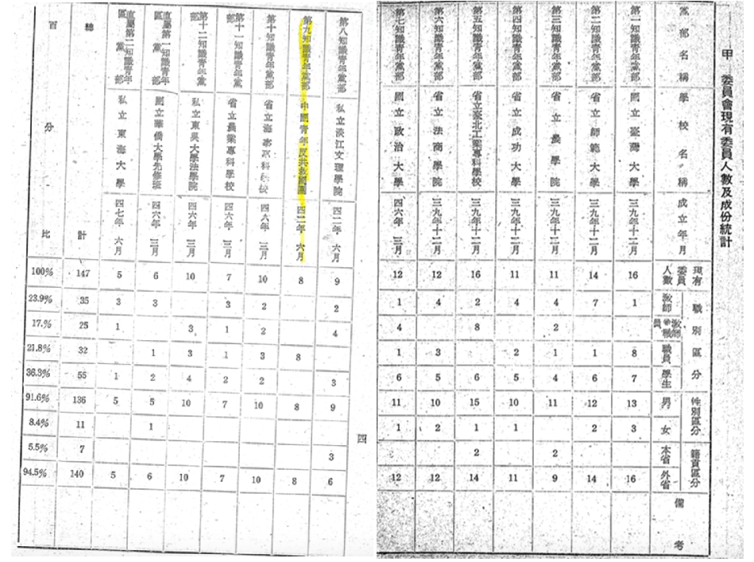
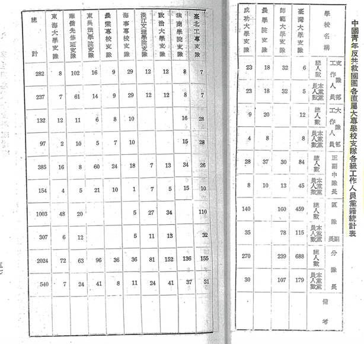

# 「社團法人中國青年救國團是否為社團法人中國國民黨之附隨組織」補充調查報告

## 壹、前言

本會前於民國（下同）106年2月24日上午10時就「社團法人中國青年救國團是否為社團法人中國國民黨之附隨組織案」（下稱「本案」）舉行第1次聽證（下稱「第1次聽證」），並於本會網站公布本案初步調查報告，該次聽證紀錄及相關資料另於同年5月4日公布於本會網站。

本案第1次聽證前之初步調查報告，已就社團法人中國青年救國團（下稱「救國團」）之現況、沿革及經費來源等事項予以說明，嗣本會106年8月22日第24次委員會議決議訂於同年10月24日就「社團法人中國青年救國團是否為社團法人中國國民黨之附隨組織」舉行第2次聽證，本次（第2次）聽證將聚焦於救國團是否為社團法人中國國民黨（下稱「中國國民黨」）之附隨組織及救國團之財務狀況等問題，並集中討論其爭點如下：

> 社團法人中國青年救國團是否曾為社團法人中國國民黨實質控制其人事、財務或業務經營，且非以相當對價轉讓而脫離中國國民黨實質控制之附隨組織？

> 一、救國團自41年10月31日成立時起，有無受到中國國民黨實質控制？

> 二、救國團是否曾以相當對價轉讓而脫離中國國民黨實質控制？

基於前開爭點，本會依政黨及其附隨組織不當取得財產處理條例（下稱本條例）第4條第2款「附隨組織」之定義，於本調查報告中，就救國團之財產狀況，並從人事、財務及業務經營三方面，將本會職權調查所得之有關檔案及文獻資料彙整如後，以提供本次聽證出席人員參考。

## 貳、救國團各時期之組織屬性

依據臺灣高等法院103年度重上字第38號民事判決[^1]，救國團之組織自成立以來可分為三個階段：自41年10月31日成立起、迄58年12月23日，係隸屬國防部總政治部之政府機構；於58年12月23日經行政院核示解除與國防部總政治部之隸屬關係時起，迄78年11月21日登記為社團法人以前，僅為業務受行政院督導、團務工作依行政院指示之公益社團，尚未取得法人資格；78年8月28日經內政部立案為社會團體，同年11月21日向臺北地方法院社團法人登記後，始取得法人資格。

### 一、籌備期

由中國國民黨中央改造委員會（下稱中改會）主導，自39年中改會運作開始，就救國團名稱、組織等進行討論[^2]，嗣於41年10月31日成立，並由蔣經國擔任救國團主任[^3]。蔣中正先生年譜長編中有關於救國團之記載，例如41年12月：自記本年總反省錄中記載：「……其二、爲革命實踐研究院訓練之影響，對於立法委員之收拾，以及黨政關係之促進，最有效益。此乃三年來繼續努力，而其終得收穫，所謂只問耕耘，不問收穫之果也。 **其三、爲青年反共救國團之組織，全省青年學生，皆可由黨統一組訓矣。** 」[^4]

### 二、自成立時起至58年12月23日止

救國團於41年10月31日成立後，團主任為蔣經國，蔣中正先生年譜長編中仍有關於救國團之記載，例如：

#### （一）44年6月8日：

> 主持中國國民黨第7屆中央常務委員會第200次會議，就黃少谷報告文藝活動情形，指示：……又對中國童子軍教育與中國青年反共救國團青年組訓工作統一領導實施要點修訂案指示：一、今後童子軍教育、中國青年反共救國團組訓工作、與學校教育對青年秩序與紀律的訓練，均應特別注意。二、童子軍圑長兼任中學訓導處管理組副組長一節，應先予以訓練，俾能充分了解其所應付之責任與執行工作之方法。[^5]

#### （二）44年8月10日：

> 主持中國國民黨第7屆中央常務委員會第212次會議，聽第五組報告中國青年反共救國團籌辦亞洲青年野營之案，因泰、韓等國不願參加而停辦，惟仍歡迎其他國家學生代表圑來臺訪問觀光。先生乃指示曰：『（一）要求來臺觀光之各國青年代表往返旅費，必要時可由我國負擔供給。（二）今後舉辦一切國際性活動，不必均以韓國代表是否參加爲準，如係必須韓國代表參加者，應於事前愼重接洽，不可輕易發動』。[^6]

#### （三）46年8月7日：

> 主持中國國民黨第7屆中央常務委員會第380次會議，聽取蔣經國反共救國青年團之工作情形後，指示應注意各點如下：……六、中國青年反共救國團爲國防部所屬單位之一，亦爲黨內重要青運機構。今後對重要工作之策劃與執行，均應先呈報中央，接受黨的領導，冀以增進青運工作之效果。[^7]

自41年10月31日成立之初，救國團主要業務為執行高中及大專院校之軍訓教育，「要實施文武合一的教育，以培養青年的戰鬥精神，養成青年的戰鬥生活，使能負擔反共抗俄，國民革命的第三期任務」[^8]。後軍訓教育業務由教育部收回，後續主要活動為每年度辦理假期青年活動，並請各部會、中國國民黨中央支援[^9]，並陸續於全國各地興建青年育樂中心，以配合救國團辦理活動之需要。自42年至51年間，參與暑期青年活動之總人次為79,850人次，共1497隊；寒假訓練活動亦有35,082人次。[^10]從56年至60年，戰鬥訓練活動已有每年10,000人的規模。[^11]

此一階段救國團所持有之不動產如附表1，其中就眷舍部分已處分。

## 三、自58年12月23日起至78年登記成為社團法人前

行政院臺58（教）字第10426號訓令核示：「一、原隸屬關係准予解除。二、中國青年反共救國團本為社團性質，今後有關青年運動、輔導、育樂活動等，應仍由該團按期創立之目的，逕行辦理，其業務可由本院予以督導。」[^12]

59年2月27日救國團以（59）青秘字第0312號函內政部，內容略以：「……本團自成立以來，在名義上雖屬政府輔導青年機構，但為適應時代潮流及青年特性，在實施方式上則以社團型態推行各項青年活動，諸多便利，尤其對於國際青年之聯繫合作事項，頗收運用之效。今後團務工作除遵奉行政院指示外，至於本團性質擬以『社會運動機構』形式，俾利工作推展。三、檢奉本團……各室組主管以上人員名冊，敬請核備並予指導。」檢附之名冊中，時任救國團主任為蔣經國，蔣經國當時亦為行政院副院長。內政部則於59年3月24日內社字第356086號函准救國團以「社會運動機構」備案。[^13]

嗣67年修改組織章程，經內政部准予備查，救國團以67年6月28日（67）青秘字第1592號函內政部：「本團部依據本團組織章程第6條之規定，設置團務指導委員會，擬聘各有關機關團體負責人暨教育專家等共13人擔任團務指導委員，檢奉名冊一份，敬請核聘。」救國團提出之名單：朱滙森為教育部長、閻振興為國立臺灣大學校長、歐陽勛為國立政治大學校長、王唯農為行政院青年輔導委員會主任委員、張豫生為國民黨中央青年工作會主任、宋時選、高銘輝則均為救國團副主任[^14]等共13人，內政部以67年6月29日臺內社字第806267號函復，並依據前揭救國團函送名單核發聘書。[^15]

68年2月12日救國團以上開模式增聘潘振球為團務指導委員[^16]，於68年2月13日團務指導委員會議紀錄中則有記載，時任內政部長邱創煥曾以主管官署指導委員身份出席會議，並表示：「宋主任（即宋時選）榮膺本黨臺灣省黨部主任委員，敬致賀忱，今後黨團工作必定更能密切配合推展。」[^17]後救國團於（69）青秘字第2015號函：「茲附奉擬聘下屆委員名單一份……」，後續團務指導委員如任期將屆，均循此一模式，由救國團檢附欲聘任之委員名單，由內政部依據救國團提供之名單核聘[^18]。

69年6月25日團務指導委員會第4次會議紀錄中記載：「……九、專題討論：民間團體辦理假期青年自強活動案：（一）現況說明：近年來少數民間團體在暑假辦理青年活動，據了解多以營利為目的，而忽視教育效果；……決議事項：建議由中央青工會、內政部、教育部、財政部、交通部、青輔會、救國團等單位成立專案小組，並請內政部擔任召集，研討處理辦法。」[^19]

而 **蔣經國自41年10月31日成立時起擔任救國團主任** ，直至62年5月3日卸任（61年6月1日接任行政院長）， **後續繼任者為李煥、李元簇、宋時選、潘振球，76年由蔣經國指派李鍾桂擔任救國團主任[^20]，當時蔣經國已經是中國國民黨主席**，也是中華民國總統[^21]。

76年10月救國團捐助成立了「財團法人中國青少年輔導基金會」[^22]，係以「配合政府政策辦理青少年身心輔導與心理衛生教育推廣等有關工作」為宗旨；77年4月另捐助成立「財團法人中國青年服務事業文教基金會」[^23]，其宗旨為「服務青年推展各項文教活動」。

此一階段中所持有及處分之不動產如附表2。

### 四、78年向內政部登記為社會團體，並向法院為社團法人登記

78年1月27日動員戡亂時期人民團體法公佈後，救國團依法申請立案，78年8月28日內政部核准救國團登記為社會團體，並於同年11月24日向臺北地方法院辦妥社團法人登記。依據人團法及民法規定，社團需有社員（救國團以團員稱之），救國團於78年召開第1次團員大會時，團員僅62人[^24]。本會就團員人數一事曾去函請救國團說明，救國團以106年6月9日（106）青研字第1029號函[^25]復本會，就歷來團員組成結構及變化，以登記為社團法人之時點前後區分，在登記前，「團員招募採取申請制，除對外開放所有社會青年以個人名義申請參加，成為個人團員外，『學校機構』亦可透過向本團申請而成為本團之團體團員，在校學生亦係循此路徑參與本團活動；……，本團另以『社會團員』方式廣納社會賢達人事擔任本團義工。……本團之團員組成結構乃漸次以團體團員及社會團員為主。由於加入本團方式開放，……成員眾多，實難統計，故未予特別統計列冊。」；登記為社團法人之後，「本團方以申請當時之團務指導委員（共17名）為團員（會員）外另邀請本團歷任召集人、主任、副主任，創團時期總團部主管、熱心青年工作之離團先進，及積極參與團務之青年學者擔任法定社團團員（會員）」。依照78年當時章程第6條規定：「凡贊同本團宗旨，熱心青年工作，經團員5人推薦，並經團務指導委員會（即理事會）審查通過者得為本團團員。」

82年間臺北市旅行業同業公會向監察院、公平交易委員會陳情稱救國團長年占用國有地，興建青年活動中心，從事旅行業者業務，與民爭利，案經監察院及公平交易委員會調查，行政院與財政部等機關也就救國團使用土地部分開會（陸續處理），救國團以（82）青秘字第2533號函[^26]復內政部，就其使用國有地興建青年活動中心一事提出說明。

而此一階段，救國團購置不動產詳如附表3。
 
## 參、附隨組織之定義及本案相關史料

### 一、附隨組織之定義

按本條例第4條第2款規定：「本條例用詞，定義如下：二、附隨組織：指獨立存在而由政黨實質控制其人事、財務或業務經營之法人、團體或機構；曾由政黨實質控制其人事、財務或業務經營，且非以相當對價轉讓而脫離政黨實質控制之法人、團體或機構」，故是否為本條例所定義之附隨組織，應從人事、財務、業務經營等三方面為調查，以茲為據。

參考「東德政黨及群眾組織財產審查獨立委員會（UnabhängigeKommissionzurÜberprüfungdesVermögensderParteienundMassenorganisationenderDDR）」（下稱「德國黨產會」）有關認定附隨組織相關報告、德國相關裁判及學者見解，附隨組織的概念應有下列內涵：

首先，就東德政黨法有關附隨組織的規範目而言，德國行政法院乃認為：「 **東德政黨法§§20a和20b，主要目的在於確保及收回政黨及群眾組織藉助前東德黨國不分而累積的財產，此一措施被視為跨向重建政黨機會平等的一步。……德國社會主義統一黨的統治導致政黨及國家財產混淆，其他政黨及群眾組織的情況也相似。德國社會主義統一黨利用權力獨佔，在40年的東德歷史中，以非法及排除公眾監督的手法取得資產，為了一黨的利益進行財產沒收，並為該黨利益而將國家預算用在其他目的。這長久以來的不正義必須加以排除，不可成為新貨幣及新經濟系統的優勢。因此必須在1990年7月1日之前確認政黨及群眾組織的資產，一部分加以確保，也就是置於政府信託管理之下，並且能夠投入有益於公眾目的之運用。此一程序被視為跨向重建政黨機會平等的一步。[^27]** 」

其次，在附隨組織的定義上。德國黨產會是以「 **政黨─尤其是德國社會主義統一黨（SED）─的其他機構應被視為穩定政治權力的根本要素（wesentlichesElement），並且相應地被操控。形式上可顯示某個機構是被定義為維持東德政治統治系統基本要素的跡象，而具備國家陣線（NationaleFront）的成員身分[^28]** 」來作為附隨組織的判準。除上述以「國家陣線的成員」作為附隨組織的參考判準外，德國學界亦將附隨組織的聯結性（Verbundenheit）認定，歸納為三個要素：透過政治工具化的連結（durchpolitischeInstrumentalisierung）、透過組織上融合的連結（durchorganisatorischeEingliederung）和財務上的連結（wirtschaftlicheVerbundenheit）來作為功能性的判準[^29]。換言之，附隨組織的判定是依個案認定，而不以完全地具備上述三要素為限[^30]。

具體而言，在人事或者組織上融合的要素上，乃須檢驗該組織的成員與政黨黨員有無交織與重疊，惟組織成員與黨員的百分比並非以過半數來作為準據，而是參考事實個案中的整體形象或者組織的重要部份來加以認定[^31]；財務上連結是指該組織財產源於政黨，主要是德國社會主義統一黨，或者是透過政黨的行為來供應該組織[^32]；在政治工具化的部分，則是考量該組織是否被政黨視為一重要的元素（wesentlichesElement），用以穩固政治權力並被其所控制。其判準為該組織在描述上是一重要的元素，用以維護東德時期的政治統治系統[^33]。

在此，德國行政法院在判決中認定自由德國青年（FreieDeutscheJugend,簡稱FDJ）為德國社會主義統一黨的附隨組織乃以：「 **自由德國青年是德國社會主義統一黨的青年組織，1963年1月19日，德國社會主義統一黨黨章第7項聲稱：『自由德國青年，德意志民主共和國的社會主義青年組織，是吾黨的積極助手和儲備人員。他們協助吾黨教育青年人，以社會主義的精神主動參與社會主義全面建設，以及捍衛社會主義祖國。協助教養全面發展的年輕世代，以社會主義精神工作、學習及生活。自由德國青年以其決議認定工人階級政黨的領導角色。』（摘自羅格曼，同上，頁64）再者，自由德國青年是政黨及群眾組織與民主同盟的一部分，德國社會主義統一黨、德國民主農民黨、東德基民黨、德國自由民主黨、德國國家民主黨、自由德國工會聯盟、德國民主婦女協會及東德文化聯盟都是民主同盟成員之一。上文引述過的國家法教科書（同上，頁119以下）稱民主同盟應被理解為『在德國社會主義統一黨領導之下，友誼合作、意見交換，以及代表性政黨及群眾組織凝聚一致意志的決策小組』。[^34]** 」而將「 **民主同盟的成員** 」、「 **作為該黨的青年組織** 」、「 **服從黨的領導** 」以及「 **具有緊密合作與共同決策** 」來作為判準，並加以認定自由德國青年是德國社會主義統一黨的附隨組織。

最後，參酌上開德國見解，本會認為於「人事」部分，應考量組織的主要成員是否為特定政黨之黨員、組織成員與政黨黨員間之重疊關係等，並須就該組織之決策者是否為政黨中之重要人士，且其是否實質掌控該組織之人事決定權等予以衡量；就「財務」部分，則須考量政黨是否直接提供該組織資金，或者是否透過政黨行為來挹注該組織，比如政黨是否透過其執政之優勢地位，促使行政部門以違反平等原則或實質法治國原則之方式來進行國家資源分配，而形成壟斷性之補助行為，或給予該組織特殊待遇等；就「業務」部分，則應考量該組織的業務內容對於政黨而言，是否作為鞏固其政權之重要工具，或其業務範圍是否依循政黨的政策或決議，甚至由政黨中之重要人士擔任該組織的領導人，並藉此貫徹政黨之意志，進而呈現具有緊密連結的合作關係。

### 二、人事相關部分

#### （一）救國團成立前之「籌組中國青年反共抗俄救國團原則」經中國國民黨中改會第288次會議通過，蔣中正並核定其團體名稱為「中國青年反共抗俄救國團」，由蔣經國擔任第1屆救國團主任，且11名團務指導委員皆由國民黨政要或與該黨關係密切人士擔任：

1. 41年1月31日中國國民黨中改會第288次會議通過「籌組中國青年反共抗俄救國團原則」[^35]，其中第3點指出救國團隸屬於政府，而國民黨則以黨團方式領導其活動；第10點則提到「青年反共抗俄救國團成立後，現有之青年組織應予以調整，以資統一領導」。

2. 中國國民黨中改會41年1月31日第288次會議紀錄曾記載：「…… **一、擬具籌組中國青年反共抗俄救國團原則草案，提請核議案。** ……決議：本案修正通過。至名稱定為『中國青年反共抗俄救國團』抑為『青年救國先鋒隊』一併簽報　總裁核奪。」[^36]

3. 國防部41年7月14日簽呈：「主旨： **為擬加聘蔣經國同志為中國青年反共救國團指導委員，並兼任團長** ，敬乞鈞核示遵由。一、據總政治部主任蔣經國中將稱：『關於奉命籌組中國青年反共救國團一案，業經遵照指示積極進行，茲謹依照行政院頒發中國青年反共救國團籌組原則第5條第1、2項之規定， **擬聘張其昀、周至柔、郭寄嶠、程天放、吳國楨、錢思亮、谷正綱、陳雪屏、任培道、劉真、沈昌煥等11人為中央團務指導委員** ，並請指派一人充任團長，俾克從速展開工作。』二、職同意所擬名單，惟查此項任務依照中央決定，係交由總政治部主辦，為便利開展是項工作計， **擬加聘蔣經國同志為委員，並兼任團長，俾能集中事權，以赴事功** 。……」，並經蔣中正批示：「 **照辦，惟該團負責人不必稱為團長，可另擬名稱報核** 。」[^37]

4. 國防部41年8月1日簽呈：「一、本部41年7月14日簽呈一件，為擬定中國青年反共救國團團務指導委員名單及團長人選，請賜核定一案，奉批『照辦，惟該團負責人不必稱為團長，可另擬名稱報核』。 **二、經研究結果，似以改稱主任較佳** ，其副團長一席，並須隨同改稱（副主任）……職　周至柔」，並經蔣中正批示「可」[^38]。

#### （二）「籌組中國青年反共抗俄救國團原則」中，規定救國團之部分幹部應選拔具中國國民黨籍者擔任：

41年1月31日中央改造委員會第288次會議通過之「籌組中國青年反共抗俄救國團原則」：「…… **九、青年反共抗俄救國團之幹部分子除專門人才外，應就原有教育行政系統中選拔本黨優秀而富有領導經驗之同志擔任** 。」[^39]

#### （三）中國國民黨自40年10月起辦理「夏令講習會」，用以訓練該黨知識青年黨部學生幹部及社會海外青運幹部，其中部分幹部之後擔任救國團各級隊長；42年6月，中國國民黨於救國團中正式成立第9知識青年黨部；且於中國國民黨知識青年黨部與救國團配合下，大專學校之救國團支隊幹部多有參加黨部工作，支隊幹部亦多遴派具中國國民黨籍者擔任：

1. 中國國民黨中央委員會第一組編印之《從改造到重建黨的組織概況》中曾記載：
 
   > 夏令講習會實施概況。

   > 1. 目的：利用暑期訓練知識青年黨部學生幹部及社會海外青運幹部加強政治認識提高革命精神。增進工作方法促進知識青年組訓與青年運動之發展。

   > 2. 調訓對象：一、知識青年黨部學生小組長及基層幹部與優秀黨員。二、自由地區社運幹部。三、大陸及海外地區青運幹部。

   > 3. 訓練內容：第一期辦理日期—40年8月；已辦8期—每期調訓人數約300人；課程方面：特約演講佔訓練總時間23.8%；工作方法課程佔訓練總時間23.8%；黨務活動佔訓練總時間9.32%；研讀訓詞及寫作佔訓練總時間10.88%；訓育活動佔訓練總時間。

   > 4. 績效：已調訓2371人：性別區分—男2048人，女323人；省籍區分—臺籍549人，外省籍1822人； **結業後擔任工作** ：吸收新黨員560人，為黨義務服務156人，重要社團幹部132人， **救國團各級隊長140人** ，基層組織幹部266人，宣傳及訓練工作252人，策動海外愛國運動6件[^40]。

2. 中國國民黨中央委員會第一組於48年7月編印之《知識青年黨部工作概況》中有如下之統計表格[^41]：

3. 中國國民黨第9次全國代表大會黨務工作報告：「繼續舉辦知識青年之夏（冬）令講習會，該項講習會自八全大會之後至52年7月止，已舉辦7期，調訓學生幹部同志1353人。對加強基層領導，發展組織，貢獻頗多。」[^42]

4. 中央委員會第一組編印之《知識青年黨部工作概況》中曾記載：「黨與救國團配合情形：救國團於42年下學期在各大專學校開始籌備，43年3月29日正式成立組織，中央為使各知識青年黨部與救國團大專學校團隊工作密切配合，除根據中國國民黨中央直屬知識青年黨部領導中國青年反共救國團大專學校支隊工作實施要點力求組織上工作及人事上配合外，並運用各黨部委員選舉提名制度，鼓勵救國團支隊各級幹部參加競選，以加強兩者工作聯繫。實施以來救國團支隊幹部多普遍參加黨部實際工作，支隊各幹部亦多遴派本黨同志擔任，故各黨部與救國團之配合頗稱良好。茲將救國團大專學校支隊以下現有各級幹部黨籍統計如下：」[^43]

### 三、財務相關部分

#### （一）救國團於52年曾就其所屬人員加發年終1個月薪津乙事函詢中國國民黨，經中國國民黨中央委員會函請時任行政院秘書長陳雪屏辦理，並核定追加145,050元寄列在國防部大陸工作經費科目內，由中國國民黨中央委員會經領轉發；53年，中國國民黨中央黨部、救國團及國防研究院等之工作人員加發1個月薪所需之經費1,253,550元，亦由行政院指示國防部撥交所屬情報局轉由中國國民黨中央黨部統領轉發：

1. 中國國民黨中央委員會祕書長唐縱致國防部副部長梁序昭：「一、准中國青年反共救國團函， **為該團暨所屬單位工作人員擬比照政府加發（52）年年終一個月薪津** ，請於53年度預算內追加該項經費152,530元一案，經由本會函請行政院陳秘書長雪屏惠辦去後，茲准陳秘書長臺（52）忠四字第1532號函復，略以 **本案經審定追加新臺幣145,050元，以該團經費係寄列在國防部大陸工作經費科目內，由貴會經領轉發** ，仍請洽知國防部於該部加發一個月薪津時併為請撥，由該部以追加大陸工作經費辦理追加預算等由……」，並經批示「 **主計局洽辦併處，如擬** 」[^44]。

2. 國防部民國53年2月12日（53）賀貼字第0791號箋函（受文者：行政院謝秘書長）：「……二、查中央黨部、 **中國青年反共救國團及國防研究院等單位工作人員53年度加發一個月薪所需經費125萬3,550元經已遵照鈞院臺（五三）忠四180號令指示如數撥交本部情報局轉由中央黨部統領轉發** 。……本件副本抄送中央黨部唐秘書長」[^45]。

#### （二）中國國民黨中央委員會第五組曾編列經費輔助救國團發展社會團隊組織

**中央委員會第五組43年上半年度工作計劃及經費預算表** ：「單位：第一室(青運)……計劃名稱：加強社會青年之組織與訓練……工作項目：（一） **輔助中國青年反共救國團發展社會團隊組織** ……本年上半年度工作進度： **一、加強各級黨部對青年救國團之領導及基層組織之密切聯繫配合工作** …… **所需事業費預算數：60,000** ……附註：輔助該團加強社會青年組之經費月需一萬元，合計如上數……」[^46]。

#### （三）地方政府補助

1. 42年3月間，基隆市議會於第2屆第1次臨時大會，決議通過由基隆市政府交議之「為反共救國團基隆市支隊部補助經費一萬元請審議案。」內容彙整如下：「一、中國青年反共救國團直屬台灣省基隆支隊部電稱略以：中國青年反共救國團本市各學校大隊業已組織成立，各項工作亦逐漸開展。茲以辦公家具及團旗等亟待製用並已於最近舉行各界首長報館記者及各界青年座談會幹部講習擴大宣傳。惟以經費所限影響工作進行，擬請仿照嘉義縣政府補助乙萬元、彰化縣政府補助五千元之例，惠予補助本小組乙萬元藉利工作」。基隆市議會以「該團所稱屬實」，決議通過撥付[^47]。

2. 42年12月間，中國青年反共救國團直屬台灣省花蓮縣支隊長關中向花蓮縣議會提出「依法迅撥本隊補助費二萬元以利工作」請願案，經花蓮縣議會第2屆第3次定期大會決議「照審查意見通過」，並送請縣府依法執行。該請願案內容彙整如下：「一、本支隊房舍修理費用前承貴會42年度第一次追加預算通過列支補助費2萬元至表感紉。頃准花蓮縣政府43年府財務字第62644號代電略以該案經呈奉台灣省政府42府財三字第121831號簡復表略以各縣市救國團支隊部經費經由省統籌配發補助有案，該隊所需修繕經費應自行調整開支請查照籌由。二、省府統籌補助乃係經常費，本支隊房舍修葺係屬特別需要，性質迥異，貴會重視國家青年組訓工作，加強本縣青年活動，通過地方預算予以補助，自有其價值與意義，且依照『台灣省地方自治實施綱要』貴會體察地方實際情形與需要，對預算科目作適宜之調整，乃屬職權正當之行使，實與任何法令不相抵觸。三、本支隊對貴會協助本縣所屬青年組訓工作之盛意感激彌深，除表懇摯謝忱外，特電查照請複察事實需要仍准專電縣府依法迅撥該項補助費2萬元，以利工作為荷。」[^48]

#### （四）省政府補助救國團在臺中興建青年育樂中心

1. 57年6月24日，台灣省省政府主席黃杰於首長會議中指示「青年反共救國團團總部宋主任秘書時選來訪，以救國團在本省北部之金山、南部之澄清湖設置青年育樂中心，均頗具規模，獨中部地區尚付闕如。茲擬在臺中市籌建青年育樂中心一所，教育廳已同意撥用游泳池鄰近之公有土地兩百八十坪，市政府已編列預算八十萬元，希望本府支援建築費用兩百萬元，期於本年內建造完成，以應中部地區青年活動之需要等語。查中部地區確有此一需要，惟設置地點似需再加研究……至於所需經費如何籌措，希財政廳、教育廳、主計處、社會處研辦。」[^49]。

2. 58年5月26日，台灣省省政府主席黃杰於首長會議中指示「青年反共救國團擬在臺中市籌建育樂中心，希省府協助撥用公地，及補助建築費250萬元，本人曾於會談中提示，土地部份已由臺中市政府照撥，省府承諾補助250萬元，希財政廳、主計處辦理。」[^50]。

### 四、業務相關部分

#### （一）救國團之名稱、籌組原則及其成立，由時任中國國民黨總裁蔣中正及中改會決議通過；其後之籌組過程，則由中央委員會透過黨團組織，於中國青年反共抗俄聯合會全國代表大會上發表宣言，號召會員參加：

1. 中國國民黨中改會41年1月31日第288次會議紀錄曾記載：「…… **一、擬具籌組中國青年反共抗俄救國團原則草案，提請核議案** 。…… **決議：本案修正通過** 。至名稱定為『中國青年反共抗俄救國團』抑為『青年救國先鋒隊』一併簽報總裁核奪。」[^51]

2. 「籌組中國青年反共抗俄救國團原則」曾提及：「…… **三、青年反共抗俄救國團屬於政府，本黨以黨團方式領導其活動。** ……十、青年反共抗俄救國團成立後，現有之青年組織，應予調整以資統一領導。」[^52]

3. **中國國民黨中改會41年5月8日第338次會議紀錄** 曾記載：

   > 主席：蔣總裁……一、茲檢呈籌組青年反共救國團審查意見一份，提請核議案。…… **決議：照審查意見通過。** （審查意見印附）……

   > 甲、決議事項

   > 一、 **中國青年反共救國團隸屬於國防部總政治部** ，設團務指導委員會負責全國團務之設計，指導委員由總政治部聘請有關人士擔任之。

   > 二、中國青年反共救國團之組織，應先組訓學校青年，再及社會青年。

   > 三、為適合目前情況，並求指揮靈便，省級及鄉鎮區暫不設機構。

   > 四、籌備機構應於本月內成立，並於六月底以前確定有關章程，正式公佈各級幹部，利用暑期予以集訓。[^53]

4. **中國國民黨第7屆中央委員會第2次全體會議黨務報告** 亦記載：「……民眾運動的展開，首為青年運動。 **中國青年反共救國團係遵照總裁指示而成立者** ，應積極輔導其發展」[^54]、「中國青年反共救國團乃隸屬政府的全國性之青年組織，於去年10月31日正式成立， **本組為遵守統一青年領導之原則，並輔導其發展起見，一方面策動前中國青年反共抗俄聯合會於10月28日舉行全國代表大會，透過黨團組織，發表宣言，結束會務，號召會員一致踴躍參加中國青年反共救國團，一方面並積極輔助其建立社會青年團隊** ，除指導其確定有關社會組織之各項辦法外，並就前青聯會戰時工作隊員1,700餘人分批講習，個別考核，嚴格甄選410人，集體宣誓入團，建立該團成立後第一個社會青年大隊。」[^55]

#### （二）蔣中正曾表示，救國團為中國國民黨最重要的青運機構，其重要工作之策劃與執行，應接受中國國民黨之指導；蔣經國也曾表示救國團的任務為執行中國國民黨的政策；救國團本身亦承認其是在蔣中正的號召下建立起來，應接受中國國民黨的指導：

1. 救國團編印之《本團重要文獻》中，就「本團的工作」有如下之記載：「 **總統指示：** 中國青年反共救國團工作，今後應特別注意下列各點：…… **六、中國青年反共救國團，<u>在社會為國防部所屬單位之一，在黨內為本黨最重要青運機構。今後中國青年反共救國團對重要工作之策劃與執行，均應先行呈報中央，接受黨的指導</u>** ，冀以增進青運工作之效果。」[^56]

2. **蔣經國** 曾以「 **救國團對青年思想的輔導工作** 」為題，於52年12月 **對救國團工作同志講話** ：「本團成立於政府遷臺之後，成長於多苦多難的國運之中。 **<u>總統　蔣公所指示我們的始終不變的任務，就是執行黨的政策</u>，為黨國培育青年** ，團結青年，為民族開闢遠大的前途。這是開天闢地的事業，需要全國青年幹部用驚天動地的氣魄去完成。」[^57]

3. 救國團曾於41年10月12日，即中國國民黨第7次全國代表大會後，電賀中國國民黨：「中國國民黨第7次全國代表大會，已於雙十國慶節隆重揭幕，中國青年反共救國團特電申賀，原文如下：中國國民黨第7次全國代表大會　公鑒：…… **本團是在　領袖『愛國青年大結合』的神聖號召之下建立起來的** 。領袖策勵我們說：『沒有青年，沒有革命。』 **我們也深自體認到：** 沒有中國國民黨的領導，中國青年不能完成國民革命的任務。我們青年第一次大結合，是在黨的領導下，完成北伐的使命；第二次大結合，也是在黨的領導下，達成抗戰的任務； **現在是我們第三次大結合，定能繼承過去的歷史，赤膽忠心，接受黨的領導，流血流汗，共同爭取國民革命第三任務之完成。** 敬祝中國國民黨第7次全國代表大會圓滿成功！中國青年反共救國團主任敬叩」。[^58]

#### （三）中央心戰指導會報相關紀錄

1. 55年8月2日，中央心理作戰指導會報於台北市松江路219號會議室舉行第123次會議。在這份當時列為「極機密」會議記錄裡，顯示除該次會議由常務委員蔣經國擔任主席外，並分別由：總政治作戰部、中央第三組、中央第五組、會報秘書處及青年救國團等單位提案，報請鑒詧。該次會議就各單位提案，皆決定准予備查。[^59]

2. 56年6月28日，中國國民黨中央委員會第六組主任陳建中簽呈中央常務委員蔣經國，檢呈中央心戰指導會報55年歷次（第122至125次）會議主席指示事項執行情形彙報表。茲就其中重要者，摘要臚呈：「（二）關於敵後及敵前心戰部分…中國青年反共救國團，遵照鈞座『以自由區知識份子吸引大陸知識份子，親切懇談，講道評理。』之指示，經邀請台灣各大專院校教授五百人，於55年7、8月間，分別舉行座談會，並個別發表其對毛共匪幫迫害知識份子之意見，且向大陸知識份子致以懇切之慰問」。[^60]

#### （四）就救國團與中國國民黨青年運動工作兩者間之關係而言，41年10月10日中國國民黨於臺北召開第7次全國代表大會後，就青年運動多所檢討，並將救國團作為青年運動之一部分；46年中國國民黨第8次全國代表大會紀錄則顯示，在中國國民黨的輔導下，救國團組織之發展已有一定成效；52年第9次全國代表大會黨務工作報告中則記載救國團中設有中國國民黨知識青年黨部；58年第10次全國代表大會黨務工作報告則記載了青年運動工作中救國團組織的發展成果；而中國國民黨第7、8屆中央委員會全體會議黨務工作報告亦將輔導救國團辦理活動作為青年運動工作之一環，中央委員會第五組在《黨的民運工作績效展覽》中亦有類此記載：

1. 據中國國民黨第8次全國代表大會黨務工作報告記載：「……扶植青年愛國組織：41年10月21日中國青年反共救國團成立，是為執行教育青年、團結青年、動員青年的總綰機構， **五年來在黨的輔導下其組織之發展，由學校而社會，由城市而鄉村，現已遍及臺灣全省及金馬地區** ，共成立24個縣市支隊，15個大專學校支隊，團員115,093人，其中社會青年約佔百分之21，女性約佔百分之3。」[^61]

2. 中國國民黨第9次全國代表大會黨務工作報告：「建立知識青年（總）黨部並擴建所屬組織： **大專院校及救國團，原設有直屬中央之知識青年黨部十三個，其特性與其他黨部不同，單獨為一類型** 。為適應實際需要，增進組織運用效能，經決定籌組知識青年總黨部，負責有關知識青年黨務計畫及督導事宜。」

3. **中國國民黨第10次全國代表大會黨務工作報告** 有記載：「青年運動是民運工作中最重要的一環，如何使青年向心本黨，熱愛國家，擁護領袖，為本黨青運工作一貫的努力目標。現階段青年運動，依照九全大會暨歷屆中全會決議案，其重點在輔導開展社會青年組訓工作。 **現臺灣省各鄉鎮均已建立青年救國團組織** ，並為配合國家經濟建設之發展，經輔導成立青年輔導機構，創青年就業機會……」[^63]、「 **發展青年組織輔導中國青年反共救國團健全各級團務組織** ，計現有縣市團委會21個，金門支隊、馬祖大隊各1個，鄉鎮（區）團委會298個，社團班隊（包括學藝、技藝、體能、康樂、服務等5大類）共555個，青年育樂中心23個，大專院校團委會70個，高中團委會307個，初中團委會253個。 **輔導知識青年黨部透過大專院校學生社團組織，建立黨團以加強領導運用** ，現已建立黨團組織者975個。由於各個青年組織之普遍建立，已發揮黨團運用功能。」[^64]

4. 中國國民黨第7屆中央委員會第2次全體會議黨務報告：

   > 七全大會總裁訓示及宣言暨四大議題與各項報告決議案處理情形報告表……

   > 六、青運部分：
   
  <blockquote>
    <table class="table table-bordered table-hover table-condensed">
      <thead>
        <tr>
          <th>部門</th>
          <th>類別</th>
          <th>內容要點</th>
          <th>處理意見</th>
          <th>處理情形</th>
        </tr>
      </thead>
      <tbody>
        <tr>
          <td>政綱</td>
          <td>社會</td>
          <td>一、指導青年思想，團結青年力量，扶植青年愛國組織...</td>
          <td>對青年思想之指導及青年愛國組織之扶植，在改進期間，即依照現階段青年運動指導方案實施，如中國青年反共抗俄聯合會，即由於黨的扶植與指導而收極大成果，今後當本七全大會通過之反共抗俄時期青年運動綱領，納入下半年度工作計劃內，切實遵照實施。</td>
          <td><strong>查中國青年反共救國團，即係遵照總裁指示而成立之全國青年愛國組織，今後當積極輔導其發展</strong>，並依照反共抗俄時期青運綱領指導其展開工作。</td>
        </tr>
      </tbody>
    </table>
  </blockquote>

5. **中國國民黨第8屆中央委員會第2次、第3次全體會議黨務工作報告** 則分別記載：「…… **青運工作** ：一、健全青年團體組織：青年運動為民眾運動的主流，為鼓舞青年愛國情緒，適應時代要求，使愛國有志青年，普遍納入革命組織之內， **救國團組織截至48年3月底止，計已建立大專支隊18個，中學大中隊227個，社會大隊61個，直屬中隊34個** ，計有男團員102,112人，女團員35,345人，共計137,457人。 **47年12月救國團於檢討以往的工作得失，改進其支隊以下的組織** ，決定按照青年志趣編組，先在基隆市和彰化縣兩支隊試辦青年育樂中心，待有成效，即普遍實施。二、實施戰鬥訓練：47年暑期戰鬥訓練，救國團共舉辦98隊，計分為學術研究、戰鬥技能、育樂活動、服務工作等訓練活動4大類，報名22,589人，因限於定額，經甄審合格參加者為6,804人，其成分為大專團員1,179人，高中團員4,423人，社會團員749人，社會青年453人。三、舉辦青年年會：青年學術年會，係秉承總裁「青年應接近自然，接近工廠」之指示，由救國團規劃辦理，其內容包括專題報告、專題研究、休閒活動、參觀旅行等項目，為我國青年活動之創舉。」[^66]、「…… **本黨當前的青運工作** ，除直接由學校知識青年黨部領導策進之外，於一般青年的組訓工作，則係輔導青年反共救國團經常辦理，舉凡思想教育、學術研究、品德陶冶以及體格的鍛鍊等等，均無不包括在內，年來所收績效，亦甚顯著； **其中尤以暑期青年戰鬥訓練一項工作，最受青年學生歡迎** ，亦極搏各界好評。本年暑期青年戰鬥訓練的實施重點，則在以配合在職青年的工作，在學青年的學業、發揮戰鬥與研究精神、儲備反攻力量為主。」[^67]

6. 中國國民黨中央委員會第五組在《黨的民運工作績效展覽》中曾記載：「關於 **青年運動** 者：1. 號召全國青年反共抗俄，為爭取國家獨立，人民自由，政治民主，經濟平等，世界和平而奮鬥。2. 團結革命青年，培養新生力量，擴大革命陣容，完成個命任務。3. 輔導青年研究學術，培養品德，養成創造能力，勞動習慣，服務觀念，戰鬥精神。 **4. 加強輔導中國青年反共救國之工作，以擴大黨在革命青年中之基礎。** 」[^68]

#### （五）中國國民黨透過其所屬知識青年黨部成員參與救國團活動，藉以吸收黨員：

中國國民黨第8屆中央委員會第2次全體會議黨務工作報告：「改進學校黨部之領導與工作方法：……丙、策進愛國活動：青年外圍社團均有學生自己主持，除在平時配合思想領導工作展開出版物，青年講座等經常活動外，並聯合救國團策進愛國活動，今來各知識青年黨部所策進之重要愛國活動項目達17項之多，辦理情形及成效均甚良好，影響所及，對整個社會良好風氣之建立多所貢獻，茲就犖犖大者列舉如後：（1）利用暑期參加戰鬥訓練及軍中、農村、漁村服務：各知識青年黨部為配合中國青年救國團暑期所舉辦之戰鬥訓練，在各大專學校策動參加人數達1,179人。佔參加受訓總人數6,804人，百分之17.4， **各黨部並指示各參加受訓同志在群眾中起領導作用，協助輔導員教育訓練，並考核優秀隊員，相機吸收入黨。** 」[^69]

#### （六）中國國民黨在其內部黨員文宣品《知識青年黨員必讀之二》中表明，救國團象徵中國青年永遠是蔣中正的忠實信徒，中國國民黨亦以救國團為青年運動之主體：

1. 「此時，一個旗幟鮮明的青年反共團體—中國青年反共抗俄聯合會，在臺北宣告成立，推行戰時節約運動，人人參戰運動，創造戰鬥文藝，轉移社會風氣，對反共戰爭貢獻甚大，民國40年，偉大的領袖，鍳於中國青年的反共抗俄運動澎湃高漲，於是在3月29日青年節，提出組織『中國青年反共救國團』，統一領導青年救國運動的莊嚴號召，立即獲得全國青年熱烈響應和擁護，青聯會乃於41年10月29日第2次全國代表大會宣告結束，而中國青年反共救國團就在同年10月31日，總裁六秩晉六華誕正式成立， **象徵中國青年永遠是領袖的忠實信徒** ，和革命事業的繼承者，並保證生生不息，永無止境，為貫澈領袖的意志而奮鬥。」[^70]

2. 「當前， **本黨以救國團作為中國青年運動的主體，救國團的一切作為，在黨的正確領導下，確實創造了許多輝煌的成就** ，尤其在青年運動的方針上，完全根據青年的需要與興趣而設計，以『愛』為出發點，以『服務』為中心，並要求學術研究與青年事業相結合，青年需要什麼，我們服務什麼，進而做到國家需要什麼，青年貢獻什麼，已經得到百分之百的成功。」[^71]

#### （七）救國團之組織系統及其所負責學生軍事訓練活動之相關規範，乃由國民黨政要所組成之9人小組負責決定：

41年4月24日中國國民黨中改會第332次會議紀錄：「一、茲簡陳『 **中國青年反共救國團學校團務高中以上學校學生軍事訓練配合實施要點** 』及『 **中國青年反共救國團組織系統草案** 』各一件，提請核議案。…… **決議：本案推陳雪屏、谷正綱（以上召集人）鄭彥棻、袁守謙、崔書琴、蔣經國、沈昌煥、唐縱、萬耀煌等九同志組織小組予以審查** 後，再行提會核議。」[^72]

#### （八）救國團藉由辦理「學生同志暑期工作」，協助中國國民黨學校黨務之發展：

中國國民黨第9次全國代表大會黨務工作報告曾提及：「舉辦 **大專院校學生同志暑期工作** ：本會為協助大專院校學生同志，利用暑假期間，增加歷練與學習機會，培養勞動觀念，並解決在校期間用費問題，特於49年起舉辦學生同志暑期工作。嗣以各方反應良好，復於50年暑期擴大辦理，並與各產職業單位主管同志協商，提高酬金數目。51年起復規定各校非同志優秀學生，遇有適合其專長之工作缺額，亦得透過學生同志之推介申請。參加暑期工作者，計49年170人，50年235人，51年442人，52年565人。是項工作對青年同志裨益甚大，而且 **有助學校黨務之發展** 。各職業黨部亦甚認真，曾擇優給予獎勵。」[^73]

#### （九）救國團歷任主任中，宋時選與潘振球皆曾於公開談話中論及其自身或救國團與中國國民黨之關係：

1. 救國團前主任宋時選於68年2月15日在其卸任救國團主任一職之惜別場合中，曾表示：「……我是一個有四十年黨齡的黨員。 **黨好比我們的家** ，今天家裏需要我回去，我想我沒有理由加以拒絕。記得小時候，我有一個弟弟，他表示願意留在家裏種田。他說：你可以到外面去工作，但是你要關心這個家，只要家裏有需要，你應當盡其所能的支援。今天，我就要回到家裏去，盼望我們在外面的兄弟們，能多瞭解家的苦難，家的需要，多給我們鼓勵。最後，讓我再說一遍：我的職務可以離開這裡，但我的心將與大家同在！」[^74]

2. 救國團前主任潘振球於71年6月7日主持救國團部週會講詞時曾表示：「國家最可靠的朋友是我們自己，『以三民主義統一中國』的最大憑藉是全國同胞力量的凝聚。所以我們要把工作做得更好，真正把愛國青年團結起來， **為蔣主任分憂，為黨分勞** ，為國盡責。」[^75]

#### （十）救國團前主任潘振球及李鍾桂，曾就救國團之工作內容於中國國民黨中央常務委員會進行報告，後於中國國民黨72年、75年及80年工作紀實中分別列於「從政幹部對執行黨的政策報告」或「黨務幹部工作報告」項下：

1. 救國團前主任潘振球曾於72年3月16日於中國國民黨中央常務委員會議中進行「中國青年反共救國團工作報告」，後經《中國國民黨72年工作紀實》將其列為「 **從政幹部對執行黨的政策報告** 」。[^76]

2. 救國團前主任潘振球曾於75年5月28日於中國國民黨中央常務委員會議中進行「中國青年反共救國團推展青年活動工作報告」，後經《中國國民黨75年工作紀實》將其列為「 **黨務幹部工作報告** 」[^77]。此次報告中，潘振球曾表示：「我國青年活動之所以能有今日的規模，為社會所認同，為青年所喜愛，實係匯聚了全國心智與力量共同辦理所致。 **本團今後在本黨的政策領導和政府及社會各界支持下** ，除保持此一優良傳統，繼續加強辦理外，並當力求活動領域之拓展，活動品質之提昇」[^78]

3. 救國團登記為社團法人後，前主任李鍾桂曾於80年9月18日於中國國民黨中央委員會以「超越自我，迎向朝陽」為題，進行救國團工作報告，後經《中國國民黨80年工作紀實》將其列為「 **從政幹部對執行黨的政策報告** 」[^79]。

#### （十一）國立嘉義大學教育學系張淑媚、朱啟華教授曾經對任職救國團之幹部進行訪談，該研究想進一步了解當年曾經擔任教國團重要幹部者如何看待教國團的功能，以及是否對救國團進行思想教育的角色有所知覺[^80]，以下節錄研究報告中之訪談：

1. 鍾總幹事[^81]主動提及在一黨獨大的戒嚴時期中，屬於黨部組織的救國團確實享有整合各單位，甚至動員軍方幫忙的特權：「那個時候，因為救國團有特權。比如說因為這個工作有意義啊。再加上那個時候還是比較屬於一黨獨大。還沒解嚴嘛。所以……救國團本身它跟國民黨的關係很密切。社會風氣比較封閉情形之下，它有很多資源。我在救國團總團部的時候，那是跟軍中負責聯絡。啊每年的寒假會請軍中、軍方資源、軍車、區士兵、預官、軍醫啊，有時候要辦金門戰鬥營。那個運輸艦，海上戰鬥營，那要軍艦，航空戰鬥營，要教練機，那三軍全力支持。要開會、開會喔。就全力支持。那……付的錢都是屬於成本的錢。那我們服務的對象是青年人。所以等於間接來講，是為社會服務。那直接來講是支持救國團。這個就是特權啊（A-3-1）」。[^82]

2. 救國團從成立之初即承擔著戰鬥任務與反共抗俄的使命，愛國思想教育貫穿其各種活動之中。而除了例行的思想教育之外，陳二總幹事[^83]提出針對退出聯合國、蔣總統過世等重大時事救國團會立即有彈性的處理與宣導：「蔣中正過世我們去設靈堂，總團部會跟各縣市說，每個團部會設靈堂，號召學生到台北去瞻仰蔣公儀容；退出聯合國的時候到各學校義務辦演講，主題是只要有我在，中國一定強，我們國家的希望等等，那時是風雨飄搖，在周會時候演講；辦愛國歌曲比賽，貼愛國標語啦，蔣經國當選總統時，我們就在建築物的外觀掛一個恭賀青年導師，我們是黨的外圍組織嘛。比如說美麗島，我們會和教育局合作，辦時事座談會，找反民進黨的人演講，一定會配合時事，主要總團部會下令，我們就會做呀[^84]」。

3. 身為總幹事的陳二在輔選上著力甚多：「輔選都是私下進行，會打電話給各校校長，會找他們來開會，找黨部人員來講，找某個校長來講，有拜票的性質，明講支持幾號候選人。還會到學校代替候選人跟老師派票拜託拜託，動員教育局長去做。總團部會撥幾萬元給我，讓我請大家吃飯。因為選舉投入太多，在競選期間對方一直說救國團動員教官大力批評（A-2-1）」[^85]。

4. 曾經在總團部以及縣市團委會擔任組長的張一[^86]，通常在選舉時接下跟義工拜票的工作：「在地方基層來講的話要輔選。從我們的義工，或是學校去動員支持那些候選人。我們就是吃飯私底下找義工來說一下請他們投誰，通常這種沒有強迫性，幫忙拜票一樣，我們當初還不到總幹事的層級，動員的會議不是我們去開的，是縣市黨部主委找去開會的，回來的時候在交代我們要各自做什麼工作，要支持誰什麼什麼的，……國民黨把我們當作是很重要的動員力量，尤其是國民黨提名的候選人（A-1-1）[^87]」。

5. 1950年代雷震『自由中國』之後，文星、大學雜誌這些自由派學者繼續攻擊救國團，面對這些攻擊，陳二認為被攻擊的確實是事實：「陳誠這一派以及立法委員會攻擊蔣經國。它們不能直接攻擊蔣經國就會直接攻擊救國團。劉自然事件『自由中國』就說是救國團策動，另一個是中美斷交，誰來台灣訪問機場的車子被攻擊，說是救國團的教官率人來搞的，也沒錯，就是這些攻擊啦。說救國團有政治動機，確實有，因為蔣經國有政治動機就是想要當總統。一個政黨要延續就得這樣，蔣經國想靠救國團爭大位，救國團實施愛國教育、讀總統訓詞、唱愛國歌曲，透過教官拉黨員、都是被攻擊的口實，這些都確實有啦！！（A-2-1）[^88]。」

## 肆、爭點

社團法人中國青年救國團是否曾為社團法人中國國民黨實質控制其人事、財務或業務經營，且非以相當對價轉讓而脫離中國國民黨實質控制之附隨組織？

一、救國團自41年10月31日成立時起，有無受到中國國民黨實質控制？

二、救國團是否曾以相當對價轉讓而脫離中國國民黨實質控制？

<table class="table table-bordered table-hover table-condensed">
  <caption>附表1：救國團41年至58年取得之不動產清冊</caption>
  <thead>
    <tr>
      <th>序</th>
      <th>標的</th>
      <th>土地建物</th>
      <th>縣市</th>
      <th>市區鄉鎮</th>
      <th>段</th>
      <th>小段</th>
      <th>面積（㎡）</th>
      <th>權利範圍</th>
      <th>轉入時間 （以土地建物資料查詢登載之登記時間為主）</th>
      <th>備註</th>
    </tr>
  </thead>
  <tbody>
    <tr>
      <td align="right">1</td>
      <td>宜蘭縣眷舍</td>
      <td>土地</td>
      <td>宜蘭</td>
      <td>宜蘭</td>
      <td>金六結</td>
      <td>六結</td>
      <td>274</td>
      <td>全</td>
      <td>50年10月9日</td>
      <td></td>
    </tr>
    <tr>
      <td align="right" rowspan="13">2</td>
      <td rowspan="13">宜蘭龍潭游泳池</td>
      <td rowspan="13">土地</td>
      <td rowspan="13">宜蘭</td>
      <td rowspan="13">礁溪</td>
      <td rowspan="13">永興</td>
      <td rowspan="13"> </td>
      <td>0.7</td>
      <td rowspan="13">全</td>
      <td rowspan="13">54年9月25日</td>
      <td rowspan="13">宜蘭縣礁溪鄉三皇路97號現為龍潭游泳池</td>
    </tr>
    <tr>
      <td>25.61</td>
    </tr>
    <tr>
      <td>5,433.26</td>
    </tr>
    <tr>
      <td>25.54</td>
    </tr>
    <tr>
      <td>43.4</td>
    </tr>
    <tr>
      <td>37.12</td>
    </tr>
    <tr>
      <td>10.92</td>
    </tr>
    <tr>
      <td>79.12</td>
    </tr>
    <tr>
      <td>215.76</td>
    </tr>
    <tr>
      <td>313.12</td>
    </tr>
    <tr>
      <td>664.92</td>
    </tr>
    <tr>
      <td>272.32</td>
    </tr>
    <tr>
      <td>8.07</td>
    </tr>
    <tr>
      <td align="right">3</td>
      <td>彰化縣團委會</td>
      <td>建物</td>
      <td>彰化</td>
      <td>彰化</td>
      <td>南郭</td>
      <td>南郭</td>
      <td>1,213.53</td>
      <td>全</td>
      <td>80.9.20</td>
      <td>門牌：彰化市卦山路2號，基地30-3地號所有權為彰化市</td>
    </tr>
    <tr>
      <td align="right" rowspan="3">4</td>
      <td rowspan="3"><del>台中縣眷舍</del></td>
      <td>土地</td>
      <td>台中市</td>
      <td>豐原區</td>
      <td>車路墘</td>
      <td>車路墘</td>
      <td>108</td>
      <td>全</td>
      <td>51年1月6日 買賣取得，98年2月9日賣出</td>
      <td>管理者為台中縣團務指導委員會</td>
    </tr>
    <tr>
      <td colspan="5">同段號1-552（86年分割自1-66）、1-585、1-586、1-587（91年分割自1-66及1-552）、1-607（97年分割自1-66）</td>
      <td></td>
      <td></td>
      <td></td>
      <td></td>
    </tr>
    <tr>
      <td>建物</td>
      <td>台中市</td>
      <td>豐原區</td>
      <td>車路墘</td>
      <td>車路墘</td>
      <td>81.36</td>
      <td></td>
      <td>81年5月14日</td>
      <td>豐原區三村路合作新村67巷2號</td>
    </tr>
    <tr>
      <td align="right" rowspan="2">5</td>
      <td rowspan="2">大直眷舍 （臺北市大直街20巷）</td>
      <td rowspan="2">土地</td>
      <td rowspan="2">台北</td>
      <td rowspan="2">中山</td>
      <td rowspan="2">北安</td>
      <td rowspan="2">二</td>
      <td>1,442</td>
      <td>7/1,520</td>
      <td>67年2月2日</td>
      <td>建號400-407為幼獅所持有</td>
    </tr>
    <tr>
      <td>46</td>
      <td>14/1,520</td>
      <td>67年2月2日</td>
      <td>道路</td>
    </tr>
    <tr>
      <td align="right">6</td>
      <td><del>高雄市團委會鳳山學習中心</del></td>
      <td>建物</td>
      <td></td>
      <td></td>
      <td></td>
      <td></td>
      <td>1,510</td>
      <td>未登記</td>
      <td></td>
      <td>105年9月6日贈與高雄市政府</td>
    </tr>
    <tr>
      <td align="right">7</td>
      <td>金山活動中心</td>
      <td>建物</td>
      <td colspan="4">陽明村、懷生廳及小屋等</td>
      <td></td>
      <td>未登記</td>
      <td></td>
      <td></td>
    </tr>
    <tr>
      <td align="right">8</td>
      <td><del>霧社山莊</del></td>
      <td>建物</td>
      <td></td>
      <td></td>
      <td></td>
      <td></td>
      <td></td>
      <td>未登記</td>
      <td></td>
      <td>99年6月1日鄉公所收回土地，地上物拆除</td>
    </tr>
  </tbody>
</table>

<table class="table table-bordered table-hover table-condensed">
  <caption>附表2：救國團59年至78年取得之不動產清冊</caption>
  <thead>
    <tr>
      <th>序</th>
      <th>標的</th>
      <th>土地建物</th>
      <th>縣市</th>
      <th>市區鄉鎮</th>
      <th>段</th>
      <th>小段</th>
      <th>面積（㎡）</th>
      <th>權利範圍</th>
      <th>轉入時間</th>
      <th>備註</th>
    </tr>
  </thead>
  <tbody>
    <tr>
      <td align="right" rowspan="4">1</td>
      <td rowspan="4">桃園縣團委會桃園眷舍</td>
      <td rowspan="2">土地</td>
      <td rowspan="2">桃園</td>
      <td rowspan="2">龜山</td>
      <td rowspan="2">山鶯</td>
      <td rowspan="2"> </td>
      <td>117.37</td>
      <td>1/2</td>
      <td>59年9月24日</td>
      <td rowspan="2">桃園市龜山區萬壽街</td>
    </tr>
    <tr>
      <td>116.75</td>
      <td>1/2</td>
      <td>59年9月24日</td>
    </tr>
    <tr>
      <td rowspan="2">建物</td>
      <td rowspan="2">桃園</td>
      <td rowspan="2">龜山</td>
      <td rowspan="2">山鶯</td>
      <td rowspan="2"> </td>
      <td>72.17</td>
      <td rowspan="2">全</td>
      <td>82年10月30日</td>
      <td rowspan="2"> </td>
    </tr>
    <tr>
      <td>72.25</td>
    </tr>
    <tr>
      <td align="right" rowspan="2">2</td>
      <td rowspan="2"><del>四維路同仁宿舍</del></td>
      <td>土地</td>
      <td>台北</td>
      <td>大安</td>
      <td>復興</td>
      <td>三</td>
      <td>232</td>
      <td>全</td>
      <td>60年3月1日買賣取得，所有權人為中華民國，管理人救國團，79年1月22日所有權人更名為救國團</td>
      <td rowspan="2">臺北市四維路</td>
    </tr>
    <tr>
      <td>建物</td>
      <td>台北</td>
      <td>大安</td>
      <td>復興</td>
      <td>三</td>
      <td>371.21</td>
      <td>全</td>
      <td>63年4月10日新建登記，所有權人為中華民國，管理人救國團，79年1月22日所有權人更名為救國團，106年5月9日該建號登記滅失</td>
    </tr>
    <tr>
      <td align="right" rowspan="2">4</td>
      <td rowspan="2"><del>大直土地</del></td>
      <td>土地</td>
      <td>台北市</td>
      <td>中山區</td>
      <td>北安</td>
      <td>二</td>
      <td>352</td>
      <td></td>
      <td>68年1月23日由台灣省政府財政廳出售予救國團</td>
      <td rowspan="2">83年3月14日賣出</td>
    </tr>
    <tr>
      <td>土地</td>
      <td>台北市</td>
      <td>中山區</td>
      <td>北安</td>
      <td>二</td>
      <td>6</td>
      <td></td>
      <td>72年12月31日台北市政府財政局出售予救國團</td>
    </tr>
    <tr>
      <td align="right" rowspan="6">5</td>
      <td rowspan="6">宜蘭 龍潭游泳池 房舍</td>
      <td rowspan="6">建物</td>
      <td rowspan="6">宜蘭</td>
      <td rowspan="6">礁溪</td>
      <td rowspan="6">永興</td>
      <td rowspan="6"></td>
      <td>123.76</td>
      <td rowspan="6">全</td>
      <td rowspan="6">88年5月11日</td>
      <td rowspan="6">門牌：宜蘭縣礁溪鄉三皇路○號 建物完成日期：70年9月15日</td>
    </tr>
    <tr>
      <td>2.97</td>
    </tr>
    <tr>
      <td>25.7</td>
    </tr>
    <tr>
      <td>19.32</td>
    </tr>
    <tr>
      <td>84.67</td>
    </tr>
    <tr>
      <td>7.5</td>
    </tr>
    <tr>
      <td align="right">6</td>
      <td><del>宜蘭縣團委會</del></td>
      <td>建物</td>
      <td>宜蘭縣</td>
      <td>宜蘭市</td>
      <td>巽門二</td>
      <td></td>
      <td>4,807.48</td>
      <td>53%</td>
      <td>74年11月15日第一次登記，救國團53/100，省政府教育廳持分47/100</td>
      <td>105年5月17日救國團將持分售予宜蘭市公所</td>
    </tr>
    <tr>
      <td align="right">7</td>
      <td>苗栗縣團委會</td>
      <td>建物</td>
      <td>苗栗</td>
      <td>苗栗</td>
      <td>苗栗</td>
      <td></td>
      <td>1,717.86</td>
      <td>全</td>
      <td>76年7月20日</td>
      <td></td>
    </tr>
    <tr>
      <td align="right">8</td>
      <td>彰化縣團委會 舊員林學習中心</td>
      <td>建物</td>
      <td>彰化縣</td>
      <td>員林市</td>
      <td>員林</td>
      <td></td>
      <td>385.78</td>
      <td>全</td>
      <td>80.4.8</td>
      <td></td>
    </tr>
    <tr>
      <td align="right">9</td>
      <td>台中市團委會</td>
      <td>建物</td>
      <td>台中</td>
      <td>北</td>
      <td>水源</td>
      <td></td>
      <td>4,412.28</td>
      <td>全部</td>
      <td>79年4月9日</td>
      <td>臺中市北區力行路262-1號，座落水源段131地號</td>
    </tr>
    <tr>
      <td align="right">10</td>
      <td><del>台中市團委會豐原學習中心</del></td>
      <td>建物</td>
      <td>台中</td>
      <td>豐原</td>
      <td>豐原</td>
      <td></td>
      <td>706.08</td>
      <td>50/100</td>
      <td></td>
      <td>101年1月10日讓售市政府</td>
    </tr>
    <tr>
      <td align="right">11</td>
      <td>嘉義張老師/團委/嘉義學苑</td>
      <td>建物</td>
      <td>嘉義</td>
      <td>嘉義</td>
      <td>檜</td>
      <td>三</td>
      <td>5,331.23</td>
      <td>15/100</td>
      <td>76年12月14日</td>
      <td></td>
    </tr>
    <tr>
      <td align="right">12</td>
      <td>南投縣團委會</td>
      <td>建物</td>
      <td>南投</td>
      <td>南投</td>
      <td>三塊厝</td>
      <td></td>
      <td>1,898.06</td>
      <td>全部</td>
      <td>76年12月31日</td>
      <td>座落基地於83年向南投縣政府購買</td>
    </tr>
    <tr>
      <td align="right">13</td>
      <td>雲林縣團委會</td>
      <td>建物</td>
      <td>雲林</td>
      <td>斗六</td>
      <td>大潭</td>
      <td>社口</td>
      <td>741.05</td>
      <td>全部</td>
      <td>77年7月11日</td>
      <td></td>
    </tr>
    <tr>
      <td align="right">14</td>
      <td><del>屏東縣團委會</del></td>
      <td>建物</td>
      <td>屏東</td>
      <td>屏東市</td>
      <td>公園</td>
      <td>三</td>
      <td>1,087.50</td>
      <td>全</td>
      <td></td>
      <td>103年6月30日縣府收回土地，建物贈與縣政府</td>
    </tr>
    <tr>
      <td align="right">15</td>
      <td>花蓮縣團委會花蓮學苑</td>
      <td>建物</td>
      <td>花蓮</td>
      <td>花蓮</td>
      <td>北濱</td>
      <td></td>
      <td>4,118.66</td>
      <td>全</td>
      <td>102年1月28日</td>
      <td>59-78僅擁有10%</td>
    </tr>
    <tr>
      <td align="right">16</td>
      <td>台東縣團委會山青中心/台東中心</td>
      <td>建物</td>
      <td>台東</td>
      <td>台東</td>
      <td>台東</td>
      <td></td>
      <td>893.46</td>
      <td>200/850</td>
      <td>78年12月8日</td>
      <td></td>
    </tr>
    <tr>
      <td align="right">17</td>
      <td>金山青年活動中心溫泉館</td>
      <td>建物</td>
      <td>新北</td>
      <td>金山</td>
      <td>中興</td>
      <td></td>
      <td>3,088.64</td>
      <td>全</td>
      <td>建物完成日期75年2月1日；76年10月9日</td>
      <td>門牌：新北市金山區青年路2號，基地中興段315地號，所有權為新北市政府</td>
    </tr>
    <tr>
      <td align="right">18</td>
      <td>金山青年活動中心光復樓</td>
      <td>建物</td>
      <td>新北</td>
      <td>金山</td>
      <td>中興</td>
      <td></td>
      <td>3,966.86</td>
      <td>全</td>
      <td>建物完成日期：67年10月9日 85年8月2日</td>
      <td>門牌：新北市金山區青年路1號，基地中興段339地號所有權為新北市政府</td>
    </tr>
    <tr>
      <td align="right" rowspan="3">19</td>
      <td rowspan="3">曾文青年活動中心</td>
      <td rowspan="3">建物</td>
      <td rowspan="3">台南</td>
      <td rowspan="3">楠西</td>
      <td rowspan="3">密枝</td>
      <td rowspan="3"></td>
      <td>2,512.84</td>
      <td>全</td>
      <td>77.12.1</td>
      <td rowspan="3">門牌：台南市楠西區密枝70之1號，基地102-23地號等6筆，所有權為中華民國</td>
    </tr>
    <tr>
      <td>463.92</td>
      <td>全</td>
      <td>77.12.1</td>
    </tr>
    <tr>
      <td>797.95</td>
      <td>全</td>
      <td>79.5.3</td>
    </tr>
    <tr>
      <td align="right">20</td>
      <td>澎湖青年活動中心</td>
      <td>建物</td>
      <td>澎湖</td>
      <td>馬公</td>
      <td>馬公</td>
      <td></td>
      <td>4,595.97</td>
      <td>全</td>
      <td>80.3.14</td>
      <td>門牌：馬公市介壽路11號，基地1932-7地號，所有權為澎湖縣，1932-9地號為中華民國</td>
    </tr>
    <tr>
      <td align="right">21</td>
      <td>天祥青年 活動中心</td>
      <td>建物</td>
      <td>花蓮</td>
      <td>秀林</td>
      <td>文山</td>
      <td></td>
      <td>4,897.41</td>
      <td>全</td>
      <td>81.9.17</td>
      <td>門牌：花蓮縣秀林鄉天祥30號，基地127地號等4筆所有權為中華民國</td>
    </tr>
    <tr>
      <td align="right">22</td>
      <td>觀雲山莊</td>
      <td>建物</td>
      <td>花蓮</td>
      <td>秀林</td>
      <td>關原</td>
      <td></td>
      <td>1,229.50</td>
      <td>全</td>
      <td>98年4月28日</td>
      <td>花蓮縣秀林鄉關原22號</td>
    </tr>
    <tr>
      <td align="right" rowspan="5">23</td>
      <td rowspan="5">日月潭 青年活動中心</td>
      <td rowspan="5">建物</td>
      <td rowspan="5">南投</td>
      <td rowspan="5">魚池</td>
      <td rowspan="5">水社</td>
      <td rowspan="5"></td>
      <td>1,103.50</td>
      <td>全</td>
      <td>69.02.28/84.10.16</td>
      <td rowspan="5">門牌：南投縣魚池鄉中正路101號，基地452地號所有權為中華民國</td>
    </tr>
    <tr>
      <td>633.75</td>
      <td>全</td>
      <td>65.07.10/84.10.16</td>
    </tr>
    <tr>
      <td>222.56</td>
      <td>全</td>
      <td>66.01.24/84.10.16</td>
    </tr>
    <tr>
      <td>5,212.48</td>
      <td>全</td>
      <td>64.6/85.5.30</td>
    </tr>
    <tr>
      <td>132.46</td>
      <td>全</td>
      <td>64.9.20/85.5.30</td>
    </tr>
    <tr>
      <td align="right">24</td>
      <td>墾丁青年活動中心</td>
      <td>建物</td>
      <td>屏東</td>
      <td>恆春</td>
      <td>墾丁</td>
      <td></td>
      <td>7,252.58</td>
      <td>全部</td>
      <td>75年6月4日</td>
      <td>屏東縣恆春鎮墾丁路17號，座落於40-1地號（國有地）</td>
    </tr>
    <tr>
      <td align="right">25</td>
      <td>基隆市團委會</td>
      <td>建物</td>
      <td colspan="4">基隆市仁愛區獅球路8號</td>
      <td>663</td>
      <td>未登記</td>
      <td>受贈取得</td>
      <td>成功段281-4</td>
    </tr>
    <tr>
      <td align="right">26</td>
      <td><del>新北市團委會</del></td>
      <td>建物</td>
      <td colspan="4"></td>
      <td>2,664.48</td>
      <td>未登記</td>
      <td></td>
      <td>106年7月21日捐贈新北市政府</td>
    </tr>
    <tr>
      <td align="right">27</td>
      <td>復興活動中心舊莊</td>
      <td>建物</td>
      <td colspan="4">桃園市復興區澤仁村中正路1號</td>
      <td>1,365.63</td>
      <td>未登記</td>
      <td></td>
      <td></td>
    </tr>
    <tr>
      <td align="right">28</td>
      <td>巴陵山莊</td>
      <td>建物</td>
      <td colspan="4"></td>
      <td></td>
      <td>未登記</td>
      <td></td>
      <td></td>
    </tr>
    <tr>
      <td align="right" rowspan="2">29</td>
      <td rowspan="2"><del>澄清湖青年活動中心</del></td>
      <td rowspan="2">建物</td>
      <td colspan="4">游泳池、忠孝廳、餐廳、仁愛莊等</td>
      <td></td>
      <td>未登記</td>
      <td></td>
      <td>捐贈臺灣自來水股份有限公司</td>
    </tr>
    <tr>
      <td colspan="4">忠孝樓</td>
      <td></td>
      <td>未登記</td>
      <td></td>
      <td>106年1月31日捐贈高雄市政府</td>
    </tr>
    <tr>
      <td align="right">30</td>
      <td><del>溪頭活動中心</del></td>
      <td>建物</td>
      <td colspan="4">南投縣鹿谷鄉內湖村森林巷15號</td>
      <td>4,671.34</td>
      <td></td>
      <td></td>
      <td>82年捐贈台灣大學</td>
    </tr>
    <tr>
      <td align="right">31</td>
      <td><del>洛韶山莊</del></td>
      <td>建物</td>
      <td></td>
      <td></td>
      <td></td>
      <td></td>
      <td></td>
      <td>未登記</td>
      <td></td>
      <td>92年12月23日讓售太魯閣國家公園管理處</td>
    </tr>
    <tr>
      <td align="right">32</td>
      <td><del>慈恩山莊</del></td>
      <td>建物</td>
      <td></td>
      <td></td>
      <td></td>
      <td></td>
      <td>828.46</td>
      <td>未登記</td>
      <td></td>
      <td>93年12月17日讓售太魯閣國家公園管理處</td>
    </tr>
    <tr>
      <td align="right">33</td>
      <td><del>利稻山莊</del></td>
      <td>建物</td>
      <td></td>
      <td></td>
      <td></td>
      <td></td>
      <td></td>
      <td>未登記</td>
      <td></td>
      <td>93年11月15日鄉公所收回土地，補償地上物</td>
    </tr>
    <tr>
      <td align="right">34</td>
      <td><del>啞口山莊</del></td>
      <td>建物</td>
      <td></td>
      <td></td>
      <td></td>
      <td></td>
      <td></td>
      <td>未登記</td>
      <td></td>
      <td>林務局收回土地，地上物贈與林務局</td>
    </tr>
    <tr>
      <td align="right">35</td>
      <td><del>大禹嶺山莊</del></td>
      <td>建物</td>
      <td></td>
      <td></td>
      <td></td>
      <td></td>
      <td>286.25</td>
      <td>未登記</td>
      <td></td>
      <td>林務局收回土地，拆除地上物</td>
    </tr>
  </tbody>
</table>

<table class="table table-bordered table-hover table-condensed">
  <caption>附表3：救國團79年至106年取得之不動產清冊</caption>
  <thead>
    <tr>
      <th>序</th>
      <th>標的</th>
      <th>土地/建物</th>
      <th>縣市</th>
      <th>市區鄉鎮</th>
      <th>段</th>
      <th>小段</th>
      <th>面積（㎡）</th>
      <th>權利範圍</th>
      <th>轉入時間</th>
      <th>備註</th>
    </tr>
  </thead>
  <tbody>
    <tr>
      <td align="right" rowspan="3">1</td>
      <td rowspan="3"><del>大直土地</del></td>
      <td>土地</td>
      <td>台北</td>
      <td>中山</td>
      <td>北安</td>
      <td>二</td>
      <td rowspan="3">525</td>
      <td>全</td>
      <td></td>
      <td>60年12月13日幼獅文化事業向財政部國有財產局買賣取得，81年7月21日再轉售予救國團，82年讓售私人</td>
    </tr>
    <tr>
      <td>土地</td>
      <td>台北</td>
      <td>中山</td>
      <td>北安</td>
      <td>二</td>
      <td>全</td>
      <td></td>
      <td rowspan="2">71年2月23日幼獅文化事業向台北市政府財政局買賣取得，81年7月21日再轉售予救國團，82年讓售私人</td>
    </tr>
    <tr>
      <td>土地</td>
      <td>台北</td>
      <td>中山</td>
      <td>北安</td>
      <td>二</td>
      <td>全</td>
      <td></td>
    </tr>
    <tr>
      <td align="right">2</td>
      <td><del>竹北土地</del></td>
      <td>土地</td>
      <td>新竹縣</td>
      <td>竹北市</td>
      <td>縣福</td>
      <td></td>
      <td>3,028.33</td>
      <td>全</td>
      <td></td>
      <td>79年6月26日財團法人中國青年服務事業文教基金會向新竹縣政府買入，81年8月10日再轉售予救國團，90年交換現新竹房地</td>
    </tr>
    <tr>
      <td align="right" rowspan="2">3</td>
      <td rowspan="2"><del>青年服務社 勵學中心</del></td>
      <td>土地</td>
      <td rowspan="2">台北</td>
      <td rowspan="2">中正</td>
      <td rowspan="2">公園</td>
      <td rowspan="2">一</td>
      <td>237</td>
      <td>全</td>
      <td rowspan="2"></td>
      <td rowspan="2">71年10月27日幼獅文化事業拍賣取得，81年7月22日賣予救國團，105年7月出售予建設公司</td>
    </tr>
    <tr>
      <td>建物</td>
      <td>732.42</td>
      <td>全</td>
    </tr>
    <tr>
      <td align="right" rowspan="6">4</td>
      <td rowspan="6">劍潭海外青年活動中心</td>
      <td rowspan="6">建物</td>
      <td rowspan="6">台北</td>
      <td rowspan="6">士林</td>
      <td rowspan="6">百齡</td>
      <td rowspan="6">六</td>
      <td>18,859.18</td>
      <td>647/1,000</td>
      <td>94年11月14日</td>
      <td>新大樓，此為向國產局價購部分，現與台北市政府訂立</td>
    </tr>
    <tr>
      <td>121.2</td>
      <td>全</td>
      <td>95年6月15日</td>
      <td></td>
    </tr>
    <tr>
      <td>140.33</td>
      <td>全</td>
      <td>95年6月15日</td>
      <td></td>
    </tr>
    <tr>
      <td>901.8</td>
      <td>全</td>
      <td>95年6月15日</td>
      <td></td>
    </tr>
    <tr>
      <td>460.56</td>
      <td>全</td>
      <td>95年6月15日</td>
      <td></td>
    </tr>
    <tr>
      <td>1252.26</td>
      <td>全</td>
      <td>95年6月15日</td>
      <td></td>
    </tr>
    <tr>
      <td align="right">5</td>
      <td>復興青年活動中心</td>
      <td>建物</td>
      <td>桃園</td>
      <td>復興</td>
      <td>角板</td>
      <td></td>
      <td>4,051.64</td>
      <td>全</td>
      <td>89年4月14日</td>
      <td></td>
    </tr>
    <tr>
      <td align="right" rowspan="3">6</td>
      <td rowspan="3">日月潭活動中心</td>
      <td rowspan="3">建物</td>
      <td rowspan="3">南投</td>
      <td rowspan="3">魚池</td>
      <td rowspan="3">水社</td>
      <td rowspan="3"></td>
      <td>434.1</td>
      <td>全</td>
      <td>84年10月16日</td>
      <td rowspan="3">門牌：南投縣魚池鄉中正路101號，基地452地號所有權為中華民國</td>
    </tr>
    <tr>
      <td>439.2</td>
      <td>全</td>
      <td>84年10月16日</td>
    </tr>
    <tr>
      <td>172.23</td>
      <td>全</td>
      <td>86年6月30日</td>
    </tr>
    <tr>
      <td align="right">7</td>
      <td>阿里山青年活動中心</td>
      <td>建物</td>
      <td>嘉義</td>
      <td>阿里山</td>
      <td>平遮</td>
      <td></td>
      <td>2,293.97</td>
      <td>全</td>
      <td>93年12月31日</td>
      <td>門牌：嘉義縣阿里山鄉香林村二萬坪106號</td>
    </tr>
    <tr>
      <td align="right">8</td>
      <td>梅山活動中心</td>
      <td>建物</td>
      <td>高雄</td>
      <td>桃源</td>
      <td>樟山</td>
      <td></td>
      <td>2,197.17</td>
      <td>全</td>
      <td>86年10月13日</td>
      <td>門牌：高雄市桃源區梅山巷55之1號，基地29-2地號，所有權為中華民國</td>
    </tr>
    <tr>
      <td align="right" rowspan="6">9</td>
      <td rowspan="6">金門青年活動中心</td>
      <td rowspan="5">土地</td>
      <td rowspan="5">金門</td>
      <td rowspan="5">金城</td>
      <td rowspan="5">北一</td>
      <td rowspan="5"></td>
      <td>3,419.06</td>
      <td rowspan="5">全</td>
      <td rowspan="5">81年7月6日</td>
      <td rowspan="6">門牌：金門縣金城鎮環島北路1段1號</td>
    </tr>
    <tr>
      <td>947.56</td>
    </tr>
    <tr>
      <td>1,505.22</td>
    </tr>
    <tr>
      <td>101.97</td>
    </tr>
    <tr>
      <td>103.92</td>
    </tr>
    <tr>
      <td>建物</td>
      <td>金門</td>
      <td>金城</td>
      <td>北一</td>
      <td></td>
      <td>2,537.50</td>
      <td>全</td>
      <td>83年5月28日</td>
    </tr>
    <tr>
      <td align="right" rowspan="9">10</td>
      <td rowspan="9">基隆市團委會光華學習中心</td>
      <td rowspan="8">土地</td>
      <td rowspan="8">基隆</td>
      <td rowspan="8">仁愛</td>
      <td rowspan="8">成功</td>
      <td rowspan="8"></td>
      <td>900</td>
      <td>737/100,000</td>
      <td>102年2月6日</td>
      <td></td>
    </tr>
    <tr>
      <td>4</td>
      <td>737/100,000</td>
      <td>102年2月6日</td>
      <td></td>
    </tr>
    <tr>
      <td>1</td>
      <td>737/100,000</td>
      <td>102年2月6日</td>
      <td></td>
    </tr>
    <tr>
      <td>1,566.00</td>
      <td>737/100,000</td>
      <td>102年2月6日</td>
      <td></td>
    </tr>
    <tr>
      <td>1,803.00</td>
      <td>737/100,000</td>
      <td>102年2月6日</td>
      <td></td>
    </tr>
    <tr>
      <td>21,326.00</td>
      <td>737/100,000</td>
      <td>102年2月6日</td>
      <td></td>
    </tr>
    <tr>
      <td>37</td>
      <td>737/100,000</td>
      <td>102年2月6日</td>
      <td></td>
    </tr>
    <tr>
      <td>1,930.00</td>
      <td>737/100,000</td>
      <td>102年2月6日</td>
      <td></td>
    </tr>
    <tr>
      <td>建物</td>
      <td>基隆</td>
      <td>仁愛</td>
      <td>成功</td>
      <td></td>
      <td>609.18</td>
      <td>全部</td>
      <td>102年2月6日</td>
      <td></td>
    </tr>
    <tr>
      <td align="right" rowspan="3">11</td>
      <td rowspan="3">張老師文化門市/青苑</td>
      <td rowspan="2">土地</td>
      <td rowspan="2">台北</td>
      <td rowspan="2">大安</td>
      <td rowspan="2">龍泉</td>
      <td rowspan="2">一</td>
      <td>521</td>
      <td>789/10,000</td>
      <td rowspan="2">81年7月23日</td>
      <td></td>
    </tr>
    <tr>
      <td>12</td>
      <td>789/10,000</td>
      <td></td>
    </tr>
    <tr>
      <td>建物</td>
      <td>台北</td>
      <td>大安</td>
      <td>龍泉</td>
      <td>一</td>
      <td>334.94</td>
      <td>全</td>
      <td>81年7月23日</td>
      <td></td>
    </tr>
    <tr>
      <td align="right" rowspan="8">12</td>
      <td rowspan="8">忠孝學習中心青年服務社</td>
      <td rowspan="5">土地</td>
      <td rowspan="5">台北</td>
      <td rowspan="5">中正</td>
      <td rowspan="5">公園</td>
      <td rowspan="5">一</td>
      <td>1,405.00</td>
      <td>4,442/100,000</td>
      <td>102年12月25日</td>
      <td></td>
    </tr>
    <tr>
      <td>9</td>
      <td>4,442/100,000</td>
      <td>102年12月25日</td>
      <td></td>
    </tr>
    <tr>
      <td>153</td>
      <td>4,442/100,000</td>
      <td>102年12月25日</td>
      <td></td>
    </tr>
    <tr>
      <td>1</td>
      <td>4,442/100,000</td>
      <td>102年12月25日</td>
      <td></td>
    </tr>
    <tr>
      <td>114</td>
      <td>4,442/100,000</td>
      <td>102年12月25日</td>
      <td></td>
    </tr>
    <tr>
      <td rowspan="3">建物</td>
      <td rowspan="3">台北</td>
      <td rowspan="3">中正</td>
      <td rowspan="3">公園</td>
      <td rowspan="3">一</td>
      <td>127.87</td>
      <td>全部</td>
      <td>102年12月25日</td>
      <td></td>
    </tr>
    <tr>
      <td>193.76</td>
      <td>全部</td>
      <td>102年12月25日</td>
      <td></td>
    </tr>
    <tr>
      <td>215.22</td>
      <td>全部</td>
      <td>102年12月25日</td>
      <td></td>
    </tr>
    <tr>
      <td align="right" rowspan="6">13</td>
      <td rowspan="6">台北市團委會南京學習中心</td>
      <td rowspan="2">土地</td>
      <td rowspan="2">台北</td>
      <td rowspan="2">松山</td>
      <td rowspan="2">美仁</td>
      <td rowspan="2">二</td>
      <td>292</td>
      <td>754/10,000</td>
      <td>97年10月16日</td>
      <td></td>
    </tr>
    <tr>
      <td>926</td>
      <td>754/10,000</td>
      <td>97年10月16日</td>
      <td></td>
    </tr>
    <tr>
      <td rowspan="4">建物</td>
      <td rowspan="4">台北</td>
      <td rowspan="4">松山</td>
      <td rowspan="4">美仁</td>
      <td rowspan="4">二</td>
      <td>89.01</td>
      <td>全部</td>
      <td>87年5月11日</td>
      <td></td>
    </tr>
    <tr>
      <td>83.1</td>
      <td>全部</td>
      <td>87年5月11日</td>
      <td></td>
    </tr>
    <tr>
      <td>342.44</td>
      <td>全部</td>
      <td>87年5月11日</td>
      <td></td>
    </tr>
    <tr>
      <td>175.19</td>
      <td>全部</td>
      <td>97年10月16日</td>
      <td></td>
    </tr>
    <tr>
      <td align="right" rowspan="13">14</td>
      <td rowspan="13">館前學習中心青年服務社</td>
      <td rowspan="2">土地</td>
      <td rowspan="2">台北</td>
      <td rowspan="2">中正</td>
      <td rowspan="2">公園</td>
      <td rowspan="2">二</td>
      <td>309</td>
      <td>全部</td>
      <td>88年7月28日</td>
      <td></td>
    </tr>
    <tr>
      <td></td>
      <td>全部</td>
      <td>88年7月28日</td>
      <td></td>
    </tr>
    <tr>
      <td rowspan="11">建物</td>
      <td rowspan="11">台北</td>
      <td rowspan="11">中正</td>
      <td rowspan="11">公園</td>
      <td rowspan="11">二</td>
      <td>258.85</td>
      <td>全部</td>
      <td>88年7月28日</td>
      <td></td>
    </tr>
    <tr>
      <td>258.85</td>
      <td>全部</td>
      <td>88年7月28日</td>
      <td></td>
    </tr>
    <tr>
      <td>258.85</td>
      <td>全部</td>
      <td>88年7月28日</td>
      <td></td>
    </tr>
    <tr>
      <td>258.85</td>
      <td>全部</td>
      <td>88年7月28日</td>
      <td></td>
    </tr>
    <tr>
      <td>258.85</td>
      <td>全部</td>
      <td>88年7月28日</td>
      <td></td>
    </tr>
    <tr>
      <td>258.85</td>
      <td>全部</td>
      <td>88年7月28日</td>
      <td></td>
    </tr>
    <tr>
      <td>258.85</td>
      <td>全部</td>
      <td>88年7月28日</td>
      <td></td>
    </tr>
    <tr>
      <td>258.85</td>
      <td>全部</td>
      <td>88年7月28日</td>
      <td></td>
    </tr>
    <tr>
      <td>258.85</td>
      <td>全部</td>
      <td>88年7月28日</td>
      <td></td>
    </tr>
    <tr>
      <td>211.86</td>
      <td>全部</td>
      <td>88年7月28日</td>
      <td></td>
    </tr>
    <tr>
      <td>254.1</td>
      <td>全部</td>
      <td>88年7月28日</td>
      <td></td>
    </tr>
    <tr>
      <td align="right" rowspan="3">15</td>
      <td rowspan="3">桃園縣團委會中壢學習中心</td>
      <td>土地</td>
      <td>桃園</td>
      <td>中壢</td>
      <td>新街</td>
      <td></td>
      <td>1,032.00</td>
      <td>810/10,000</td>
      <td>92年1月6日</td>
      <td></td>
    </tr>
    <tr>
      <td rowspan="2">建物</td>
      <td rowspan="2">桃園</td>
      <td rowspan="2">中壢</td>
      <td rowspan="2">新街</td>
      <td rowspan="2"></td>
      <td>765.97</td>
      <td>全部</td>
      <td>92年1月6日</td>
      <td></td>
    </tr>
    <tr>
      <td>842.15</td>
      <td>1/27</td>
      <td>92年1月6日</td>
      <td></td>
    </tr>
    <tr>
      <td align="right" rowspan="15">16</td>
      <td rowspan="15">桃園縣團委會學習中心</td>
      <td>土地</td>
      <td>桃園</td>
      <td>桃園</td>
      <td>東國</td>
      <td></td>
      <td>588</td>
      <td>全</td>
      <td>79年6月4日</td>
      <td></td>
    </tr>
    <tr>
      <td rowspan="14">建物</td>
      <td rowspan="14">桃園</td>
      <td rowspan="14">桃園</td>
      <td rowspan="14">東國</td>
      <td rowspan="14"></td>
      <td>168.65</td>
      <td>全部</td>
      <td>88年1月6日</td>
      <td></td>
    </tr>
    <tr>
      <td>148.74</td>
      <td>全部</td>
      <td>88年1月6日</td>
      <td></td>
    </tr>
    <tr>
      <td>184.63</td>
      <td>全部</td>
      <td>88年1月6日</td>
      <td></td>
    </tr>
    <tr>
      <td>184.63</td>
      <td>全部</td>
      <td>88年1月6日</td>
      <td></td>
    </tr>
    <tr>
      <td>184.63</td>
      <td>全部</td>
      <td>88年1月6日</td>
      <td></td>
    </tr>
    <tr>
      <td>148.74</td>
      <td>全部</td>
      <td>88年1月6日</td>
      <td></td>
    </tr>
    <tr>
      <td>148.74</td>
      <td>全部</td>
      <td>88年1月6日</td>
      <td></td>
    </tr>
    <tr>
      <td>163.61</td>
      <td>全部</td>
      <td>88年1月6日</td>
      <td></td>
    </tr>
    <tr>
      <td>163.61</td>
      <td>全部</td>
      <td>88年1月6日</td>
      <td></td>
    </tr>
    <tr>
      <td>163.61</td>
      <td>全部</td>
      <td>88年1月6日</td>
      <td></td>
    </tr>
    <tr>
      <td>163.61</td>
      <td>全部</td>
      <td>88年1月6日</td>
      <td></td>
    </tr>
    <tr>
      <td>163.61</td>
      <td>全部</td>
      <td>88年1月6日</td>
      <td></td>
    </tr>
    <tr>
      <td>163.61</td>
      <td>全部</td>
      <td>88年1月6日</td>
      <td></td>
    </tr>
    <tr>
      <td>148.74</td>
      <td>全部</td>
      <td>88年1月6日</td>
      <td></td>
    </tr>
    <tr>
      <td align="right" rowspan="3">17</td>
      <td rowspan="3">新竹團委會</td>
      <td>土地</td>
      <td>新竹</td>
      <td>新竹</td>
      <td>北門</td>
      <td></td>
      <td>2110</td>
      <td>837/10,000</td>
      <td>93年4月30日</td>
      <td></td>
    </tr>
    <tr>
      <td rowspan="2">建物</td>
      <td rowspan="2">新竹</td>
      <td rowspan="2">新竹</td>
      <td rowspan="2">北門</td>
      <td rowspan="2"></td>
      <td>33.31</td>
      <td>全部</td>
      <td>93年4月30日</td>
      <td></td>
    </tr>
    <tr>
      <td>773.16</td>
      <td>全部</td>
      <td>90年7月9日</td>
      <td></td>
    </tr>
    <tr>
      <td align="right" rowspan="4">18</td>
      <td rowspan="4">苗栗縣團委會</td>
      <td rowspan="4">土地</td>
      <td rowspan="4">苗栗</td>
      <td rowspan="4">苗栗</td>
      <td rowspan="4">苗栗</td>
      <td rowspan="4"></td>
      <td>14</td>
      <td>全部</td>
      <td>82年8月17日</td>
      <td></td>
    </tr>
    <tr>
      <td>126</td>
      <td>全部</td>
      <td>82年8月17日</td>
      <td></td>
    </tr>
    <tr>
      <td>16</td>
      <td>全部</td>
      <td>105年6月30日</td>
      <td></td>
    </tr>
    <tr>
      <td>329</td>
      <td>全部</td>
      <td>105年6月30日</td>
      <td></td>
    </tr>
    <tr>
      <td align="right" rowspan="2">19</td>
      <td rowspan="2">彰化縣團委會新員林學習中心</td>
      <td>土地</td>
      <td>彰化</td>
      <td>員林</td>
      <td>員林</td>
      <td></td>
      <td>25,024.00</td>
      <td>1,262/100,000</td>
      <td>105年7月5日</td>
      <td></td>
    </tr>
    <tr>
      <td>建物</td>
      <td>彰化</td>
      <td>員林</td>
      <td>員林</td>
      <td></td>
      <td>1,509.83</td>
      <td>全部</td>
      <td>105年7月5日</td>
      <td></td>
    </tr>
    <tr>
      <td align="right" rowspan="3">20</td>
      <td rowspan="3">台中市團委會大雅學習中心</td>
      <td>土地</td>
      <td>台中</td>
      <td>北</td>
      <td>文正</td>
      <td></td>
      <td>2,637.00</td>
      <td>232/10,000</td>
      <td>86年6月12日</td>
      <td></td>
    </tr>
    <tr>
      <td>建物</td>
      <td>台中</td>
      <td>北</td>
      <td>文正</td>
      <td></td>
      <td>345.73</td>
      <td>全部</td>
      <td>86年6月12日</td>
      <td></td>
    </tr>
    <tr>
      <td></td>
      <td></td>
      <td></td>
      <td></td>
      <td></td>
      <td>345.73</td>
      <td>全部</td>
      <td>86年6月12日</td>
      <td></td>
    </tr>
    <tr>
      <td align="right" rowspan="3">21</td>
      <td rowspan="3">台中市團委會環南學習中心</td>
      <td>土地</td>
      <td>台中</td>
      <td>豐原</td>
      <td>豐原</td>
      <td></td>
      <td>952</td>
      <td>29,099/100,000</td>
      <td>86年7月2日</td>
      <td rowspan="3"></td>
    </tr>
    <tr>
      <td>建物</td>
      <td>台中</td>
      <td>豐原</td>
      <td>豐原</td>
      <td></td>
      <td>663.34</td>
      <td>全部</td>
      <td>86年7月2日</td>
    </tr>
    <tr>
      <td></td>
      <td></td>
      <td></td>
      <td></td>
      <td></td>
      <td>465.38</td>
      <td>全部</td>
      <td>86年7月2日</td>
    </tr>
    <tr>
      <td align="right" rowspan="4">22</td>
      <td rowspan="4">台中張老師</td>
      <td>土地</td>
      <td>台中</td>
      <td>北</td>
      <td>賴厝廍</td>
      <td></td>
      <td>530</td>
      <td>633/10,000</td>
      <td>87年12月11日</td>
      <td rowspan="2"></td>
    </tr>
    <tr>
      <td>建物</td>
      <td>台中</td>
      <td>北</td>
      <td>賴厝廍</td>
      <td></td>
      <td>360.99</td>
      <td>全部</td>
      <td>87年12月11日</td>
    </tr>
    <tr>
      <td>土地</td>
      <td>台中</td>
      <td>北</td>
      <td>賴厝廍</td>
      <td></td>
      <td>530</td>
      <td>633/10,000</td>
      <td>94年4月21日</td>
      <td rowspan="2"></td>
    </tr>
    <tr>
      <td>建物</td>
      <td>台中</td>
      <td>北</td>
      <td>賴厝廍</td>
      <td></td>
      <td>360.99</td>
      <td>全部</td>
      <td>94年4月21日</td>
    </tr>
    <tr>
      <td align="right">23</td>
      <td>南投縣團委會</td>
      <td>土地</td>
      <td>南投</td>
      <td>南投</td>
      <td>三塊厝</td>
      <td></td>
      <td>137</td>
      <td>全部</td>
      <td>83年7月23日</td>
      <td></td>
    </tr>
    <tr>
      <td align="right" rowspan="8">24</td>
      <td rowspan="8">台南新營大樓台南市團委會新營社教中心</td>
      <td>土地</td>
      <td>台南</td>
      <td>新營</td>
      <td>民治</td>
      <td></td>
      <td>1,192.82</td>
      <td>981/10,000</td>
      <td>89年10月21日</td>
      <td rowspan="8"></td>
    </tr>
    <tr>
      <td>建物</td>
      <td>台南</td>
      <td>新營</td>
      <td>民治</td>
      <td></td>
      <td>132.67</td>
      <td>全</td>
      <td>87年10月13日</td>
    </tr>
    <tr>
      <td>建物</td>
      <td>台南</td>
      <td>新營</td>
      <td>民治</td>
      <td></td>
      <td>82.38</td>
      <td>全部</td>
      <td>87年10月13日</td>
    </tr>
    <tr>
      <td></td>
      <td></td>
      <td></td>
      <td></td>
      <td></td>
      <td>68.14</td>
      <td>全部</td>
      <td>87年10月13日</td>
    </tr>
    <tr>
      <td></td>
      <td></td>
      <td></td>
      <td></td>
      <td></td>
      <td>55.32</td>
      <td>全部</td>
      <td>87年10月13日</td>
    </tr>
    <tr>
      <td></td>
      <td></td>
      <td></td>
      <td></td>
      <td></td>
      <td>125.12</td>
      <td>全部</td>
      <td>87年10月13日</td>
    </tr>
    <tr>
      <td></td>
      <td></td>
      <td></td>
      <td></td>
      <td></td>
      <td>72.24</td>
      <td>全部</td>
      <td>87年10月13日</td>
    </tr>
    <tr>
      <td></td>
      <td></td>
      <td></td>
      <td></td>
      <td></td>
      <td>72.24</td>
      <td>全部</td>
      <td>87年10月13日</td>
    </tr>
    <tr>
      <td align="right">25</td>
      <td><del>台北學苑（交換對象：嘉義張老師/團委）</del></td>
      <td>土地</td>
      <td>台北</td>
      <td>松山</td>
      <td>美仁</td>
      <td>一</td>
      <td>12</td>
      <td>全部</td>
      <td>93年11月19日</td>
      <td>交換前異動紀錄</td>
    </tr>
    <tr>
      <td align="right" rowspan="5">26</td>
      <td rowspan="5">嘉義市團委會/張老師/嘉義學苑</td>
      <td>土地</td>
      <td>嘉義</td>
      <td>嘉義</td>
      <td>檜</td>
      <td>三</td>
      <td>384</td>
      <td>12,224/100,000</td>
      <td>102年7月31日</td>
      <td rowspan="5">以台北市美仁段一小段土地辦理交換</td>
    </tr>
    <tr>
      <td></td>
      <td></td>
      <td></td>
      <td></td>
      <td></td>
      <td>12</td>
      <td>12,224/100,000</td>
      <td>102年7月31日</td>
    </tr>
    <tr>
      <td></td>
      <td></td>
      <td></td>
      <td></td>
      <td></td>
      <td>592</td>
      <td>12,224/100,000</td>
      <td>102年7月31日</td>
    </tr>
    <tr>
      <td></td>
      <td></td>
      <td></td>
      <td></td>
      <td></td>
      <td>1,076.00</td>
      <td>12,224/100,000</td>
      <td>102年7月31日</td>
    </tr>
    <tr>
      <td></td>
      <td></td>
      <td></td>
      <td></td>
      <td></td>
      <td>58</td>
      <td>12,224/100,000</td>
      <td>102年7月31日</td>
    </tr>
    <tr>
      <td align="right" rowspan="5">27</td>
      <td rowspan="5">台南市團委會永康社教中心</td>
      <td>土地</td>
      <td>台南</td>
      <td>永康</td>
      <td>五王</td>
      <td></td>
      <td>3,035.45</td>
      <td>273/10,000</td>
      <td>102年12月17日</td>
      <td></td>
    </tr>
    <tr>
      <td>建物</td>
      <td>台南</td>
      <td>永康</td>
      <td>五王</td>
      <td></td>
      <td>162.38</td>
      <td>全部</td>
      <td>102年12月17日</td>
      <td></td>
    </tr>
    <tr>
      <td>建物</td>
      <td>台南</td>
      <td>永康</td>
      <td>五王</td>
      <td></td>
      <td>189.43</td>
      <td>全部</td>
      <td>102年12月17日</td>
      <td></td>
    </tr>
    <tr>
      <td></td>
      <td></td>
      <td></td>
      <td></td>
      <td></td>
      <td>94.68</td>
      <td>全部</td>
      <td>102年12月17日</td>
      <td></td>
    </tr>
    <tr>
      <td></td>
      <td></td>
      <td></td>
      <td></td>
      <td></td>
      <td>94.68</td>
      <td>全部</td>
      <td>102年12月17日</td>
      <td></td>
    </tr>
    <tr>
      <td align="right" rowspan="3">28</td>
      <td rowspan="3">台南市團委會崇德終身學習中心</td>
      <td>土地</td>
      <td>台南</td>
      <td>東</td>
      <td>竹篙厝</td>
      <td></td>
      <td>118</td>
      <td>全部</td>
      <td>104年4月9日</td>
      <td></td>
    </tr>
    <tr>
      <td></td>
      <td></td>
      <td></td>
      <td></td>
      <td></td>
      <td>118</td>
      <td>全部</td>
      <td>104年4月9日</td>
      <td></td>
    </tr>
    <tr>
      <td>建物</td>
      <td>台南</td>
      <td>東</td>
      <td>竹篙厝</td>
      <td></td>
      <td>1,094.89</td>
      <td>全部</td>
      <td>104年4月9日</td>
      <td></td>
    </tr>
    <tr>
      <td align="right" rowspan="3">29</td>
      <td rowspan="3">高雄中青旅 大同學習中心</td>
      <td>土地</td>
      <td>高雄</td>
      <td>前金</td>
      <td>前金</td>
      <td></td>
      <td>663</td>
      <td>1,662/10,000</td>
      <td>85年4月2日</td>
      <td></td>
    </tr>
    <tr>
      <td>建物</td>
      <td>高雄</td>
      <td>前金</td>
      <td>前金</td>
      <td></td>
      <td>420.33</td>
      <td>全部</td>
      <td>85年4月2日</td>
      <td></td>
    </tr>
    <tr>
      <td></td>
      <td></td>
      <td></td>
      <td></td>
      <td></td>
      <td>420.33</td>
      <td>全部</td>
      <td>85年4月2日</td>
      <td></td>
    </tr>
    <tr>
      <td align="right" rowspan="3">30</td>
      <td rowspan="3">高雄學苑終身學習中心</td>
      <td>土地</td>
      <td>高雄</td>
      <td>前金</td>
      <td>前金</td>
      <td></td>
      <td>812</td>
      <td>全部</td>
      <td>93年7月20日</td>
      <td></td>
    </tr>
    <tr>
      <td></td>
      <td></td>
      <td></td>
      <td></td>
      <td></td>
      <td>834</td>
      <td>全部</td>
      <td>93年7月20日</td>
      <td></td>
    </tr>
    <tr>
      <td>建物</td>
      <td></td>
      <td></td>
      <td></td>
      <td></td>
      <td>3,337.82</td>
      <td>全</td>
      <td>99年10月14日</td>
      <td></td>
    </tr>
    <tr>
      <td align="right" rowspan="3">31</td>
      <td rowspan="3">高雄張老師</td>
      <td>土地</td>
      <td>高雄</td>
      <td>苓雅</td>
      <td>過田子</td>
      <td></td>
      <td>598</td>
      <td>955/10,000</td>
      <td>90年4月20日</td>
      <td rowspan="3"></td>
    </tr>
    <tr>
      <td></td>
      <td></td>
      <td></td>
      <td></td>
      <td></td>
      <td>28</td>
      <td>955/10,000</td>
      <td>90年4月20日</td>
    </tr>
    <tr>
      <td>建物</td>
      <td>高雄</td>
      <td>苓雅</td>
      <td>過田子</td>
      <td></td>
      <td>434.26</td>
      <td>全部</td>
      <td>90年4月20日</td>
    </tr>
    <tr>
      <td align="right" rowspan="3">32</td>
      <td rowspan="3">屏東縣團委會</td>
      <td>土地</td>
      <td>屏東</td>
      <td>屏東</td>
      <td>斯文</td>
      <td></td>
      <td>1,041.00</td>
      <td>442/10,000</td>
      <td>87年6月9日</td>
      <td rowspan="3"></td>
    </tr>
    <tr>
      <td>建物</td>
      <td>屏東</td>
      <td>屏東</td>
      <td>斯文</td>
      <td></td>
      <td>125.1</td>
      <td>全部</td>
      <td>87年6月9日</td>
    </tr>
    <tr>
      <td></td>
      <td></td>
      <td></td>
      <td></td>
      <td></td>
      <td>113.81</td>
      <td>全部</td>
      <td>87年6月9日</td>
    </tr>
    <tr>
      <td align="right">33</td>
      <td>屏東市成功路街頭段五小段</td>
      <td>土地</td>
      <td>屏東</td>
      <td>屏東</td>
      <td>街頭</td>
      <td>五</td>
      <td>34</td>
      <td>全部</td>
      <td>103年2月25日</td>
      <td></td>
    </tr>
    <tr>
      <td align="right" rowspan="3">34</td>
      <td rowspan="3">屏東市成功路街頭段六小段</td>
      <td>土地</td>
      <td>屏東</td>
      <td>屏東</td>
      <td>街頭</td>
      <td>六</td>
      <td>430</td>
      <td>全部</td>
      <td>103年2月25日</td>
      <td></td>
    </tr>
    <tr>
      <td></td>
      <td></td>
      <td></td>
      <td></td>
      <td></td>
      <td>70</td>
      <td>全部</td>
      <td>103年2月25日</td>
      <td></td>
    </tr>
    <tr>
      <td></td>
      <td></td>
      <td></td>
      <td></td>
      <td></td>
      <td>28</td>
      <td>全部</td>
      <td>103年2月25日</td>
      <td></td>
    </tr>
    <tr>
      <td align="right" rowspan="4">35</td>
      <td rowspan="4">屏東市成功路</td>
      <td>土地</td>
      <td>屏東</td>
      <td>屏東</td>
      <td>街頭</td>
      <td>六</td>
      <td>5</td>
      <td>全部</td>
      <td>106年1月4日</td>
      <td></td>
    </tr>
    <tr>
      <td></td>
      <td></td>
      <td></td>
      <td></td>
      <td></td>
      <td>18</td>
      <td>全部</td>
      <td>105年10月12日</td>
      <td></td>
    </tr>
    <tr>
      <td></td>
      <td></td>
      <td></td>
      <td></td>
      <td></td>
      <td>8</td>
      <td>全部</td>
      <td>106年1月4日</td>
      <td></td>
    </tr>
    <tr>
      <td></td>
      <td></td>
      <td></td>
      <td></td>
      <td></td>
      <td>2</td>
      <td>全部</td>
      <td>105年10月12日</td>
      <td></td>
    </tr>
    <tr>
      <td align="right" rowspan="2">36</td>
      <td rowspan="2">宜蘭縣團委會</td>
      <td>土地</td>
      <td>宜蘭</td>
      <td>宜蘭</td>
      <td>坤門二</td>
      <td></td>
      <td>191.49</td>
      <td>全部</td>
      <td>105年11月9日</td>
      <td></td>
    </tr>
    <tr>
      <td>建物</td>
      <td>宜蘭</td>
      <td>宜蘭</td>
      <td>坤門二</td>
      <td></td>
      <td>664.33</td>
      <td>全部</td>
      <td>105年11月9日</td>
      <td></td>
    </tr>
    <tr>
      <td align="right">37</td>
      <td>花蓮學苑</td>
      <td>建物</td>
      <td>花蓮</td>
      <td>花蓮</td>
      <td>北濱</td>
      <td></td>
      <td>4,118.66</td>
      <td>全部</td>
      <td>102年1月28日</td>
      <td></td>
    </tr>
    <tr>
      <td align="right">38</td>
      <td><del>花蓮縣團委會</del></td>
      <td><del>建物</del></td>
      <td><del>花蓮</del></td>
      <td><del>花蓮</del></td>
      <td><del>北濱</del></td>
      <td></td>
      <td>842.11</td>
      <td>全部</td>
      <td></td>
      <td><del>101.10.31約滿建物贈花蓮縣政府</del></td>
    </tr>
  </tbody>
</table>

<table class="table table-bordered table-hover table-condensed">
  <caption>附表4：現存青年活動中心及學苑一覽表</caption>
  <thead>
    <tr>
      <th>序</th>
      <th>標的</th>
      <th>地址</th>
      <th>啟用時間</th>
      <th>興建時間（建物完成日）</th>
      <th>核准文號</th>
      <th>租約起始</th>
      <th>租約現況</th>
      <th>現土地所有權人/管理機關</th>
      <th>現建物產權</th>
      <th>教育部補助年度/費用</th>
    </tr>
  </thead>
  <tbody>
    <tr>
      <td align="right">1</td>
      <td>金山青年活動中心</td>
      <td>新北市金山區青年路1號</td>
      <td>52年7月11日正式啟用</td>
      <td>75年2月1日</td>
      <td>（80）縣金財字第9605號函</td>
      <td>83年7月1日起算</td>
      <td>105年1月1日至108年12月31日</td>
      <td>新北市政府及國產署</td>
      <td>救國團</td>
      <td>76年度：6,000萬元（曾文、澄清湖、金山、溪頭）</td>
    </tr>
    <tr>
      <td align="right">2</td>
      <td>劍潭海外中心</td>
      <td>臺北市中山北路四段16號</td>
      <td>62年5月1日整修完畢開放使用，65年10月-69年4月間曾因高速公路施工停用</td>
      <td>77年11月1日</td>
      <td>臺北市有土地，82年10月辦理承租中</td>
      <td>臺北市政府部分為82年7月1日起；鐵路局部分83年1月</td>
      <td>104年1月1日起至108年12月31日止</td>
      <td>臺北市政府、國產署、交通部鐵路管理局</td>
      <td>救國團</td>
      <td>77年度：6,000萬元78年度：5,400萬元79年度：5,400萬元</td>
    </tr>
    <tr>
      <td align="right">3</td>
      <td>復興青年活動中心</td>
      <td>桃園市復興區中山路1號</td>
      <td>66年3月動工，67年1月正式啟用</td>
      <td>88年9月17日</td>
      <td>省政府八十胞地第7413號函；復興鄉公所81年5月5日建字第4068號函</td>
      <td>81年4月1日起</td>
      <td>104年4月7日起至113年4月6日止</td>
      <td>行政院原住民族委員會</td>
      <td>救國團</td>
      <td></td>
    </tr>
    <tr>
      <td align="right">4</td>
      <td>日月潭青年活動中心</td>
      <td>南投縣魚池鄉日月村中正路101號</td>
      <td>64年7月1日正式啟用</td>
      <td>64年9月20日</td>
      <td>林務局62年7月17日林政字第32706號函准與救國團租用；75年7月18日巒經字第06508號函</td>
      <td>83年1月1日起算</td>
      <td>102年1月1日至110年12月31日</td>
      <td>經濟部水利署</td>
      <td>救國團</td>
      <td></td>
    </tr>
    <tr>
      <td align="right">5</td>
      <td>溪頭青年活動中心</td>
      <td>南投縣鹿谷鄉內湖村溪頭森林巷15號</td>
      <td>64年12月動工，66年1月1日啟用</td>
      <td>65年12月1日，後仍有增建跟整建</td>
      <td>82年與台大租約到期後，將房舍撥捐台大，與台大訂有租約</td>
      <td></td>
      <td></td>
      <td>國立臺灣大學</td>
      <td>國立臺灣大學</td>
      <td>72年度：6,000萬元（墾丁、溪頭、澄清湖）76年度：6,000萬元（曾文、澄清湖、金山、溪頭）</td>
    </tr>
    <tr>
      <td align="right">6</td>
      <td>阿里山青年活動中心</td>
      <td>嘉義縣阿里山鄉香林村二萬平106號</td>
      <td></td>
      <td>80年12月13日</td>
      <td>77年1月28林政字第03222號函核准，由教育部向林務局借用</td>
      <td>83年1月1日起算</td>
      <td>102年1月1日至至110年12月31日</td>
      <td>農委會林務局</td>
      <td>救國團</td>
      <td></td>
    </tr>
    <tr>
      <td align="right">7</td>
      <td>曾文青年活動中心</td>
      <td>臺南市楠西區密枝里70之1號</td>
      <td>65年7月1日正式啟用</td>
      <td>65年8月26日</td>
      <td>八○曾財字第3371號函</td>
      <td>80年7月1日止</td>
      <td>0109年12月31日</td>
      <td>經濟部水利署</td>
      <td>救國團</td>
      <td>76年度：6,000萬元（曾文、澄清湖、金山、溪頭）</td>
    </tr>
    <tr>
      <td align="right">8</td>
      <td>澄清湖青年活動中心 （現營業部分僅水漾會館）</td>
      <td>高雄市鳥松區大埤路32-2號</td>
      <td>55年夏天破土，56年7月1日啟用</td>
      <td></td>
      <td>（八十）台水七總字第10529號函</td>
      <td></td>
      <td>高雄市政府部分於106年1月1日收回管理、其上建物有捐自來水公司</td>
      <td>高雄市政府、臺灣自來水股份有限公司</td>
      <td></td>
      <td>72年度：6,000萬元（墾丁、溪頭、澄清湖）76年度：6,000萬元（曾文、澄清湖、金山、溪頭）</td>
    </tr>
    <tr>
      <td align="right">9</td>
      <td>墾丁青年活動中心</td>
      <td>屏東縣恆春鎮墾丁路17號</td>
      <td>72年8月24日啟用</td>
      <td>72年7月5日</td>
      <td>行政院67年2月23日台六十七經1448號函</td>
      <td>80年12月1日</td>
      <td>108年12月31日止</td>
      <td>國產署</td>
      <td>救國團</td>
      <td>69年度：4,000萬元（澎湖、墾丁）70年度：4,500萬元（墾丁、南投）71年度：5,500萬元（墾丁）72年度：6,000萬元（墾丁、溪頭、澄清湖）</td>
    </tr>
    <tr>
      <td align="right">10</td>
      <td>天祥青年活動中心</td>
      <td>花蓮縣秀林鄉天祥路30號</td>
      <td>48年即設立天祥山莊，67年12月16日完工啟用</td>
      <td>67年12月2日完工</td>
      <td>行政院66年4月26日台六十六財3293</td>
      <td></td>
      <td>108年12月31日止</td>
      <td>國產署</td>
      <td>救國團</td>
      <td></td>
    </tr>
    <tr>
      <td align="right">11</td>
      <td>觀雲山莊</td>
      <td>花蓮縣秀林鄉富世村關原22號</td>
      <td></td>
      <td>75年1月2日</td>
      <td>72年10月20日林政字第337260號函</td>
      <td>90年12月1日</td>
      <td>0108年11月30日</td>
      <td>農委會林務局</td>
      <td>救國團</td>
      <td></td>
    </tr>
    <tr>
      <td align="right">12</td>
      <td>花蓮學苑</td>
      <td>花蓮縣花蓮市公園路40-11號</td>
      <td></td>
      <td>72年1月13日</td>
      <td></td>
      <td></td>
      <td>0110年12月31日</td>
      <td>花蓮縣政府</td>
      <td>救國團</td>
      <td></td>
    </tr>
    <tr>
      <td align="right">13</td>
      <td>澎湖青年活動中心</td>
      <td>澎湖縣馬公市介壽路11號</td>
      <td>69年10月28日在金龍頭正式啟用，73年7月7日遷至觀音亭</td>
      <td>73年6月7日</td>
      <td></td>
      <td>澎湖縣政府：91年9月20日起；國產署：100年1月1日起</td>
      <td>澎湖縣政府：103年1月1日至111年12月31日止；國產署：至108年12月31日止</td>
      <td>澎湖縣政府、國產署</td>
      <td>救國團</td>
      <td>68年度：3,000萬元（澎湖）69年度：4,000萬元（澎湖、墾丁）</td>
    </tr>
    <tr>
      <td align="right">14</td>
      <td>金門青年活動中心</td>
      <td>金門縣金城鎮環島北路一段1號</td>
      <td></td>
      <td>82年2月25日</td>
      <td></td>
      <td>無</td>
      <td>無</td>
      <td>救國團</td>
      <td>救國團</td>
      <td></td>
    </tr>
    <tr>
      <td align="right">15</td>
      <td>嘉義學苑</td>
      <td>嘉義市忠孝路307號</td>
      <td></td>
      <td>75年2月14日</td>
      <td></td>
      <td></td>
      <td>102年1月1日至106年12月31日止</td>
      <td>國產署88.78％救國團12.22％</td>
      <td>國產署85％、救國團15％</td>
      <td></td>
    </tr>
  </tbody>
</table>

附表5：

-----

[^1]: 臺灣高等法院103年度重上字第38號民事判決，財政部國有財產署起訴請求救國團返還占用房屋之訴。
[^2]: 中國國民黨中央改造委員會會議決議案彙編，中央秘書處編印，41年12月，頁103以下，同本會調查卷4，頁數同前；另可參本會106年2月15日救國團案初步調查報告頁10以下。
[^3]: 〈軍職任官任職命令與黨團幹部聘書及當選證書〉，《蔣經國總統文物/文件/行誼剪輯與大事紀/其他》，國史館藏，典藏號：005-010403-00009-038，入藏登錄號：005000002019A。
[^4]: 蔣中正先生年譜長編第10冊，國史館、國立中正紀念堂管理處、財團法人中正文教基金會，104年12月，頁139。
[^5]: 蔣中正先生年譜長編第10冊，國史館、國立中正紀念堂管理處、財團法人中正文教基金會，104年12月，頁468。
[^6]: 蔣中正先生年譜長編第10冊，國史館、國立中正紀念堂管理處、財團法人中正文教基金會，104年12月，頁487。
[^7]: 蔣中正先生年譜長編第10冊，國史館、國立中正紀念堂管理處、財團法人中正文教基金會，104年12月，頁734。
[^8]: 團務十年，中國青年反共抗俄救國團總團部編印，頁8。
[^9]: 內政部106年4月10日台內團字第1060405903號函（調查卷13，頁3-4）檢附之救國團登記卷（下簡稱登記卷，另置卷外）中檢附之各年度冬令、夏令活動（後為假期活動）相關請求協辦會議資料。
[^10]: 團務十年，中國青年反共抗俄救國團總團部編印，頁28、33。
[^11]: 綠旗飄揚三十年，中國青年反共救國團總團部編印，71年10月31日，頁241。
[^12]: 行政院臺58（教）字第10426號訓令，調查卷2，頁51-52。
[^13]: 59年2月27日救國團（59）青秘字第0312號函，調查卷2，頁55-56。
[^14]: 登記卷4，頁100-102，另外6人為宗亮東（國立師範大學教務長）、郭為藩（國立師範大學教授）、高梓（私立文化學院教授）、蔡馨發（國際獅子會中華民國總會理事長）、王明順（國際青商會中華民國總會會長）、吳必恩（全國總工會理事長）。
[^15]: 登記卷4，頁98-99。
[^16]: 登記卷4，頁120。
[^17]: 登記卷5，頁10。
[^18]: 登記卷5，頁232。
[^19]: 登記卷5，頁200-202。
[^20]: 真善美的追尋：李鍾桂與救國團的半世情，曾繁蓉、俞壽成著，張老師文化，99年11月，頁12-13，調查卷3，頁138；106年2月24日本會初步調查報告，頁18。
[^21]: 蔣經國先生全集（記事年表下輯），行政院新聞局，81年6月，頁443，調查卷8，頁145。
[^22]: 救國團總團部出資150萬元，金寶電子工業股份有限公司、臺灣石化合成股份有限公司、統一企業股份有限公司各捐助50萬元，於76年10月22日完成設立登記。87年6月更名為財團法人「張老師」基金會。
[^23]: 救國團總團部出資200萬元，於77年4月13日完成設立登記。
[^24]: 救國團106年2月23日（106）青研字第0384號函及附件中78年第1次團員大會之團員名單，調查卷9，頁33-38。
[^25]: 救國團106年6月9日（106）青研字第1029號函調查卷13，頁212-215。
[^26]: 中國青年反共救國團82年10月13日（82）青秘字第2533號函，登記卷18，頁124-130。
[^27]: VG Berlin, Beschl. v. 11. 9. 1991- VG 1A 212. 91= ZIP 1992, 582 (585).
[^28]: Zwischenbericht der Unabhängigen Kommission zur Überprüfung des Vermögens der Parteien und Massenorganisationen der DDR, S. 6 f. (BT-Drucks. 12/6515. 12. Wahlperiode. 22.12.1993); OVG Berlin, Urt. V. 13. 3. 1992- 2 B 34. 91= ZIP 1992, 1184 (1188).
[^29]: 林佳和，「中華民國婦女聯合會是否為社團法人中國國民黨之附隨組織」第2次聽證紀錄，106年7月18日，頁49。
[^30]: 林佳和，「中華民國婦女聯合會是否為社團法人中國國民黨之附隨組織」第2次聽證紀錄，106年7月18日，頁50。
[^31]: 林佳和，「中華民國婦女聯合會是否為社團法人中國國民黨之附隨組織」第2次聽證紀錄，106年7月18日，頁49。
[^32]: OVG Berlin, Urt. V. 13. 3. 1992- 2 B 34. 91= ZIP 1992, 1184 (1188).
[^33]: 林佳和，「中華民國婦女聯合會是否為社團法人中國國民黨之附隨組織」第2次聽證紀錄，106年7月18日，頁49; Zwischenbericht der Unabhängigen Kommission zur Überprüfung des Vermögens der Parteien und Massenorganisationen der DDR, S. 6 f. (BT-Drucks. 12/6515. 12. Wahlperiode. 22.12.1993); OVG Berlin, Urt. V. 13. 3. 1992- 2 B 34. 91= ZIP 1992, 1184 (1188).
[^34]: VG Berlin, Beschl. v. 11. 9. 1991- VG 1A 212. 91= ZIP 1992, 582 (587).
[^35]: 中國國民黨中央改造委員會會議決議案彙編，中央委員會秘書處編印，41年5月，頁348-349；調查卷4，頁數同前。
[^36]: 中國國民黨中央改造委員會會議決議案彙編，中央委員會秘書處編印，41年5月，頁348-349。調查卷4，頁數同前。
[^37]: 國防部41年7月14日簽呈，調查卷8，頁55。
[^38]: 國防部41年8月1日簽呈，調查卷8，頁30。
[^39]: 中國國民黨中央改造委員會會議決議案彙編，中央委員會秘書處編印，41年5月，頁348-349。調查卷4，頁數同前。
[^40]: 從改造到重建黨的組織概況，中央委員會第一組編印，46年10月，附表二十。
[^41]: 知識青年黨部工作概況，中央委員會第一組編印，48年7月，頁3-4。
[^42]: 中國國民黨第9次全國代表大會黨務工作報告，中央委員會秘書處印，52年11月，頁79。
[^43]: 知識青年黨部工作概況，中央委員會第一組編印，48年7月，頁56。
[^44]: 中國國民黨中央委員會祕書長唐縱致國防部副部長梁序昭文，國軍檔案，國防部追加預算案，檔案號：41_0210.5_6015_13_36_00034991。調查卷2，頁269-270。
[^45]: 國防部53年2月12日（53）賀貼字第0791號箋函。
[^46]: 中央委員會各處組會四十三年度上半年工作計劃暨經費預算表。
[^47]: 基隆市議會第二屆第一次大會季第一次臨時會議事錄，頁171-172，42年3月11日至42年3月28日，中華民國地方議會議事錄，典藏號：012C-02-01-050602-0494。
[^48]: 花蓮縣市議會第二屆第三次大會議事錄，頁103-104，42年12月20日至43年1月20日，中華民國地方議會議事錄，典藏號：012C-02-01-050602-0494。
[^49]: 典藏號：00502015812，會議序號： 005020158，會議名稱：02首長會議，次數：0158，時間：1969-05-26，國史館臺灣文獻館。
[^50]: 典藏號：00502012313，會議序號：005020123，會議名稱：02首長會議，次數：0123，時間：1968-06-24，國史館臺灣文獻館。
[^51]: 中國國民黨中央改造委員會會議決議案彙編，中央委員會秘書處編印，41年5月，頁348-349。調查卷4，頁數同前。
[^52]: 中國國民黨中央改造委員會會議決議案彙編，中央委員會秘書處編印，41年5月，頁348-349。調查卷4，頁數同前。
[^53]: 中國國民黨中央改造委員會會議決議案彙編，中央委員會秘書處編印，41年5月，頁406。調查卷4，頁數同前。
[^54]: 中國國民黨第7屆中央委員會第2次全體會議黨務報告，中央委員會秘書處編印，42年5月，頁5。
[^55]: 中國國民黨第7屆中央委員會第2次全體會議黨務報告，中央委員會秘書處編印，42年5月，頁69。
[^56]: 本團的工作，本團重要文獻，中國青年反共救國團總團部編印，71年10月31日，頁3。
[^57]: 蔣主席言論集—對青年學生的昭示，中央文物供應社，67年5月20日，頁209。
[^58]: 青年救國團電賀七全會，41年10月12日，中央日報，第四版。
[^59]: 〈中央心戰指導會報（一）〉，《蔣經國總統文物/文件/忠勤檔案/》，國史館藏，典藏號：005-010100-00087-005，入藏登錄號：005000000088A。
[^60]: 〈中央心戰指導會報（一）〉，《蔣經國總統文物/文件/忠勤檔案/》，國史館藏，典藏號：005-010100-00087-004，入藏登錄號：005000000088A。
[^61]: 中國國民黨第8次全國代表大會黨務工作報告，第7屆中央委員會編印，46年，頁36。
[^62]: 中國國民黨第9次全國代表大會黨務工作報告，中央委員會秘書處印，52年11月，頁53。
[^63]: 中國國民黨第10次全國代表大會黨務工作報告，中央委員會印，58年3月，頁109。
[^64]: 中國國民黨第10次全國代表大會黨務工作報告，中央委員會印，58年3月，頁109。
[^65]: 中國國民黨第7屆中央委員會第2次全體會議黨務報告，中央委員會秘書處編印，42年5月，頁186。
[^66]: 中國國民黨第8屆中央委員會第2次全體會議黨務工作報告，中央委員會秘書處印，48年5月，頁41。
[^67]: 中國國民黨第8屆中央委員會第3次全體會議黨務工作報告，中央委員會秘書處印，49年9月28日，頁41。
[^68]: 中國國民黨中央委員會第五組，黨的民運工作績效展覽，50年11月，頁2。
[^69]: 中國國民黨第8屆中央委員會第2次全體會議黨務工作報告，中央委員會秘書處印，48年5月，頁25-26。
[^70]: 知識青年黨員必讀之二，認識我們的黨，中國國民黨臺灣省委員會印，58年12月，頁53-54。
[^71]: 知識青年黨員必讀之二，認識我們的黨，中國國民黨臺灣省委員會印，58年12月，頁53-54。
[^72]: 中國國民黨中央改造委員會會議決議案彙編，中央委員會秘書處編印，41年5月，頁389-390。
[^73]: 中國國民黨第9次全國代表大會黨務工作報告，中央委員會秘書處印，52年11月，頁79。
[^74]: 宋時選，我永遠與大家同在，本團重要文獻，中國青年反共救國團團部編印，71年10月31日，頁540。
[^75]: 潘振球，形象・榮譽・責任，本團重要文獻，中國青年反共救國團團部編印，71年10月31日，頁553。
[^76]: 中國國民黨72年工作紀實，頁5-6。
[^77]: 中國國民黨75年工作紀實，頁6-7。
[^78]: 中國國民黨75年工作紀實，頁227。
[^79]: 中國國民黨80年工作紀實，頁5、9。
[^80]: 行政院國家科學委員會專題研究計畫期末報告，計畫名稱：法西斯主義下的教育-德國希特勒青年團和台灣救國團之比較研究（第3年），計畫編號：NSC 98-2410-H-415-019-MY3，執行期間：100 年 08 月 01 日至 102 年 01 月 31 日，執行單位：國立嘉義大學教育學系（所），計畫主持人：張淑媚，共同主持人：朱啟華。
[^81]: 指鍾任琴，71年至77年在救國團擔任總幹事。張淑媚、朱啟華，法西斯主義下的教育-德國希特勒青年團和台灣救國團之比較研究（第3年）期末報告，頁6-7。
[^82]: 張淑媚、朱啟華，法西斯主義下的教育-德國希特勒青年團和台灣救國團之比較研究（第3年）期末報告，頁9-10。
[^83]: 此為化名，期於64年至72年間擔任彰化救國團總幹事，張淑媚、朱啟華，法西斯主義下的教育-德國希特勒青年團和台灣救國團之比較研究（第3年）期末報告，頁6。
[^84]: 張淑媚、朱啟華，法西斯主義下的教育-德國希特勒青年團和台灣救國團之比較研究（第3年）期末報告，頁11-12。
[^85]: 張淑媚、朱啟華，法西斯主義下的教育-德國希特勒青年團和台灣救國團之比較研究（第3年）期末報告，頁12。
[^86]: 此為化名，76年至81年任職救國團總團部大陸青年工作組，81年至83任職彰化救國團，張淑媚、朱啟華，法西斯主義下的教育-德國希特勒青年團和台灣救國團之比較研究（第3年）期末報告，頁6。
[^87]: 張淑媚、朱啟華，法西斯主義下的教育-德國希特勒青年團和台灣救國團之比較研究（第3年）期末報告，頁13。
[^88]: 張淑媚、朱啟華，法西斯主義下的教育-德國希特勒青年團和台灣救國團之比較研究（第3年）期末報告，頁15-16。
