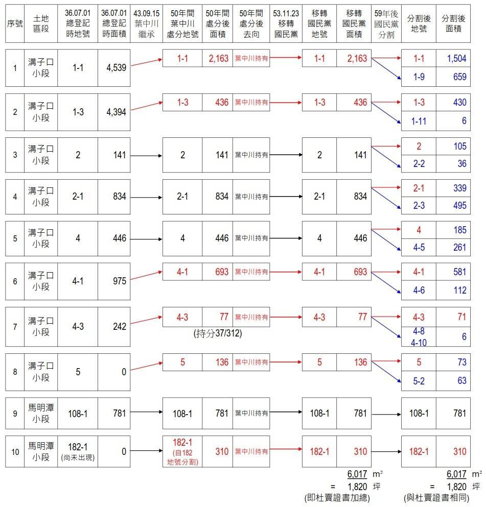
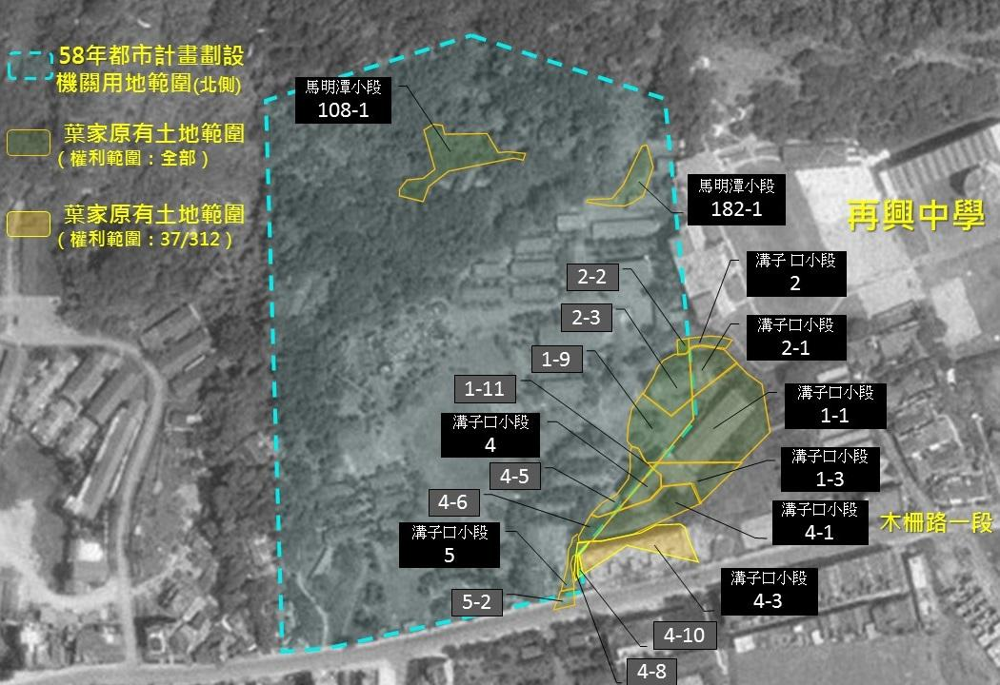
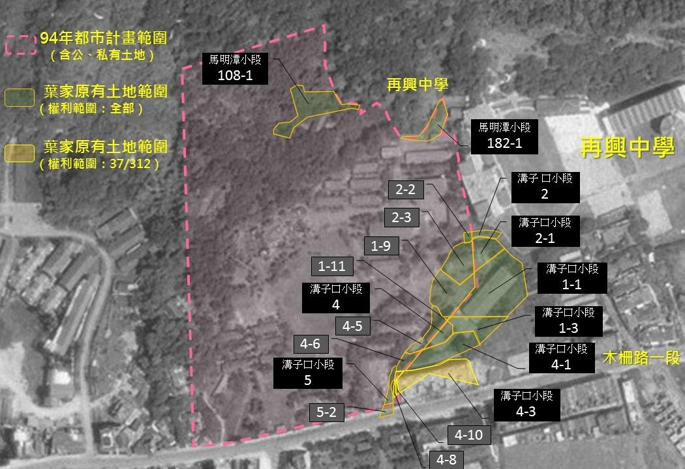
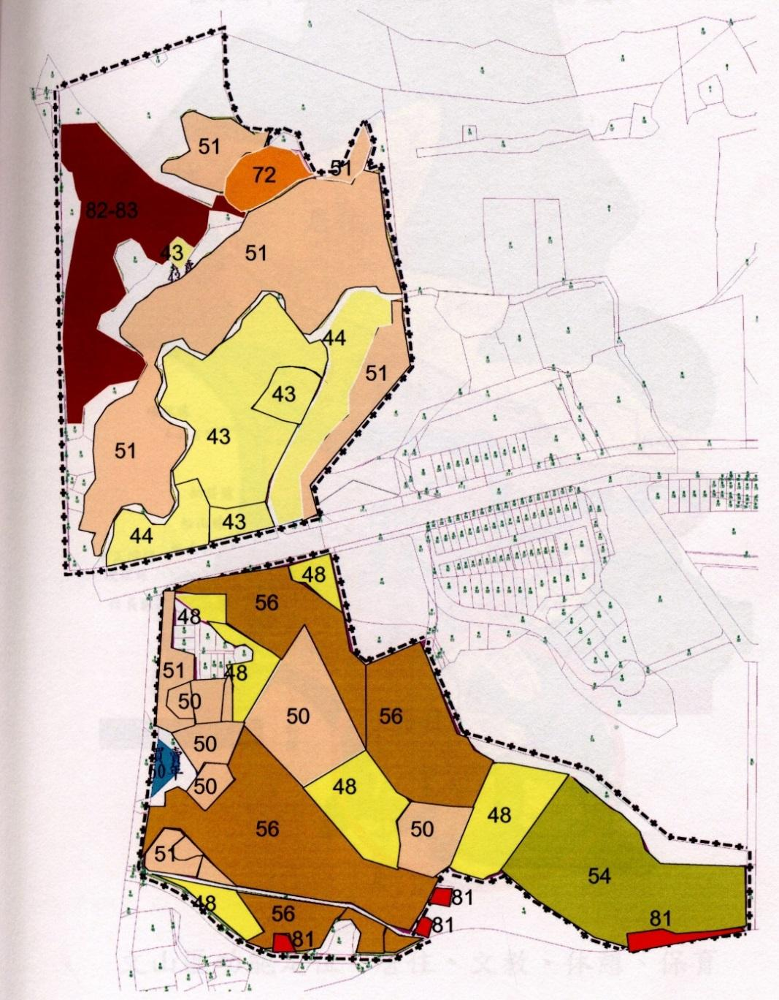
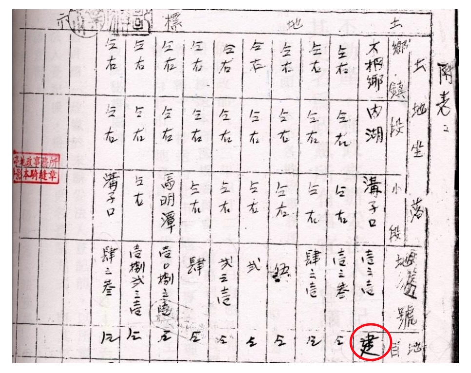
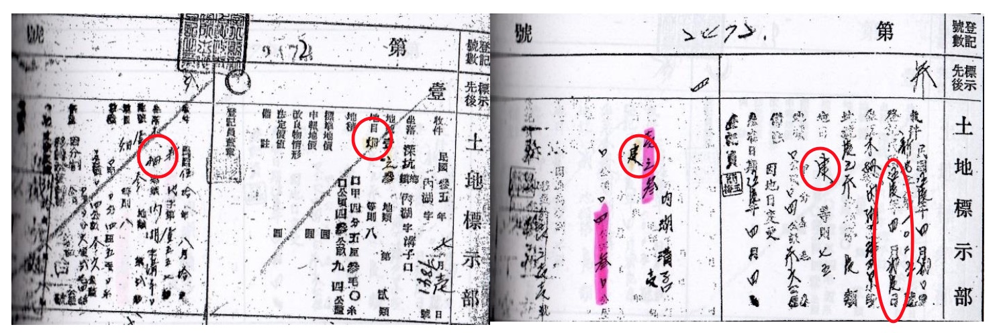
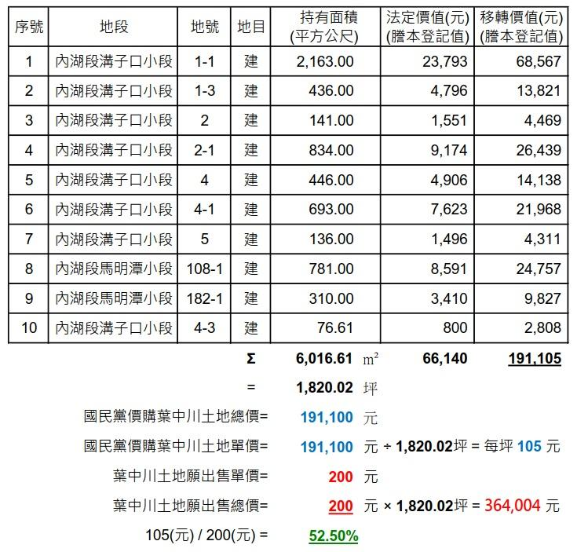
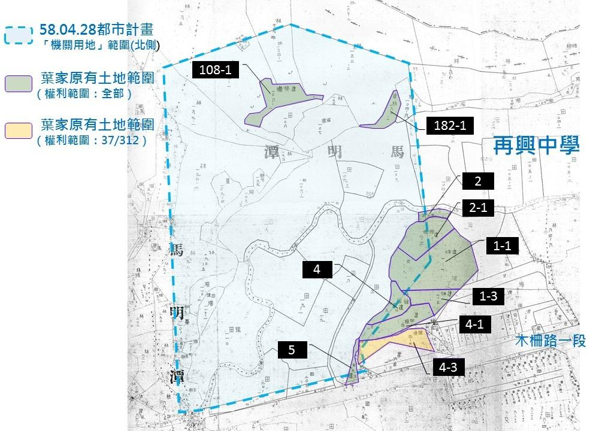
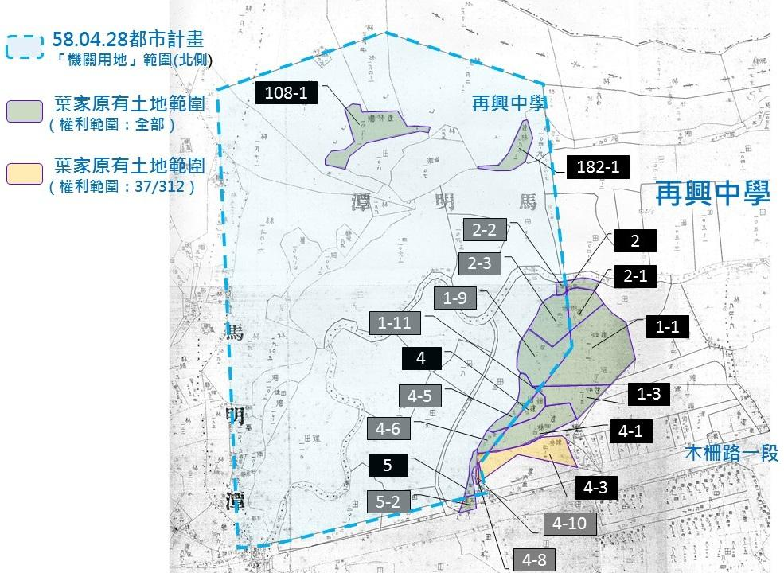
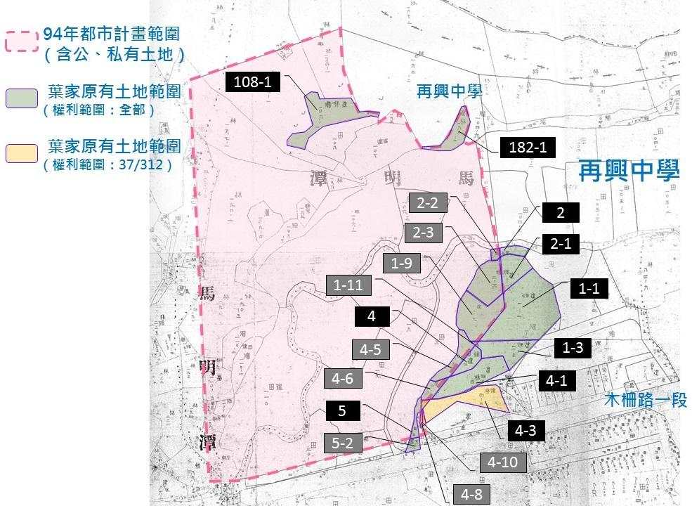

#民眾葉頌仁陳情其父葉中川原有坐落國家發展研究院前中興山莊院區之土地疑係中國國民黨不當取得財產案調查報告

## 一、調查緣起

本案係依國家發展研究院（下稱『國發院』）前中興山莊院區部分土地原所有權人即民眾葉中川之子葉頌仁（下稱『陳情人』）提交之書面陳情文件暨舉報書1，陳情民國（下同）53年11月23日由葉中川名下移轉登記予中國國民黨中央委員會（下稱『國民黨中央委員會』）之土地（下稱『系爭土地』）疑為社團法人中國國民黨（下稱『國民黨』）不當取得之財產，爰依政黨及其附隨組織不當取得財產條例（下稱『本條例』）第8條第6項主動立案調查。

## 二、本會調查經過

本會取得陳情人提供之書面陳情文件後，經向臺北市古亭地政事務所行文調閱相關舊載地籍資料2，藉由核對新舊地籍圖與謄本之過程，確認舊載地籍資料之土地所有權移轉登記情形與陳情人提供資料之異同；另調閱葉家與國民黨之民事訴訟卷宗、葉家與臺北市古亭地政事務所等之行政訴訟卷宗3，參考其中94年間之地籍資料，綜整出地籍登記變更之脈絡，並確認其原有面積。

本會另向最高法院檢察署內政部、臺灣省政府、臺北市政府地政局、臺北市文山區公所、臺北市古亭地政事務所等單位調閱相關資料，希冀除葉家對事件發生始末之陳述外，得由相關文獻歸納及還原系爭土地移轉登記之具體歷程。

## 三、國發院歷史概述：系爭土地占用爭議之成因

38年，國民政府因國共和談破裂，臺灣省警備總司令部以確保安定、有助勘亂為由，宣布全臺於同年5月20日起實施戒嚴4。故總統蔣中正（時任國民黨總裁）有鑑國民黨黨員於國共內戰期間大量折損，為培養該黨接續人力、規劃黨員專屬訓練機構，同年10月16日於臺北市近郊草山（陽明山）成立「革命實踐研究院」（下稱『革實院』），稱為陽明山莊。42年7月於臺北縣木柵鄉中興山莊設置分院，48年7月陽明山莊本院併入中興山莊分院，64年全院遷返陽明山莊，83年全院再遷中興山莊5。

國民黨自42年間成立革實院中興山莊分院後，即陸續租購周邊土地以擴充院區基地。中興山莊院區以舊臺北縣木柵鄉木柵路一段為界分南北二側基地，北側基地曾改為國民黨中央黨部木柵疏散辦公室使用，南側基地曾有國防部總政戰部青邨幹訓班營區6及救國團木柵團委會7進駐，系爭土地即坐落北側基地範圍內。陳情人表示，系爭土地於日治時期曾為日軍強占設置戰俘營，國民政府接收臺灣後，以舊日軍營舍為由續占之，院區土地地主實未取回使用權8。經本會調查，二戰時期日本軍方於臺灣設立多處戰俘營，32年6月13日原設置於花蓮縣玉里鄉之戰俘營遷至臺北縣木柵鄉，專司將校級戰俘之收容工作，其坐落位置約現今臺北市文山區木柵路一段335巷山坡尾處，即系爭土地所在地，亦為中興山莊院區範圍內9。43年後中興山莊之設置概如下列圖1：

圖1「革實院前中興山莊院區範圍示意圖」

89年10月25日經國民黨中央委員會第15屆第154次中常會通過後，革實院更名為「國家發展研究院」迄今。該院為國民政府撤臺後由國民黨所成立用以培訓黨內接續人力之重要單位，係國民黨訓練人才之最高機構10。現址位於臺北市中山區八德路二段232及234號地下1樓。

## 四、系爭土地歷史概述：葉家原持有土地範圍

臺北市文山區原為舊臺北縣木柵鄉，臺北市於56年升格為直轄市，於57年7月1日將原屬臺北縣及陽管局轄下景美、木柵、南港、內湖、士林、北投等6區納入市區範圍，79年3月21日後再整併木柵、景美區成為文山區11。故系爭土地所有權於53年11月23日移轉登記12予國民黨中央委員會持有時，仍屬臺北縣木柵鄉轄區境內。

經調閱相關舊載地籍資料並分析其地籍登記記錄後，葉家於革實院中興山莊院區範圍內原持有土地依地籍圖重測前之地籍變遷時間點，歸納為下列五期：

<table class="table table-bordered table-hover table-condensed">
  <thead>
    <tr>
      <th>序號</th>
      <th>時期</th>
      <th>地籍登記情形</th>
    </tr>
  </thead>
  <tbody>
    <tr>
      <td>一</td>
      <td>36年7月1日至50年</td>
      <td>全國地籍總登記作業時葉金塗原持有土地之登記情形。</td>
    </tr>
    <tr>
      <td>二</td>
      <td>50年間</td>
      <td>葉中川繼承葉金塗原持有土地後將其辦理分割及處分之登記情形。</td>
    </tr>
    <tr>
      <td>三</td>
      <td>53年11月23日</td>
      <td>葉中川原持有土地（分割及處分後仍保留者，即系爭土地）移轉予國民黨中央委員會之登記情形。</td>
    </tr>
    <tr>
      <td>四</td>
      <td>58年4月18日</td>
      <td>革實院中興山莊院區基地（包含系爭土地在內）經臺北市政府都市計畫變更使用分區。</td>
    </tr>
    <tr>
      <td>五</td>
      <td>59年7月4日後</td>
      <td>系爭土地依都市計畫經主管機關2次逕為分割。</td>
    </tr>
  </tbody>
</table>

### （一）36年7月1日至50年

依木柵鄉地籍登記之臺帳記錄及國民政府取得臺灣治權後之地籍資料所示：

1、葉中川祖父葉金塗於昭和14年（民國28年）間取得革實院中興山莊院區範圍內之若干土地所有權，其地目含「林」、「田」、「畑」（音同『田』，旱田之意）等三類。

2、35年7月1日後因國民政府辦理地籍總登記作業，葉金塗原有土地於36年7月1日重新登記於葉金塗名下。

3、43年9月15日，葉金塗原有、包含系爭土地之革實院中興山莊院區範圍內土地，由葉中川繼承取得（原因發生日期為35年10月18日）13。

### （二）50年間

葉中川處分其原有坐落革實院中興山莊院區範圍內之6筆土地：臺北縣木柵鄉內湖段溝子口小段1-1、1-3、4-1、4-3、5地號及同段馬明潭小段182地號，處分情形略以14：

#### 1、因分割新增地號：

馬明潭小段182-1地號由同小段182地號分割而新增，面積為0.0310公頃（權利範圍全部），仍登記為葉中川所有。

#### 2、分割土地致原地號面積縮減：

1. 溝子口小段1-1地號經分割後面積為0.2163公頃（權利範圍全部）；

2. 溝子口小段1-3地號分割後面積為0.0436公頃（權利範圍全部）；

3. 溝子口小段4-1地號分割後面積為0.0693公頃（權利範圍全部）；

4. 溝子口小段5地號分割後面積為0.0136公頃（權利範圍全部）。

#### 3、移轉土地部分持分予他人：

溝子口小段4-3地號經移轉部分持分後，持有面積為0.0077公頃（即4-3地號之權利範圍37/312）15。

表1「國發院案葉家於中興山莊院區範圍之原持有土地處分經過對照表」

### （三）53年11月23日

葉中川原有坐落革實院中興山莊院區範圍之10筆土地： **臺北縣木柵鄉內湖段溝子口小段1-1、1-3、2、2-1、4、4-1、5地號** 與同段 **馬明潭小段108-1、182-1地號** 等9筆（權利範圍皆為全部）及同段 **溝子口小段4-3地號** 等1筆（權利範圍為37/312），土地總面積0.6017公頃（即 **6,017平方公尺、1,820.02坪** ）16，經地政機關移轉登記為國民黨中央委員會所有，即系爭土地之範圍。詳以下圖2：

圖2「葉中川原有坐落革實院前中興山莊院區之土地示意圖」

### （四）58年4月18日

包含系爭土地之革實院中興山莊院區土地（含南、北兩側基地），經臺北市政府公告都市計畫「擬修訂木柵、景美兩地區主要計畫案」後，變更使用分區為「機關用地」17。

### （五）59年7月4日後

系爭土地之溝子口小段1-1、1-3、2、2-1、4、4-1、4-3、5地號等8筆土地依前述58年都市計畫公告內容由主管機關逕為分割，增加1-9、1-11、2-2、2-3、4-5、4-6、4-8、5-2地號等8筆新地號；62年8月23日，上述溝子口小段4-3地號再經分割，增加4-10地號1筆新地號。是以，系爭土地之地號由原先10筆增為19筆，土地總面積仍為0.6017公頃，由分割後地號之地界可窺其日後地籍圖重測之新地界與94年中興山莊都市計畫範圍之脈絡18。分割後之地籍概況詳參以下圖3-1、3-2：

圖3-1「葉中川原有坐落革實院前中興山莊院區之土地示意圖（一）」

圖3-2「葉中川原有坐落革實院前中興山莊院區之土地示意圖（二）」

## 五、系爭土地占用爭議之始末

國民黨於42年7月1日設立革實院中興山莊分院，即陸續以革實院或國民黨中央委員會名義藉租用或買賣取得中興山莊南北側基地（包含系爭土地）之使用權或所有權19（參圖4）。

圖4「中國國民黨取得中興山莊院區土地時間示意圖」

（本圖界線為94年都市計畫範圍，非中興山莊全部範圍）

依陳情人所提葉中川向國民黨中央委員會提出之書面陳抗文件（49年至50年間葉中川陸續以『申請書』或『存證函』20等紙本信函為之）內容及葉家與國民黨於民事訴訟中所述，葉家及國民黨均承認43年1月14日葉中川與革實院已就中興山莊院區內之葉家原有土地訂立租約21、22。惟45年1月14日起革實院未經葉家同意，將承租之葉家土地轉租予國民黨中央委員會，然國民黨中央委員會自取得革實院原承租之葉家土地使用權後，遂因長期租金未繳及租約未訂等爭議，而有葉家向國民黨中央委員會及木柵鄉公所書面陳抗之下列過程。

49年7月27日，葉中川向國民黨中央委員會提出「申請書」，表示自45年1月14日至撰寫該申請書為止，葉家未收得租金分文，雙方亦無訂立租約，其土地係為葉中川合法所有並依法納捐，然土地經革實院轉租予國民黨中央委員會使用後，形同無條件供其使用，使葉家受虧至甚，故葉中川於申請書中催繳租金並請求雙方速立租約，且說明同年3月21日亦曾以申請書催繳租金及催立租約，但未獲國民黨中央委員會回應23。

49年9月5日，葉中川再向國民黨中央委員會提出「存證函」，請求清償積欠之4年租金，鑑於當時土地法24規定，倘承租人積欠租金達二年以上，出租人得自行收回產權，然國民黨中央委員會已積欠租金達4年以上，且國民黨中央委員會對其先前歷次發函要求清償租金並訂立租約之請求久不理睬，倘再不回應將依土地法規定，自49年9月15日起中止租賃關係，返還土地25。

50年2月21日，葉中川向國民黨中央委員會提出「申請書」請求依法註銷耕地租約26、27，並複本向木柵鄉公所申請註銷與國民黨之土地租約。葉中川於該申請書中表示，49年9月5日後，國民黨曾由木柵鄉長張榮森轉交租金支票1紙予葉中川，面額新臺幣（以下皆同）3,343元7角。惟葉中川認為該金額少算一年租金，故並未具領；其租金少算之餘，金額係以耕地法計算，然國民黨中央委員會並非以耕地而係以建地使用其土地，既非農戶又不做農田使用卻僅以耕地計算租金，實有欠公允。而葉家每年負擔土地之相關稅賦約計1,400餘元，依國民黨中央委員會擬繳租金之支票面額3,443元7角計，每年租金僅800餘元，致葉家土地租予國民黨中央委員會毫無獲利可言，且每年尚須自行墊付數百餘元之稅賦。葉中川亦再次重申葉家土地非耕作使用及非法轉租等違法使用之事實，說明葉家得終止租賃收回土地，實於法有據28。

50年4月21日，葉中川申請分割其名下臺北縣木柵鄉內湖段馬明潭小段182地號土地，新增馬明潭小段182-1地號土地1筆，並處分馬明潭小段182地號土地29。

50年7月28日，葉中川再向國民黨中央委員會提出「申請書」，表達葉家土地未立租約卻遭無償使用之事實，且因國民黨中央委員會於葉家土地興建辦公廳舍顯而易見，遭地政機關注目派員現勘，有將葉家土地變更為建地之可能，倘如預期變更，葉家所需負擔之稅賦金額將更加提升。葉中川並指出，其土地現況雜有建地及田、畑在內，國民黨中央委員會僅憑耕地法計算租金實有欠妥，認為應依附近考試院承租土地之例核算租金較為公平，否則實難具領租金。葉中川並於文末請求：（一）訂立租約之舉並非無矢之求，請國民黨中央委員會參照考試院承租土地之例訂立租約；（二）維持不訂租約、亦不協商租賃事宜之現況實非良策，若國民黨有意承買葉家土地，葉家願以每坪200元出售、由國民黨負擔一切稅捐及手續費，並說明該價格並非苛求，請國民黨中央委員會考慮是否得當30。

50年8月10日，葉中川申請分割其名下臺北縣木柵鄉內湖段溝子口小段1-1、1-3、4-1、5地號等4筆土地，並處分分割後新增地號之土地；同年9月15日再將同段溝子口小段4-3地號辦理部分持分移轉他人31。

## 六、系爭土地所有權移轉爭議

51年1月16日，葉中川與國民黨中央委員會就系爭土地簽訂「杜賣證書」（買賣契約），依該杜賣證書所載，買主為國民黨中央委員會（代表人郭驥）、賣主為葉中川，買賣價金19萬1,100元，另有木柵鄉長張榮森、馬葆民、黃魏臺、王淮德、張開任等5人擔任杜賣證書之證明人32。依杜賣證書後附清冊所載，買賣標的為：臺北縣木柵鄉內湖段溝子口小段1-1、1-3、2、2-1、4、4-1、5地號及同段馬明潭小段108-1、182-1地號等9筆（權利範圍皆為全部）、同段溝子口小段4-3地號等1筆（權利範圍為37/312）共10筆土地，總面積6,017平方公尺（即1,820坪）。該杜賣證書後附清冊中將系爭土地10筆之地目均列為「建」，核與簽約當時實際僅有溝子口小段4-3地號1筆土地之地目為建，其餘9筆均為田、畑、林，買賣標的地目與實際土地地目兩者不符33，詳下列表2「葉中川、國民黨中央委員會所簽杜賣證書買賣標的清冊地目對照表」及圖5-1、5-2：

<table class="table table-bordered table-hover table-condensed">
  <thead>
    <tr>
      <th>地號/地目</th>
      <th>杜賣證書所載</th>
      <th>51.01.16實際地目</th>
      <th>51.04.04實際地目</th>
    </tr>
  </thead>
  <tbody>
    <tr>
      <td>溝口子小段1-1</td>
      <td>建</td>
      <td>畑</td>
      <td>建</td>
    </tr>
    <tr>
      <td>溝子口小段1-3</td>
      <td>建</td>
      <td>畑</td>
      <td>建</td>
    </tr>
    <tr>
      <td>溝子口小段2</td>
      <td>建</td>
      <td>田</td>
      <td>建</td>
    </tr>
    <tr>
      <td>溝子口小段2-1</td>
      <td>建</td>
      <td>畑</td>
      <td>建</td>
    </tr>
    <tr>
      <td>溝子口小段4</td>
      <td>建</td>
      <td>畑</td>
      <td>建</td>
    </tr>
    <tr>
      <td>溝子口小段4-1</td>
      <td>建</td>
      <td>畑</td>
      <td>建</td>
    </tr>
    <tr>
      <td>溝子口小段5</td>
      <td>建</td>
      <td>田</td>
      <td>建</td>
    </tr>
    <tr>
      <td>馬明潭小段108-1</td>
      <td>建</td>
      <td>林</td>
      <td>建</td>
    </tr>
    <tr>
      <td>馬明潭小段182-1</td>
      <td>建</td>
      <td>林</td>
      <td>建</td>
    </tr>
    <tr>
      <td>溝子口小段4-3</td>
      <td>建</td>
      <td>建</td>
      <td>建</td>
    </tr>
  </tbody>
</table>
表2「葉中川、國民黨中央委員會所簽杜賣證書後附清冊地目對照表」

圖5-1「葉中川、國民黨中央委員會所簽杜賣證書後附清冊」

圖5-2「木柵鄉內湖段溝口子小段舊載謄本」

（以1-1地號為例，土地地目原皆為「畑」，於51.04.21始變更登記為「建」）

51年1月16日，葉中川、國民黨中央委員會另以「委託書」委任代書「蘇錦榮」辦理該杜賣證書所為之土地移轉一切事宜34。

上開杜賣證書及土地所有權移轉登記過程，嗣後為葉家爭執其屬無效。91年8月20日葉中川逝世，其配偶葉張淑津、長子葉頌仁、長女葉頌娟、次子葉頌文之繼承人葉柏均及葉柏辰於95年間提起民事訴訟。葉家主張買賣契約（杜賣證書）無效，第一，國民黨中央委員會僅係國民黨之內部機關，無權利能力，不得為契約當事人；第二，葉中川並無以19萬1,100元出賣系爭土地之意思，簽訂杜賣證書係出於強暴脅迫；第三，國民黨並無給付價金以買受系爭土地之真意；第四，買賣標的於簽訂杜賣證書時地目仍為田、畑、林等農地，國民黨無自耕能力，雙方又無約定待國民黨可辦理所有權登記後再辦理所有權移轉登記之條款，該杜賣證書違反當時土地法第30條「私有農地所有權之移轉，其承受人以承受後能自耕者為限。」之規定而無效。

### （一）關於葉家主張葉中川係遭脅迫而簽訂該杜賣證書，並非出於自由意志乙節：

葉家主張，51年1月16日國民黨中央委員會代表郭驥、木柵鄉長張榮森由4名著中山裝、腰間佩帶槍枝之壯漢跟隨，於中午時分乘軍用吉普車2部至葉家請葉中川「去喝茶」，車行至土地代書蘇錦榮處，郭驥對葉中川說：系爭土地黨國另有用途，願以每坪100元收購35。就此，葉中川配偶葉張淑津曾於96年12月5日於法院證述36：

> 法官問

> 「系爭土地買賣的情形？」

> 證人答

> 「時間我忘記了，有一天突然來了四個人，我不認識，來我旁邊，我們剛好在吃飯，在臺北市保安街十一號我們家突然來了四個人到我們餐桌旁邊，我嚇一跳，我先生後來說是誰誰誰，當時我先生沒有告訴我他們來做什麼，他們就說要我先生走，要請我先生一起走，我先生也不知道什麼事，我們就一起走到花園後走到大門口，門口有吉普車，我看著我先生跟他們一起走，我看見我旁邊腰間一個有槍，他們就帶他走了，我就看他跟他們一起去，我就進屋裡。」

> 法官問

> 「四個人是穿軍服？」

> 證人答

> 「配槍的人士穿卡其色，另外三個人穿西裝。」

> 法官問

> 「妳先生被帶走多久後回來？」

> 證人答

> 「當天就回來。」

> 法官問

> 「從出去到回來幾個小時？」

> 證人答

> 「約有半天。」

> 法官問

> 「回來有無問他們去做什麼？」

> 證人答

> 「我沒有問，我先生主動告訴我，他去跟他們一起去某個地方，他講的我也不認識，他講了好多事情，就回來，去談什麼事情，我先生沒有講，但他有介紹，是占他們土地的那些人。」

> 法官問

> 「妳先生的土地在哪裡？」

> 證人答

> 「木柵的山上，後來我有去過，詳細地址我不知道。」

> 法官問

> 「靠哪個地方？」

> 證人答

> 「靠政大，詳細地址我不知道。」

> 法官問

> 「何人佔用你們的地？」

> 證人答

> 「軍人、國民黨。」

> 法官問

> 「妳先生有跟他們要求返還土地？」

> 證人答

> 「有，但他們都不走。」

> 法官問

> 「後來有無說要跟妳先生買土地？」

> 證人答

> 「我不知道。」

> 法官問

> 「後來知道土地有賣給誰？」

> 證人答

> 「不知道。」

> 法官問

> 「何時知道？」

> 證人答

> 「過幾天知道，我先生談起說，要賣那塊土地，他說有人要他賣給他們。」

> 法官問

> 「是誰要妳先生賣給他們？」

> 證人答

> 「我沒問，我先生也沒提。」

> 法官問

> 「知道後來那塊地賣給誰？」

> 證人答

> 「國民黨，那些阿兵哥。」

> 法官問

> 「多少錢？」

> 證人答

> 「不知道。」

> 法官問

> 「妳先生有無跟妳說類似的話，不賣會怎麼樣？」

> 證人答

> 「他們是到我家帶他出去，我不知道，但是後來我先生回來說他們要買土地。他們說要買土地，我說你要賣嗎？他說也沒辦法，因為他們一定要。」

> 法官問

> 「還有無說其他的話？」

> 證人答

> 「沒有。」

> 原告訴訟代理人問

> 「妳先生跟他們出去，後來知道是賣木柵那塊土地？」

> 證人答

> 「不知道。」

> 原告訴訟代理人問

> 「妳先生在木柵有幾塊地？」

> 證人答

> 「壹片、一個山頭。」

> 原告訴訟代理人問

> 「妳先生跟他們出去回來有無拿賣土地的錢回來？」

> 證人答

> 「沒有看到錢。」

### （二）關於買賣價額以及有無收受價金乙節：

葉家主張，明明當時市價36萬元以上之土地，杜賣證書上卻僅記載19萬1,100元37，簽好買賣契約所有文件後，國民黨中央委員會代表郭驥交付葉中川1萬9,100元支票乙紙38。由於葉中川始終堅不收受其買賣價金，該黨遂將該買賣價金提存於法院，以做為該黨完成價金支付之依據。然該黨於法院提存之金額，亦僅有上開買賣價金10%，即1萬9,100元，葉家則迄今未曾前往法院具領39。

依葉中川與國民黨中央委員會51年1月16日「杜賣證書」所載價金19萬1,100元，除以系爭土地1,820.02坪計，國民黨係以每坪105元之價格取得系爭土地。對照葉中川50年7月28日向國民黨中央委員會提出之申請書內所言，若該黨有意承買葉家土地，葉家願以每坪200元出售其名下坐落革實院中興山莊院區之土地予該黨，並由該黨負擔一切稅捐及手續費，請國民黨中央委員會考慮是否得當40乙節，則系爭土地之買賣價金應達36萬4,000元。杜賣證書所載價金僅佔葉中川認為合理之價格52.50%。

經本會就上開「土地/建物權利移轉登記聲請書」內所載「法定價值」及「移轉價值」函詢臺北市政府地政局及臺北市稅捐稽徵處，針對上開二價值，前者表示其屬規定地價前之資料無從查復，後者表示其來源及標準無資料可稽41、42；另查木柵地區最早辦理第一次規定地價（公告現值）為59年7月，當時系爭土地之公告現值為：臺北縣木柵鄉內湖段溝子口小段1-1、1-3、2、2-1、4、4-1、4-3地號等7筆土地為每坪1,944元（即588元/平方公尺）；臺北縣木柵鄉內湖段溝子口小段5地號為每坪1,550元（即469元/平方公尺）；臺北縣木柵鄉內湖段馬明潭小段108-1、182-1地號等2筆土地為每坪800元（即242元/平方公尺）43。

系爭土地之買賣價金分析如下表344：

表3「葉中川、國民黨中央委員會所簽杜賣證書買賣價金分析表」

### （三）關於51年1月16日杜賣證書後附之土地清冊所列土地地目均為「建」，核與實際地目僅有1筆為建，其餘9筆均為田、畑、林之情形不符乙節：

查葉中川與國民黨於51年1月16日簽訂杜賣證書時，系爭土地僅有臺北縣木柵鄉內湖段溝子口小段4-3地號1筆土地之地目為建，其餘9筆均為「田」、「畑」、「林」，惟杜賣證書後附之土地清冊則將買賣標的10筆土地之地目均列為「建」。葉中川及國民黨中央委員會簽訂杜賣證書後，同日亦委任代書「蘇錦榮」辦理該杜賣證書所為之土地移轉登記之一切事宜45。

51年2月間，臺北縣新店地政事務所（下稱「新店地政事務所」）針對人民申請變更地目之案件，經初勘完竣，造具51年2月份人民申請地目變更清冊，呈請臺北縣政府核示46，臺北縣政府於51年4月4日以（51）.4.4北府文地一字第23450號令核定，其中包括核准系爭土地之地目變更申請案，新店地政事務所復據此通知葉中川為變更登記47（陳情人於民事訴訟中主張受通知者為代書蘇錦榮48）。

51年4月20日，新店地政事務所收受以葉中川名義申請之「土地/建物變更登記申請書」49，申請登記原因為「地目變更」，變更內容係將系爭土地（除多人共有之溝子口小段4-3地號乙筆外）中，原地目為「林」、「田」、「畑」等三類之9筆土地，變更登記為「建」，原因發生日期以51年4月4日起算，即臺北縣政府（51）.4.4北府文地一字第23450號令核准時50。新店地政事務所並於隔日（51年4月21日）將系爭土地之地目標示登記為「建」。自此，系爭土地之地目始與51年1月16日杜賣證書後附清冊之記載相符。上開簽訂杜賣證書時地目與實際不符之情形，為陳情人及國民黨於民事訴訟中爭執。陳情人否認上開變更登記申請書為真正，主張係國民黨冒用葉中川名義申請，而查變更登記申請書上「聲請人」欄位有經塗改之痕跡，原以葉中川與國民黨中央委員會分列「出賣人」與「承買人」之方式聯名申請，惟因葉中川仍為土地單一所有權人，倘與非所有權人共同提出申請地目變更，顯與物權原則相違，故以刪除線劃掉原記載，改為所有權人葉中川單獨申請。且新店地政事務所收受之時間亦遭塗改，「收件日期51年4月11日」之記載以刪除線劃掉，另於文件上方加蓋收件日期為51年4月20日。陳情人並以此佐證契約無效，蓋買賣標的為農地，國民黨非自耕農，違反簽訂杜賣證書時土地法第30條「私有農地所有權之移轉，其承受人以承受後能自耕者為限。」之規定，無法為所有權移轉登記，必須先變更地目，始能移轉登記系爭土地之所有權51。

國民黨則主張，簽訂杜賣證書時，系爭土地之地目固為田、畑、林，然買賣雙方於簽約當時已約定俟系爭土地地目變更為「建」後，再辦理所有權移轉之登記，即不能給付之情形得除去之，因此契約仍為有效，並引用葉中川於50年7月28日向國民黨中央委員會提出之「申請書」中所載：「復查該地業經建屋堂，是為主辦地政機關注目派員查勘，據悉地目將欲變更為建地。是申請人以後應納之捐稅，勢必更鉅…」；「假設鈞部有意承買基地者，申請人願意以每坪二百元出售，但一切須納之捐稅及手續等費用由鈞部負擔…」，以及系爭土地之價格與葉中川在50年間出售予謝張秀英之內湖段溝子口小段1-4、1-6、4-4、5-1、4-2地號土地之價格相較，有十倍多之差距，益明兩造均已知悉系爭土地將變更地目為「建」，始會以建地之價格買賣等語，來主張葉中川已知系爭土地將地目變更，雙方乃係以建地之價格買賣系爭土地52。

52年7月22日，新店地政事務所首次收受葉中川與國民黨中央委員會共同提出之「土地/建物權利移轉登記聲請書」53，申請就系爭土地為所有權移轉登記，登記原因為「買賣」，原因發生日期為51年1月16日54。該聲請書所附證件包括：

1. 土地登記證明書一份：51年7月26日木柵鄉公所開立55。
2. 地租稅捐繳納證明書一份：51年6月21日開立。
3. 印鑑證明書一份：51年1月3日開立56。
4. 戶籍謄本二份：葉中川部分因文獻模糊無法確定開立日期，國民黨中央委員會代表郭驥部分為51年1月17日開立。
5. 委託書二份57：買賣雙方皆委任蘇錦榮為受託人，二份委託書均為51年1月16日簽立。

該聲請書所附證件中，51年7月26日由木柵鄉公所（鄉長張榮森）開立之「土地登記證明書」上記載之系爭土地地目，仍為51年4月21日變更登記前之「田、畑、林」58，與權利移轉登記聲請書之土地標示為「建」不符；且聲請人「買主中國國民中央委員會」並非法人，故新店地政事務所於52年7月23日通知國民黨中央委員會（代理人蘇錦榮），要求補正：

1. 權利人之法人登記證明文件（國民黨當時尚非法人）。
2. 土地登記證明書地目不符（上列地目仍為51年4月21日變更前之『田、畑、林』）。
3. 稅金完納證明書及戶籍謄本逾期，應補最近之證明（完納證明書所證僅限於51年間開立前已繳納部分，戶籍謄本內載有效期限為3個月，52年送辦時前揭二書類已皆產生時效問題）。

上開新店地政事務所通知國民黨中央委員會申請之買賣登記件尚需完成補正手續乙節，查新店地政事務所於53年11月19日二次收辦系爭土地移轉登記文件時，其最終補正結果如下：

1. 國民黨尚未完成法人登記，僅臺北縣政府回函指示新店地政事務所可比照革實院前例准予登記。
2. 51年1月16日簽立之杜賣證書地目為「建」，51年4月21日系爭土地已變更地目為「建」，然51年7月26日開立之土地登記證明書原所載地目為「田、畑、林」，故有不相符情形；惟該證明書於新店地政事務所第二次收辦時已塗改地目為「建」，以解決地目不相符之問題。
3. 地租稅捐繳納證明書於51年6月21日開立，距新店地政事務所52年7月22日首次收辦時已逾1年；戶籍謄本葉中川部分無法辨識核發日期，但郭驥部分為51年1月17日核發，上標有效期限3個月，郭驥部分顯然逾期。二類書類於新店地政事務所第二次收辦時皆無補正，仍以原件做為附件。

另一方面，新店地政事務所就國民黨中央委員會尚未完成法人登記前，可否得為權利義務之主體容有疑義，遂於52年7月26日簽呈臺北縣政府請示：

1. **查國民黨中央委員會價購土地申請所有權移轉登記前來。**
2. **經核該會尚未完成法人登記前可否得為權利義務之主體。未敢擅專。**
3. **謹檢呈前項申請書乙冊請鑒核示遵59。**

臺北縣政府於53年10月12日以北府清地一字48059號令復以：

1. **前揭該所轉呈中國國民黨中央委員會價購土地申請所有權移轉登記一案，自可比照革命實踐研究院前例准予登記。**
2. **原件發還复希知照60。**

查上開臺北縣政府就新店地政事務所所提疑義指示「自可比照革命實踐研究院前例准予登記」之「前例」，係指臺北縣政府52年11月8日行文新店地政事務所指示辦理革實院申請土地移轉登記一案61：

**「前據革命實踐研究院申請土地移轉登記乙案，經報奉臺灣省政府(52)10.31府民地甲字第25201號令：二、革命實踐研究院價購本案自耕保留地為庭院使用，仰照……土地行政改進事項第三項規定……辦理移轉並依法變更地目，至其權屬登記可登記為中國國民黨中央委員會。」**

按臺灣省政府公報內容所示，上開「土地行政改進事項」乃內政部自擬，呈奉行政院51年3月21日臺(51)內字第1699號令修正發交內政部公布實施之行政命令62，其第3項規定內容為：

**「自耕地移轉為建築用或工業用聲請登記時，免繳自耕能力保證書，繳清地價之公私放領耕地申請移轉為自耕或建築用或工業用者，毋須申請縣市政府（局）核准，各地政事務所應即依法辦理登記，但移轉為建築用之面積以不超過十公畝為限。」**

上述土地行政改進事項第3項中，未有明文非法人身分做為土地移轉登記權利人之相關規定，即新店地政事務所函詢臺北縣政府有關國民黨中央委員會尚未完成法人登記前可否得為權利義務之主體乙節，該條文未有規範。

新店地政事務所收受臺北縣政府53年10月12日北府清第一字第48059號令後，於53年11月19日第二次收辦前述52年7月22日葉中川與國民黨中央委員會聯名申請之「土地/建物權利移轉登記聲請書」，惟葉中川與國民黨中央委員會並未提出新的權利移轉登記聲請書及附件，而係以52年7月22日同一份權利移轉登記聲請書及應附證明文件重複聲請，並由新店地政事務所於其上加蓋53年11月19日之收文章。

該聲請書所附附件中，均為52年7月22日第一次送辦之原件，其中除51年7月26日由木柵鄉公所（鄉長張榮森）開立之土地登記證明書係於52年7月22日第一次送辦之原件上將原記載之地目「田、畑、林」以刪除線劃除，並於右側修改為「建」63外，其餘4項：葉中川之印鑑證明書64、買賣雙方委任蘇錦榮之委託書65、戶籍謄本及地租稅捐繳納證明書均未修改。而51年1月16日簽訂之杜賣證書，卻係於53年11月24日收文（另蓋收文章於其上）66。

53年11月23日，系爭土地全數移轉登記於國民黨中央委員會名下67。

## 七、系爭土地所有權移轉登記予國民黨後之地籍登記異動

58年4月28日，臺北市政府公告「擬修訂木柵景美兩地區主要計畫案」中，革實院中興山莊院區劃設為「機關用地」68。

59年7月後，系爭土地之溝子口小段1-1、1-3、2、2-1、4、4-1、4-3、5地號等8筆於國民黨名下分別被分割為19筆地號69（分割後新舊地號間之新增地界與日後中興山莊都市計畫之東側地界相吻合），惟19筆土地之加總面積仍與系爭土地總面積相同70，故依上開19筆土地於舊載地籍圖及現況地籍圖內，即可勾勒出系爭土地於53年11月23日移轉登記予國民黨中央委員會時之實際範圍71。地籍沿革詳參以下圖6-1、6-2、6-3：

圖6-1「葉中川原有坐落革實院前中興山莊院區之土地對照地籍圖（一）」

圖6-2「葉中川原有坐落革實院前中興山莊院區之土地對照地籍圖（二）」

圖6-３「葉中川原有坐落革實院前中興山莊院區之土地對照地籍圖（三）」

69年起，臺北市各行政區配合臺北市政府政策開始辦理地籍圖重測72，重測後系爭土地大抵落於當時重測後之華興段一小段150、168、168-3、170、173、174、177、178地號等8筆土地範圍內73；至其後民間提出當地國小遷校方案時，為臺北市政府納入中興山莊院區之相關都市計畫內容。上述150、177地號2筆土地因囊括系爭土地重測前之多數地號，成為陳情人與國民黨日後初始法律爭訟之標的。

75年3月19日，臺北市政府公告「修訂木柵區華興里、景美區興光里附近地區細部計畫（第二次通盤檢討）暨配合修訂主要計畫案」74中，考量革實院中興山莊北側基地之「機關用地」非提供行政機關使用，且該地大部分由國民黨做為訓練使用，因此變更北側基地變更為「行政區」；77年12月16日，臺北市政府公告「修訂木柵區樟腳里附近地區細部計畫（第二次通盤檢討）暨配合修訂主要計畫案」75中，南、北側基地之使用分區維持不變。經58年4月28日「擬修訂木柵景美兩地區主要計畫案」及上述二都市計畫後，革實院中興山莊院區土地大抵維持北側基地「行政區」及南側基地「機關用地」之使用分區。78年12月16日，木柵區及景美區合併，系爭土地即歸於合併後之文山區轄內。

89年4月24日，臺北市政府教育局函請該府都市發展局就文山區永建國小希以遷校方式解決校地不足乙事，納入「文山區都市計畫通盤檢討案」，協助該校另覓校地，文中提及革實院中興山莊北側基地頗適該校遷校之用76。同年6月2日，臺北市政府都市發展局函復該府教育局表示，永建國小校地不足問題已邀相關單位研商，惟未見教育局針對校地不足乙事提出具體建議，並建議教育局依當時文山區國小用地服務水準，考量以學區調整等具體方案解決之77。

89年8月，永建國小家長及社區居民連署成立「永建國小遷校促進會」。同年8月10日，臺北市國民黨籍議員李慶元、蔣乃辛、林奕華等人通知臺北市政府都市發展局等單位就永建國小遷校問題於8月18日前往中興山莊會勘，會勘結論表示，請都市發展局將永建國小遷校問題納入「文山區都市計畫通盤檢討案」時參辦或以個案變更方式辦理78。

89年9月4日，臺北市政府財政局函該府都市發展局表示，前述8月18日市議會會勘時，財政局曾建議將中興山莊南側之機關用地變更為商業區或住宅區，以取得地主應回饋之土地，再與同地段市有土地合併做為學校用地；然9月29日臺北市政府財政局函同府教育局表示，有關教育局詢問永建國小校地不足，研議採以地易地方式之遷校之可行性，因無適法性，故建議採區段徵收方式為宜79。

89年10月16日，永建國小函臺北市政府教育局表示，認同教育局對該校遷校之報告，並請教育局協調都市發展局納入「文山區都市計畫通盤檢討案」且考量另以專案變更方式辦理。同年12月19日，臺北市政府都發局函教育局表示，永建國小校地不足案就區段徵收及市地重劃方式，初步試算不具可行性，仍請教育局就未來永建國小學童數、設校面積、同區段小學用地發展政策及校地取得預算等研擬具體方案80。

90年1月，臺北市政府教育局成立「永建國小建全發展規劃小組」81。90年2月7日，臺北市政府教育局通知同府都市發展局等相關單位於同年3月9日召開「研商臺北市文山區永建國民小學建全發展相關事宜」會議。會中教育局表示，都市計畫（指中興山莊北側基地）為行政區而非公共設施用地，應由教育局以需地機關做為主辦，另都市計畫通盤檢討已將北側基地及南側機關用地做為教育局與地主（此時為國民黨）協商之談判籌碼82。

90年4月4日，臺北市國民黨籍議員厲耿桂芳函時任市長馬英九（都市發展局收辦）表示，其會晤國民黨秘書長林豐正時，建議中興山莊北側土地提供永建國小做為新校地，林欣表同意，厲並建議都市發展局對中興山莊重議開發並逐年編列預算。同年4月17日，都市發展局函教育局表示，4月2日永建國小家長會以「中興山莊北側土地取得可行性方案」向都市發展局函提建議以中興山莊北側基地做為該校新校地，請教育局納入「永建國小建全發展規劃小組」研處83。同年5月4日，臺北市政府都市發展局再函同府教育局，說明永建國小遷校案其家長會研擬方案該局評估結果，並建議將木柵路以南機關用地納入計畫範圍一併考量變更方案，以增加回饋可行性。

91年1月11日，臺北市政府教育局函國民黨表示，請該黨捐地以利永建國小遷校事宜，惟國民黨未回復84。同年3月8日，臺北市國民黨籍議員厲耿桂芳邀集教育局、都市發展局及國民黨研商都市計畫變更可行性，會議結論：國民黨希市府將中興山莊南、北側基地一併納入都市計畫整體規劃變更，都市發展局初步表示同意，惟希國民黨提出使用需求及規劃構想以利進行85。

91年3月14日，臺北市政府教育局以上呈府簽表示，各局處研討永建國小遷校結果，為求時效以「一般徵收」較為可行，校地需求為1.8公頃，然徵收成本約需13億元，礙於財政困難同年1月11日已函請國民黨捐地協助，惟該黨未做回復。同年3月8日市議員厲耿桂芳邀集各單位之研商會議中，國民黨已表達希市府將中興山莊南、北側基地一併納入都市計畫整體規劃變更之想法，並獲都市發展局初步同意，惟需國民黨提出使用需求或規劃構想以利進行都市計畫變更。教育局據上述情形表示將依規劃內容積極配合都市發展局辦理中興山莊都市計畫整體規劃案，以加速永建國小遷校事宜，時任市長馬英九於3月21日核准教育局所擬方案86。

91年4月4日，臺北市政府教育局函國民黨表示，請該黨儘速提出中興山莊地區使用需求或規劃構想送都市發展局，以利進行都市計畫變更事宜。同年11月3日，永建國小遷校促進會函國民黨請其捐地興學，使永建國小得遷校至中興山莊北側基地處。11月17日，國民黨函復永建國小遷校促進會表示，原則同意配合臺北市政府對中興山莊土地之使用分區整體規劃辦理。12月11日，永建國小遷校促進會函教育局表示，請將該校遷校列入市府專案列管案件。12月22日，教育局上呈府簽，說明就中興山莊南北側土地都市計畫行政區變更為住宅區、學校用地、公園用地之規劃結果。時任市長馬英九於93年1月10日核准87。 

## 爭點：民眾葉中川原有坐落國家發展研究院前中興山莊院區之土地，是否係社團法人中國國民黨以無償或交易時顯不相當之對價取得之財產？

---

1. 陳情人葉頌仁於105年9月13日所提供之最高法院100年度台上字第484號民事判決相關資料、同年11月1日提交之舉報書及其附件
2. 臺北市古亭地政事務所106年2月7日北市古地籍字第10631383100號函、106年2月15日北市古地籍字第10631401800號函
3. 臺灣臺北地方法院民事聲請事件卷宗95年救字第191號、民爭卷宗95年重訴字第1275號（一）（二）；臺灣高等法院民事第二審訴訟卷宗97年重上字第102號（一）（二）（三）；最高法院民事第三審卷宗100年民事第一庭台上字第484號、民事聲請卷宗100年民事第一庭台聲字第621號。
4. 國家發展委員會檔案管理局「[台灣邁向民主化的里程碑─告別戒嚴時期](http://www.archives.gov.tw/Publish.aspx?cnid=948&p=748)」網站（最後瀏覽日：106年5月1日）。
5. 參註3，97/9/25民事答辯（三）狀，臺灣高等法院民事第二審訴訟卷宗97年重上字第102號（一），頁149至151；
   「[國家發展研究院](http://demoparixblog.blogspot.tw/2015/06/blog-post_7.html/)」網站（最後瀏覽日：106年5月1日）；
   「[中華百科全書](http://ap6.pccu.edu.tw/Encyclopedia_media/main-h.asp?id=2587)」網站：（最後瀏覽日：106年5月1日）；
   「[財團法人中正文教基金會](http://www.ccfd.org.tw/ccef001/index.php?option=com_content&view=article&id=2071:0016-18&catid=161&Itemid=256)」網站：（最後瀏覽日：106年5月1日）；
   「[國家文化資產資料庫管理系統](https://nchdb.boch.gov.tw/web/cultureassets/Building/info_upt.aspx?p0=5286)」網站：（最後瀏覽日：106年5月1日）。
6. 科技部「[數位典藏國家型科技計畫](http://gis.rchss.sinica.edu.tw/mapdap/?p=4223?&lang=zh-tw)」網站：（最後瀏覽日：106年5月1日）。
7. 地理資訊科學研究專題中心[「臺北市百年歷史地圖」-臺北市街道圖（1977）、臺北市行政區域圖（1983）](http://gissrv4.sinica.edu.tw/gis/taipei.html)（最後瀏覽日：106年5月1日）。
8. 97/9/26民事準備書（三）狀，臺灣臺北地方法院民爭卷宗95年重訴字第1275號（一），頁174至175。
9. 日本「POW【PrisonersofWar】研究会」-「[日本国外の捕虜収容所](http://www.powresearch.jp/jp/archive/camplist/gaichi_index.html)」（最後瀏覽日：106年5月1日）；
   木柵戰俘營坐落木柵地區舊地名「喙鼻仔嶺」，約現今文山區木柵路一段335巷山坡尾處（華興段一小段169地號範圍內）。[臺北市文山區公所〉認識文山〉文山區志〉卷一、土地篇〉地名](http://wsdo.gov.taipei/ct.asp?xItem=29784&ctNode=4754&mp=124121)（最後瀏覽日：106年5月1日）。
10. 「[國家發展研究院](http://demoparixblog.blogspot.tw/)」網站（最後瀏覽日：106年5月1日）。
11. [臺北市文山區公所〉認識文山〉歷史沿革](http://wsdo.gov.taipei/ct.asp?xItem=29507&CtNode=4751&mp=124121)（最後瀏覽日：106年5月1日）。
12. 臺北市古亭地政事務所106年5月5日北市古地籍字第10631588800號函，葉中川、國民黨中央委員會雙方名義送辦之「土地/建物權利移轉登記聲請書」及其附件「杜賣證書」等地政登記文件，前述「杜賣證書」之立約日期為51年1月16日，臺北縣政府新店地政事務所於52年7月22日以新地字第1932號（第2494號）初次收辦、53年11月19日以新地字第3417號（第4439號）二次收辦（同一文件蓋有上述二日期收文章）、53年11月23日核定移轉登記。
13. 參註2，依地政登記臺帳記錄及國民政府接收臺灣後之舊載地籍資料所示，葉家於中興山莊院區範圍之土地為葉金塗於昭和14年間（民國28年）取得所有權，地目含「林」、「田」、「畑」（音同『田』，旱田之意）等三類。35年7月1日，因地籍總登記作業葉家原持有土地於36年7月1日重新登記於葉金塗名下，43年9月15日，由葉中川登記繼承葉金塗原有、包含系爭土地之革實院中興山莊院區範圍內土地。
14. 參表1「國發院案葉家於中興山莊院區範圍之原持有土地處分經過對照表」。按舊載地籍資料所示，葉中川於50年4月21日完成臺北縣木柵鄉內湖段馬明潭小段182地號分割登記，新增同小段182-1地號1筆土地；同年8月10日申請分割同段溝子口小段1-1、1-3、4-1、5地號等4筆土地，分割後原有地號仍保留，僅面積減少；同年9月15日將同段溝子口小段4-3地號辦理部分持分移轉，移轉後原有地號亦保留，僅持分減少（權利範圍餘37/312）。
   上述馬明潭小段182-1地號、溝子口小段1-1、1-3、4-1、4-3、5地號等6筆土地，日後皆包含於53年11月23日系爭土地移轉登記之內容。
15. 參註2，臺北縣木柵鄉內湖段溝子口小段1-1、1-3、4、4-1、4-3、5地號與同段馬明潭小段182地號等舊載地籍謄本。
16. 參註12杜賣證書內土地明細附表、註13舊載地籍資料中葉金塗、葉中川土地登記紀錄；註14「國發院案葉家於中興山莊院區範圍之原持有土地處分經過對照表」。
17. 臺北市政府都市發展局「[臺北市都市計畫整合查詢系統](http://www.budwebgis.tcg.gov.tw/planmap/cityplan_main.aspx)」網站（最後瀏覽日：106年5月1日）。北側基地之機關用地範圍，可參圖1。
18. 參圖3-1「葉中川原有坐落革實院前中興山莊院區之土地示意圖（一）」、3-2「葉中川原有坐落革實院前中興山莊院區之土地示意圖（二）」。
19. 「臺北市文山區木柵路一段中興山莊附近地區主要計畫案」-歷次專案小組審查結論辦理情形對照表附圖「圖3-2中國國民黨取得土地時間示意圖」，最高法院檢察署99年度特他字第3號(000049-102)-原97年度特他字第35號偵查卷宗，頁068。
20. 參註1、3，詳葉家提供之佐證文獻：49年7月27日「申請書」、49年9月5日「存證函」、50年2月21日「申請書」、50年7月28日「申請書」等共4份，皆葉中川親書寄交國民黨中央委員會，抗議葉家土地無法收租且租約未立、國民黨等同無償使用其土地，如不履約將依法收回土地權利，另建議國民黨中央委員會逕以合理市價承購土地以解決占用爭議云云。
21. 參註20，葉中川50年2月21日致國民黨中央委員會「申請書」中表示，雙方於43年1月14日訂立「臺北縣私有耕地租約北木中字第008號」（經本會行文臺北市政府調閱相關資料，但因年代久遠未查有保留文獻），立約時之租賃範圍為臺北縣木柵鄉內湖段溝子口小段1-1、1-3、2、2-1、4-1地號等5筆土地；葉家二審民事準備(三)狀、臺灣高等法院民事第二審訴訟卷宗97年重上字第102號（一），頁174。
22. 國民黨革實院於43年1月14日起即向葉中川之母葉周招治承租，雙方有簽立中字第010號租約。國民黨97/8/29高院民事答辯（二）狀、臺灣高等法院民事第二審訴訟卷宗97年重上字第102號（一），頁142；國民黨98/7/31二審言詞辯論意旨狀、臺灣高等法院民事第二審訴訟卷宗97年重上字第102號（三），頁043。
23. 參註20，葉中川49年7月27日致國民黨中央委員會「申請書」中表示，於49年3月21日即以申請書催繳租金（惟49年3月21日申請書未有保留原件紙本或影本）。
24. 耕地租約之依據：民國40年《耕地三七五減租條例》第6條。
25. 參註20，葉中川49年9月5日致國民黨中央委員會「存證函」。
26. 參註20，葉中川50年2月21日致國民黨中央委員會及木柵鄉公所「申請書」。
27. 民國40年5月25日制定《耕地三七五減租條例》第6條：「（第1項）耕地租約應一律以書面為之，租約之訂立、變更、終止或換訂，應由出租人會同承租人申請登記。前項（第2項）登記辦法，由省政府擬訂，報請行政院核定之。」
28. 參註20，葉中川50年2月21日致國民黨中央委員會及木柵鄉公所「申請書」。
29. 參註14「國發院案葉家於中興山莊院區範圍之原持有土地處分經過對照表」。
30. 參註20，葉中川50年7月28日致國民黨中央委員會「申請書」。
31. 參註14「國發院案葉家於中興山莊院區範圍之原持有土地處分經過對照表」。
32. 參註12，「權利移轉登記聲請書」及其附件「杜賣證書」等地政登記文件；臺灣高等法院民事第二審訴訟卷宗97年重上字第102號（一），頁129至131。
33. 參註12，系爭土地舊載地籍謄本51年間地目及「杜賣證書」所附土地明細表地目。
34. 參註12，葉中川、國民黨中央委員會各自委任蘇錦榮之「委任書」。
35. 97年9月26日葉家二審準備（三）狀，臺灣高等法院民事第二審訴訟卷宗97年重上字第102號（一），頁175。
36. 96/12/5言詞辯論筆錄，臺灣臺北地方法院民爭卷宗95年重訴字第1275號（二），頁241至244。
37. 97/12/1葉家二審準備（五）狀，臺灣高等法院民事第二審訴訟卷宗97年重上字第102號（二），頁015。
38. 97/9/26民事準備書（三）狀，臺灣臺北地方法院民爭卷宗95年重訴字第1275號（一），頁175。
39. 97/9/26民事準備書（三）狀，臺灣臺北地方法院民爭卷宗95年重訴字第1275號（一），頁175。
40. 參註20，葉中川50年7月28日致國民黨中央委員會「申請書」。
41. 臺北市政府地政局106年5月1日北市地價字第10606000200號函【本會流水號1060001295】；臺北市政府地政局「[臺北市地價查詢多功能服務系統](http://w2.land.gov.taipei/query/prc/Input_p.asp)」網站（最後瀏覽日：106年5月1日）。
42. 臺北市稅捐稽徵處文山分處106年4月28日北市稽文山甲子第10666989800號函【本會流水號1060001344】。
43. 參註41，臺北市政府地政局106年5月1日北市地價字第10606000200號函【本會流水號1060001295】。
44. 參註12，臺北市古亭地政事務所106年5月5日北市古地籍字第10631588800號函，葉中川、國民黨中央委員會雙方名義送辦之「土地/建物權利移轉登記聲請書」內所載「法定價值」及「移轉價值」。
45. 參註12，葉中川、國民黨中央委員會「杜賣證書」。
46. 臺北縣新店地政事務所新地朝一字第0405號函，臺灣高等法院民事第二審訴訟卷宗97年重上字第102號（一），頁187。
47. 臺北縣新店地政事務所地目變更核准通知書，葉家97年9月26日二審民事準備（三）狀附件F，臺灣高等法院民事第二審訴訟卷宗97年重上字第102號（一），頁189。
48. 臺灣高等法院民事第二審訴訟卷宗97年重上字第102號（一），頁176。
49. 參註12，51年4月20日以葉中川名義送辦之「土地/建物變更登記申請書」。依該申請書內容所示，原應欲以葉中川與國民黨中委會分列「出賣人」與「承買人」之方式聯名申請，惟因葉中川仍為土地單一所有權人，倘與非所有權人共同提出申請地目變更，顯與物權原則相違，故塗改為所有權人葉中川單獨申請。另該申請書並無檢附相關文件足證當時雙方之買賣契約已簽立（杜賣證書於53年11月24日始出現於土地移轉登記案文件之附件內）。
50. 土地/建物變更登記申請書，葉家97年9月26日二審民事準備（三）狀附件C，臺灣高等法院民事第二審訴訟卷宗97年重上字第102號（一），頁184。
51. 97年5月2日二審準備程序筆錄，臺灣高等法院民事第二審訴訟卷宗97年重上字第102號（一），頁065；葉家二審準備（三）狀，臺灣高等法院民事第二審訴訟卷宗97年重上字第102號（一），頁176
52. 國民黨96年12月5日補充辯護意旨狀，臺灣臺北地方法院民爭卷宗95年重訴字第1275號二），頁257；國民黨97年10月29日二審答辯（四）狀，臺灣高等法院民事第二審訴訟卷宗97年重上字第102號（一），頁206；國民黨98年7月31日二審言詞辯論意旨狀，臺灣高等法院民事第二審訴訟卷宗97年重上字第102號（三），頁055。
53. 臺灣高等法院民事第二審訴訟卷宗97年重上字第102號（一），頁191；出處同註12，參葉中川與國民黨中委會就地政登記作業之委託書。
54. 參註12，參移轉登記聲請書之原因發生日期欄位。
55. 臺灣高等法院民事第二審訴訟卷宗97年重上字第102號（二），頁29，民事準備（五）狀附件。
56. 臺灣高等法院民事第二審訴訟卷宗97年重上字第102號（二），頁32，民事準備（五）狀附件（印鑑登記日期：35年11月16日）。
57. 臺灣高等法院民事第二審訴訟卷宗97年重上字第102號（二），頁27，民事準備（五）狀附件。
58. 臺灣高等法院民事第二審訴訟卷宗97年重上字第102號（二），頁29，民事準備（五）狀附件。
59. 臺北縣新店地政事務所稿，致臺北縣政府52年7月26日新地朝一字第48059號，臺灣臺北地方法院民爭卷宗95年重訴字第1275號（一），頁115。
60. 臺北縣政府（令）稿，致新店地政事務所53年10月12日北府清地一字第126432號。
61. 臺北縣政府（令），致新店地政事務所52年11月8日北府玉地一字第126432號，臺灣臺北地方法院民爭卷宗95年重訴字第1275號（一），頁116。
62. 臺灣省政府公報第4597號，頁1992至1993，〈土地行政改進事項〉。
63. 民事準備（五）狀附件，臺灣高等法院民事第二審訴訟卷宗97年重上字第102號（二），頁029。
64. 民事準備（五）狀附件（印鑑登記日期：35年11月16日），臺灣高等法院民事第二審訴訟卷宗97年重上字第102號（二），頁032。
65. 民事準備（五）狀附件，臺灣高等法院民事第二審訴訟卷宗97年重上字第102號（二），頁027。
66. 杜賣證書，臺灣臺北地方法院民爭卷宗95年重訴字第1275號（一），頁017。
67. 參註12，參新店地政二次收辦章、聲請書核定日期。
68. 臺北市政府都市計畫查詢系統「[擬修訂木柵、景美兩地區主要計畫案](http://www.budwebgis.tcg.gov.tw/planmap/cityplan_main.aspx)」：（最後瀏覽日：106年5月1日）。
69. 參表1「國發院案葉家於中興山莊院區範圍之原持有土地處分經過對照表」。
70. 同註71。
71. 參圖6-2「葉中川原有坐落革實院前中興山莊院區之土地對照地籍圖（二）」、圖6-3「葉中川原有坐落革實院前中興山莊院區之土地對照地籍圖（三）」。
72. [臺北市政府地政局土地開發總隊〉業務資訊〉地籍測量〉臺北市地籍圖沿革](http://tcgwww.taipei.gov.tw/ct.asp?xItem=69695147&ctNode=70197&mp=111011)（最後瀏覽日：106年5月1日）。
73. 依106年1月後調閱之地籍資料所示，系爭土地大部分落於現今臺北市文山區華興段一小段149、150、169、178地號內，少部分落於同段170、173、174地號內。惟上述地號因經合併、分割，尚包含其他舊載地號之原始範圍，故上述地號總面積大於系爭土地總面積6,017平方公尺（1,820.02坪）。
74. 臺北市政府都市計畫查詢系統「[修訂木柵區華興里、景美區興光里附近地區細部計畫（第二次通盤檢討）暨配合修訂主要計畫案](http://www.budwebgis.tcg.gov.tw/planmap/cityplan_main.aspx)」：（最後瀏覽日：106年5月1日）。
75. 臺北市政府都市計畫查詢系統「[修訂木柵區樟腳里附近地區細部計畫（第二次通盤檢討）既配合修訂主要計畫案](http://www.budwebgis.tcg.gov.tw/planmap/cityplan_main.aspx)」（最後瀏覽日：106年5月1日）。
76. 臺北市政府教育局致同府都市發展局公文，最高法院檢察署99年度特他字第3號(000049-85)偵查卷宗，頁086。
77. 臺北市政府都市發展局致同府教育局公文，最高法院檢察署99年度特他字第3號(000049-85)偵查卷宗，頁083。
78. 臺北市議會致同府都市發展局會勘通知及其會勘紀錄，最高法院檢察署99年度特他字第3號(000049-85)偵查卷宗，頁087至088。
79. 臺北市政府財政局致同府都市發展局、教育局公文，最高法院檢察署99年度特他字第3號(000049-85)偵查卷宗，頁092、頁102。
80. 永建國小、臺北市政府都市發展局致臺北市政府教育局公文，最高法院檢察署99年度特他字第3號(000049-85)偵查卷宗，頁089、頁092。
81. 臺北市政府「變更臺北市文山區木柵路一段中興山莊附近地區主要計畫案」，頁001。
82. 臺北市政府教育局致同府都市發展局等單位開會通知及會議紀錄，最高法院檢察署99年度特他字第3號(000049-85)偵查卷宗，頁096。
83. 臺北市議員厲耿桂芳致臺北市政府函、臺北市政府都市發展局致同府政府教育局公文，最高法院檢察署99年度特他字第3號(000049-85)偵查卷宗，頁081至082。
84. 臺北市政府教育局致國民黨函，臺北市政府函最高法院檢察署99年度特他字第3號(000049-85)偵查卷宗，頁062。
85. 臺北市議員厲耿桂芳致臺北市政府函、臺北市政府都市發展局致同府政府教育局公文，最高法院檢察署99年度特他字第3號(000049-85)偵查卷宗，頁062。
86. 臺北市政府教育局上呈府簽內容，最高法院檢察署99年度特他字第3號(000049-85)偵查卷宗，頁109。
87. 臺北市政府教育局致致國民黨函，頁222、永建國小遷校促進會致國民黨函，頁026、教育局上呈府簽，最高法院檢察署99年度特他字第3號(000049-85)偵查卷宗，頁108。
